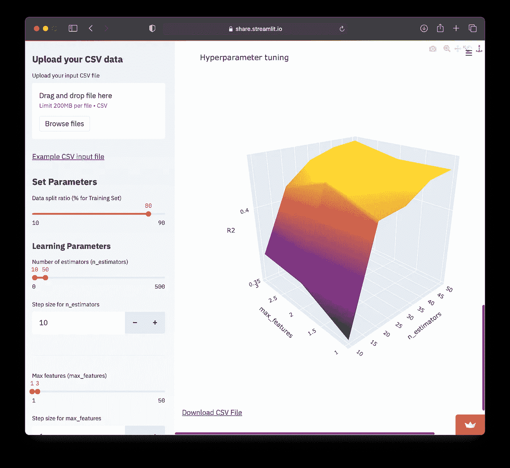
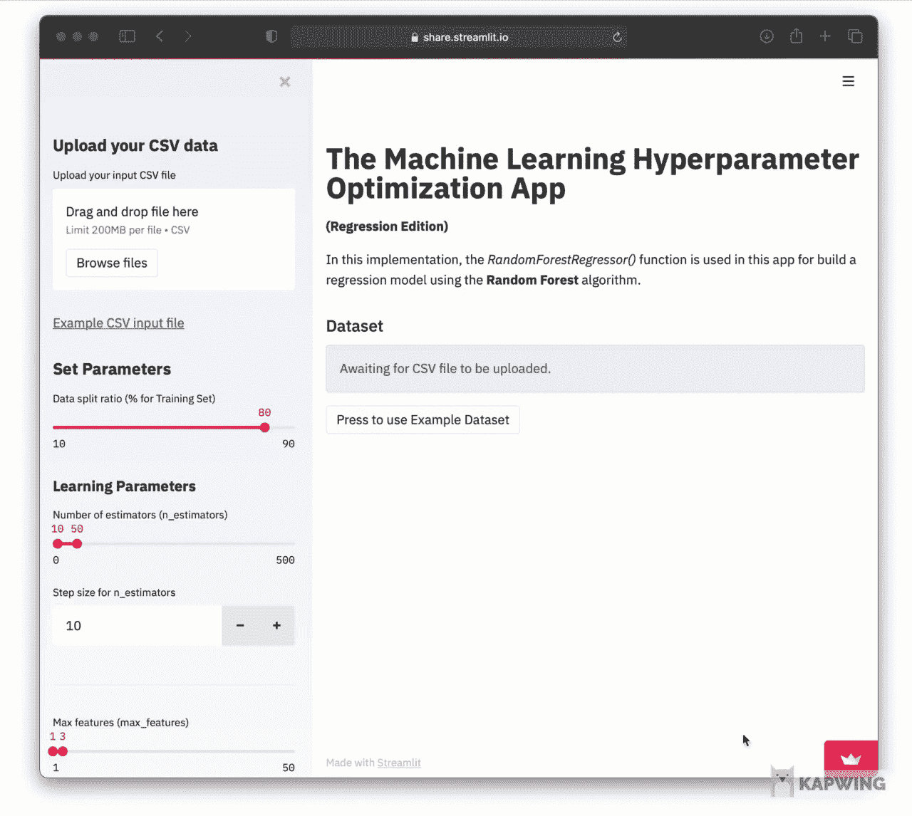
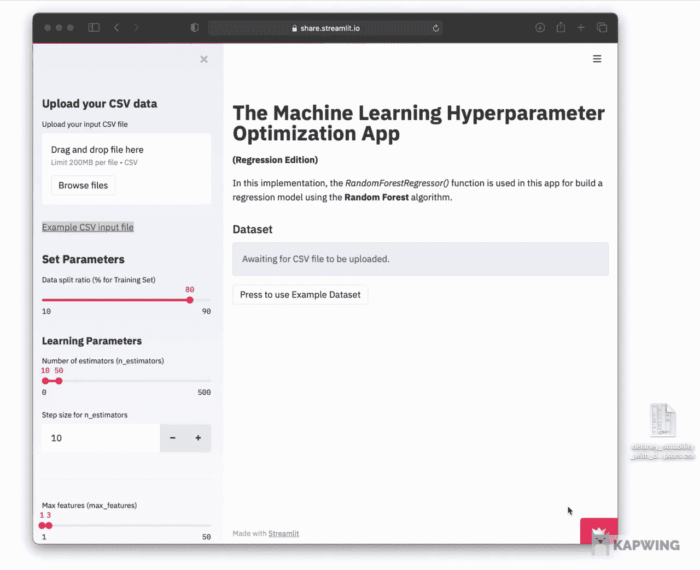
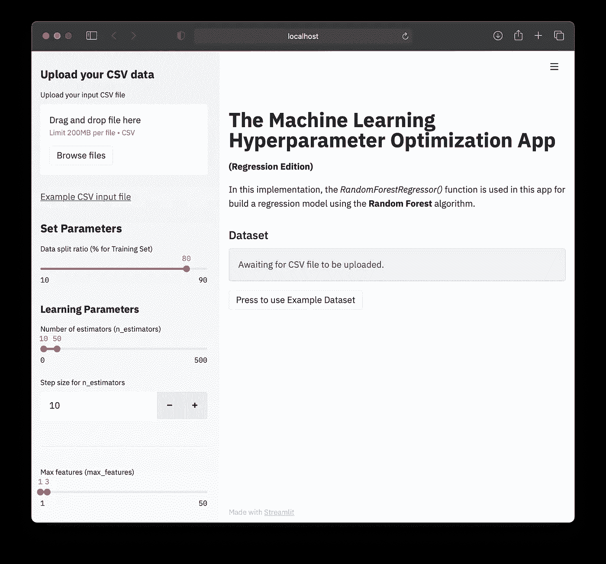

# 如何用 Python 构建 AutoML 应用程序

> 原文：<https://towardsdatascience.com/how-to-build-an-automl-app-in-python-e216763d10cd?source=collection_archive---------6----------------------->


使用来自 [envato elements](https://1.envato.market/c/2346717/628379/4662) 的 [koctia](https://elements.envato.com/user/koctia) 的图像创建(经许可)。

## [数据科学](https://medium.com/tag/data-science) | [机器学习](https://medium.com/tag/machine-learning)

## 使用 Streamlit 库的分步教程

自动化机器学习(AutoML)通过简化流程来帮助降低机器学习模型构建的门槛，从而允许非技术用户利用机器学习的力量。另一方面，AutoML 的可用性也有助于解放数据科学家的时间(否则他们会花在冗余和重复的预处理任务或模型构建任务上)，允许他们探索数据分析管道的其他领域。

简而言之，用户可以向 AutoML 系统提供输入数据集，用于模型构建(特征转换、特征选择、超参数优化等)。)最后，它将预测作为输出返回。

如果你可以构建自己的 AutoML 应用程序，并根据自己的喜好进行定制，这不是很好吗？该 AutoML 应用程序的开发分为两部分:(1)模型部署有助于完成数据生命周期，以及(2) AutoML 有助于非技术用户访问 ML。

在本文中，我们将使用 Streamlit 和 Scikit-learn 库用 Python 构建一个 AutoML 应用程序。这个 web 应用程序将允许用户上传他们自己的 CSV 文件，并且 web 应用程序将通过执行网格超参数搜索来自动构建随机森林模型。

需要注意的是，这篇文章的灵感来自于我前段时间在我的 YouTube 频道上做的一个视频( [***如何搭建一个机器学习超参数优化 App***](https://youtu.be/HT2WHLgYpxY))([***数据教授***](https://youtube.com/dataprofessor) )。

[*如何搭建机器学习超参数优化 App*](https://youtu.be/HT2WHLgYpxY) @ [数据教授](https://youtube.com/dataprofessor)

# 1.AutoML 应用程序概述

我们今天构建的 AutoML 应用程序不到 200 行代码，确切地说是 171 行。

## 1.1.技术堆栈

web 应用程序将使用以下库在 Python 中构建:

*   `streamlit` —网络框架
*   `pandas` —处理数据帧
*   `numpy` —数值数据处理
*   `base64` —对要下载的数据进行编码
*   `scikit-learn` —进行超参数优化，建立机器学习模型

## 1.2.用户界面

web 应用程序有一个简单的界面，由两个面板组成:(1)左侧面板接受输入 CSV 数据和参数设置，而(2)主面板显示输出，包括打印出输入数据集的数据帧、模型的性能指标、超参数调整的最佳参数以及调整后的超参数的 3D 等值线图。



AutoML 应用程序的屏幕截图。

## 1.3.AutoML 应用程序演示

让我们看一下下面 2 个截图中的 web 应用程序，这样你就可以对你将要构建的应用程序有个大概的了解。

***1.3.1。AutoML 应用程序使用示例数据集***

试用 web 应用程序的最简单方法是使用提供的示例数据集，方法是单击主面板中的`Press to use Example Dataset`按钮，这将加载糖尿病数据集作为示例数据集。



使用示例数据集的 AutoML 应用程序的屏幕截图。

**1 . 3 . 2*。AutoML 应用程序使用上传的 CSV 数据***

或者，您也可以上传自己的 CSV 数据集，方法是将文件直接拖放到上传框中(如下图所示)，或者点击`Browse files`按钮并选择要上传的输入文件。



使用输入 CSV 数据集的 AutoML 应用程序的屏幕截图。

在上面的两个屏幕截图中，在提供示例数据集或上传的 CSV 数据集后，应用程序打印出数据集的数据帧，通过使用提供的输入学习参数自动构建几个机器学习模型，以执行超参数优化，然后打印出模型性能指标。最后，在主面板的底部提供了调整后的超参数的交互式 3D 等高线图。

您也可以点击以下链接试用该应用程序:

*   [AutoML 应用的演示链接](https://share.streamlit.io/dataprofessor/ml-opt-app/main/ml-opt-app.py)

# 2.代码

现在让我们深入了解一下 AutoML 应用程序的内部工作原理。如你所见，整个应用程序只用了 171 行代码。

应该注意的是，代码中提供的所有注释(由包含散列标签符号`#`的行表示)通过记录每个代码块正在做什么来使代码更可读。

## 第 1–10 行

导入必要的库，包括`streamlit`、`pandas`、`numpy`、`base64`、`plotly`和`scikit-learn`。

## 第 15–16 行

`set_page_config()`功能允许我们将网页标题指定为`page_title=‘The Machine Learning Hyperparameter Optimization App’`，并将页面布局设置为全幅模式，如`layout=’wide’`输入参数所指定。

## 第 19–25 行

在这里，我们使用 st.write()函数和 markdown 语法，通过在标题文本`The Machine Learning Hyperparameter Optimization App`前面使用`#`标签来编写第 20 行的网页标题文本。在随后的几行中，我们编写了 web 应用程序的描述。

## 第 29–58 行

这些代码块属于左侧面板中的输入小部件，它接受用户输入的 CSV 数据和模型参数。

*   第 29–33 行—第 29 行通过`st.sidebar.header()`函数打印左侧边栏面板的标题文本，其中函数中的 sidebar 指示输入小部件应该放置在左侧边栏面板中的位置。线 30 通过`st.sidebar.file_uploader()`功能接受用户输入的 CSV 数据。正如我们所看到的，有 2 个输入参数，其中第一个是文本标签`Upload your input CSV file`，而第二个输入参数`type=[“csv”]`限制只接受 CSV 文件。第 31–33 行通过`st.sidebar.markdown()`函数以 Markdown 语法打印到示例数据集的链接。
*   第 36 行—通过`st.sidebar.header()`功能打印标题文本`Set Parameters`。
*   第 37 行通过`st.sidebar.slider()`功能显示一个滑动条，允许用户通过简单调整滑动条来指定数据分割比率。第一个输入参数打印小部件标签文本`Data split ratio (% for Training Set)`，其中接下来的 4 个值代表最小值、最大值、默认值和增量步长。最后，将指定值赋给`split_size`变量。
*   第 39–47 行显示学习参数的输入部件，而第 49–54 行显示一般参数的输入部件。类似于对第 37 行的解释，这些代码行也利用`st.sidebar.slider()`作为输入小部件，接受用户指定的模型参数值。第 56–58 行将滑块输入的用户指定值组合成一个聚合形式，然后作为负责超参数调整的`GridSearchCV()`函数的输入。

## 第 64 行

通过`st.subheader()`功能在输入数据帧上方添加一个副标题文本`Dataset`。

## 第 69–73 行

这段代码将通过`base64`库对模型性能结果进行编码和解码，作为一个可下载的 CSV 文件。

## 第 75–153 行

在高层次上，这个代码块是`build_model()`自定义函数，它将接受输入数据集和用户指定的参数，然后执行模型构建和超参数调整。

*   第 76–77 行——输入数据帧分为`X`(删除最后一列 Y 变量)和`Y`(特别选择最后一列)变量。
*   第 79 行——这里我们通过`st.markdown()`函数通知用户模型正在构建中。然后在第 80 行，Y 变量的列名通过`st.info()`函数打印在一个信息框中。
*   第 83 行——使用`X`和`Y`变量作为输入数据，通过`train_test_split()`功能执行数据分割，而用户指定的分割比率值由`split_size`变量指定，该变量从第 37 行描述的滑动条中取值。
*   第 87–95 行—通过分配给`rf`变量的`RandomForestRegressor()`函数实例化随机森林模型。如您所见，`RandomForestRegressor()`函数中定义的所有模型参数都从用户指定的输入小部件中获取参数值，如上文第 29–58 行所述。
*   第 97–98 行—执行超参数调整。
    →第 97 行——在`rf`变量中指定的上述随机森林模型被指定为`GridSearchCV()`函数中的`estimator`参数的输入变量，它将执行超参数调整。在超参数调整中探索的超参数值范围在`param_grid`变量中指定，该变量直接从用户指定值中取值，该值从滑动条(第 40-43 行)获得，并作为`param_grid`变量(第 56-58 行)进行预处理。
    →第 98 行——超参数调整过程从输入`X_train`和`Y_train`作为输入数据开始。
*   第 100 行—通过`st.subheader()`功能打印型号性能副标题文本。接下来的行将打印模型性能指标。
*   第 102 行——存储在`grid`变量中的超参数调整过程的最佳模型被用于对`X_test`数据进行预测。
*   第 103–104 行—通过使用`Y_test`和`Y_pred_test`作为输入参数的`r2_score()`函数打印 R2 分数。
*   第 106–107 行—通过使用`Y_test`和`Y_pred_test`作为输入参数的`mean_squared_error()`函数打印 MSE 分数。
*   第 109–110 行—打印最佳参数，并四舍五入到小数点后两位。最佳参数值从`grid.best_params_`和`grid.best_score_`变量中获得。
*   第 112–113 行—第 112 行通过`st.subheader()`功能打印副标题`Model Parameters`。第 113 行通过`st.write()`功能打印存储在`grid.get_params()`中的模型参数。
*   第 116-125 行——从`grid.cv_results_`获得模型性能指标，并重新调整为`x`、`y`和`z`。
    →第 116 行——我们将有选择地从`grid.cv_results_`中提取一些数据，这些数据将用于创建一个包含 2 个超参数组合及其相应性能指标的数据框架，在本例中是 R2 分数。特别是，`pd.concat()`功能将用于组合 2 个超参数(`params`)和性能指标(`mean_test_score`)。
    →第 118 行——现在将进行数据整形，以将数据准备成适合创建等高线图的格式。特别是，`pandas`库中的`groupby()`函数将用于根据两列(`max_features`和`n_estimators`)对数据帧进行分组，从而合并第一列(`max_features`)的内容。
*   第 120–122 行—数据现在将被旋转到一个 m ⨯ n 矩阵中，其中的行和列分别对应于`max_features`和`n_estimators`。
*   第 123-125 行——最后，各`x`、 `y`和`z`变量的整形数据将用于绘制等高线图。
*   第 128-146 行——这些代码块现在将通过`plotly`库使用`x`、 `y`和`z`变量创建 3D 等高线图。
*   第 149-152 行——然后将`x`、 `y`和`z`变量组合成一个`df`数据帧。
*   第 153 行——存储在 grid_results 变量中的模型性能结果现在可以通过`filedownload()`自定义函数下载(第 69–73 行)。

## 第 156–171 行

在高层次上，这些代码块将执行应用程序的逻辑。这由 2 个代码块组成。第一个是`if`代码块(第 156-159 行)，第二个是`else`代码块(第 160-171 行)。每次 web 应用程序加载时，它将默认运行`else`代码块，而`if`代码块将在输入 CSV 文件上传时被激活。

对于两个代码块，逻辑是相同的，唯一的区别是`df`数据 dataframe 的内容(无论它是来自输入 CSV 数据还是来自示例数据)。接下来，通过`st.write()`功能显示`df`数据框的内容。最后，通过`build_model()`自定义函数启动模型构建过程。

# 3.运行 AutoML 应用程序

现在我们已经编写了应用程序，让我们继续启动它。

## 3.1.创造康达环境

让我们首先创建一个新的`conda`环境(为了确保代码的可再现性)。

首先，在终端命令行中创建一个名为`automl`的新`conda`环境，如下所示:

```
conda create -n automl python=3.7.9
```

其次，我们将登录到`automl`环境

```
conda activate automl
```

## 3.2.安装必备库

首先，下载`requirements.txt`文件

```
wget [https://raw.githubusercontent.com/dataprofessor/](https://raw.githubusercontent.com/dataprofessor/ml-auto-app/main/requirements.txt)[ml-opt-app](https://github.com/dataprofessor/ml-opt-app)[/main/requirements.txt](https://raw.githubusercontent.com/dataprofessor/ml-auto-app/main/requirements.txt)
```

其次，安装如下所示的库

```
pip install -r requirements.txt
```

## 3.3.下载应用程序文件

您可以下载数据教授的 GitHub repo 上托管的 web 应用程序文件，也可以使用上面找到的 171 行代码。

```
wget [https://github.com/dataprofessor/](https://github.com/dataprofessor/ml-app/archive/main.zip)[ml-opt-app](https://github.com/dataprofessor/ml-opt-app)[/archive/main.zip](https://github.com/dataprofessor/ml-app/archive/main.zip)
```

接下来，解压缩文件内容

```
unzip main.zip
```

现在通过`cd`命令进入`main`目录

```
cd main
```

现在你在`main`目录中，你应该能够看到`ml-opt-app.py`文件。

## 3.4.启动 web 应用程序

要启动应用程序，请在终端提示符下键入以下命令(即确保`ml-opt-app.py`文件位于当前工作目录中):

```
streamlit run ml-opt-app.py
```

几秒钟后，终端提示中出现以下消息。

```
> streamlit run ml-opt-app.pyYou can now view your Streamlit app in your browser.Local URL: [http://localhost:8501](http://localhost:8501)
Network URL: [http://10.0.0.11:8501](http://10.0.0.11:8501)
```

最后，应该会弹出一个浏览器和应用程序。



本地启动的 AutoML App 截图。

您也可以通过以下链接测试 AutoML 应用程序:

*   [***AutoML App 的演示链接***](https://share.streamlit.io/dataprofessor/ml-opt-app/main/ml-opt-app.py)

# 4.结论

现在您已经按照本文中的描述创建了 AutoML 应用程序，接下来呢？你或许可以将这款应用调整为另一种机器学习算法。附加功能，如功能重要性图也可以添加到应用程序中。可能性是无穷的，并享受定制应用程序的乐趣！请随时发表评论，说明您是如何为自己的项目修改应用程序的。

## 订阅我的邮件列表，获取我在数据科学方面的最佳更新(偶尔还有免费赠品)!

# 关于我

我是泰国一所研究型大学的生物信息学副教授和数据挖掘和生物医学信息学负责人。在我下班后的时间里，我是一名 YouTuber(又名[数据教授](http://bit.ly/dataprofessor/))制作关于数据科学的在线视频。在我制作的所有教程视频中，我也在 GitHub 上分享 Jupyter 笔记本([数据教授 GitHub page](https://github.com/dataprofessor/) )。

<https://www.youtube.com/dataprofessor>  

# 在社交网络上与我联系

✅YouTube:[http://youtube.com/dataprofessor/](http://youtube.com/dataprofessor/)
♇网站:[http://dataprofessor.org/](https://www.youtube.com/redirect?redir_token=w4MajL6v6Oi_kOAZNbMprRRJrvJ8MTU5MjI5NjQzN0AxNTkyMjEwMDM3&q=http%3A%2F%2Fdataprofessor.org%2F&event=video_description&v=ZZ4B0QUHuNc)(在建)
♇LinkedIn:[https://www.linkedin.com/company/dataprofessor/](https://www.linkedin.com/company/dataprofessor/)
♇Twitter:[https://twitter.com/thedataprof](https://twitter.com/thedataprof)/
♇Facebook:[http://facebook.com/dataprofessor/](https://www.youtube.com/redirect?redir_token=w4MajL6v6Oi_kOAZNbMprRRJrvJ8MTU5MjI5NjQzN0AxNTkyMjEwMDM3&q=http%3A%2F%2Ffacebook.com%2Fdataprofessor%2F&event=video_description&v=ZZ4B0QUHuNc)
♇github:[https://github.com/dataprofessor/](https://github.com/dataprofessor/)
♇Instagram:)