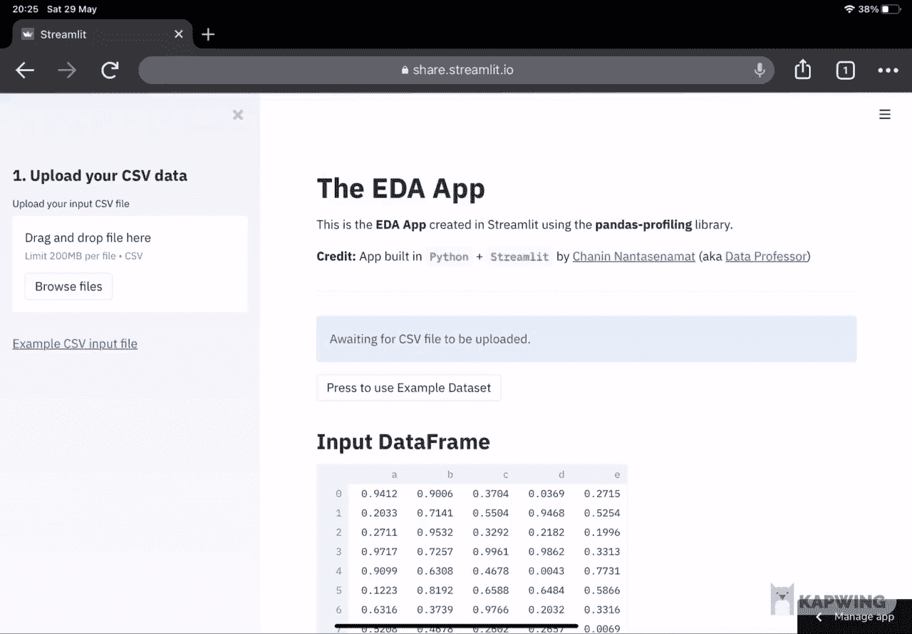
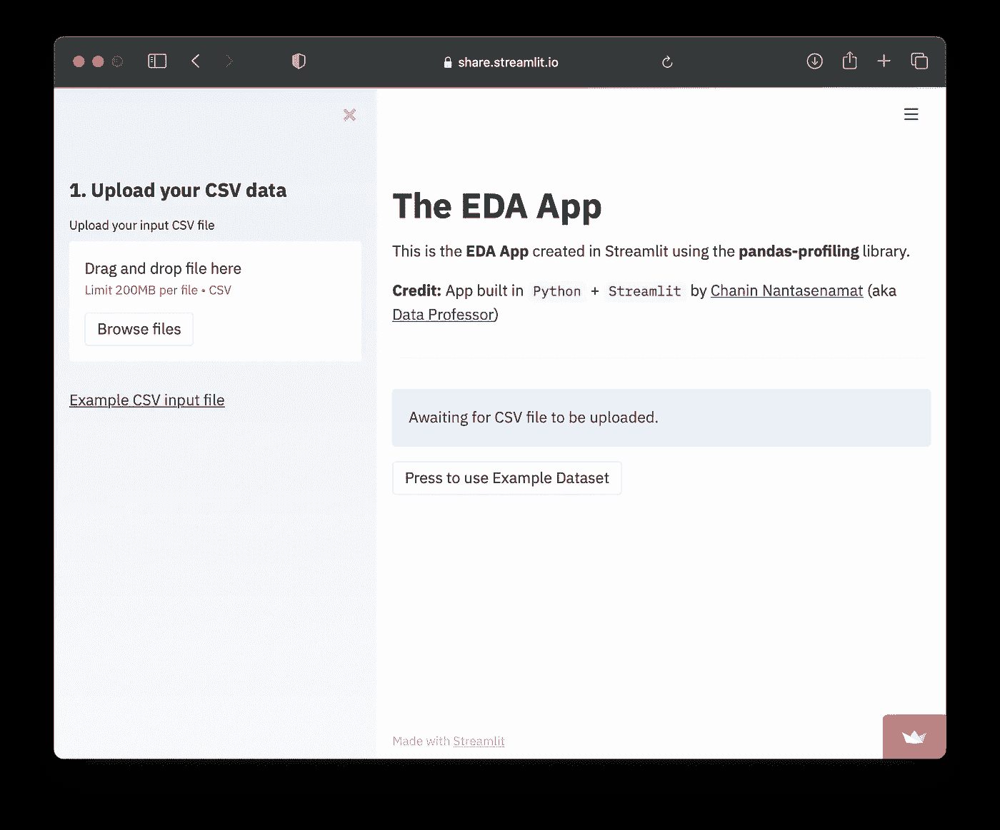
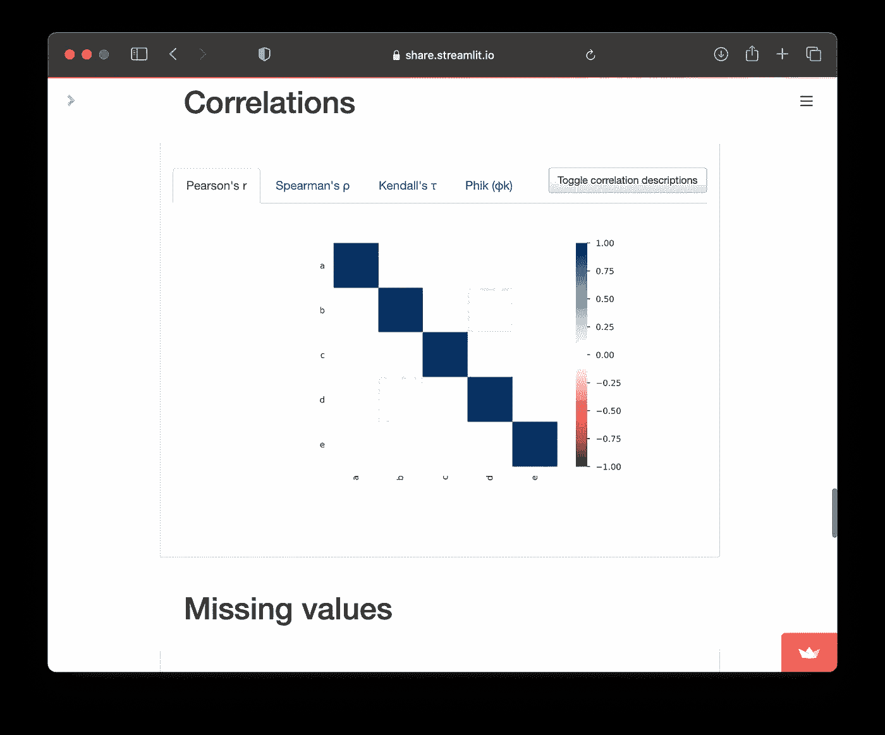

# 如何用 Python 构建 EDA 应用程序

> 原文：<https://towardsdatascience.com/how-to-build-an-eda-app-in-python-af7ec4b51528?source=collection_archive---------10----------------------->


使用来自 [envato elements](https://1.envato.market/c/2346717/628379/4662) 的 [hoangpts](https://elements.envato.com/user/hoangpts) 的图像创建(经许可)。

## [数据科学](https://medium.com/tag/data-science) | [机器学习](https://medium.com/tag/machine-learning)

## 用 50 行代码从头开始一步一步的教程

探索性数据分析(EDA)是探索和总结数据集主要特征的基本和初步的第一步。EDA 提供了帮助我们更好地理解变量及其关系的方法。这是通过非图形(描述性统计)和图形(数据可视化)技术实现的。

在本文中，我们将创建一个 EDA web 应用程序，您可以使用它来加速 EDA 分析，或者让您的同事无需使用 Python 编写代码就可以执行 EDA。执行 EDA 分析只需简单上传输入 CSV 文件。

也可以参考我 YouTube 频道([数据教授](https://www.youtube.com/channel/UCV8e2g4IWQqK71bbzGDEI4Q))的我的 YouTube 视频 [*如何利用熊猫建档*](https://youtu.be/p4uohebPuCg) 构建探索性数据分析 app 作为本文的补充。

# 1.EDA 工具(Pandas Profiling)

一个简单直观的 EDA 工具是 Python 中的`pandas-profiling`库。它允许通过`df.profile_report()`功能为`df`数据帧生成一份分析报告。

生成的配置文件是一个交互式 HTML 报告，显示每个变量的以下统计数据(更多详情，请参见[文档](https://pandas-profiling.github.io/pandas-profiling/docs/master/rtd/)):

*   **类型推断**:识别数据帧中各列的数据类型。
*   **要领**:类型、唯一值、缺失值。
*   **分位数统计**:最小值、最大值、Q1、中位数、Q3、极差和四分位差。
*   **描述性统计**:均值、众数、标准差、总和、中位数绝对偏差、变异系数、峰度、偏度。
*   **最频繁值**
*   **直方图**:数值范围分布。
*   **相关性**:突出显示高度相关的变量、Spearman、Pearson 和 Kendall 矩阵。
*   **缺失值**:缺失值的矩阵、计数、热图和树状图。
*   **重复行**:列出出现次数最多的重复行。
*   **文本分析**:了解文本数据的类别(大写、空格)、脚本(拉丁文、西里尔文)和块(ASCII)。

# 2.关于我们今天正在构建的 EDA 应用程序

我们今天将要构建的 EDA 应用程序将允许我们将自己的 CSV 数据集上传到应用程序，然后应用程序将自动生成一个*(一个便于 EDA 分析的交互式 HTML 报告)。*

**

*你可以在这里自己试试: [**EDA App 演示**](https://share.streamlit.io/dataprofessor/eda-app/main/app.py)*

# *3.EDA 应用程序的代码*

*这段代码有 50 多行代码，准确地说是 52 行。*

*让我们来看看应用程序背后的技术。它基于由以下内容组成的 5 个 Python 库:*

*   *`numpy` —用于生成由 5 列(变量)组成的合成数据集，该数据集用作示例数据集(注意 web 应用程序页面标题下主面板中的`Press to use Example Dataset`按钮)。*
*   *`pandas` —用于存放数据帧形式的数据。*
*   *`streamlit` —使构建简单 web 应用成为可能的 web 框架。*
*   *`pandas_profiling` —为执行 EDA 生成交互式 HTML 报告的库。*
*   *`streamlit_pandas_profiling` —允许在 Streamlit web 应用程序中使用`pandas_profiling`库的库。*

# *4.对代码的逐行解释*

## *第 1–5 行*

*   *导入由`numpy`、`pandas`、`streamlit`、`pandas_profiling`和`streamlit_pandas_profiling`组成的必备库*

## *第 7–13 行*

*   ***第 7 行** —注释文本，表示后续代码块与 web 应用程序的标题相关。*
*   ***第 8–13 行**—`st.markdown()`功能打印 web 应用程序的标题。输入参数采用 Markdown 语法。*

## *第 15–20 行*

*   ***第 15 行** —注释文本，描述第 16–20 行负责 CSV 上传功能。*
*   ***第 16 行** — `with`用于构建属于代码块的后续代码行。`st.sidebar.header()`指定使用`header()`功能在左侧面板显示标题文本`1\. Upload your CSV data`。*
*   ***第 17 行**—`st.sidebar.file_uploader()`功能允许创建上传框。需要注意的是`st.sidebar`指定了上传框在侧边栏中的位置(可折叠的左侧面板)。在`file_uploader()`函数中找到的输入参数`type=["csv"]`指定上传框只接受`csv`文件类型。*
*   ***第 18 行**—`st.sidebar.markdown()`函数指定使用`markdown()`函数在左侧面板中显示一个指向示例 CSV 文件的链接。*

## *第 22–52 行*

*   ***第 22 行** —注释文本，描述后续代码块负责创建 **Pandas Profiling** 报告。这里需要注意的是，这个部分由一个`if-else`语句组成，每次 web 应用程序加载时，默认情况下都会运行`else`代码块(第 35–52 行)。上传输入 CSV 文件后，`if`代码块(第 23-34 行)将被激活并运行。*
*   ***第 23–34 行** —该代码块代表`if`语句。如前所述，该代码块将在输入 CSV 文件上传后运行。
    — **第 23 行** —设置`if`条件，检测`uploaded_file is not None`指示文件上传。
    — **第 24 行**—`@st.cache`装饰器允许应用程序跳过后续代码行中定义的高成本且重复的函数。
    — **第 25–27 行** —一个名为`load_csv`的自定义函数，通过`uploaded_file`变量从上传框读入输入 CSV 文件。
    — **第 28 行** —从`load_csv`自定义函数读取的 CSV 文件内容被分配给`df`变量。
    — **第 29 行**—`ProfileReport()`功能被分配给`pr`变量。
    — **第 30–31 行**—`**Input DataFrame**`的标题通过`st.header()`功能打印为标题文本(第 30 行)。存储在`df`变量中的数据帧内容被打印出来(第 31 行)。
    — **第 32 行** — `"- — -”`打印一个水平条。
    — **第 33–34 行**—`**Pandas Profiling Report**`的标题通过`st.header()`功能打印为标题文本(第 33 行)。存储`ProfileReport()`功能输出的`pr`变量的内容被打印出来。特别是，这是允许 EDA 功能的交互式 HTML 配置文件报告。*
*   ***第 35–52 行** —该代码块代表`else`语句。
    — **第 35 行**—`else`条件设置为默认状态，每次加载 web 应用程序时运行。
    — **第 36 行** —通过`st.info()`功能在信息框中打印一段文字`Awaiting for CSV file to be uploaded.`。
    — **第 37–52 行**—`if`条件用于指定点击`Press to use Example Dataset`按钮的结果(其下的语句将被运行),这将使用示例数据集生成配置文件报告。
    — **第 38 行** —注释文本，表示以下代码行与示例数据相关。
    — **第 39 行**——如前面第 24 行所述，`@st.cache`装饰器允许应用跳过后续代码行的潜在高成本运行(即，否则应用将在每次重新加载时重新生成合成数据集)。
    — **第 40–45 行** —定义了一个自定义函数，使用`NumPy`库创建一个由 5 列组成的合成数据集。
    — **第 46 行** —第 40–45 行自定义函数定义的合成数据集被分配给`df`变量。*

# *5.运行 EDA 应用程序*

*现在是运行应用程序的时候了。*

## *5.1.创造康达环境*

*让我们假设您是从零开始，因此您将不得不创建一个新的`conda`环境(这是一个好主意，以确保代码的可再现性)。*

*首先，在终端命令行中创建一个名为`eda`的新`conda`环境，如下所示:*

```
*conda create -n eda python=3.7.9*
```

*其次，我们将登录到`eda`环境*

```
*conda activate eda*
```

## *5.2.安装必备库*

*首先，下载 requirements.txt 文件*

```
*wget [https://raw.githubusercontent.com/dataprofessor/eda-app/main/requirements.txt](https://raw.githubusercontent.com/dataprofessor/ml-auto-app/main/requirements.txt)*
```

*其次，安装如下所示的库*

```
*pip install -r requirements.txt*
```

## *5.3.下载 EDA 应用文件*

*您可以下载数据教授的 GitHub repo 上托管的 web 应用程序文件，也可以使用上面找到的 52 行代码。*

```
*wget [https://github.com/dataprofessor/eda-app/archive/main.zip](https://github.com/dataprofessor/ml-app/archive/main.zip)*
```

*接下来，解压缩文件内容*

```
*unzip main.zip*
```

*现在通过`cd`命令进入`main`目录*

```
*cd main*
```

*现在你在`main`目录中，你应该能够看到`app.py`文件。*

## *5.4.启动 web 应用程序*

*可以通过在终端提示符下键入以下命令来启动应用程序(即确保`app.py`文件在当前工作目录下):*

```
*streamlit run app.py*
```

*之后，您将在终端提示符下看到以下消息。*

```
*> streamlit run app.pyYou can now view your Streamlit app in your browser.Local URL: [http://localhost:8501](http://localhost:8501)
Network URL: [http://10.0.0.11:8501](http://10.0.0.11:8501)*
```

*最后，应该会弹出一个浏览器和应用程序。*

**

***EDA App 截图。**试用 app 请参考**[**EDA App demo**](https://share.streamlit.io/dataprofessor/eda-app/main/app.py)**。*****

******

*****EDA 应用在运行中的截图。**我们可以在这里看到相关图。请参考上面第 2 节中的动画示例。***

# ***恭喜你！***

***现在，您已经创建了一个 EDA 应用程序，可以让您在旅途中轻松执行 EDA 分析，只需上传一个输入 CSV 文件，即可开始执行 EDA 分析。***

# ***将 EDA 应用部署到互联网***

***如果您希望向全世界公开您的 web 应用程序，您可以将其部署到互联网上。我在 YouTube 上制作了视频，展示如何在 Heroku、Streamlit 和 Streamlit 上做到这一点。***

*   ***[如何将数据科学 Web App 部署到 Heroku](https://www.youtube.com/watch?v=zK4Ch6e1zq8)***
*   ***[如何部署 Data Science Web App 以简化 it 共享](https://www.youtube.com/watch?v=kXvmqg8hc70)***

***通过 Streamlit 共享平台在互联网上部署的 EDA 应用示例可在此处访问: [**EDA 应用演示**](https://share.streamlit.io/dataprofessor/eda-app/main/app.py)***

## ***订阅我的邮件列表，获取我在数据科学方面的最佳更新(偶尔还有免费赠品)!***

# ***关于我***

***我是泰国一所研究型大学的生物信息学副教授和数据挖掘和生物医学信息学负责人。在我下班后的时间里，我是一名 YouTuber(又名[数据教授](http://bit.ly/dataprofessor/))制作关于数据科学的在线视频。在我做的所有教程视频中，我也在 GitHub 上分享 Jupyter 笔记本([数据教授 GitHub page](https://github.com/dataprofessor/) )。***

***<https://www.youtube.com/dataprofessor>  

# 在社交网络上与我联系

✅YouTube:[http://youtube.com/dataprofessor/](http://youtube.com/dataprofessor/)
♇网站:[http://dataprofessor.org/](https://www.youtube.com/redirect?redir_token=w4MajL6v6Oi_kOAZNbMprRRJrvJ8MTU5MjI5NjQzN0AxNTkyMjEwMDM3&q=http%3A%2F%2Fdataprofessor.org%2F&event=video_description&v=ZZ4B0QUHuNc)(在建)
♇LinkedIn:[https://www.linkedin.com/company/dataprofessor/](https://www.linkedin.com/company/dataprofessor/)
♇Twitter:[https://twitter.com/thedataprof](https://twitter.com/thedataprof)
♇Facebook:[http://facebook.com/dataprofessor/](https://www.youtube.com/redirect?redir_token=w4MajL6v6Oi_kOAZNbMprRRJrvJ8MTU5MjI5NjQzN0AxNTkyMjEwMDM3&q=http%3A%2F%2Ffacebook.com%2Fdataprofessor%2F&event=video_description&v=ZZ4B0QUHuNc)
♇github:[https://github.com/dataprofessor/](https://github.com/dataprofessor/)
♇insta gram:[https://www.instagram.com/data.professor/【t19](https://www.instagram.com/data.professor/)***