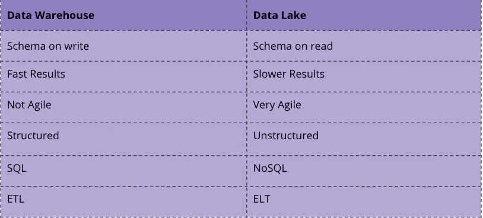

# 如何建立一个高效的现代化数据平台

> 原文：<https://towardsdatascience.com/how-to-build-an-efficient-and-modern-data-platform-7e0e7630ef70?source=collection_archive---------35----------------------->

## 为什么您应该将数据湖、数据仓库和数据集市集成在一起，而不是将它们孤立起来

乔尔·沃戴尔在 [Unsplash](https://unsplash.com/s/photos/lake?utm_source=unsplash&utm_medium=referral&utm_content=creditCopyText) 上拍摄的照片

它们应该自由地相互集成，而不是独立地构建和理解数据湖、数据仓库和数据集市。这避免了数据孤岛并简化了数据供应。

## 什么是什么？

**数据仓库和数据湖代表了一个中央数据库**系统，可用于公司的分析目的。该系统从各种异构数据源提取、收集和保存相关数据，并提供给下游系统。

数据仓库可以分为四个子过程:

*   数据获取:从各种数据仓库中获取和提取数据。
*   数据存储:在数据仓库中存储数据，包括长期存档。
*   数据供应:为下游系统提供所需的数据，提供数据集市。
*   数据评估:对数据库的分析和评估。

虽然数据仓库将经典的 ETL 过程与关系数据库中的结构化数据结合使用，但数据湖使用 ELT 和模式等范例读取非结构化数据[1]。

差异数据仓库与湖

在上图中，您可以看到主要的区别。你使用的技术也很不同。对于数据仓库，您将使用 SQL 和关系数据库，而对于数据湖，您可能会使用 NoSQL 或两者的混合。

可以说，数据集市是面向特定业务部门的数据仓库的子集[2]。数据集市包含收集的汇总数据的存储库，用于对组织内的特定部门或单位(例如销售部门)进行分析。

## 将所有这些结合在一个混合数据湖中

那么如何将这些概念结合起来呢？在下图中，您可以从高层次的角度看到一个架构。该过程是将非结构化和未转换的数据加载到数据湖中。从这里，一方面，数据可以用于 ML 和数据科学任务。另一方面，数据也可以以结构化的形式被转换和加载到数据仓库中。从这里开始，可以通过数据集市和(自助式)BI 工具实现传统的数据仓库分布。

混合数据湖概念—图片来自作者

您可以为这个架构使用的主要技术可以是例如:[3][4]

*   ELT/ETL 流程通过——talend、Google 数据流、AWS 数据管道
*   数据湖 via — HDFS、AWS 雅典娜和 S3、谷歌云存储
*   数据仓库/数据集市通过——Google big query、AWS Redshift、雪花

> 注意:像 Google 的 BiqQuery 或 AWS Redshift 这样的技术通常被认为是数据仓库和数据湖技术的混合体，因为它们通常已经实现了 NoSQL 的一些特征。

大多数技术可以从单一来源获得的事实使得建立这样的数据平台更加容易。这对小公司来说是一个优势。例如，一旦数据被加载到数据仓库中，就可以通过现有的接口相对容易地对其进行进一步的处理，用于 ETL 和数据集市过程，通常只需要很少的编程工作。

## 结论

本文解释了如何使用混合数据湖。数据湖使您的公司能够灵活地以数据形式捕获业务运营的各个方面，同时保持传统数据仓库的活力。从那里，数据可以依次转移到数据集市。好处是一切都建立在相同的数据源和技术上，因此可以更容易地进行更改。大型云提供商通常从一个来源提供所有必要的工具，因此这导致了更容易的处理和可能的成本优势。我帮助构建的一个解决方案包括 Google Storage 和 BigQuery 作为数据湖和暂存区，talend 作为 ETL/ELT 工具，Big Query 作为数据仓库和数据集市层。从那里，数据可以很容易地用于 ML 服务或 BI 工具 Data Studio。

## 资料来源和进一步阅读

[1] IBM，[绘制数据湖:使用读取模式和写入模式的数据模型](https://www.ibmbigdatahub.com/blog/charting-data-lake-using-data-models-schema-read-and-schema-write#:~:text=Blogs-,Charting%20the%20data%20lake%3A%20Using%20the%20data%20models%20with%20schema,read%20and%20schema-on-write&text=There%20is%20no%20attempt%20to,-on-read%20data%20stores.) (2017)

[2]数据仓库指南，[数据仓库指南](https://panoply.io/data-warehouse-guide/)，(2021)

[3]谷歌，[帮助保护从数据湖到数据仓库的管道](https://cloud.google.com/solutions/help-secure-the-pipeline-from-your-data-lake-to-your-data-warehouse?hl=en) (2021)

[4] AWS，[AWS 中的混合数据湖](https://aws.amazon.com/de/quickstart/architecture/hybrid-data-lake-with-wandisco-fusion/) (2021)