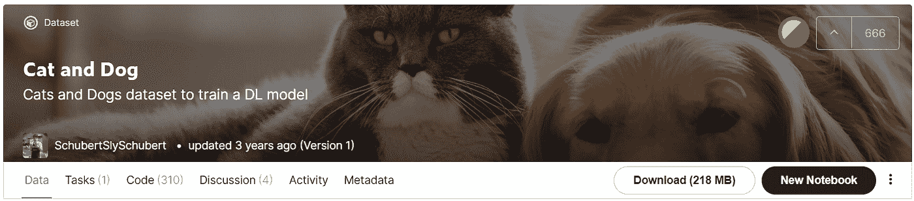
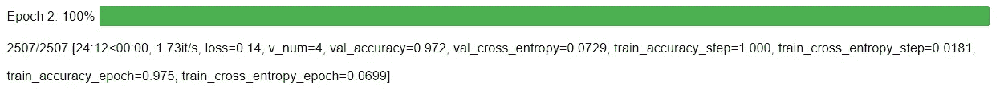

# 如何用 Flash 用几行代码构建一个图像分类器

> 原文：<https://towardsdatascience.com/how-to-build-an-image-classifier-in-few-lines-of-code-with-flash-ccfcf41f7972?source=collection_archive---------34----------------------->

## Flash 简介:面向初学者的高级深度学习框架


Brian Suh 在 [Unsplash](https://unsplash.com/s/photos/colors?utm_source=unsplash&utm_medium=referral&utm_content=creditCopyText) 上拍摄的照片

# 介绍

图像分类是一项任务，我们要预测哪一类属于一幅图像。由于图像表示，这项任务很困难。如果我们将图像展平，它将创建一个长的一维向量。此外，该表示将丢失邻居信息。因此，我们需要深度学习来提取特征并预测结果。

有时候，建立深度学习模型可能会成为一项艰巨的任务。虽然我们为图像分类创建了一个基础模型，但是我们需要花费大量的时间来创建代码。我们必须准备代码来准备数据、训练模型、测试模型，并将其部署到服务器。这就是闪光的来源！

Flash 是一个高级深度学习框架，用于快速构建、训练和测试深度学习模型。Flash 基于 PyTorch 框架。所以如果你了解 PyTorch，你会很容易熟悉 Flash。

与 PyTorch 和 Lighting 相比，Flash 易于使用，但不如以前的库灵活。如果你想建立一个更复杂的模型，你可以使用 Lightning 或 straight to the PyTorch。


由作者创作。

使用 Flash，您可以用几行代码构建您的深度学习模型！所以，如果你是深度学习的新手，不要害怕。Flash 可以帮助你建立深度学习模型，而不会因为代码而感到困惑。

本文将向您展示如何使用 Flash 构建图像分类器。没有进一步，让我们开始吧！

# 履行

## 安装库

要安装库，您可以像这样使用 pip 命令:

```
**pip install lightning-flash**
```

如果这个命令不起作用，您可以使用它的 GitHub 库来安装这个库。该命令如下所示:

```
**pip install git+**[**https://github.com/PyTorchLightning/lightning-flash.git**](https://github.com/PyTorchLightning/lightning-flash.git)
```

在我们成功下载包之后，现在让我们加载库。我们也用数字 42 设定种子。下面是实现这一点的代码:

## 下载数据

在我们安装了库之后，现在让我们来获取数据。为了进行演示，我们将使用名为猫狗数据集的数据集。

该数据集包含分为两类的图像。这些课是猫和狗。要访问数据集，可以在 Kaggle 找到这个数据集。您可以在这里 访问数据集 [**。**](https://www.kaggle.com/tongpython/cat-and-dog)



作者捕捉到的。

## 加载数据

下载完数据后，现在让我们将数据集加载到一个对象中。我们将使用 from_folders 方法将数据放入 ImageClassification 对象。下面是实现这一点的代码:

## 加载模型

在我们加载数据之后，下一步是加载模型。因为我们不会从头开始创建自己的架构，所以我们将使用基于现有卷积神经网络架构的预训练模型。

我们将使用已经过预训练的 ResNet-50 模型。此外，我们根据数据集设置类的数量。下面是实现这一点的代码:

## 训练模型

在我们加载模型之后，现在让我们训练模型。我们需要首先初始化教练对象。我们将在 3 个时期训练模型。此外，我们启用 GPU 来训练模型。下面是实现这一点的代码:

初始化对象后，现在让我们训练模型。为了训练模型，我们可以使用一个名为 finetune 的函数。在函数内部，我们设置模型和数据。此外，我们将训练策略设置为冻结，在这里我们不想训练特征提取器。换句话说，我们只训练分类器部分。

下面是实现这一点的代码:

下面是评测结果:



作者捕捉到的。

从结果可以看出，我们的模型达到了大约 97%的准确率。这个不错！现在让我们用几个新数据来测试这个模型。

## 测试模型

我们将使用未经模型训练的样本数据。以下是我们将对模型进行测试的示例:

为了测试模型，我们可以使用 flash 库中的 predict 方法。下面是实现这一点的代码:

从上面的结果可以看出，模型已经预测到了带有正确标签的样本。真好！现在让我们保存模型以备后用。

## 保存模型

现在我们已经对模型进行了训练和测试。让我们使用 save_checkpoint 方法保存模型。下面是实现这一点的代码:

如果您想在其他代码上加载模型，您可以使用 load_from_checkpoint 方法。下面是实现这一点的代码:

# 结束语

干得好！现在，您已经学习了如何使用 Flash 构建图像分类器。正如我一开始所说的，这只需要几行代码！多酷啊。

希望这篇文章能帮助你根据自己的案例建立自己的深度学习模型。如果你想实现一个更复杂的模型，我希望你可以学习 PyTorch。

如果你对我的文章感兴趣，可以在 **Medium** 上关注我。我会发表数据科学和机器学习相关的文章。还有，如果你有什么问题或者想打个招呼，可以在 [**LinkedIn**](https://www.linkedin.com/in/alghaniirfan/) 上和我联系。

谢谢你看我的文章！