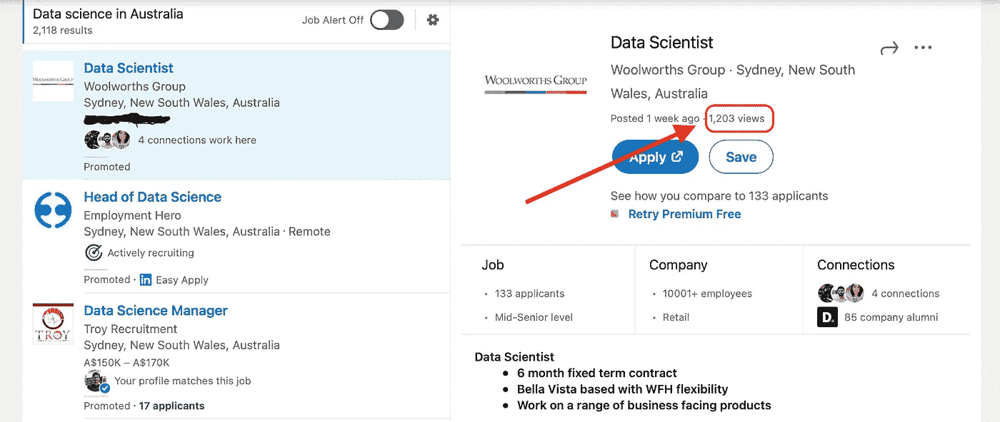
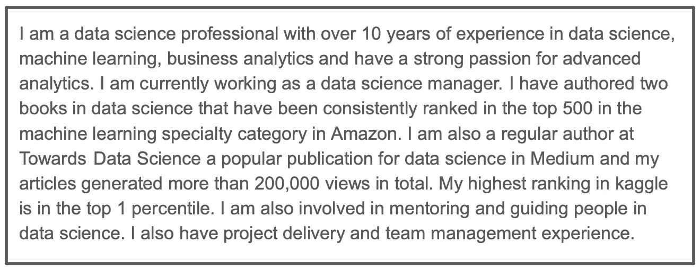
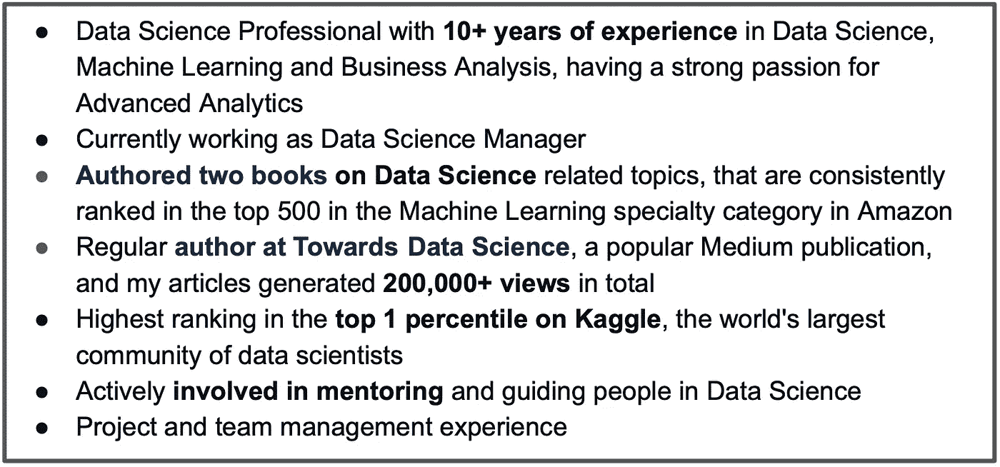

# 如何打造令人印象深刻的数据科学简历？

> 原文：<https://towardsdatascience.com/how-to-build-an-impressive-data-science-resume-7a9c71f761c5?source=collection_archive---------7----------------------->

## 制作一份引人注目的有影响力的简历的建议

格伦·卡斯滕斯-彼得斯在 [Unsplash](https://unsplash.com/s/photos/writing?utm_source=unsplash&utm_medium=referral&utm_content=creditCopyText) 上拍摄的照片

我们每个人都需要一份简历来展示我们的技能和经验，但是我们付出了多少努力来使它有影响力呢？不可否认，简历在我们的求职过程中起着关键的作用。本文将探索一些简单的策略来显著改善数据科学简历的展示和内容。

## 第一，为什么关注简历很重要？

获得数据科学工作变得非常具有竞争力，尽管机会的数量处于历史高位，申请这些工作的人数也非常高。

***例如*** *，下面是 LinkedIn 的一个招聘信息截图，这个招聘信息总共有 1200+次浏览，如果我们考虑大约十分之一的人申请这份工作，那么总共有 120+份申请，这只是申请这份工作的一种方式，还有人从其他渠道申请这份工作，通过推荐人和直接申请，因此申请总数大约为 200+。同样的逻辑适用于任何数据科学职位，因此简历在入围名单中起着关键作用。*

截图来自 [LinkedIn](https://www.linkedin.com/jobs/search/?currentJobId=2427824929&keywords=data%20science)

在这篇文章中，我将指导你如何制作一份有影响力的简历，帮助你进入求职候选名单。本文涵盖的主题是，

*   简历准备的基本规则
*   定制你的简历和求职信
*   谷歌的 X-Y-Z 公式来做出有影响力的陈述
*   有助于打造出色简历的工具

如果你喜欢视频格式，[点击这里](https://www.youtube.com/watch?v=te8fmsRzITs)。

# 简历准备的基本规则

## 继续格式化

大多数求职申请都接受 pdf 和 word 格式的简历。但是我建议你坚持使用 pdf 版本，因为这样可以确保格式不变，也就是说招聘人员看到的简历和你看到的一样。

## 个人资料摘要

简介摘要是简历的关键，把它当作电梯推销吧。它应该是有说服力的，应该包括你是谁，你的技能和优势等信息。简历的这一部分将是第一印象的主要驱动力，也会影响招聘人员的决定，因此要花足够的时间来确保它包括关于你的关键细节。

我的人会在简历的开头写上职业目标。我个人主张把职业目标从简历中去掉，用这个地方来写一份更好的简历摘要。因为大多数招聘是基于你的成就、优势和技能，而不是你的抱负。所以做一个明智的决定，有效地利用你的简历，尤其是开头。

## 使用项目符号

确保你在简历中包括的细节都是要点，无论是简介总结还是专业/项目经历。很难将注意力集中在一个长段落上，因此保持它的简单性和要点性可以确保更好的可读性，如下图所示。

在一个长段落中概述

项目符号中的个人资料摘要

尝试将每个要点限制在 2-3 行，并将关键短语加粗，这样有助于快速浏览。

## 格式的一致性

简历的内容应该是一致的格式，标题、副标题、要点和简历中的其他文本都应该是一致的格式。下面是一些可以确保一致性的事情，

*   选择一种字体，在简历中使用
*   简历中用来突出经历和教育的标题应该保持一致的格式。你可以选择使用更大的字体，但是要在简历中保持一致
*   如果你的简历超过一页，那么要确保所有页面的页边距、对齐方式和空格都是一致的
*   你可以选择将标题中的第一个单词大写，但是在整个简历中保持一致

## 避免错别字

经常检查印刷和语法错误，因为它们可能会让招聘人员失去兴趣。虽然印刷和语法错误很有可能不被注意到，但当被发现时，它们会发出错误信号，

*   你不够细致，没有发现那些错误
*   作为一名数据科学家，沟通是一个关键方面，出现拼写或语法错误绝对不好
*   公司越来越多地使用自动化工具来过滤简历，这些工具很可能会拒绝有印刷错误的简历

## 包括联系人详细信息

您的联系方式对于招聘人员联系您非常重要，因此请确保您仔细检查您的详细信息。许多人开始根据他们同事或朋友的简历编辑他们的简历，在这种情况下，请确保在编辑文本时超链接也被编辑。就像当你编辑电子邮件 id 时，确保超链接中的电子邮件也被编辑。

## 包含您的个人资料和投资组合的链接

确保你的简历有链接到你的 LinkedIn 个人资料，git 知识库，以及你想向招聘人员强调的其他网站或个人资料，如 Kaggle

# 定制你的简历和求职信

当你在一份工作申请上与许多人竞争时，像定制这样简单的事情可以成为一个优势，可以帮助你立即引起招聘人员的注意。当我说根据招聘启事定制你的简历时，这并不意味着完全重写你申请的每一份工作的简历，而是做一些小的调整，以确保你的简历突出了工作要求的要求和期望。

定制简历有助于你

*   确保你的简历是为招聘职位量身定做的
*   确保你的简历通过基于关键词的自动过滤
*   向招聘人员发出积极的信号，因为你已经做好了基础工作

简历中有几个部分是你可以自定义的，它们是

*   你简历中的目标职位，以及求职信，应该与招聘启事相符
*   确保简历中强调的技能包括工作描述中要求的一些技能
*   对您的个人资料摘要进行简单的修改，以确保招聘启事中提到的期望得到满足
*   如果你申请的工作地点不在你现在所在的城市，或者你申请的工作需要出差，那么在简历或求职信中明确提到你愿意重新安置或出差

# 用谷歌 X-Y-Z 公式做出有影响力的陈述

这是一个惊人的公式，有助于将你的成就转化为一个高影响力的声明。它是由拉兹洛·博克在他的文章[中首次提出的。这是一个非常有效的技巧，可以用来写一份有影响力的简历。这个公式的意思是，](https://www.linkedin.com/pulse/20140929001534-24454816-my-personal-formula-for-a-better-resume/)

> **通过做“Z”来完成“X”并以“Y”来衡量**

我将使用一些简单的例子来准确地解释如何在你的数据科学简历中应用这个公式。

**例一:**

*“建立了一个推荐系统”*

这是一个简单的陈述，一点也不吸引人，因为它没有确切地提到用例的影响。我们可以使用下面的语句，通过包含其影响的细节来尝试改进它，

*“建立了一个推荐系统，增加了 10%的收入”*

现在，这比前面的陈述好得多，但可以通过使用 Google X-Y-Z 公式进一步改进，如下所示(公式中的 X、Y 和 Z 在下面突出显示)

*“通过使用****【Z】****协同过滤算法，在平台上建立了***【X】****推荐系统，帮助* ***收入提高了 10%【Y】****

****例二:****

***“参加了一场 kaggle 比赛”***

**这又是一个简单的陈述，只是说你参加了一个卡格尔比赛，但没有谈论你的表现，因此可以通过包括如下一些细节来改进。**

***“在一场追逐赛中获得第 20 名”***

**现在这样更好了，但是我们可以通过使用谷歌的 X-Y-Z 公式让它更有影响力，**

***“参加了一场* ***Kaggle 竞赛(X)*** *并在****1250 支队伍中排名第 20 位(Y)*** *由* ***与 3 位同事合作建立一个集合预测模型(Z)*****

***现在，用这个公式把你的成就转化成更有力的陈述。***

# ***有助于打造出色简历的工具***

***有很好的工具可以帮助你打造一份令人惊艳的简历。下面是我最喜欢的两个，***

## ***[Resume.io](https://resume.io)***

*   ***这是一个建立你的简历和求职信的付费平台，尽管使用这个平台不需要任何费用，但是你需要付费来下载简历***
*   ***他们有很多简历模板来迎合不同的工作类别，帮助你开始工作***
*   ***虽然这个平台支持几个模板，并有许多选项来进行更改，但模板的某些部分仍然是僵化的。但我个人觉得这样更好，因为这样可以让你只关注需要注意的事情，还能确保简历的一致性***

## ***[流量系数 io](https://flowcv.io)***

*   ***这是一个建立你的简历和求职信的免费平台，如果你希望有一个以上的简历版本，那么需要一次性付款***
*   ***该平台提供了多种配置来进行任何更改，以定义事物的外观。我觉得有更多的选择意味着要做更多的决定，因此很耗时，可能会导致一些不一致***

***这些工具对于创建令人惊叹的简历非常有帮助。***

# ***保持联系***

*   ***如果你喜欢这篇文章，并对类似的文章感兴趣，请在 Medium 上关注我***
*   ***我在我的 YouTube 频道上教授和谈论各种数据科学主题。[在这里订阅我的频道](https://www.youtube.com/c/DataSciencewithSharan)。***
*   ***在此注册[我的电子邮件列表，获取更多数据科学技巧，并与我的工作保持联系](https://chipper-leader-6081.ck.page/50934fd077)***