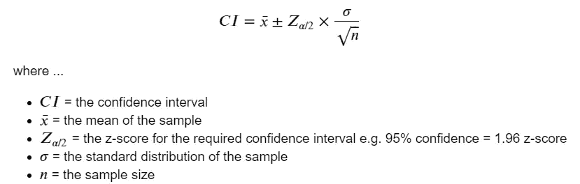
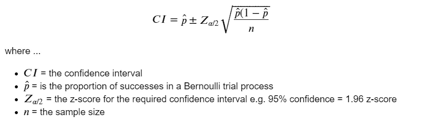
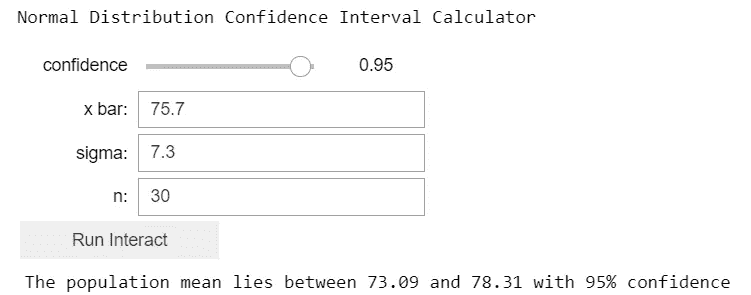
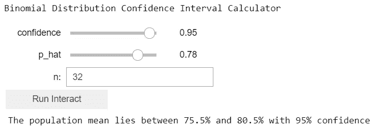
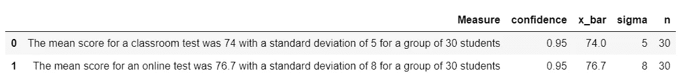
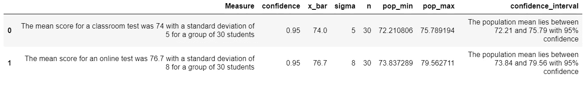
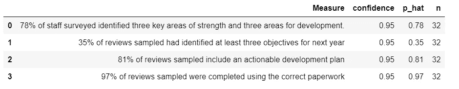
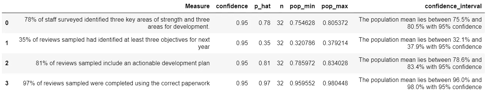

# 如何用 Python 构建交互式置信区间计算器

> 原文：<https://towardsdatascience.com/how-to-build-an-interactive-confidence-interval-calculator-in-python-6aea08d69be3?source=collection_archive---------18----------------------->

## 在 Python 和 Jupyter Notebook 中为正态和二项式置信区间构建一个可重用的交互式批处理计算器


Avel Chuklanov 在 [Unsplash](https://unsplash.com/?utm_source=unsplash&utm_medium=referral&utm_content=creditCopyText) 上拍摄的照片

## 背景

很常见的是，我们可以获得一个值的样本，可能是点击我们新网站页面的 200 个用户的样本，或者是在他们离开投票站时进行的投票后调查中的 30 个选民的样本。

为了对这些观察结果做出陈述，我们需要使用置信区间，而不仅仅是引用试验的百分比或结果。

置信区间是一个数值范围，我们相当确定我们的真实值所在，例如，如果我们问 30 个选民他们投票给谁，75%的人说“候选人 A ”,那么整个选民投票给候选人 A 的范围是多少？

如果你想知道更多关于置信区间的信息，这个在线资源是一个很好的起点——【https://www.mathsisfun.com/data/confidence-interval.html[，但是知道比背景信息更多的信息对于让置信区间为你工作并不重要。](https://www.mathsisfun.com/data/confidence-interval.html)

## 这个想法

我曾在工作场合多次使用置信区间，根据样本观察对某件事情发生的可能性做出陈述，每次我要么在 Excel 中重新创建公式，要么重新编写 Python 代码。

我决定用 Jupyter 编写一个交互式置信区间计算器，下次我需要做同样的事情时可以重用它，这就产生了代码和这篇文章

## 我们开始吧！

首先，我们需要导入一些库，我们将使用它们来构建我们的计算器…

## 公式的快速复习

置信区间的公式看起来很可怕，但作为一个非统计学家，我可以说它们并不可怕。如果你想更深入地了解它们是如何工作的，请看看我的另一篇文章-[https://towardsdatascience . com/hypothesis-testing-in-python-made-easy-7a 60 e 8 c 27 a 36](/hypothesis-testing-in-python-made-easy-7a60e8c27a36)。

回顾一下要点，我们将在 Jupyter 和 Python 中实现两个公式，一个用于正态分布，一个用于二项式分布。

正态分布的公式将用于所有正态分布，例如，英国男性鞋码的分布或一组学习在线课程的学生的年终考试分数的分布。

当出现简单的二元结果时，将使用二项式分布公式，例如，75%的受访选民投票给候选人 A，25%的人没有。

这是计算正态分布置信区间的公式…



作者图片

…这是二项式的公式…



作者图片

因此，抛开那些讨厌的公式，让我们继续进行比较直接的工作，让它们发挥作用，并创建几个 Python 函数来实现它们…

## 在 Python 中实现公式

…让我们快速测试一下我们的功能…

```
[71.4489792915286, 74.669551749961]
```

我已经使用其他程序测试了输出结果，结果是正确的，但要注意的是，如果您正在从一组测试数据中计算标准偏差(𝜎),您需要注意以下几点

`scipy.stats.sem function()`使用默认值`ddof=1`作为自由度参数，而`numpy.std()`默认使用`ddof=0`，这可能会导致不同的结果，取决于您是使用`scipy`还是`numpy`来执行计算。

有关完整的解释，请参见这篇关于 stackoverflow 的文章:[https://stack overflow . com/questions/54968267/scipy-stats-SEM-calculate-of-standard-error](https://stackoverflow.com/questions/54968267/scipy-stats-sem-calculate-of-standard-error)

```
[0.7546278801351438, 0.8053721198648562]
```

该输出也已经使用简单的 Excel 公式- `=1.96*(SQRT(B2*(1-B2))/Sheet2!$B$1)`进行了验证，其中 1.96 是 95%置信区间的 z 得分，单元格 B2 保存𝑝̂的值，`Sheet2!$B$1`保存样本大小的值。

# 创建交互式计算器

互动计算器是使用 Jupyter 互动部件创建的，完整的文档可以在这里找到

*   [https://ipywidgets . readthedocs . io/en/stable/examples/Widget % 20 list . html](https://ipywidgets.readthedocs.io/en/stable/examples/Widget%20List.html)
*   [https://ipywidgets . readthedocs . io/en/stable/examples/Using % 20 interact . html](https://ipywidgets.readthedocs.io/en/stable/examples/Using%20Interact.html)

我们需要做的第一件事是定义我们的输入控件…

现在我们需要几个简单的包装函数来显示控件，并在单击按钮时调用适当的置信区间函数…

## 正态分布置信区间计算器

这是解决方案的关键部分；只需几行 Python 和 Jupyter 代码，就可以创建交互式计算器，这样您就可以更改输入参数并单击“运行交互”来随时重新运行正态分布的计算-



作者图片

## 二项式分布置信区间计算器

下面是创建二项式置信区间交互式计算器的等效代码…



作者图片

# 创建批处理计算器

由于交互式置信区间计算器适用于单独的计算，我决定将其扩展到批处理模式，以适应我想一次处理几个计算的情况。

首先我们需要创建几个助手函数来更新`DataFrame`中的值...

## 正态分布置信区间批处理计算器



作者图片



作者图片

## 二项式置信区间批量计算器



作者图片



作者图片

# 结论

我们简要回顾了计算正态分布和二项式分布置信区间的统计公式，并表明能够交互式地计算这些公式是非常有用的，而不是每次我们想要计算它们时都必须在 Excel 或 Python 中重新编写代码。

我们定义了 Python 函数来计算置信区间，然后快速创建了两个交互式表单，我们可以反复运行它们来计算我们感兴趣的置信区间。

最后，我们扩展了交互式计算器，从一个`.csv`文件中读取参数，以便对一批数据快速执行置信区间计算，从而加快我们希望对几组数据而不是一组数据进行计算的过程。

Jupyter 笔记本的完整源代码可以在这里找到

 