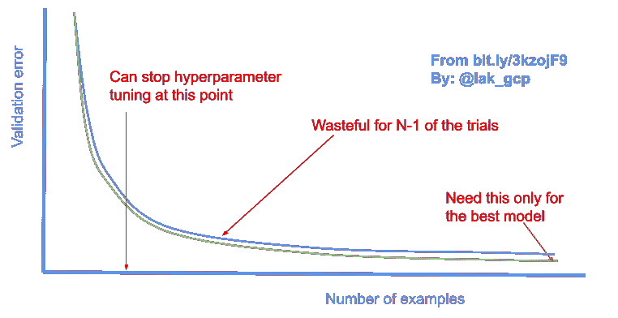
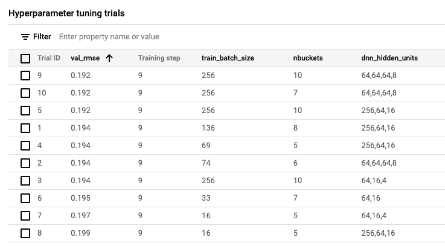

# 如何在 Vertex AI 中构建用于超参数调整的 MLOps 管道

> 原文：<https://towardsdatascience.com/how-to-build-an-mlops-pipeline-for-hyperparameter-tuning-in-vertex-ai-45cc2faf4ff5?source=collection_archive---------12----------------------->

## 为超参数调整设置模型和 orchestrator 的最佳实践

当你设计一个机器学习模型时，有许多超参数——学习速率、批量大小、神经网络的层数/节点数、桶数、嵌入维数等。你基本上是猜的。通过找到这些超参数的最佳值，通常会比最初的猜测有 2-10%的改进。(当然，这取决于您最初的猜测有多糟糕，但我会假设您做出了一些有根据的猜测)。

在之前的一篇文章中，我建议你使用 Jupyter 笔记本进行实验，但是一旦事情稳定下来，就使用普通的 Python 文件。这样做可以区分 ML 开发和 MLOps 之间的职责。因此，假设您已经这样做了，并且您的模型训练文件以 [model.py](https://github.com/GoogleCloudPlatform/data-science-on-gcp/blob/edition2/09_vertexai/model.py) 的形式存在，您的管道编排器以 [train_on_vertexai.py](https://github.com/GoogleCloudPlatform/data-science-on-gcp/blob/edition2/09_vertexai/train_on_vertexai.py) 的形式存在。在阅读本文时，您可能会发现使用这两个链接中的代码很有帮助。

## 1.在 model.py 中参数化您的模型

第一步是为您的模型创建超参数命令行参数。例如，在 model.py 中，我们可能会这样做:

```
parser.add_argument(
        '--nembeds',
        help='Embedding dimension for categorical variables',
        type=int,
        default=3
    )
```

请注意，变量的初始猜测值是默认值。这允许您的训练脚本像以前一样继续工作。然后，通过命令行参数设置该变量，供训练脚本使用:

```
args = parser.parse_args()
...
NEMBEDS = args['nembeds']
```

对您现在或将来可能想要调优的所有超参数都这样做。一个好的做法是在 model.py 中不要有任何硬编码的值——那里的所有东西都需要一个输入参数。

## 2.实施更短的训练运行

通常，您的训练运行将涉及在整个数据集上进行训练，然后在整个测试数据集上进行评估。为超参数调整进行完整的训练运行是昂贵的、浪费的和错误的。为什么？

**贵:**超参数调优的重点是获得最佳的一组参数，而不是获得可能的最佳模型。一旦你找到了最好的参数，你就可以用这些参数来训练一个模型。因此，没有必要进行完整的试验。你只需要训练它，直到你知道哪个试验可能会更好。



为超参数调整进行完整的训练运行是昂贵的、浪费的和错误的。作者图解。

**浪费:**在假设你的训练曲线表现良好的情况下，在整个训练过程中，一组更好的参数会更好，你可以在它开始收敛之前很好地停止训练。用你的训练预算做更多的试验，而不是延长试验时间。

**错误:**您不想评估测试数据集上的超参数调优。您希望比较验证数据集的性能。只需确保验证数据集足够大，让您能够在试验模型之间进行有意义的比较。

我做这些修改的方法是在我的 model.py 中添加两个选项:一个用于较短时间的训练，另一个用于跳过完整的评估:

```
NUM_EXAMPLES = args['num_examples']
SKIP_FULL_EVAL = args['skip_full_eval']
...steps_per_epoch = NUM_EXAMPLES // train_batch_size
epochs = NUM_EPOCHS
eval_dataset = read_dataset(eval_data_pattern, eval_batch_size,
                    tf.estimator.ModeKeys.EVAL, **num_eval_examples**)
model.fit(train_dataset,
                        validation_data=eval_dataset,
                        epochs=NUM_EPOCHS,
                        **steps_per_epoch=steps_per_epoch,**
                        callbacks=[cp_callback, HpCallback()])
...if not SKIP_FULL_EVAL:
        test_dataset = read_dataset(test_data_pattern, eval_batch_size, tf.estimator.ModeKeys.TEST, None)
        final_metrics = model.evaluate(test_dataset)
        ...
else:
        logging.info("Skipping evaluation on full test dataset")
```

steps_per_epoch 和 NUM_EXAMPLES 是怎么回事？注意上图中的 x 轴。这不是时代，而是例子的数量。虽然在完整数据集上进行训练是非常浪费的，但获得与完整训练相同数量的中间指标是有帮助的(我将在下一步解释原因)。因为您还将超参数调整批量大小，所以最好的方法是使用*虚拟时期*(参见[机器学习设计模式书](https://amzn.to/31T9RRL):检查点了解详情)。每历元步数是我们在大型数据集上获取虚拟历元的方法。

## 3.在培训期间写出衡量标准

在培训过程中写出衡量标准。不要只是等到最后。如果你这样做了，那么 Vertex AI 也将通过缩短非生产性试验来帮助你节省成本。

在 Keras 中，要在培训期间写出指标，可以使用回调。看起来是这样的:

```
METRIC = 'val_rmse'
hpt = hypertune.HyperTune()**class HpCallback**(tf.keras.callbacks.Callback):
        def on_epoch_end(self, epoch, logs=None):
            if logs and METRIC in logs:
                logging.info("Epoch {}: {} = {}".format(epoch, METRIC, logs[METRIC]))
                hpt.report_hyperparameter_tuning_metric(
hyperparameter_metric_tag=METRIC, metric_value=logs[METRIC], global_step=epoch)...history = model.fit(train_dataset,
                    ...
                    callbacks=[cp_callback, **HpCallback()**])
```

我正在使用 cloudml-hypertune 包来简化以 TensorFlow 生态系统(TensorBoard、Vizier 等)的形式编写指标。)可以理解。

## 4.实现超参数调整管道

现在您已经修改了 model.py，使其易于进行超参数调整，MLOps 人员可以随时调整您的模型，只要他们注意到它在漂移。

编排代码中有两个步骤(在 train_on_vertexai.py 中):

**(4a)** 创建一个顶点 AI CustomJob，用正确的参数调用你的 model.py:

```
 tf_version = '2-' + tf.__version__[2:3]
    train_image = "us-docker.pkg.dev/vertex-ai/training/tf-gpu.{}:latest".format(tf_version) model_display_name = '{}-{}'.format(ENDPOINT_NAME, timestamp)
    trial_job = aiplatform.CustomJob.from_local_script(
        display_name='train-{}'.format(model_display_name),
        **script_path="model.py",**
        container_uri=train_image,
        **args=[
            '--bucket', BUCKET,
            '--skip_full_eval', # no need to evaluate on test data
            '--num_epochs', '10',
            '--num_examples', '500000' # 1/10 actual size
        ],**
        requirements=['cloudml-hypertune'],  **# hpt**
        replica_count=1,
        machine_type='n1-standard-4',
        # See [https://cloud.google.com/vertex-ai/docs/general/locations#accelerators](https://cloud.google.com/vertex-ai/docs/general/locations#accelerators)
        accelerator_type=aip.AcceleratorType.NVIDIA_TESLA_T4.name,
        accelerator_count=1,
    )
```

**(4b)** 创建并运行一个超参数调整作业，该作业将使用上述作业作为单独试验:

```
 hparam_job = aiplatform.HyperparameterTuningJob(
        # See [https://googleapis.dev/python/aiplatform/latest/aiplatform.html#](https://googleapis.dev/python/aiplatform/latest/aiplatform.html#)
        display_name='hparam-{}'.format(model_display_name),
        custom_job=trial_job,
        **metric_spec={'val_rmse': 'minimize'},**
        parameter_spec={
            **"train_batch_size": hpt.IntegerParameterSpec(min=16, max=256, scale='log'),
            "nbuckets": hpt.IntegerParameterSpec(min=5, max=10, scale='linear'),
            "dnn_hidden_units": hpt.CategoricalParameterSpec(values=["64,16", "64,16,4", "64,64,64,8", "256,64,16"])**
        },
        max_trial_count=4 if develop_mode else 10,
        parallel_trial_count=2,
        search_algorithm=None,  # Bayesian
    ) 
```

请注意，我在这里指定的指标与我的 model.py 中的指标相匹配，并且我指定了参数的范围。

默认情况下，Vertex AI 中的超参数调优服务(称为 Vizier)将使用贝叶斯优化，但如果你愿意，可以将算法更改为 GridSearch。

## 5.监控 GCP web 控制台

一旦你启动超参数调优工作，你可以在 GCP 控制台的顶点人工智能部分看到参数进来。

您会看到类似这样的内容:



## 6.运行最佳试验直至完成

确定最佳参数集后，采用最佳参数集，然后运行训练作业直到完成。这将为您提供部署模型。

当然，我们也可以实现自动化:

```
 best = sorted(hparam_job.trials, 
              key=lambda x: x.final_measurement.metrics[0].value)[0]
    logging.info('Best trial: {}'.format(best))
    best_params = []
    for param in best.parameters:
        best_params.append('--{}'.format(param.parameter_id))
        best_params.append(param.value) # run the best trial to completion
    model = train_custom_model(data_set, timestamp, develop_mode, extra_args=best_params)
```

同样，通过 Vertex AI，数据科学家(决定哪些参数可以优化)和 MLOps 工程师(决定何时重新调整模型)之间的职责分离变得更加容易。

尽情享受吧！

# 更多关于 Vertex AI 的阅读:

1.  [给谷歌云上的新统一 ML 平台 Vertex AI 一个旋转](/giving-vertex-ai-the-new-unified-ml-platform-on-google-cloud-a-spin-35e0f3852f25) :
    我们为什么需要它，无代码 ML 培训到底有多好，所有这些对数据科学工作意味着什么？
2.  [如何将 TensorFlow 模型部署到 Vertex AI](/how-to-deploy-a-tensorflow-model-to-vertex-ai-87d9ae1df56) :在 Vertex AI 中使用保存的模型和端点
3.  [使用 Python 在 Vertex AI 上开发和部署机器学习模型](https://medium.com/@lakshmanok/developing-and-deploying-a-machine-learning-model-on-vertex-ai-using-python-865b535814f8):编写让你的 MLOps 团队满意的训练管道
4.  [如何在 Vertex AI 中为超参数调整构建 MLOps 管道](https://lakshmanok.medium.com/how-to-build-an-mlops-pipeline-for-hyperparameter-tuning-in-vertex-ai-45cc2faf4ff5) :
    为超参数调整设置模型和协调器的最佳实践