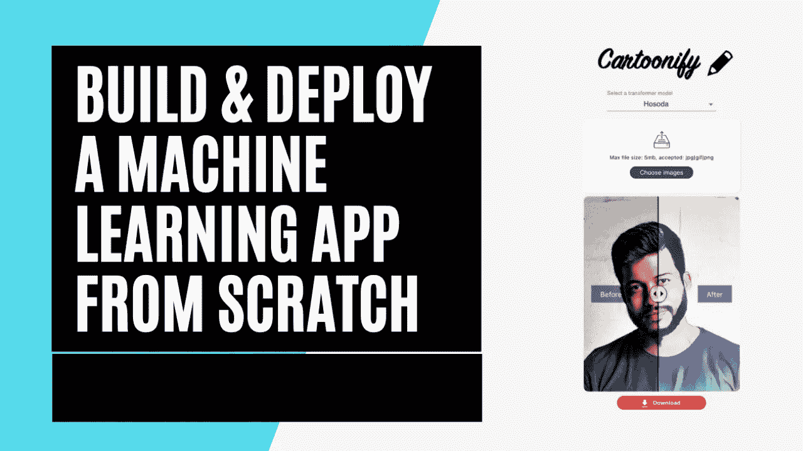
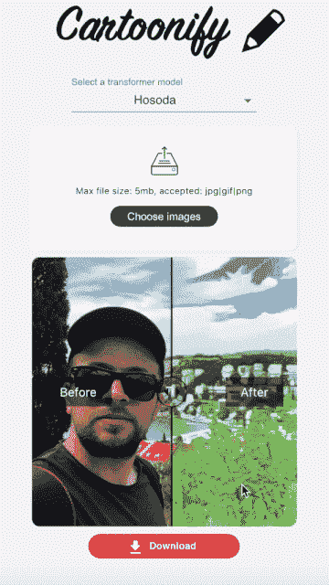
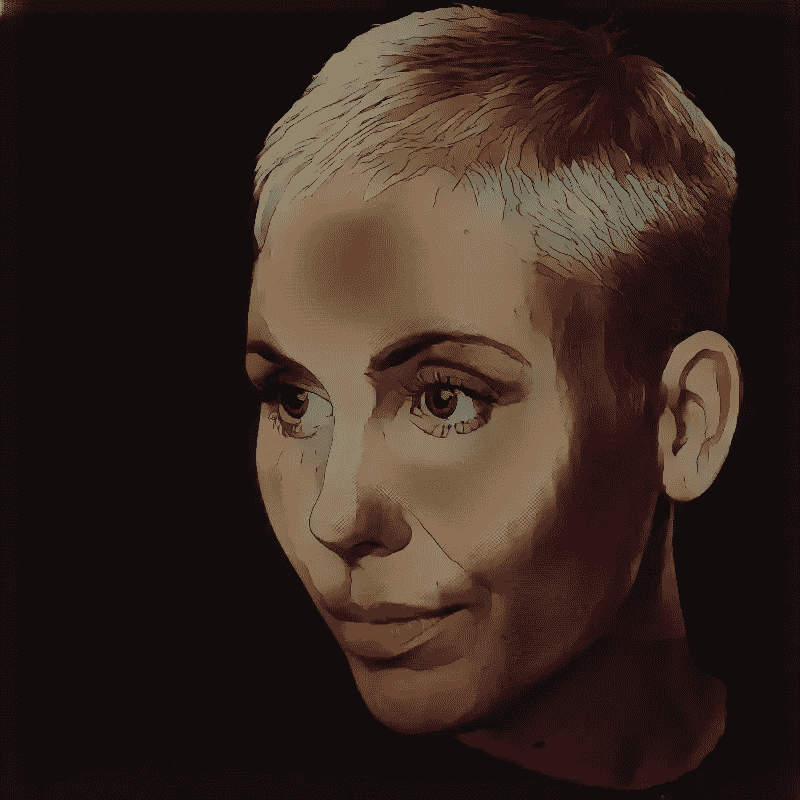
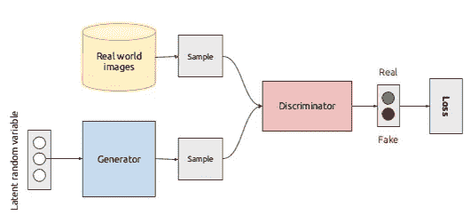
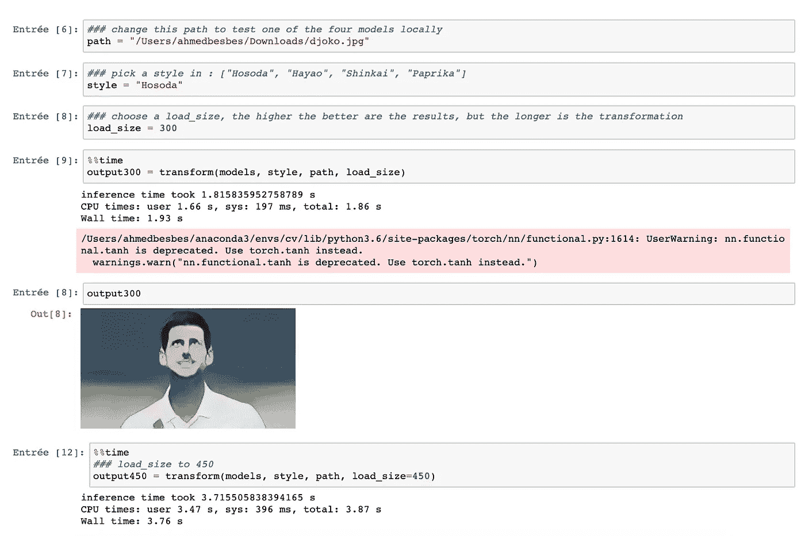
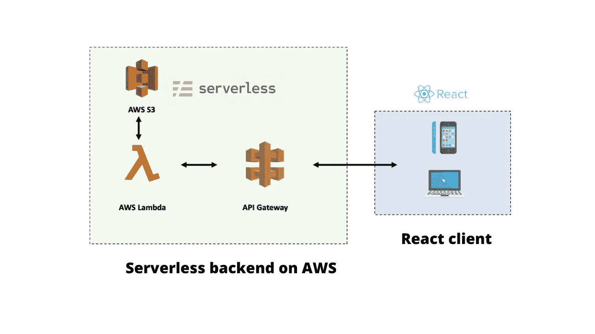
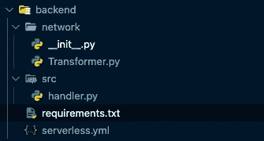
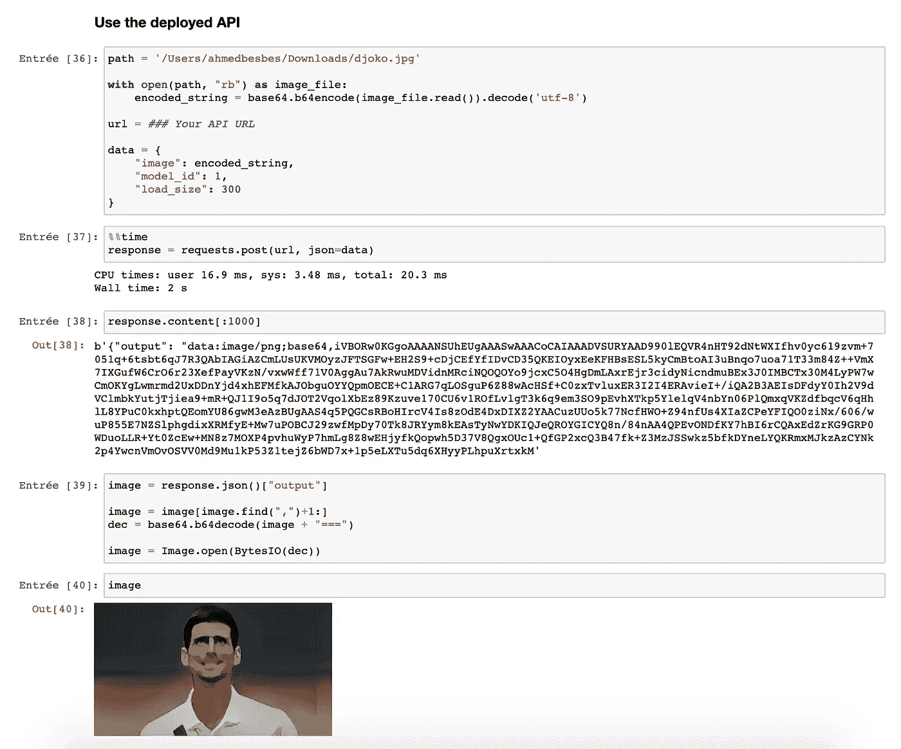

# 如何在 AWS 上构建和部署无服务器机器学习应用

> 原文：<https://towardsdatascience.com/how-to-build-and-deploy-a-serverless-machine-learning-app-on-aws-1468cf7ef5cb?source=collection_archive---------14----------------------->

## 即使预算很低也能扩展



建筑卡通化(图片由作者提供)

你有没有想过构建一个机器学习应用程序，后端有一个沉重的模型，前端有一个 React 用户友好的界面，周围有一个无服务器的云架构，这样你的产品就可以扩展到数十、数百甚至数千个用户？

这并不像听起来那么难，在本文中，我将展示如何构建这样的应用程序。为了让本教程更有趣，我将介绍构建 Cartoonify 的过程。



演示(作者 GIF)

Cartoonify 是我从头开始做的一个玩具应用，把图片变成漫画。我知道这可能看起来有点滑稽，但相信我，这个应用程序背后有严肃的工作，你可以在其他地方利用。我会让你读这篇文章来相信我或者检查我的 [GitHub](https://github.com/ahmedbesbes/cartoonify) *上的代码。*

## 这是我开始这个项目的动机

*   试试生成性对抗网络(GANs)。我最近被这些模型迷住了。尝试卡通模特把你的脸变成卡通看起来很有趣。
*   了解如何使用 AWS 的不同服务(Lambda、API Gateway、S3 等)在无服务器架构上部署应用程序。).
*   练习我的反应能力。我习惯于策划、冲刺和精简，我想，这一次，建立一些自定义和不那么主流的东西。
*   使用 Netlify 部署此 React 应用程序。我看到了这个过程是多么简单的演示，我想试着说服自己。

构建卡通化是如此有趣，我决定在一个视频系列中谈论它。这里有一个简短的介绍:

第 0 部分—卡通化简介(作者制作的视频)

# 0.构建和部署 Cartoonify 的先决条件

如果您想要运行和部署 Cartoonify，首先需要满足以下先决条件:

*   一个 [AWS](https://aws.amazon.com/) 账户(别担心，部署这个应用几乎不会花你一分钱。)
*   在[网上的免费账户](https://www.netlify.com)
*   [安装在您机器上的 Docker](https://www.docker.com/)
*   [节点](https://nodejs.org/en/)和 [npm](https://www.npmjs.com/) (最好是最新版本)
*   [火炬](https://pytorch.org/get-started/locally/)和火炬视觉在本地测试卡通(可选)

如果你已经准备好了一切，你现在就可以出发了。

请遵循以下四个步骤。

# 1.cartongan——人工智能艺术家？

本节提供了关于该模型的一些细节。如果您对此不感兴趣，可以转到关于部署的下一部分。

## 这个网络背后的主要思想

在测试这个应用程序背后的模型 CartoonGAN 之前，让我们先来谈谈它，以了解底层架构以及它是如何被设计和训练来产生卡通风格的。



🇸🇮·扬科·费里奇在 Unsplash 上拍摄的照片(左)——转换后的图像(右)

CartoonGAN 于 2018 年在这篇[论文](https://openaccess.thecvf.com/content_cvpr_2018/papers/Chen_CartoonGAN_Generative_Adversarial_CVPR_2018_paper.pdf)中推出，目标是将图像转换成不同日本漫画的风格。CartoonGAN 所实现的被称为*风格转移*，这是一种图像转换技术，由于 Leon A. Gatys 关于神经风格转移的[工作](https://arxiv.org/pdf/1508.06576.pdf)，它在 2015 年首次与神经网络一起引入。风格转移后来在 2017 年通过 CycleGAN 架构得到了增强。CycleGAN 通过将风格转换形式化为两个图像分布之间的转换问题来处理风格转换，而神经风格转换将其框定为优化问题。

CartoonGAN 是神经类型转移和 GANs 的混合体。事实上，它使用了一个简单的 GAN 架构(不是循环架构)，并添加了一个受神经风格转移技术启发的语义损失，以强制生成器保留原始图像的内容。

作者甚至进一步使 CartoonGAN 的结果尽可能具有视觉吸引力:为此，他们添加了第二个损失，迫使生成器创建平滑的边缘、低阴影颜色和纹理较少的区域，因为这些是卡通特有的视觉特征。

## 从甘人到卡通人

要了解 CaroonGAN 是如何构建的，我们先来了解一个典型的 GAN 是如何被训练生成假图像的。



甘建筑—(图片经作者修改)

GAN 由两个网络组成:发生器和鉴别器。

生成器的目标是获取一些输入数据(或噪声)并创建看起来像真实世界图像分布的样本，而鉴别器的目标是了解假样本和真实样本之间的边界。

这两个网络在一个受博弈论启发的最小-最大游戏中相互训练，其中生成器的目标是欺骗鉴别器，鉴别器的目标是更好地识别真实数据和虚假数据。

刚开始训练的时候，这两个网络在各自的任务中都很差，一旦训练下去，就越来越好。

当它们达到平衡时，发生器是如此强大，以至于它通过完全混淆来控制鉴别器。在这种情况下，我们可以扔掉鉴别器，将生成器用于生成任务。

## 而生成漫画呢？

训练 GAN 从真实照片生成卡通数据是一个简单的问题，可以通过考虑以下因素来构建:

*   真实照片作为生成器的输入数据
*   卡通数据作为真实的数据分布，生成器会尽可能地伪造

这种设置的好处在于，你不需要在照片和漫画之间建立一对一的映射:这意味着在实践中，如果你想训练一个定制的卡通人物来生成你最喜欢的漫画(比如说辛普森一家)，那么你所要做的就是收集一些没有任何对应关系的辛普森图像和真实照片，然后开始训练。

要了解更多关于 CartoonGAN 背后的训练程序，请看原始的[论文](https://openaccess.thecvf.com/content_cvpr_2018/papers/Chen_CartoonGAN_Generative_Adversarial_CVPR_2018_paper.pdf)。

现在让我们转到一个更具动手能力的部分，在这里我们可以自己生成卡通效果。

## 在本地测试卡通人物

首先克隆这个项目的 [repo](https://github.com/ahmedbesbes/cartoonify) 。

```
git clone [https://github.com/ahmedbesbes/cartoonify.git](https://github.com/ahmedbesbes/cartoonify.git)
```

先下载四个预先训练好的模型。这些重量将加载到`cartoongan/network/Transformer.py`中定义的发电机模型中

```
cd cartoongan
bash download_pth.sh
```

要测试四个模型中的一个，请将头伸到笔记本`cartoongan/notebooks/CartoonGAN.ipynb`上，将输入图像路径更改为您的测试图像。这个笔记本调用`cartoongan/test_from_code.py`脚本进行转换。

```
cd cartoongan/notebooks
jupyter notebook
```



在本地测试卡通——作者截图

transform 方法使用一个`load_size`参数来调整输入图像的大小，以便加速转换。如果将其设置为较高的值，结果看起来会更好，但处理时间会更长。在整个项目中，我们将`load_size`设为 450。

这里是一些用 800 的`load_size`得到的结果。


Anthony DELANOIX 在 Unsplash 上拍摄的照片(左)-转换后的图像(右)


克里斯蒂安·加比在 Unsplash 上拍摄的照片(左)——转换后的图像(右)

您可以在 YouTube 上观看这一部分，了解更多关于 GANs、CartoonGAN 模型以及如何构建用于转换图像的脚本`test_from_code.py`的信息。

第 1 部分—卡通人物模型(作者提供的视频)

# 2.使用 AWS Lambda 在无服务器 API 上部署 CartoonGAN

本节的目标是在无服务器架构上部署 CartoonGAN 模型，以便可以通过 API 端点从互联网上的任何地方请求它。

## 为什么无服务器架构如此重要？

例如，在使用 Lambda 函数的无服务器架构中，您不必自己提供服务器。大致来说，您只需编写将要执行的代码并列出其依赖项，AWS 将自动为您管理服务器并负责基础设施。

这有很多好处:

1.  **成本效率**:你不用的时候不用花钱买无服务器架构。相反，当您有一台 EC2 机器正在运行并且不处理任何请求时，您仍然需要为此付费。
2.  **可伸缩性**:如果一个无服务器应用程序开始同时有大量请求，AWS 将通过分配更多的能力来管理负载，从而对其进行扩展。如果您让自己使用 EC2 实例管理负载，您可以通过手动分配更多的机器并创建一个负载平衡器来做到这一点。

当然，无服务器架构不可能完全适合任何用例。在某些情况下，它们根本不实用(需要实时或快速响应、使用 WebSockets、繁重的处理等)。).

由于我经常构建机器学习模型并将它们集成到 web 应用程序中只是为了进行推理，所以我发现无服务器架构在这些特定的用例中很有趣。

## 卡通化工作流程

在部署 lambda 函数之前，我们先来看看应用的架构:



卡通化背后的建筑(作者图片)

在右侧，我们有一个内置在 React 中的客户端，在左侧，我们有一个部署在无服务器 AWS 架构上的后端。

后端和前端通过 HTTP 请求相互通信。工作流程如下:

*   客户端通过 POST 请求发送图像。
*   然后通过 API 网关接收图像。
*   API Gateway 触发 Lambda 函数执行，并将图像传递给它。
*   Lambda 函数开始运行:它首先从 S3 获取预先训练好的模型，然后在接收到的图像上应用样式转换。
*   一旦 Lambda 函数运行完毕，它会再次通过 API Gateway 将转换后的图像发送回客户端。

## 使用无服务器框架进行部署

我们将使用[无服务器](https://www.serverless.com/)框架，一个自动化部署到 AWS、Azure、Google Cloud 等的开源工具，通过将它编写为 YAML 文件来定义和部署这个架构。

将基础设施写成代码，这难道不酷吗？

以下是要遵循的步骤:

1.在您的计算机上安装无服务器框架。

```
npm install -g serverless
```

2.在 AWS 上创建一个具有管理员权限的 IAM 用户，并将其命名为`cartoonify`。然后用这个用户的凭证配置 serverless(我就不给你看我的了——放你的吧，伙计)。

3.引导一个无服务器项目，在这个项目的根目录下有一个 Python 模板。

```
serverless create --template aws-python --path backend
```

4.安装两个无服务器插件来管理 lambda 依赖项并防止 Lambda 函数冷启动:

5.在`backend`中创建一个名为`network`的文件夹，并将以下两个文件放入其中:

*   `Transformer.py`:保存生成器模型架构的脚本。
*   一片空白`__init__.py`

6.用以下部分修改`serverless.yml`文件:

*   provider 部分，我们在这里设置提供者、运行时和访问 bucket 的权限。请注意，您必须指定自己的 S3 存储桶。

*   我们配置插件的自定义部分:

*   我们从生产中排除不必要的文件夹的包部分:

*   functions 部分，我们创建 Lambda 函数，配置它，并定义调用它的事件。在我们的例子中，lambda 函数由路径`transform`上的 API Gateway 上的 post 请求触发。

*   列出外部插件的插件部分:

7.列出`requirements.txt`内部的依赖关系(与`serverless.yml`同级)。

8.在`backend`中创建一个`src`文件夹，并将`handler.py`放入其中以定义 lambda 函数。然后修改`handler.py`。

首先，添加导入:

在`handler.py`中定义两个函数:

*   `img_to_base64_str`将二进制图像转换为 base64 字符串
*   `load_models`将四个预先训练好的模型载入字典，然后保存在内存中

最后，将由 API 网关触发的`lambda_handler`:

现在你完成了。后端的文件结构现在应该如下所示:



后端文件夹的文件结构(图片由作者提供)

9.部署前启动 Docker。

10.部署 lambda 函数。

```
cd backend/
sls deploy
```

部署可能需要 10 分钟，所以去拿一个☕️.

这里发生的事情，除了其他事情之外，是 Docker 将构建 Lambda 部署包的映像，然后 Serverless 将在上传到 S3 之前提取这个环境的依赖项。

一旦 lambda 函数部署完毕，系统会提示您输入可以请求的 API 的 URL。

请访问 Jupyter notebook，通过加载图像、将其转换为 base64 并将其放入有效载荷中进行测试。



API 演示—(作者截图)

如果你想按部就班地学习这一部分，这样你就不会错过任何东西，你可以在 YouTube 上观看。

第 2 部分—在 AWS Lambda 上部署(作者提供的视频)

# 3.构建一个 React 接口

本节将介绍如何构建一个简单的 React 接口来与模型进行交互。

我希望这个界面尽可能对用户友好，以一种非常简单的方式可视化样式转换。

我希望找到这个漂亮的 React 组件，它允许你并排比较两张图片，并通过滑动光标从一张图片切换到另一张图片。

在运行 React 应用程序并构建它之前，您需要指定刚刚部署的模型的 API URL。进入`fontend/src/api.js`并更改`baseUrl`的值。

*   要在本地运行 React 应用程序:

```
cd frontend/
yarn install
yarn start
```

这将在 [http://localhost:3000](http://localhost:3000/) 开始。

*   要在部署到 Netlify 之前构建应用程序:

```
yarn build
```

这将创建一个`build/`文件夹，其中包含要在 Netlify 上提供的应用程序的构建版本。

您可以在 YouTube 上观看这一部分，以了解代码的结构以及正在使用的其他 React 组件。

第 3 部分——构建一个 React 接口(视频由作者提供)

# 4.在 Netlify 上部署 React 应用程序

在最后一节中，我们将介绍前端接口的部署。

有许多方法可以部署 React 应用程序，以便它可以在互联网上运行，任何人都可以访问它。其中一个是使用 [Netlify](https://netlify.com) :一个伟大的平台，可以在许多框架(React、Vue、Gatsby 等)中自动构建和部署应用程序。)

*   为了能够在 Netlify 上部署，您需要一个帐户。这是免费的:前往 [Netlify](https://app.netlify.com/) 注册。
*   然后，您需要安装 netlify-cli:

```
npm install netlify-cli -g
```

*   使用您的帐户验证 Netlify 客户端:

```
netlify login
```

*   并部署:

```
cd app/
netlify deploy
```

Netlify 将要求您提供构建文件夹(输入“build”)和应用程序的自定义名称(这将显示为 netlify.com 的子域)。我已经选择了“卡通化”，但是你可以选择另一个。

这应该就是了！现在您的应用程序已上线！

但是等等！这个网址有些问题:它的前缀是字母数字代码——我不想这样，对吗？

那是因为你部署了一个草稿 URL！

要获得干净的 URL，您必须通过指定 prod 选项来进行部署:

```
netlify deploy --prod
```

您可以在 YouTube 上观看这一部分的现场演示，以了解在 Netlify 上部署有多容易。

第 4 部分—在 Netlify 上部署 React(视频由作者提供)

# 5.下一个:想投稿？

如果你已经做到这一步，我真诚地感谢你的时间！

如果你喜欢这个项目，想改善它，请自便:我随时欢迎拉式请求，这是[项目](https://github.com/ahmedbesbes/cartoonify)的回购。

如果你有一个机器学习项目，你需要在云上快速部署一个 API，并通过一个定制的前端请求它，这个项目应该是一个样板文件来启动你的工作，所以请随意重用代码。

黑客快乐！

# 新到中？您可以每月订阅 5 美元，并解锁无限的文章— [点击此处。](https://ahmedbesbes.medium.com/membership)