# 如何使用 SpaCy 和 Streamlit 构建和部署文本匿名器

> 原文：<https://towardsdatascience.com/how-to-build-and-deploy-a-text-anonymizer-with-spacy-and-streamlit-70ed9607823?source=collection_archive---------18----------------------->

## NLP 使你符合 GDPR 的一个可能的方法

在这篇文章中，我将向您展示使用 Streamlit 和 Spacy 构建一个匿名化文本数据的 web 应用程序是多么容易。我们还将看到如何将它部署到 Heroku，并让它在互联网上直播，供其他用户使用和玩。

**剧透:这是这个应用的样子**

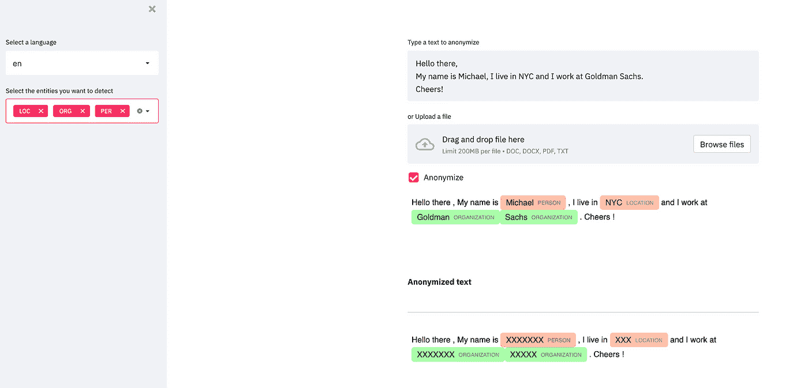

作者图片

尽管图像是不言自明的，但您可以使用此应用程序做以下事情:

*   上传文本数据(目前为 TXT 格式)或在输入区粘贴一些文本
*   选择语言模型(目前仅支持英语和法语)
*   选择要检测的实体类型(人员、位置和组织)
*   可视化检测到的实体并匿名化它们

*PS*:* ***这是一个玩具 app*** *:我会在这篇帖子的最后列出潜在的想法，通过增加更多的功能来改进它。现在请容忍我。*

*PS**:所有代码都可以在* [*Github*](https://github.com/ahmedbesbes/anonymizer) 上找到

*PS***:如果你想一步一步按代码来的话可以找这个教程的视频版*

# 为什么需要匿名化数据？


作者图片

每当您处理文本数据(电子邮件、合同、评论等)时，您可能必须处理个人和敏感信息:人名或公司名、地址、电子邮件等等。出于合规性原因和其他法律约束(嘿，GDPR ),您必须非常小心地处理这些数据:潜在的数据泄露可能会给您的组织带来巨大的后果。

作为一名前数据科学顾问，我参与了许多处理敏感和个人数据的项目。建立匿名化管道是解决这个问题的一种方法。

今天，我将向您展示如何在 web 应用程序中嵌入匿名化。

让我们开始吧。

# 使用 pipenv 快速设置您的环境


来源:[https://pipenv.pypa.io/en/latest/](https://pipenv.pypa.io/en/latest/)

我总是为我的每个项目保持一个干净和独立的环境，我用 ***pipenv*** 来妥善处理这个问题:

> Pipenv 是一个工具，旨在将所有包装领域的精华(bundler、composer、npm、cargo、yarn 等。)到 Python 世界。在我们的世界里，Windows 是一等公民。它会自动为您的项目创建和管理一个 virtualenv，并在您安装/卸载软件包时从您的 Pipfile 中添加/删除软件包。它还生成非常重要的 Pipfile.lock，用于生成确定性的构建。—pypi.org

如果您想使用 pipenv，请使用 pip 全局安装它:

```
**pip install pipenv**
```

然后，创建一个项目文件夹，并通过安装所需的依赖项在其中初始化一个 pipenv 环境:

```
**mkdir anonymizer
cd anonymizer/
pipenv install streamlit spacy st-annotated-text
pipenv install black --dev**
```

我们将安装:

*   [streamlit](https://streamlit.io/) :构建 UI
*   [空间](https://spacy.io/):进行命名实体识别
*   [st-annotated-text](https://github.com/tvst/st-annotated-text) :在 Streamlit 应用程序中显示注释文本的简单组件
*   [黑色](https://github.com/psf/black)用于本地格式化代码。这个包只能在开发模式下使用。

安装完这些依赖项后，pipenv 将创建一个以您的项目文件夹命名的虚拟环境。它还会在这个文件夹的根目录下添加两个文件: **Pipfile** 和 **Pipfile.lock** (不要手动修改这些文件:它们是由 pipenv 自动生成的)

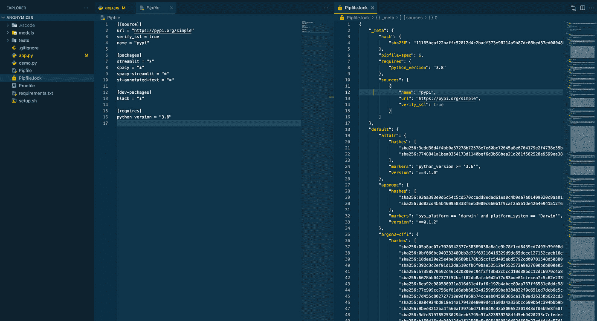

作者图片

现在一切都设置好了，激活环境:

```
**pipenv shell**
```

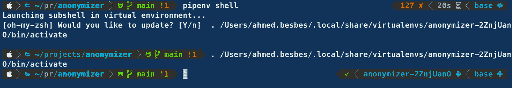

作者图片

# 下载空间语言模型


来源:https://spacy.io/

由于我们将在最后在 Heroku 上部署应用程序，我们将手动下载 SpaCy 语言模型并将其放在一个文件夹中。这个文件夹将作为源代码的一部分上传到 Heroku 服务器上。

您可以直接从 Github 下载 SpaCy 语言模型:

*   [英文](https://github.com/explosion/spacy-models/releases/download/en_core_web_sm-3.0.0/en_core_web_sm-3.0.0.tar.gz)模型
*   [法国](https://github.com/explosion/spacy-models/releases/download/fr_core_news_sm-3.0.0/fr_core_news_sm-3.0.0.tar.gz)车型

两个文件都是 tar.gz 文件。您必须首先解压缩它们，并复制粘贴包含`config.cfg`文件的文件夹中的所有文件。然后将这些文件分别放到`models`文件夹下的`en`和`fr`文件夹中。下面是你最后应该有的:

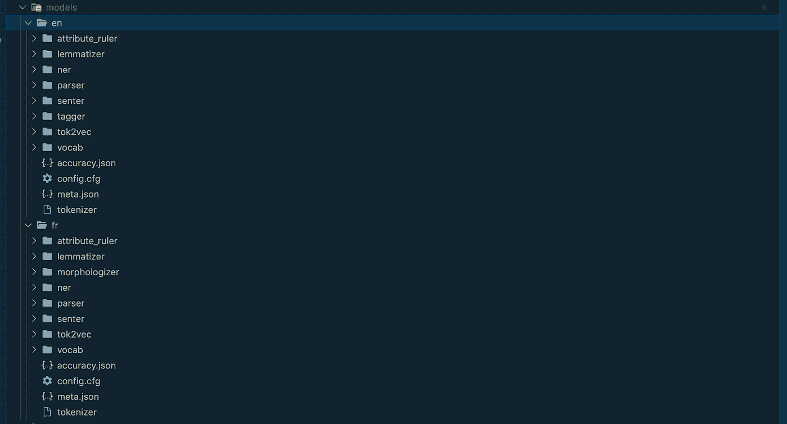

作者图片

现在，每个型号都可以轻松加载:

```
**import spacy****french_model = spacy.load("./models/fr/")
english_model = spacy.load("./models/en/")**
```

# 构建 Streamlit 应用程序

我们将从导入项目的依赖项开始:

```
**import streamlit as st
import spacy
from annotated_text import annotated_text**
```

然后，我们将收集用户输入:

*   模特的语言(`en`或`fr`)
*   实体类型(`PER`、`LOC`和`ORG`)
*   文本区域中的输入文本
*   用于上传 TXT 文件的文件上传程序

一旦用户选择了语言，我们就必须选择正确的空间模型。

但是，我们不希望每次用户从一种语言切换到另一种语言时都加载这个模型。相反，我们想要的是将所有模型一次性加载到内存中，并在字典中以恒定的复杂度访问它们。

这就是 Streamlit **缓存**发挥作用的地方:

既然已经收集了输入文本，并且从界面中选择了语言模型，我们就必须从文本中提取实体，并用`st-annotated-text`插件显示它们。

要显示这样的注释文本:

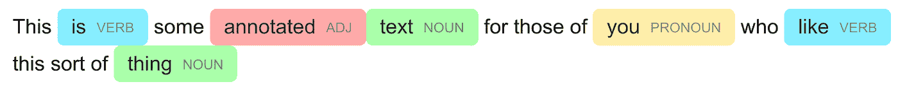

来源:[https://github.com/tvst/st-annotated-text](https://github.com/tvst/st-annotated-text)

`st-annotated-text`需要一个元组列表，其中每个元组由其文本、实体名称和十六进制颜色代码描述。

```
annotated_text(
    "This ",
    ("is", "verb", "#8ef"),
    " some ",
    ("annotated", "adj", "#faa"),
    ("text", "noun", "#afa"),
    " for those of ",
    ("you", "pronoun", "#fea"),
    " who ",
    ("like", "verb", "#8ef"),
    " this sort of ",
    ("thing", "noun", "#afa"),
)
```

给定标记化的文本和选择的实体，我们可以很容易地得到这种类型的结构。

通过将 anonymize 参数设置为`True`，该函数将用 Xs 替换每个实体。

既然输入文本已经过处理，我们可以可视化原始文本和匿名文本。

这是应用程序的完整代码。

# 部署到 Heroku

[Heroku](https://www.heroku.com/) 是一个平台即服务(PaaS ),支持开发人员完全在云中构建、运行和操作应用。

在 Heroku 上部署 Streamlit 应用非常简单。以下是要遵循的步骤:

1 —使用以下依赖项创建一个`requirements.txt`文件，并将其放在项目的根目录下

```
**streamlit
spacy
st-annotated-text**
```

2 —在同一位置添加一个`setup.sh`文件:这将处理服务器配置

```
**mkdir -p ~/.streamlit/****echo "\\
[server]\\n\\
headless = true\\n\\
enableCORS=false\\n\\
port = $PORT\\n\\
" > ~/.streamlit/config.toml**
```

3 —在同一位置添加一个名为`Procfile`的文件，并使用以下脚本告诉 Heroku 如何启动 Streamlit 应用程序

```
**web: sh setup.sh && streamlit run --server.enableCORS false app.py**
```

4——确保应用程序在本地运行，并在 Github 上推送您的代码

5 —如果您还没有账户，请在[heroku.com](http://heroku.com)上创建一个(免费)账户

6 —转到[https://dashboard.heroku.com/apps](https://dashboard.heroku.com/apps)并点击创建新应用

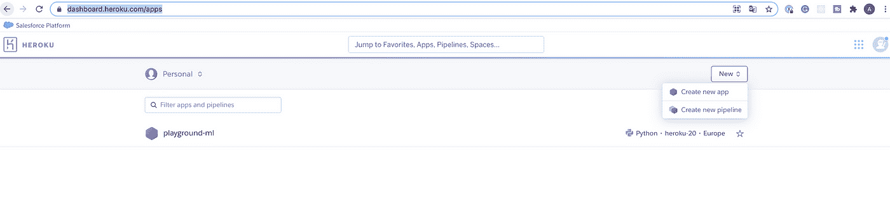

作者图片

7-为应用程序选择一个名称，选择一个地区，然后点击创建应用程序

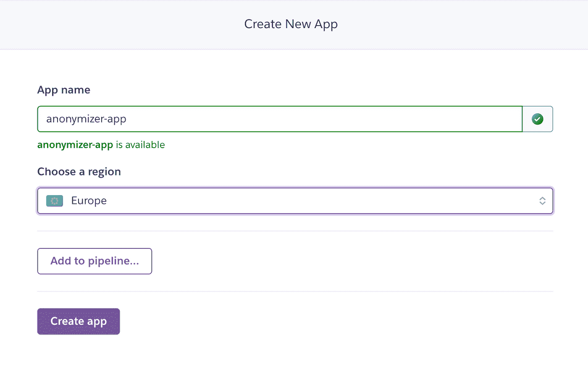

作者图片

8-Heroku 会询问您部署方法。选择 Github 选项，搜索你的回购，点击连接

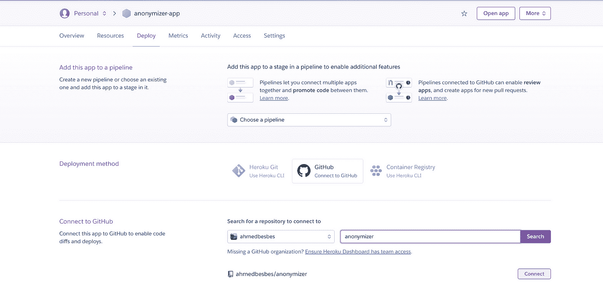

作者图片

9-您可以选择手动或自动部署应用程序。我通常通过点击 deploy 分支(在我的例子中是`main`分支)来手动完成这项工作

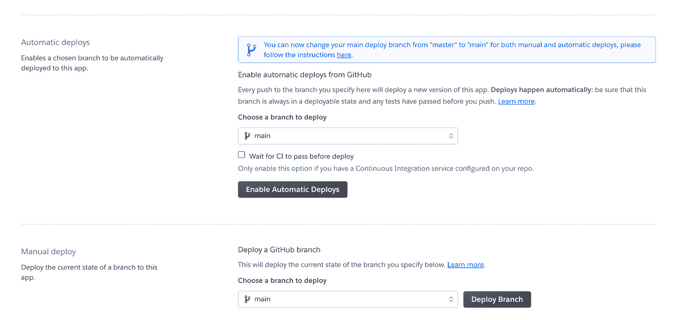

作者图片

10-点击部署后，Heroku 将开始构建应用程序。这可能需要几分钟时间

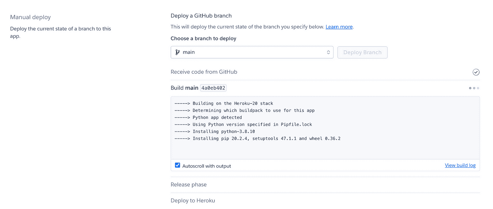

作者图片

11-应用程序部署后，您将获得 URL

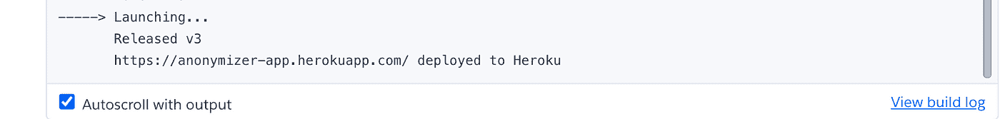

作者图片

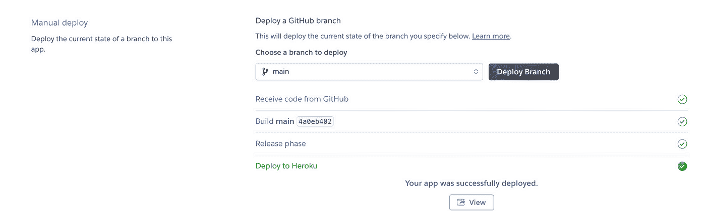

作者图片

12——看起来它起作用了

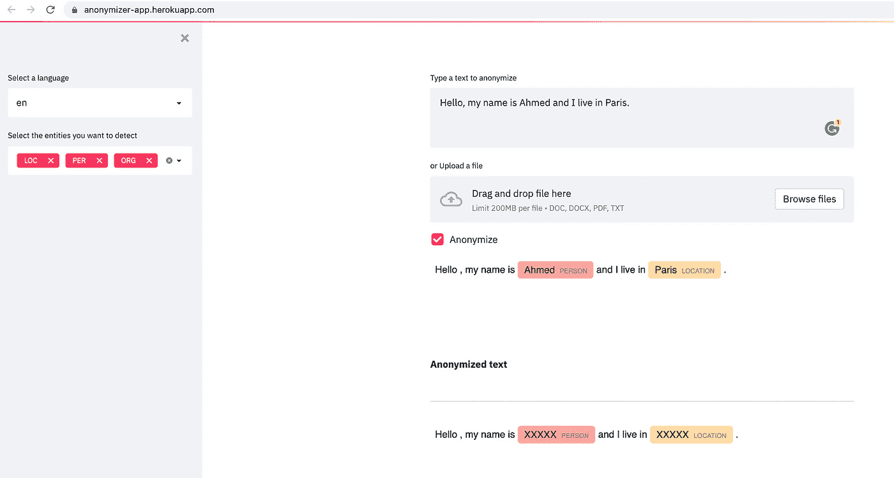

作者图片

# 下一步？

感谢你阅读并坚持到最后。正如承诺的那样，这里有一些改进这个应用程序的技巧:

*   处理更多语言(西班牙语、德语等。)通过添加空间模型
*   处理不同类型的文件，如 DOCXs 或 PDF:有一些 python 库允许你阅读 Word 和 PDF 文档[这里](https://github.com/python-openxml/python-docx)和[这里](https://github.com/mstamy2/PyPDF2)
*   允许多文件上传来处理批量文档
*   检测更多实体，如日期、电子邮件地址或信用卡号。检测这些实体不一定需要 NER 模型。有时候一个正则表达式就足够了
*   在更强大的实例上部署。一种方法是将你的应用程序分类，使用你最喜欢的云提供商

如果你对代码感兴趣，可以在我的 [Github](https://github.com/ahmedbesbes/anonymizer) repo 上找到。

保重！

# 新到中？您可以每月订阅 5 美元，并解锁无限的文章— [单击此处。](https://ahmedbesbes.medium.com/membership)