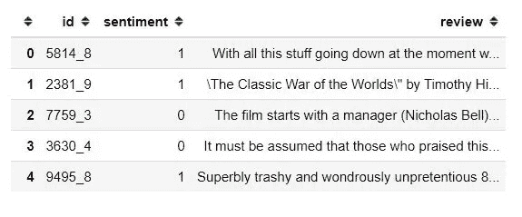

# 如何用 FastAPI 构建和部署 NLP 模型:第 1 部分

> 原文：<https://towardsdatascience.com/how-to-build-and-deploy-an-nlp-model-with-fastapi-part-1-9c1c7030d40?source=collection_archive---------8----------------------->

## 部署 NLP 模型的简单方法。


来自 [Pexels](https://www.pexels.com/photo/person-in-blue-denim-jacket-holding-black-smartphone-5053740/?utm_content=attributionCopyText&utm_medium=referral&utm_source=pexels) 的 [cottonbro](https://www.pexels.com/@cottonbro?utm_content=attributionCopyText&utm_medium=referral&utm_source=pexels) 摄影

**模型部署**如果你要从事 NLP 模型工作，这是你应该掌握的最重要的技能之一。

模型部署是将模型集成到现有生产环境中的过程。该模型将接收输入，并为特定用例的决策预测输出。

> *“只有当模型与业务系统完全集成时，我们才能从其预测中提取真正的价值”。—克里斯托弗·萨米乌拉*

有不同的方法可以将你的 NLP 模型部署到产品中，你可以使用 Flask，Django，Bottle e.t.c .但是在今天的文章中，你将学习如何使用 FastAPI 构建和部署你的 NLP 模型。

在这一系列文章中，您将了解到:

*   如何建立一个将 IMDB 电影评论分类成不同情绪的 NLP 模型？
*   什么是 FastAPI，如何安装？
*   如何用 FastAPI 部署您的模型？
*   如何在任何 Python 应用程序中使用您部署的 NLP 模型。

在第 1 部分中，我们将重点构建一个 NLP 模型，该模型可以将电影评论分类为不同的情感。所以让我们开始吧！

# 如何建立自然语言处理模型

首先，我们需要建立我们的 NLP 模型。我们将使用 [IMDB 电影数据集](https://www.kaggle.com/c/word2vec-nlp-tutorial/data?ref=hackernoon.com)来构建一个简单的模型，该模型可以分类关于该电影的评论是正面的还是负面的。下面是你应该遵循的步骤。

## 导入重要的包

首先，我们导入重要的 python 包来加载数据，清理数据，创建机器学习模型(分类器)，并保存模型以供部署。

```
# import important modules
import numpy as np
import pandas as pd# sklearn modules
from sklearn.model_selection import train_test_split
from sklearn.pipeline import Pipeline
from sklearn.naive_bayes import MultinomialNB # classifier from sklearn.metrics import (
    accuracy_score,
    classification_report,
    plot_confusion_matrix,
)
from sklearn.feature_extraction.text import TfidfVectorizer, CountVectorizer# text preprocessing modules
from string import punctuation # text preprocessing modules
from nltk.tokenize import word_tokenizeimport nltk
from nltk.corpus import stopwords
from nltk.stem import WordNetLemmatizer 
import re #regular expression# Download dependency
for dependency in (
    "brown",
    "names",
    "wordnet",
    "averaged_perceptron_tagger",
    "universal_tagset",
):
    nltk.download(dependency)

import warnings
warnings.filterwarnings("ignore")
# seeding
np.random.seed(123)
```

从数据文件夹加载数据集。

```
# load data
data = pd.read_csv("../data/labeledTrainData.tsv", sep='\t')
```

显示数据集的样本。

```
# show top five rows of data
data.head()
```



我们的数据集有 3 列。

*   **Id** —这是审核的 Id
*   **情绪** —积极(1)或消极(0)
*   **评论** —对电影的评论

检查数据集的形状。

```
# check the shape of the data
data.shape
```

(25000, 3)

该数据集有 25，000 条评论。

我们需要检查数据集是否有任何缺失值。

```
# check missing values in data
data.isnull().sum()
```

id 0
感悟 0
回顾 0
dtype: int64

输出显示我们的数据集没有任何缺失值。

## 如何评价班级分布

我们可以使用 pandas 包中的 **value_counts()** 方法来评估数据集的类分布。

```
# evalute news sentiment distribution
data.sentiment.value_counts()
```

1 12500
0 12500
名称:情操，类型:int64

在这个数据集中，我们有相同数量的正面和负面评论。

## 如何处理数据

在分析数据集之后，下一步是在创建我们的机器学习模型之前，将数据集预处理成正确的格式。

这个数据集中的评论包含了很多我们在创建机器学习模型时不需要的不必要的单词和字符。

我们将通过删除停用字词、数字和标点来清理邮件。然后我们将使用 NLTK 包中的词汇化过程将每个单词转换成它的基本形式。

函数 **text_cleaning()** 将处理所有必要的步骤来清理我们的数据集。

```
stop_words =  stopwords.words('english')def text_cleaning(text, remove_stop_words=True, lemmatize_words=True):
    # Clean the text, with the option to remove stop_words and to lemmatize word # Clean the text
    text = re.sub(r"[^A-Za-z0-9]", " ", text)
    text = re.sub(r"\'s", " ", text)
    text =  re.sub(r'http\S+',' link ', text)
    text = re.sub(r'\b\d+(?:\.\d+)?\s+', '', text) # remove numbers

    # Remove punctuation from text
    text = ''.join([c for c in text if c not in punctuation])

    # Optionally, remove stop words
    if remove_stop_words:
        text = text.split()
        text = [w for w in text if not w in stop_words]
        text = " ".join(text)

    # Optionally, shorten words to their stems
    if lemmatize_words:
        text = text.split()
        lemmatizer = WordNetLemmatizer() 
        lemmatized_words = [lemmatizer.lemmatize(word) for word in text]
        text = " ".join(lemmatized_words)

    # Return a list of words
    return(text)
```

现在我们可以通过使用 **text_cleaning()** 函数来清理我们的数据集。

```
#clean the review
data["cleaned_review"] = data["review"].apply(text_cleaning)
```

然后将数据分为特征变量和目标变量。

```
#split features and target from  data 
X = data["cleaned_review"]
y = data.sentiment.values
```

我们训练的特点是 **cleaned_review** 变量，目标是**情绪**变量。

然后，我们将数据集分成训练和测试数据。测试规模是整个数据集的 15%。

```
# split data into train and validateX_train, X_valid, y_train, y_valid = train_test_split(
    X,
    y,
    test_size=0.15,
    random_state=42,
    shuffle=True,
    stratify=y,
)
```

## 如何实际创建我们的 NLP 模型

我们将训练多项式朴素贝叶斯算法来分类评论是正面还是负面。这是文本分类最常用的算法之一。

但是在训练模型之前，我们需要将我们清理过的评论转换成数值，以便模型能够理解这些数据。在这种情况下，我们将使用 scikit-learn 中的 **TfidfVectorizer** 方法。TfidfVectorizer 将帮助我们将一组文本文档转换为 TF-IDF 特征矩阵。

为了应用这一系列步骤(预处理和训练)，我们将使用来自 scikit-learn 的一个[管道类](https://scikit-learn.org/stable/modules/generated/sklearn.pipeline.Pipeline.html?ref=hackernoon.com)，它顺序应用一系列转换和一个最终估计器。

```
# Create a classifier in pipeline
sentiment_classifier = Pipeline(steps=[
                               ('pre_processing',TfidfVectorizer(lowercase=False)),
                                 ('naive_bayes',MultinomialNB())
                                 ])
```

然后我们训练我们的分类器。

```
# train the sentiment classifier sentiment_classifier.fit(X_train,y_train)
```

然后，我们根据验证集创建一个预测。

```
# test model performance on valid data 
y_preds = sentiment_classifier.predict(X_valid)
```

将使用 **accuracy_score** 评估指标来评估模型的性能。我们使用 accuracy_score 是因为我们在情感变量中有相同数量的类。

```
accuracy_score(y_valid,y_preds)
```

0.8629333333333333

我们的模型的精度大约为 86.29%，这是一个很好的性能。

## 保存模型管道

模型管道将通过使用 **joblib** python 包保存在模型的目录中。

```
#save model 
import joblib joblib.dump(sentiment_classifier, '../models/sentiment_model_pipeline.pkl')
```

# 包扎

恭喜👏👏，您已经完成了第 1 部分的学习。我希望你已经学到了一些关于如何构建 NLP 模型的新知识。在第 2 部分中，我们将学习如何用 FastAPI 部署 NLP 模型，并在 python 应用程序中运行它。

如果你学到了新的东西或者喜欢阅读这篇文章，请分享给其他人看。在那之前，第 2 部分再见！

你也可以在 Twitter 上找到我 [@Davis_McDavid](https://twitter.com/Davis_McDavid?ref=hackernoon.com) 。

***最后一件事:*** *在以下链接阅读更多类似这样的文章。*

[](https://medium.com/geekculture/scikit-learn-0-24-top-5-new-features-you-need-to-know-7af15d8cdeac) [## sci kit-学习 0.24:您需要了解的 5 大新功能

### Scikit-learn 仍然是最受欢迎的 Python 开源免费机器学习库之一。的…

medium.com](https://medium.com/geekculture/scikit-learn-0-24-top-5-new-features-you-need-to-know-7af15d8cdeac) [](/improve-ml-model-performance-by-combining-categorical-features-a23efbb6a215) [## 通过组合分类特征提高 ML 模型性能

### 提高机器学习模型性能的简单技巧。

towardsdatascience.com](/improve-ml-model-performance-by-combining-categorical-features-a23efbb6a215) [](https://medium.com/analytics-vidhya/how-to-deploy-a-machine-learning-model-for-free-7-ml-model-deployment-cloud-platforms-fd9191726a10) [## 如何免费部署机器学习模型— 7 ML 模型部署云平台

### 我记得我第一次创建一个简单的机器学习模型。这是一个可以预测你工资的模型…

medium.com](https://medium.com/analytics-vidhya/how-to-deploy-a-machine-learning-model-for-free-7-ml-model-deployment-cloud-platforms-fd9191726a10) 

*以前在这里发表过* [*。*](https://hackernoon.com/how-to-build-and-deploy-an-nlp-model-with-fastapi-part-1-n5w35cj)