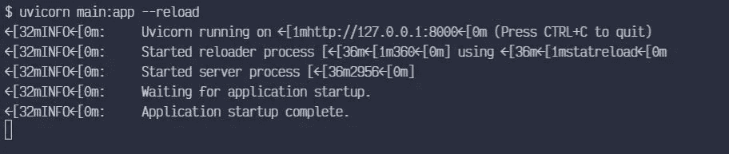
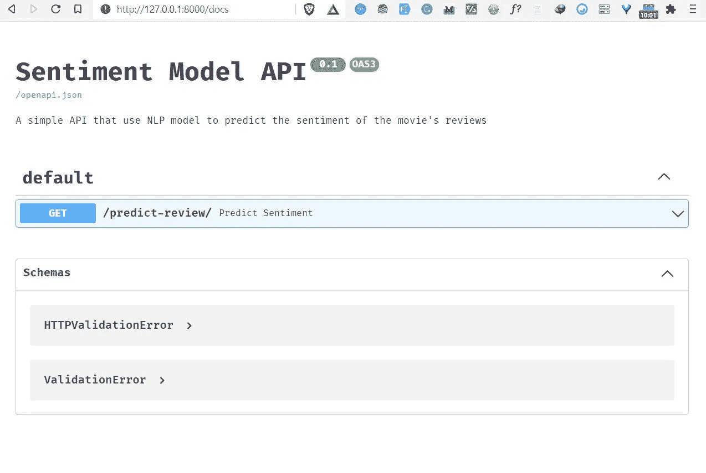
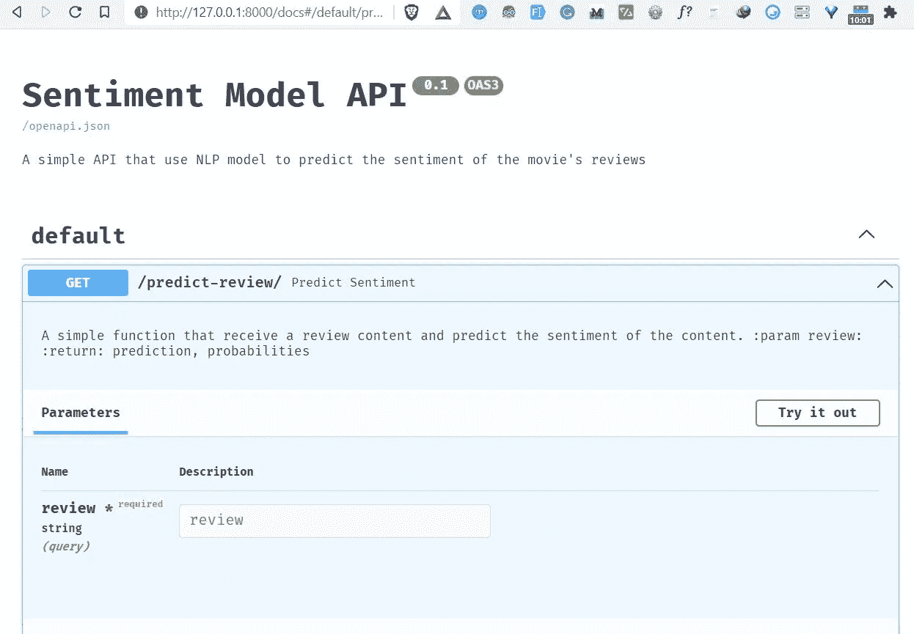
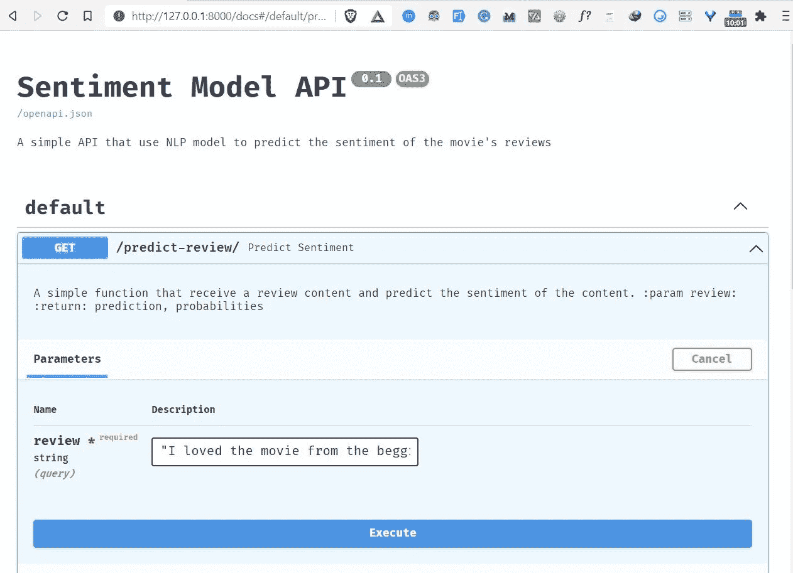

# 如何用 FastAPI 构建和部署 NLP 模型:第 2 部分

> 原文：<https://towardsdatascience.com/how-to-build-and-deploy-an-nlp-model-with-fastapi-part-2-e63a3eac71ad?source=collection_archive---------18----------------------->

## 部署 NLP 模型的简单方法


来自 [Pexels](https://www.pexels.com/photo/woman-writing-on-whiteboard-3861943/?utm_content=attributionCopyText&utm_medium=referral&utm_source=pexels) 的 [ThisIsEngineering](https://www.pexels.com/@thisisengineering?utm_content=attributionCopyText&utm_medium=referral&utm_source=pexels) 摄影

这是关于如何用 FastAPI 构建和部署 NLP 模型的系列文章的第二部分，也是最后一部分。在[的第一部分](/how-to-build-and-deploy-an-nlp-model-with-fastapi-part-1-9c1c7030d40)，我们看了如何建立一个 NLP 模型，可以将电影评论分类成不同的情感。

在第二部分也是最后一部分，您将了解到

*   什么是 FastAPI，如何安装？
*   如何用 FastAPI 部署您的模型？
*   如何在任何 Python 应用程序中使用您部署的 NLP 模型。

所以让我们开始吧。🚀

# 什么是 FastAPI？

FastAPI 是快速的现代 python web 框架，用于构建不同的[API](https://hackernoon.com/how-to-use-the-requests-python-library-to-make-an-api-call-and-save-it-as-a-pandas-dataframe-z43k33rm?ref=hackernoon.com)。它提供了更高的性能，更容易编码，并提供了自动的交互式文档。

FastAPI 基于两个主要的 python 库 **— Starlette** (用于 web 处理)和 **Pydantic** (用于数据处理&验证)。与 Flask 相比，FastAPI 非常快，因为它将异步函数处理程序带到了表中。

如果您想了解 FastAPI 的更多信息，我推荐您阅读 Sebastián Ramírez 的这篇文章。

在本文中，我们将尝试使用 FastAPI 中的一些特性来服务于我们的 NLP 模型。

# 如何安装 FastAPI

首先，确保您安装了最新版本(带 pip):

```
pip install fastapi
```

你还需要一个 ASGI 服务器用于生产，比如[uvicon](http://www.uvicorn.org/?ref=hackernoon.com)。

```
pip install uvicorn
```

# 使用 FastAPI 部署 NLP 模型

在本节中，我们将使用 FastAPI 将我们训练过的 [NLP](https://hackernoon.com/tagged/nlp?ref=hackernoon.com) 模型部署为 REST API。我们 API 的代码将保存在一个名为 **main.py** 的 python 文件中，这个文件将负责运行我们的 FastAPI 应用程序。

# 导入包

第一步是导入将帮助我们构建 FastAPI 应用程序和运行 NLP 模型的包。

# 初始化 FastAPI 应用程序实例

我们可以使用下面的代码来初始化 FastAPI 应用程序。

如您所见，我们已经定制了 FastAPI 应用程序的配置，包括:

*   API 的标题
*   API 的描述。
*   API 的版本。

# 加载 NLP 模型

为了加载模型，我们使用 **joblib.load()** 方法，并将路径添加到模型目录中。NLP 模型的名称是**情绪 _ 模型 _ 管道. pkl** 。

# 定义一个函数来清理数据

我们将使用第 1 部分中的同一个函数 **text_cleaning()** ，该函数通过删除停用词、数字和标点符号来清理评论数据，最后，通过使用 NLTK 包中的词汇化过程将每个单词转换成其基本形式。

# 创建预测端点

下一步是用 GET 请求方法添加我们的预测端点“ **/predict-review** ”。

```
@app.get("/predict-review")
```

> “API 端点是两个系统交互时通信通道的入口点。它指的是 API 和服务器之间的通信接触点。”

然后我们为这个端点定义一个预测函数。函数的名字叫做**predict _ perspective()**带有一个 review 参数。

predict _ perspective()函数将执行以下任务。

*   收到影评。
*   使用 **text_cleaning()** 函数清理电影评论。
*   使用我们的 NLP 模型进行预测。
*   将预测结果保存在**输出**变量中(0 或 1)。
*   将预测的概率保存在 **probas** 变量中，并将其格式化为两位小数。
*   最后，返回预测和概率结果。

这里是 **main.py** 文件中的所有代码块。

# 运行 API

以下命令将帮助我们运行我们创建的 FastAPI 应用程序。

```
uvicorn main:app --reload
```

下面是我们为 uvicorn 定义的运行 FastAPI 应用程序的设置。

*   **main:** 包含 FastAPI 应用程序的文件 main.py。
*   **app:** 在 main.py 中用 app = FastAPI()行创建的对象。
*   **— reload** :使服务器在我们修改代码时自动重启。



FastAPI 提供了一个自动交互式 API 文档页面。要访问它，请在浏览器中导航到[**http://127 . 0 . 0 . 1:8000/docs**](http://127.0.0.1:8000/docs)，然后您将看到由 FastAPI 自动创建的文档页面。



文档页面显示了我们的 API 的名称、描述及其版本。它还显示了 API 中可用路线的列表，您可以与之交互。

要进行预测，首先点击"**预测-审核**"路线，然后点击按钮"**试用"**，它允许您填写审核参数并直接与 API 交互。



通过添加您选择的电影评论来填写评论栏。我补充了以下关于 2021 年上映的**扎克·施奈德版正义联盟**电影的影评。

> “我从头到尾都很喜欢这部电影。就像雷·费希尔说的，我希望这部电影不会结束。乞讨的场景令人激动，我非常喜欢那个场景。不像《正义联盟》这部电影展示了每个英雄最擅长自己的事情，让我们热爱每一个角色。谢谢扎克和整个团队。”

然后点击执行按钮进行预测，得到结果。



最后，来自 API 的结果显示，我们的 NLP 模型预测所提供的评论具有**正面**情感，概率为 **0.70** 。


# 在任何 Python 应用程序中使用 NLP 模型

要在任何 python 应用程序中使用我们的 NLP API，我们需要安装 requests python 包。这个 python 包将帮助我们向我们开发的 FastAPI 应用程序发送 HTTP 请求。

要安装请求包，请运行以下命令。

```
pip install requests
```

然后创建一个名为 **python_app.py** 的简单 python 文件。这个文件将负责发送我们的 HTTP 请求。

我们首先导入请求包。

```
import requests as r
```

补充一个关于**哥斯拉 vs 孔(2021)** 电影的影评。

```
# add review
review = "This movie was exactly what I wanted in a Godzilla vs Kong movie. It's big loud, brash and dumb, in the best ways possible. It also has a heart in a the form of Jia (Kaylee Hottle) and a superbly expressionful Kong. The scenes of him in the hollow world are especially impactful and beautifully shot/animated. Kong really is the emotional core of the film (with Godzilla more of an indifferent force of nature), and is done so well he may even convert a few members of Team Godzilla."
```

然后在要传递给 HTTP 请求的关键参数中添加评论。

```
keys = {"review": review}
```

最后，我们向我们的 API 发送一个请求，对评论进行预测。

```
prediction = r.get("http://127.0.0.1:8000/predict-review/", params=keys)
```

然后就可以看到预测结果了。

```
results = prediction.json()
print(results["prediction"])
print(results["Probability"])
```

这将显示预测及其概率。以下是结果。

正
0.54

# 包扎

恭喜👏👏，您已经完成了第 2 部分的学习。我希望您已经学到了一些关于如何使用 FastAPI 部署 NLP 模型的新知识。

如果你想了解更多关于 FastAPI 的知识，我推荐你参加由[bit fuses](https://twitter.com/bitfumes?ref=hackernoon.com)创建的[完整 FastAPI 课程](https://www.youtube.com/watch?v=7t2alSnE2-I&ref=hackernoon.com)。

您可以从这里下载本文中使用的项目源代码:

[https://github.com/Davisy/Deploy-NLP-Model-with-FastAPI](https://github.com/Davisy/Deploy-NLP-Model-with-FastAPI?ref=hackernoon.com)

如果你学到了新的东西或者喜欢阅读这篇文章，请分享给其他人看。在那之前，下一篇文章再见！。

你也可以在推特上找到我 [@Davis_McDavid](https://twitter.com/Davis_McDavid?ref=hackernoon.com)

***最后一件事:*** *在下面的链接里多看看这样的文章。*

<https://medium.com/geekculture/scikit-learn-0-24-top-5-new-features-you-need-to-know-7af15d8cdeac>  </improve-ml-model-performance-by-combining-categorical-features-a23efbb6a215>  <https://medium.com/analytics-vidhya/how-to-deploy-a-machine-learning-model-for-free-7-ml-model-deployment-cloud-platforms-fd9191726a10>  

*以前发表的* [这里的*。*](https://hackernoon.com/how-to-build-and-deploy-an-nlp-model-with-fastapi-part-2-0a1x37ot)