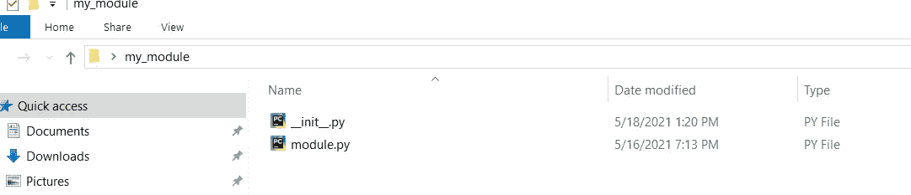

# 如何为数据科学项目构建和使用自定义 python 包

> 原文：<https://towardsdatascience.com/how-to-build-and-use-custom-python-packages-for-data-science-project-145b4f759d6f?source=collection_archive---------18----------------------->

## 比上次更干净的代码


由 [Unsplash](https://unsplash.com?utm_source=medium&utm_medium=referral) 上的[品牌盒子](https://unsplash.com/@brandablebox?utm_source=medium&utm_medium=referral)拍摄

在数据科学项目中，我们根据问题的性质使用类似的步骤。通常，数据科学项目包括问题识别、数据收集和准备、功能工程、培训和测试模型以及部署。在这些步骤中，使用了几个函数。数据科学家需要在不同的项目中反复使用这些功能。例如，数据科学家导入不同的模型进行训练，然后用训练数据拟合模型，然后根据拟合的模型进行预测。为了评估模型，他/她需要使用某种形式的评估指标，如平均绝对百分比误差(MAPE)。所以，如果能把重复使用的代码保存在某个地方，一直重复使用，会节省很多时间，代码也会比上次干净很多。这就是构建定制包可以帮助数据科学家创建可重用代码的地方。

**封装和模块:**

python 中的包是模块的集合。另一方面，python 模块是一个由 python 语句和定义组成的文件。Python 有自己的包，我们在代码中一直导入和使用这些包。类似地，我们可以创建自己的模块，并将它们保存为一个包，这样我们就可以通过将它们导入到我们的代码中来反复使用它们。这有助于更好地管理代码，并增加代码的可重用性。这篇文章将展示我们如何创建一个包含一个模块的定制包，并在我们的回归问题中使用它。

**构建我们的定制包:**

在这个问题中，我们将使用 xgboost 和随机森林回归模型来训练模型，以便进行演示。然后，我们将使用平均绝对百分比误差(MAPE)来评估模型的准确性。最后，我们将尝试使用网格搜索来优化这两个模型的精度。因此，我们将创建所有这些函数来训练和评估模型，以及优化模型的超参数。我们将把所有这些函数放在一个 python 文件中，该文件将成为我们的模块，然后我们将通过插入该模块来创建一个包。我们可以继续在该包中添加模块。下面是我们将添加到模块/ python 文件中的函数。

```
import xgboost as xgb
from sklearn.ensemble import RandomForestRegressor
from sklearn.metrics import mean_absolute_percentage_error**#functions to train random forest regression model**def model_rf(x_train,y_train): #Function fits the random forest regression
    model = RandomForestRegressor(random_state=0)
    return model.fit(x_train,y_train)**#functions to train xgboost regression model**def model_xgb(x_train,y_train):  #Function fits the xgboost regressor  
    model=xgb.XGBRegressor(objective ='reg:squarederror')
    return model.fit(x_train,y_train)**#functions to calculate MAPE value**def result(model,x_test,y_true): #Funtion takes a fitted model and predicts based on x_test values and calculates the MAPE
    y_pred=model.predict(x_test)
    mape=mean_absolute_percentage_error(y_true, y_pred)*100
    return mape**#functions to do grid search to optimize model hyper-parameters** def optimization(model,params,cv,x_train,y_train): # setup the grid search
    grid_search = GridSearchCV(model,
                           param_grid=params,
                           cv=cv,
                           verbose=1,
                           n_jobs=1,
                           return_train_score=True)
    return grid_search.fit(x_train, y_train)
```

从上面的代码中，我们可以看到我们导入了所有必需的库，然后创建了 4 个函数。model_rf 函数创建一个随机森林回归对象，然后拟合定型数据。model_xgb 函数创建一个 xgboost 回归对象，然后拟合定型数据。结果函数采用拟合模型、x_test 和 y_true 值。它使用 x_test 预测 y 值，然后通过比较 y_true 和预测值来计算 MAPE。

让我们将文件保存为 module.py，并将其放在名为 my_module 的文件夹中。我们可以用任何我们想要的名字。


作者照片

现在让我们创建一个空白的 python 文件，并将其命名为 __init__.py。因此，这非常重要。当 Python 有' __init__ '时，它会将文件夹作为一个包读取。py '文件在里面。因此，我们创建文件并保存在同一个文件夹 my_module 中。



作者照片

这就是我们所需要的。现在，我们希望将该文件夹放在我们的 python 目录中，以便每次需要它时，我们可以将其作为内置的 python 包导入。因此，我们需要转到我们的目录，将 my_module 文件夹放在 site-packages 文件夹中。我用的是 anaconda3。因此，我将转到该文件夹，然后在 lib 文件夹中找到我的用于 anaconda 发行版的站点包，如下所示。


作者照片

之后，我将 my_module 文件夹粘贴到 site-packages 文件夹中。我放弃了，现在我可以将 my_module 作为一个包导入到我的 ide 中。之后，我可以在 my_module 包中创建的模块中使用所有这些函数。


作者照片

在上图中，我们可以看到我已经从我的 Jupiter 笔记本内部的 my_module 包中导入了一个模块。之后，我调用了 help 函数来查看模块内部的内容。我们可以看到它显示了保存在模块文件中的所有四个函数。它还显示了我们在计算机上安装该模块的路径。现在，我们可以在我们的问题中反复使用这些函数，而不是专门编写或复制粘贴。我们可以在模块文件中创建更多的函数，或者在 my_module 包中创建不同的模块文件。让我们使用我们的定制包来解决一个机器学习问题

**问题:**

动物园管理部门正试图了解不同栖息地的美洲驼数量。这个项目将帮助他们计划食物，这样他们就可以正确地喂养骆驼。我们有 20 个月的历史数据，包括不同栖息地的羊驼数量和一些天气特征。数据文件可以在下面的链接中找到

<https://github.com/PriyaBrataSen/Machine_Learning_with_python/tree/main/Data>  

拉斯波娃·玛丽娜在 [Unsplash](https://unsplash.com?utm_source=medium&utm_medium=referral) 上拍摄的照片

**数据预处理:**

在这一步中，我们只是导入数据并做一些预处理，为我们的机器学习模型准备数据。

```
**#Importing some packages**import numpy as np
import pandas as pd
import matplotlib.pyplot as plt 
import seaborn as sns 
import datetime as dt
from my_module import module**# Importing the two files and merging them together**df1=pd.read_csv('llama_forecast_train.csv')
df2=pd.read_csv('historical_weather.csv')
df2.rename(columns={'HOUR':'DAY'},inplace='True')
df1=pd.merge(df1,df2,on=['DAY'], how= "left")**#Breaking the date time variables**df1['Date']=pd.to_datetime(df1['DAY'])
df1.sort_values(by='Date',ascending=True,inplace=True)
df1['Year']=df1['Date'].dt.year
df1['Month']=df1['Date'].dt.month
df1['Week']=df1['Date'].dt.week
df1['Day']=df1['Date'].dt.day
df1['Week Day']=df1['Date'].dt.dayofweek
df1['Year Day']=df1['Date'].dt.dayofyear
df1.drop(['Date','DAY'],axis=1,inplace=True)**#Creating dummies for the habitat names becasue it is a qualitative variable**df3=pd.concat([df1, pd.get_dummies(df1[['HABITAT NAME']])], axis=1).drop(['HABITAT NAME'],axis=1)
df3=df3.reset_index(drop=True)
df3.head()
```


作者照片

**模型构建:**

现在，我们将数据分为训练和测试。在第二部分中，我们用训练数据拟合了随机森林和 xgboost 回归模型。在这里我们可以看到，我们从我们的模块中调用了 model_rf 和 model_xgb 函数，该模块是从我们的 my_module 定制包中导入的。不需要创建回归对象，然后用训练数据来拟合它们。导入的函数将完成这项工作

```
**# Splitting data in tarin test split**
y=df3['AVAILABLE LLAMAS']
x=df3.drop(['AVAILABLE LLAMAS'],axis=1)
b=int(len(df1)*.75)
x_train, x_test=x.iloc[0:b, :], x.iloc[b:-1, :]
y_train, y_test=y.iloc[0:b], y.iloc[b:-1]**# train both random forest and xgboost model**rf=module.model_rf(x_train,y_train)
xgboost=module.model_xgb(x_train,y_train)
```

**模型评估:**

让我们使用自定义包中的结果函数来计算随机森林和 xgboost 模型的 MAPE。我们只是传递 x 和 y 的模型和测试值

```
print('MAPE for random forest:',module.result(rf, x_test, y_test))
print('MAPE for xgboost:',module.result(xgboost, x_test, y_test))
```


作者照片

我们可以看到随机森林的 MAPE 为 20.01%，xgboost 为 20.07%。让我们使用网格搜索来改善结果。

**超参数优化:**

在本节中，我们将使用模块中的优化功能来调整两个模型的超参数。

```
**#Splitting data for hyperparameter tuning**
tss=TimeSeriesSplit(n_splits=3)**# define the grid for the xgboost**
params_xgb = {
    "learning_rate": [0.01, 0.1],
    "max_depth": [2, 4, 6],
    "n_estimators": [10, 100,150],
    "subsample": [0.8, 1],
    "min_child_weight": [1, 3],
    "reg_lambda": [1, 3],
    "reg_alpha": [1, 3]
}**# define the grid random forest**
params_rf = {
    "n_estimators": [50, 100, 150],
    "max_features": [0.33, 0.66, 1.0],
    "min_samples_split": [2, 8, 14],
    "min_samples_leaf": [1, 5, 10],
    "bootstrap": [True, False]
}**# fit the new models with the optimized hyper-parameters**grid_xgb=module.optimization(xgboost, params_xgb, tss, x_train, y_train)
grid_rf=module.optimization(rf, params_rf, tss, x_train, y_train)
```

在上面的块中，我们首先创建了双参数网格。这些将在网格搜索函数的 param_grid 参数中传递。最后，我们调用我们的优化函数，它主要计算模型的超参数的最佳值，并拟合精化的模型。同样，我们能够避免为超参数调节函数编写长代码。我们刚刚使用了模块中的函数。下面是优化模型的结果

```
print('MAPE for the tuned xgboost model:',module.result(grid_xgb, x_test, y_test))
print('MAPE for the tuned random forest model:',module.result(grid_rf, x_test, y_test))
```


作者照片

**结论:**

从上面的例子中，我们可以看到创建我们自己的 python 数据科学包并在我们的项目中重复使用它们是多么容易。这个过程也有助于保持你的代码整洁，节省大量时间。将自定义包放在 python 目录的站点包中非常重要，这样我们就可以像使用 python 中的内置包一样使用我们的自定义包。