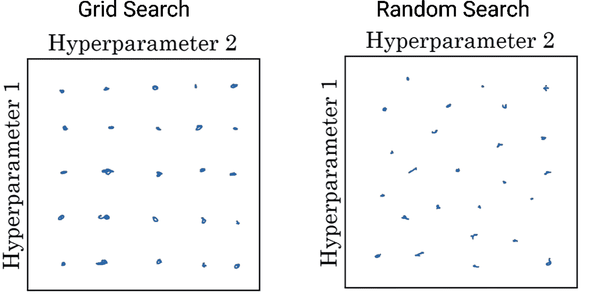
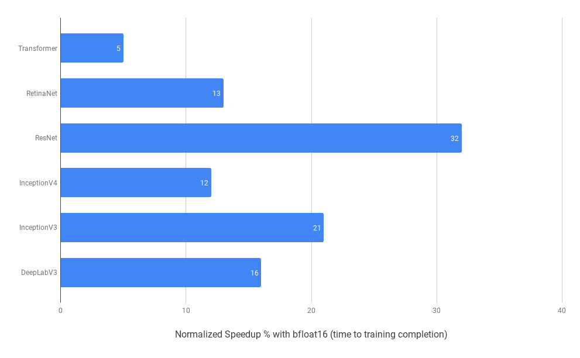
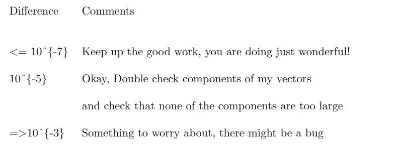
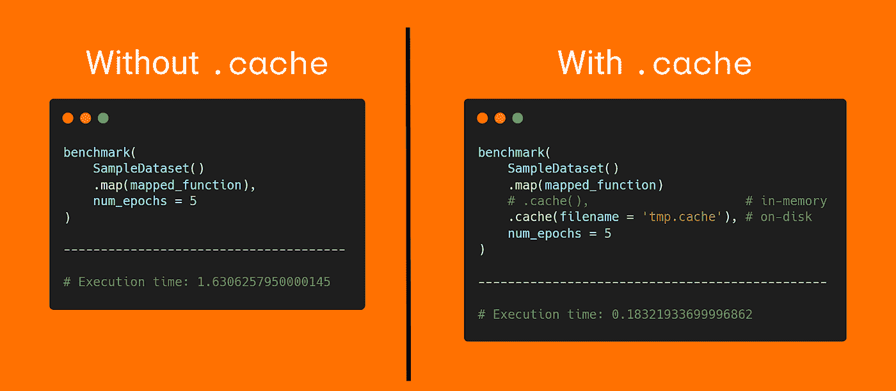

# 如何建立更好的机器学习模型

> 原文：<https://towardsdatascience.com/how-to-build-better-machine-learning-models-537a4486d056?source=collection_archive---------30----------------------->

## 开发良好深度神经网络的提示、技巧和指南


伊万·阿列克西奇在 [Unsplash](https://unsplash.com?utm_source=medium&utm_medium=referral) 上的照片

开发者们好👋。如果你以前建立过深度神经网络，你可能知道这需要大量的实验。

在本文中，我将与您分享一些有用的技巧和指南，您可以使用它们来更好地建立更好的深度学习模型。这些技巧会让你更容易发展一个好的人际网络。

你可以选择使用哪些技巧，因为有些对你正在做的项目更有帮助。并不是本文中提到的所有东西都能直接提高模型的性能。

# 超参数 tuning🕹️的高级方法

训练深度神经网络的一个更痛苦的事情是，你必须处理大量的超参数。

这些可能是你的学习率 **α** ，折现因子 **ρ** 和ε**ε**，如果你使用的是 RMSprop 优化器([辛顿等人](https://www.cs.toronto.edu/~tijmen/csc321/slides/lecture_slides_lec6.pdf))，或者是指数衰减率 **β₁** 和 **β₂** ，如果你使用的是亚当优化器([金玛等人](https://arxiv.org/abs/1412.6980))。

您还需要选择网络中的层数或层的隐藏单元数。您可能正在使用学习率调度程序，并且想要配置这些功能以及更多功能😩！我们确实需要更好地组织超参数调整过程的方法。

我倾向于使用随机搜索算法来组织我的超参数搜索过程。尽管有其他可能更好的算法，但我通常最终还是会使用它。

假设在本例中，您想要调整两个超参数，并且您怀疑这两个参数的最佳值都在 1 到 5 之间。

这里的想法是，与其选择 25 个值像(1，1) (1，2)等系统地尝试，随机选择 25 个点会更有效。



基于[吴恩达](https://www.andrewng.org/)的课堂笔记

下面是一个关于 TensorFlow 的简单示例，我尝试在时尚 MNIST 数据集上使用随机搜索来获得学习率和第一密集层中的单元数量:

张量流随机搜索

在这里，我怀疑第一密集层中单元的最佳数量将在 32 和 512 之间，并且我的学习率将是 1e-2、1e-3 或 1e-4 之一。

因此，如本例所示，我将单位数的最小值设为 32，最大值设为 512，步长为 32。然后，我指定了一个可以尝试的范围，而不是硬编码一个单位数的值。

```
hp_units = hp.Int('units', min_value = 32, max_value = 512, step = 32)
model.add(tf.keras.layers.Dense(units = hp_units, activation = 'relu'))
```

我们对我们的学习率做同样的事情，但是我们的学习率只是 1e-2、1e-3 或 1e-4 中的一个，而不是一个范围。

```
hp_learning_rate = hp.Choice('learning_rate', values = [1e-2, 1e-3, 1e-4])
optimizer = tf.keras.optimizers.Adam(learning_rate = hp_learning_rate)
```

最后，我们执行随机搜索，并指定在我们构建的所有模型中，具有最高验证准确性的模型将被称为最佳模型。或者简单地说，获得良好的验证准确性是目标。

```
tuner = kt.RandomSearch(model_builder,
                        objective = 'val_accuracy', 
                        max_trials = 10,
                        directory = 'random_search_starter',
                        project_name = 'intro_to_kt') 

tuner.search(img_train, label_train, epochs = 10, validation_data = (img_test, label_test))
```

这样做之后，我还想检索最佳模型和最佳超参数选择。尽管我想指出使用`get_best_models`通常被认为是一种捷径。

为了获得最佳性能，您应该使用在整个数据集上获得的最佳超参数来重新训练您的模型。

```
# Which was the best model?
best_model = tuner.get_best_models(1)[0]# What were the best hyperparameters?
best_hyperparameters = tuner.get_best_hyperparameters(1)[0]
```

我不会在这篇文章中详细讨论这些代码，但是如果你愿意，你可以在[这篇文章](/the-art-of-hyperparameter-tuning-in-deep-neural-nets-by-example-685cb5429a38)中读到。

# 对大型网络使用混合精度训练🎨

你的神经网络越大，你的结果就越准确(一般来说)。随着模型规模的增长，用于训练这些模型的内存和计算需求也会增加。

使用混合精度训练的想法(NVIDIA， [Micikevicius 等人](https://arxiv.org/abs/1710.03740))是使用半精度浮点数来训练深度神经网络，这让您可以更快地训练大型神经网络，而不会降低或可以忽略网络的性能。

但是，我想指出的是，这种技术应该只用于参数超过 1 亿左右的大型模型。

虽然混合精度可以在大多数硬件上运行，但它只会提高最近的 NVIDIA GPUs(例如特斯拉 V100 和特斯拉 T4)和云 TPU 上的模型的速度。

我想让您了解一下使用混合精度时的性能提升。当我在我的 GCP 笔记本实例(由 Tesla V100 组成)上训练 ResNet 模型时，它在训练时间上几乎好了三倍，在云 TPU 实例上几乎好了 1.5 倍，准确性几乎没有差异。测量上述加速的代码取自[本例](https://www.tensorflow.org/guide/mixed_precision)。

为了进一步增加你的训练量，你也可以考虑使用更大的批量——因为我们使用的是 float16 tensors，你应该不会耗尽内存。

用 TensorFlow 实现混合精度也相当容易。使用 TensorFlow，您可以轻松使用 [tf.keras.mixed_precision](https://www.freecodecamp.org/news/p/d63b23cb-c1f8-4997-87c1-6c5c44ea9e14/tf.keras.mixed_precision) 模块，该模块允许您设置数据类型策略(使用 float16)并应用损失缩放以防止下溢。

下面是一个在网络上使用混合精度训练的简单示例:

在这个例子中，我们首先将`dtype`策略设置为 float16，这意味着我们所有的模型层都将自动使用 float16。

这样做之后，我们构建一个模型，但是我们覆盖了最后一个或输出层的数据类型为 float32，以防止任何数字问题。理想情况下，你的输出层应该是 float32。

注意:我已经建立了一个有这么多单位的模型，所以我们可以看到混合精度训练在训练时间上的一些差异，因为它对大型模型很有效。

如果您正在寻找使用混合精度训练的更多灵感，这里有一张图片，展示了 Google Cloud 在 TPU 上对多个模型进行加速:



云 TPU 上的加速

# 对 backpropagation✔️使用毕业支票

在多种情况下，我不得不定制实现一个神经网络。实现反向传播通常是容易出错的方面，也很难调试。

通过不正确的反向传播，你的模型可能会学到一些看起来合理的东西，这使得调试更加困难。那么，如果我们能够实现一些东西，让我们能够轻松地调试我们的神经网络，那该有多酷呢？

我经常在实现反向传播时使用梯度检查来帮助我调试它。这里的想法是使用数值方法来近似梯度。如果它接近反向传播算法计算的梯度，那么您可以更加确信反向传播是正确实现的。

到目前为止，你可以用这个表达式得到一个向量，我们称之为`dθ[approx]`:


计算近似梯度(图片由作者提供)

如果你正在寻找这背后的原因，你可以在我写的这篇文章中找到更多。

所以，现在我们有两个向量`dθ[approx]`和`dθ`(通过反向投影计算)。而这些应该是彼此几乎相等的。您可以简单地计算这两个向量之间的欧几里德距离，并使用该参考表来帮助您调试网络:



参考表格(图片由作者提供)

# 缓存数据集💾

缓存数据集是一个简单的想法，但我没见过用得多的。这里的想法是检查整个数据集，并将其缓存在文件或内存中(如果它是一个小数据集)。

这将使你不必在每个时期执行一些昂贵的 CPU 操作，如文件打开和数据读取。

这也意味着你的第一个纪元会花费更多的时间📉因为理想情况下，您会执行所有操作，如在第一个时期打开文件和读取数据，然后缓存它们。但是随后的时期应该快得多，因为您将使用缓存的数据。

这看起来绝对是一个非常容易实现的想法，对吗？这里有一个 TensorFlow 示例，展示了如何轻松缓存数据集。它还显示了加速🚀实现这个想法。在我的要点中找到下面例子的完整代码。



一个简单的数据集缓存和加速的例子

# 如何解决⭐过度拟合的问题

当您使用神经网络时，过度拟合和欠拟合可能是您面临的两个最常见的问题。这一部分讲述了我在处理这些问题时常用的一些方法。

您可能知道这一点，但高偏差会导致您错过要素和标注之间的关系(拟合不足)，而高方差会导致模型捕捉噪声并过度拟合训练数据。

我认为解决过度拟合的最有效方法是获取更多的数据——尽管你也可以扩充你的数据。深度神经网络的一个好处是，随着数据越来越多，它们的性能会提高。

但在很多情况下，获取更多数据可能成本太高，或者根本不可能。在这种情况下，让我们谈谈你可以用来解决过度拟合的其他方法。

除了获取更多数据或扩充数据，您还可以通过改变网络的架构或对网络的权重进行一些修改来解决过度拟合问题。我们来看看这两种方法。

## 改变模型架构

改变架构的一个简单方法是使用随机搜索偶然发现一个好的架构。或者您可以尝试从模型中删除节点，从本质上降低模型的容量。

我们已经讨论了随机搜索，但是如果你想看修剪的例子，你可以看看 [TensorFlow 模型优化修剪指南](https://www.tensorflow.org/model_optimization/guide/pruning)。

## 修改网络权重

在这一节中，我们将看到一些我常用的方法，通过修改网络的权重来防止过度拟合。

## 权重正则化

重复我们所讨论的，“简单的模型比复杂的模型更不容易过度拟合”。我们试图通过强制网络权重取小值来限制网络的复杂性。

为此，我们将在损失函数中添加一项，如果模型的权重较大，则该项会对模型不利。通常使用 L₁和 L₂正则化，区别在于:

*   L1——增加的惩罚是∝对|权重系数|
*   L2——增加的惩罚是∝到|权重系数|**|**

其中|x|代表绝对值。

你注意到 L1 和 L2 的区别了吗，平方项？由于这个原因，L1 可能会推动权重等于零，而 L2 会有权重趋于零，但不是零。

如果你对进一步探索这个问题感兴趣，[这篇文章](/solving-overfitting-in-neural-nets-with-regularization-301c31a7735f)深入探讨了规范化，可能会有所帮助。

这也是我倾向于使用 L2 多于 L1 正则化的确切原因。让我们看一个 TensorFlow 的例子。

在这里，我展示了一些代码来创建一个简单的 3 个单位和 L2 正则密集层:

```
import tensorflow as tf
tf.keras.layers.Dense(3, kernel_regularizer = tf.keras.regularizers.L2(0.1))
```

为了更清楚地说明这是干什么的，正如我们上面讨论的，这将向损失函数添加一项(0.1 ×权重系数值)，作为对非常大的权重的惩罚。此外，在上面的代码中，将 L2 替换为 L1 来为您的层实现 L1 非常简单。

## 辍学者

当我在构建一个模型并且面临过度拟合时，我做的第一件事就是尝试使用 droppets([Srivastava 等人](https://jmlr.org/papers/v15/srivastava14a.html))。这里的想法是在训练过程中随机丢弃或设置为零(忽略)x%的图层输出要素。

我们这样做是为了阻止单个节点依赖于其他节点的输出，并防止它们过多地从其他节点进行共同适应。

使用 TensorFlow 很容易实现辍学，因为他们可以作为层使用。下面是一个例子，我试图建立一个模型来区分辍学的狗和猫的图像，以减少过度拟合:

```
model = tf.keras.models.Sequential([
    tf.keras.layers.Conv2D(32, (3,3), padding='same', activation='relu',input_shape=(IMG_HEIGHT, IMG_WIDTH ,3)),
    tf.keras.layers.MaxPooling2D(2,2),
    tf.keras.layers.Dropout(0.2),
    tf.keras.layers.Conv2D(128, (3,3), padding='same', activation='relu'),
    tf.keras.layers.MaxPooling2D(2,2),
    tf.keras.layers.Dropout(0.2),
    tf.keras.layers.Flatten(),
    tf.keras.layers.Dense(512, activation='relu'),
    tf.keras.layers.Dense(1, activation='sigmoid')
])
```

正如您在上面的代码中看到的，您可以直接使用`tf.keras.layers.dropout`来实现 dropout，向它传递要忽略的输出特征的一部分(这里是 20%的输出特征)。

## 提前停止

早期停止是我经常使用的另一种正则化方法。这里的想法是在验证集上的每个时期监控模型的性能，并在满足验证性能的某些指定条件时终止训练(如当丢失时停止训练< 0.5)

It turns out that the basic condition like we talked about above works like a charm if your training error and validation error look something like in this image. In this case, Early Stopping would just stop training when it reaches the red box (for demonstration) and would straight up prevent overfitting.

> *)它(早期停止)是一种如此简单有效的正则化技术，以至于 Geoffrey Hinton 称之为“美丽的免费午餐”。*
> 
> *—使用 Aurelien Geron 的 Scikit-Learn 和 TensorFlow 进行机器实践学习*


改编自[Lutz pre helt](https://link.springer.com/chapter/10.1007/978-3-642-35289-8_5)

但是，在某些情况下，您可能无法直接选择识别标准或知道何时停止训练模型。

就本文的范围而言，我们不会在这里讨论更多的标准，但我建议您查看“[早期停止—但何时，Lutz pre helt](https://link.springer.com/chapter/10.1007/978-3-642-35289-8_5)”，我经常使用它来帮助确定标准。

让我们看一个使用 TensorFlow 提前停止操作的示例:

```
import tensorflow as tfcallback = tf.keras.callbacks.EarlyStopping(monitor='loss', patience=3)
model = tf.keras.models.Sequential([...])
model.compile(...)
model.fit(..., callbacks = [callback])
```

在上面的例子中，我们创建了一个提前停止的回调，并指定我们想要监控我们的损失值。我们还规定，如果在 3 个时期内损失值没有明显的改善，就应该停止训练。最后，在训练模型时，我们指定它应该使用这个回调。

此外，为了这个例子的目的，我展示了一个顺序模型——但是这也可以以完全相同的方式与用功能 API 或子类模型创建的模型一起工作。

# 感谢您的阅读！

谢谢你坚持到最后。我希望你能从这篇文章中受益，并将这些技巧应用到你自己的实验中。

我很高兴看到它们是否也能帮助你提高神经网络的性能。如果您对我有任何反馈或建议，请随时通过 Twitter 联系我[。](https://twitter.com/rishit_dagli)