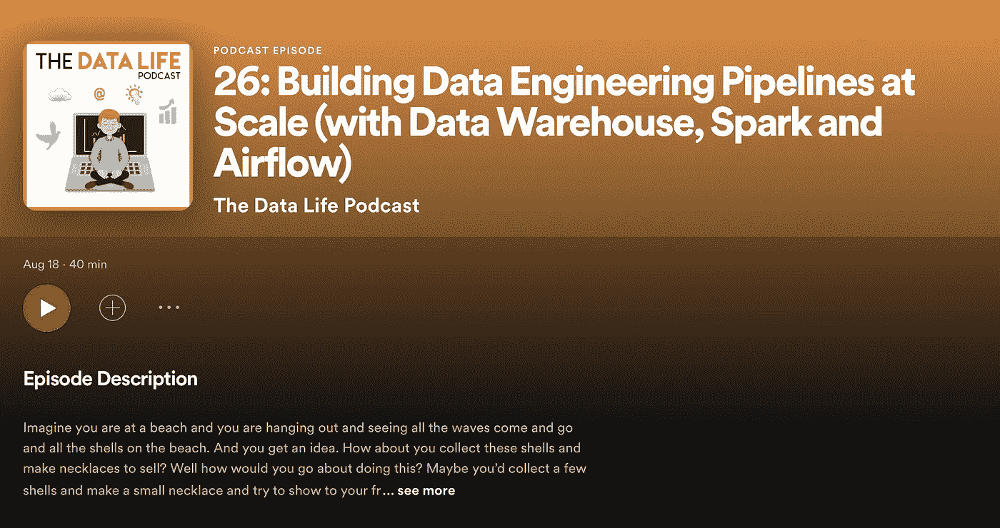

# 如何大规模构建数据工程管道

> 原文：<https://towardsdatascience.com/how-to-build-data-engineering-pipelines-at-scale-6f4dd3746e7e?source=collection_archive---------3----------------------->

## [理解大数据](https://towardsdatascience.com/tagged/making-sense-of-big-data)

## 你在海滩上，看到周围有许多贝壳。我们用这个来学习 ETL / ELT，火花，气流。

想象你在一个海滩上，你在闲逛，看着海浪来来去去，看着海滩上所有的贝壳。你会有一个想法。你收集这些贝壳做成项链去卖怎么样？

你想在海滩上用贝壳做项链。让我们从这个例子中学习数据工程的概念。[ [来源](https://unsplash.com/photos/2Jjx-btuiMY)

你会怎么做呢？也许你可以收集一些贝壳，做一条小项链，试着展示给你的朋友。这是 ETL 流程的一个示例，首先提取看起来不错的外壳/原始数据，然后进行转换，即构建一条项链，并加载到您向朋友展示的位置。如果她喜欢，你可以回来收集更多的贝壳，做更多的项链。

我们将使用这个例子来学习所有关于构建数据工程管道的知识。我发现使用一个相关的例子更容易(也更有趣！)来理解复杂的概念。

## 1.为什么是数据工程？

*创建原始数据源并获得洞察力*

互联网公司创造了大量的数据。在互联网时代，数据集变得越来越大，越来越乱，用户在网站上的所有行为和互动都有大量的数据集，包括产品描述、图片、时间序列信息、评论等。

据说数据是新的石油。对于天然石油，我们还需要一种方法来钻探和开采这种石油，使其变得有用。同样，我们需要一种方法来挖掘和理解所有这些有用的数据。

一方面，高管和管理层希望从这些数据集中获得洞察力。

数据科学家和 ML 实践者也希望有干净的数据集来建模。

当你这样做时，有一些真正有趣的权衡要做。作为一名数据科学家或处理大量数据的人工智能人员，了解这些可以帮助你。无论您处于数据之旅的哪个阶段，我想您都会对这些内容感兴趣。

## 2.ETL 与 ELT

*在海滩上制作项链，而不是先用卡车将贝壳运到仓库*

大多数公司将不同的数据源(JSONs、CSV、Parquets 等)存储在一个数据湖中。数据湖可以建立在亚马逊 S3 或谷歌云存储。它高度可用、耐用，完全由云提供商管理，而且非常便宜，非常适合您将来可能会使用或不会使用的数据集。您的数据湖中的数据就像海滩上的贝壳。我们需要将其转换并加载到干净、原始的结构中，以供高管和数据科学家使用。保持干净、原始和规范数据的地方可以是一个**数据仓库**。数据仓库还支持延迟非常低的分析查询(COUNT、SUM、GROUPBY ),因为它们以列格式存储数据——想象一下将所有事务量放在内存的同一个位置。

我们希望将数据湖中的数据转换成数据仓库中的原始规范的事实[ [来源](https://unsplash.com/photos/Hrmayke-v8g)

回到 shells 的例子。你送给你的朋友一条贝壳项链，她很喜欢。她要你现在做 1000 条项链出售。我们如何做到这一点？

你可以继续做 ETL 过程，比如在海滩上做 1000 条项链。运输最终产品。这里的缺点是，如果一条项链的外壳有问题，或者一个外壳坏了，你就必须扔掉整条项链，回到海滩，从头开始。在数据领域，这意味着如果您首先转换数据，然后将其加载到数据仓库中。有人可能会发现代码的问题或 bug 然后你不得不再次找到原始资料，从头开始。所以这是不好的，对吗？替代方案是什么？

嗯，这是 ELT。你把所有你认为可能有趣的贝壳先装上卡车，然后再做项链。如果壳牌有什么问题，你有一整卡车的壳牌在那里等着你。听起来很棒，对吧？这里的缺点是，你需要大量的**储存**，你需要这些巨型卡车将贝壳运送到你的仓库，在那里你有一个团队处理这些贝壳。

## 3.何时使用 ETL 还是 ELT

*对于敏感数据使用 ETL。当存储成本不成问题时，使用 ELT。*

ETL 基本上是把贝壳转化成项链，然后把它们装上卡车运到仓库。ELT 加载有趣的 shells，然后在仓库中进行转换。我们什么时候会使用一个而不是另一个？如果存储是个问题，ETL 更好。如今，仓库的存储成本非常低廉，存储成本通常不再是问题。使用 ETL 而不是 ELT 的一个更有效的理由是为了**敏感数据**。在贝壳的情况下，想象一下，如果一些贝壳是有毒的，我们不希望它们靠近我们的仓库，我们会想先清洗它们，加工它们，可能先只做一条项链。敏感数据也是如此——我们不希望将 **PII** 的数据加载到仓库中，以便以后进行转换。

ELT 更好的一个地方是，如果你认为你的转换会有**频繁的变化**。转换可以在任何地方进行，从填充和输入缺失数据到计算统计数据、聚合数据或其他信息。如果你认为会有变化，最好使用 ELT，这样你就可以很好地比较转换前和转换后的数据。ELT 真正大有用武之地的一个常见领域是网络分析。
您希望首先将所有的客户交互和交易加载到一个仓库中，然后再次转换它们，最后重新加载回商业智能。dbt 是一个很棒的工具，可以让你做 ELT——你可以对转换步骤的 SQL 代码进行版本控制。

## 4.使用 Spark 进行大数据处理

*支持以分布式方式处理海量数据集*

到目前为止，在你的项链生意中，我们假设只有你和几辆卡车和一个小仓库，如果人们真的喜欢你的贝壳，而你不得不加工成千上万个呢？你需要什么？你需要租用或购买几台加工机器，这些机器采用不同的外壳，并行工作来制作项链。你不会希望你的顾客等很久才收到项链。像 Spark 这样的大数据框架就是这么做的。

Spark 是一个处理**海量数据集**的框架。它让您能够以分布式方式处理大数据。它让几个工人运转起来，这些工人处理你的大数据集，所有这些都由一个驱动节点来编排。“大数据”一词在 2000 年代末/2010 年代初开始流行，Hadoop 等框架也开始流行。您可能想知道 Hadoop 与 Spark 有何不同。基本上 Spark 是 Hadoop 的更快版本，它们都在底层使用 MapReduce 技术，但 Spark 将大块数据保存在内存中，而 Hadoop 将数据作为物理文件保存在磁盘存储中。这使得火花快得多。

Spark 可以让你处理大规模的数据

Spark 可以让你对数十亿条记录进行大规模的 ETL 或 ELT，Spark 还可以从 S3 等地读取数据，并写入 S3 或数据仓库。您可以进行混合，其中一个阶段提取并加载到 S3，然后另一个阶段转换 S3 数据，估算，添加新信息，然后加载到仓库->这是 ETL 和 ELT 的组合。

Spark 还支持使用 **MLLib** 的并行机器学习算法，该算法在机器之间划分数据，并在梯度下降期间定期更新参数。这叫做*全归*术。MLLib 并不支持所有的 ML 算法，但正在慢慢赶上。

你既可以自己运行 Spark，也可以使用完全托管的服务，比如 Amazon EMR 或 Databricks。在我的另一个媒体[帖子](/moving-from-pandas-to-spark-7b0b7d956adb])中阅读更多内容。Jules Damji 的书，学习 Spark 真的很棒。

## 5.利用气流进行数据编排

你需要一个系统的方法来安排任务的顺序。

最后，当您的 shells 并行处理变成一个真正的大型操作时——您可能需要一个指挥者——一个告诉卡车应该开始移动或者处理被延迟等等的人。这个编排者可以是一个人，也可以是一个跟踪单个进程的机器人。在数据领域，这个协调器可以是定制的 cron 作业，或者类似于 **Airflow** 的东西。Airflow 允许你在一个 **DAG** 或者一个有向无环图中安排所有的事情，下一步依赖于前一步，你可以使用 cron 语句控制它们何时运行。

我们需要一种方法来协调和安排不同的任务

Airflow 需要一个地方来托管它以运行 web 服务器。亚马逊为 Apache Airflow ( [MWAA](https://aws.amazon.com/managed-workflows-for-apache-airflow/) )服务创建了托管工作流。虽然如果你在亚马逊生态系统中，只需要你上传 Dag 到 S3，这是一个很好的服务，但他们对最新气流发布的支持很慢。如果最新版本的支持对你很重要——试试[天文学家. io](https://www.astronomer.io/)——他们很棒。

您可能还想对这样一个大型系统进行监控，Airflow 可以让您进行协调，并查看哪个阶段出现了故障。但是您可能希望使用 Spark 的 Ganglia UI 来查看不同工作人员的指标——CPU 使用率、空闲内存、网络带宽等。您也可以使用 [Datadog](https://www.datadoghq.com/) 来监控这些。

## 6.存储格式和数据仓库的选择

虽然 CSV 和 JSON 对于一般的数据科学来说很棒，因为它们是人类可读的，但是对于大型数据集来说，最好使用像 Parquet、Avro 或 Delta 这样的文件格式。**拼花地板**是柱状存储类型，而 Avro 是基于行的格式。Parquet 对于大型数据集来说很常见，因为它允许您快速查询特定的列。另一个选择是使用 **Delta** 格式，它位于 Parquet 之上，但是增加了事件历史、交易日志和其他特性。你可以在 Spark 上使用其中的任何一个，并将数据存储在 S3。

您可以定期将这些数据加载到数据仓库中。数据仓库有多种选择。**红移**是面向数据仓库的 AWS 产品。 **BigQuery** 是 GCP 产品，**雪花**是另一种选择。我广泛地比较了红移和雪花，对雪花的速度和平滑程度印象深刻。它还支持按使用量付费的格式，只对查询收费。另一方面，只要实例在运行，红移就会向您收取任何费用。

您的另一个选择是最近的 **lakehouse** 架构，它将数据湖和数据仓库合并到一个地方。Delta Lake 是 Databricks 提供的一个这样的产品，它在底层处理 Delta 存储格式，并提供一种像仓库一样查询数据的方法。

## 摘要

可以构建 ETL 管道，从数据湖(S3)处理原始数据并在 Spark 中转换，然后加载到数据仓库(如雪花或红移),然后为 BI 工具(如 Tableau 或 Looker 或 PowerBI)提供动力。这符合管理者希望做出数据驱动决策的用例。

您也可以首先从仓库内不同的来源收集数据，然后使用 Spark 转换这些大型数据集，将它们加载到 S3 的 Parquet 文件中，然后从 SageMaker 读取它们，以防您更喜欢使用 SageMaker 而不是 Spark 的 MLLib。这符合数据科学家/ ML 工程师的用例。

我们学到了什么？
1。我们从几个 shells 和一条项链开始，来理解 ETL 和 ELT 之间的权衡。在海滩上制作项链，而不是先用卡车把贝壳运到仓库。
2。我们扩大了运营规模，了解了 Spark 的使用案例。
3。我们用气流这样的管弦乐器把一切都连接起来。

这篇关于理解数据工程管道的博文到此结束。感谢您到目前为止的阅读，如有任何问题或评论，请通过 [LinkedIn](https://www.linkedin.com/in/sanketgupta107/) 联系我！

**P.S —查看我的播客** [**第一集**](https://open.spotify.com/episode/4FzmyNVEpdn1pxyjQ9j5fJ) **！我将更详细地介绍数据仓库选择、OLAP 与 OLTP 等。**

同一主题的播客插曲:[https://open.spotify.com/episode/4FzmyNVEpdn1pxyjQ9j5fJ](https://open.spotify.com/episode/4FzmyNVEpdn1pxyjQ9j5fJ)