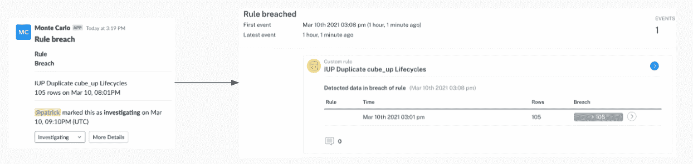
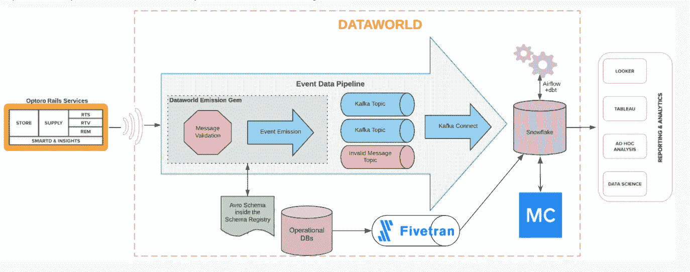
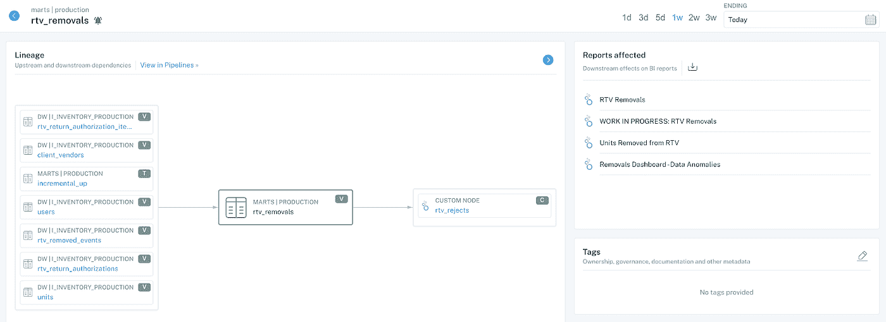

# 如何大规模建立数据信任和所有权

> 原文：<https://towardsdatascience.com/how-to-build-data-trust-and-ownership-at-scale-bf84ceab41c1?source=collection_archive---------25----------------------->

## 个案研究

## 物流公司 Optoro 通过自助式数据质量和所有权方法每周节省 44 个小时。以下是方法。

图片由 [Unsplash](http://www.unsplash.com) 上的 [Marcin Jozwiak](https://unsplash.com/photos/kGoPcmpPT7c) 提供。

*当你的客户第一个知道数据出错时，他们对你的数据和你的公司的信任就会受损。了解物流公司 Optoro 的数据工程团队如何直面这一挑战，通过大规模数据可观察性重获信任和宝贵时间。*

总部位于 DC 华盛顿州的 Optoro 有一个令人钦佩的使命:通过消除退货中的所有浪费，使零售更具可持续性。他们为宜家、塔吉特(Target)和百思买(Best Buy)等领先零售商提供退货技术和物流，帮助提高盈利能力，同时通过重新推荐或为退货寻找“下一个最好的家”来减少环境浪费。

在 Fivetran 的[数据工程师答谢日](http://www.dataengineerappreciationday.com/)期间，我最近有机会与 Optoro 的首席数据工程师 Patrick Campbell 聊天。我们深入探讨了 Optoro 的数据团队和技术堆栈、他们面临的挑战，以及 [**数据可观察性**](/data-observability-the-next-frontier-of-data-engineering-f780feb874b) 如何帮助他们实现构建更可持续的零售行业的使命。

## Optoro 的数据环境

表面上，Optoro 为零售商重新安排退货或未售出的商品。但是除了运送大量的商品，Optoro 真正的业务是运送数据。很多数据。

Patrick 说:“我们的技术平台将每一件物品都连接到它的下一个最好的家。“可以想象，当我们通过我们的系统发送退货库存时，该系统会创建许多关键任务数据点。”

Optoro 的数据工程团队最近转移到工程组织下，以便更有效地与技术和产品团队合作，但他们自然会与数据质量、数据科学和数据分析团队合作。Optoro 还有许多内部和外部的数据消费者，他们通过 Looker 仪表盘访问数据。但它并不总是可靠的。

## 挑战:数据完整性

> “我们需要深入了解我们数据的质量，简单明了，”Patrick 说。“我们没有一个好的方法来了解数据何时可能丢失，何时可能过时，或者数据是否不是我们预期的那样。”

这意味着当数据问题发生时，客户(而不是 Optoro 的数据团队)往往是第一个知道的。这将导致客户不满，并阻止 Optoro 提供有关其软件管理的库存的可靠信息。

## 解决方案:数据可观察性

一个警报工作流向 Patrick 的团队通知了由配送问题触发的特定仓库中的异常情况。图片由 Optoro 提供。

Patrick 的团队需要在客户和不良数据之间找到平衡点，他们有两个选择:构建或购买。Patrick 考虑使用 dbt 构建定制的 SQL 完整性检查，但他知道由于资源有限，他的团队只能部分覆盖 Optoro 的许多管道，这将长期增加数据工程团队已经很大的工作量。

相反，他们选择创建一个概念验证，以了解他们在解决数据质量问题方面能取得多大进展。数据可观测性使用机器学习来推断和学习数据的样子，识别数据质量问题，并在出现问题时通知正确的团队成员。

概念验证要求 Optoro 能够实现以下目标:

*   过时数据产品警报
*   对大型管道更改(如模式更改)发出警报
*   当操作数据库安全地进行故障转移时，提供不间断的监控和警报
*   基于预期的数据行为自动生成规则
*   能够编写自定义警报 SQL 检查以监控特定用例。

这些成果将帮助 Patrick 的团队实现他们的最终目标，即防止数据质量问题对客户体验产生负面影响。

Optoro 的数据平台利用雪花仓库、Fivetran 进行集成、dbt 进行转换、Monte Carlo 进行数据观察，以及 Looker 进行分析。图片由 Optoro 提供。

POC 实现了它的目标。Patrick 和他的团队开始全面整合该平台，将它与 Snowflake、Fivetran、dbt 等一起放在 Optoro 的数据堆栈中。

从接收、转换到 BI 报告，这些工具协同工作，蒙特卡罗在数据生命周期的每个阶段都密切关注。

## 结果:通过沿袭获得可信数据

数据可观察性让 Patrick 的团队可以跨数据资产绘制端到端的谱系图，甚至可以在 Looker 中绘制到字段级别。图片由 Optoro 提供。

随着监控和警报的到位，Patrick 和他的团队现在是第一个知道数据丢失或管道中断的人。当收到警报时，数据工程师可以更快地解决问题，这得益于自动化的沿袭数据可观察性。

“我们可以看到受影响的数据源，从内部数据集市一直到我们面向客户的 Looker 报告，”Patrick 说。“能够快速识别客户面临的问题并积极主动是建立对我们数据信任的关键。这个特性使数据工程师的工作变得更加容易——我可以从这里的经验明确地告诉你。"

对于 Optoro 的数据工程师来说，拥有不需要任何手动映射或更新的端到端全自动数据血统是 Patrick 最喜欢的平台部分之一。

> Patrick 说:“数据可观察性能够建立这种血统本身就很了不起。“在构建上游和下游依赖关系方面，我们的数据团队几乎不需要任何投入。”

**结果:数据团队节省时间并加快速度**

Optoro 数据工程团队还估计，数据可观测性为他们每个工程师每周节省了至少四个小时的支持时间来调查不良数据。对于一个 11 人以上的数据工程团队来说，这相当于**每周 44 小时**。

而且，由于所有数据团队(不仅仅是工程师)现在都可以访问自助监控和警报、数据目录视图和沿袭，Patrick 报告说，其他数据团队正在逐步接管更多数据所有权，并在他们交付的产品中承担更多责任。

“这不仅是数据工程在试图追踪大海捞针问题方面的巨大胜利，还帮助我们使其他数据团队能够帮助我们保持对我们数据的信任，”Patrick 说。

> “建立这些框架使数据工程不再是这些情况下的中间人或女人……数据完整性确实应该是自助服务。您的数据工程师会感谢您的。”

***好奇数据可观察性如何帮助你的团队建立信任和节省时间？伸出手去*** [***巴尔摩西***](https://www.linkedin.com/in/barrmoses/) ***和*** [***蒙特卡洛团队***](http://www.montecarlodata.com) ***了解更多！***