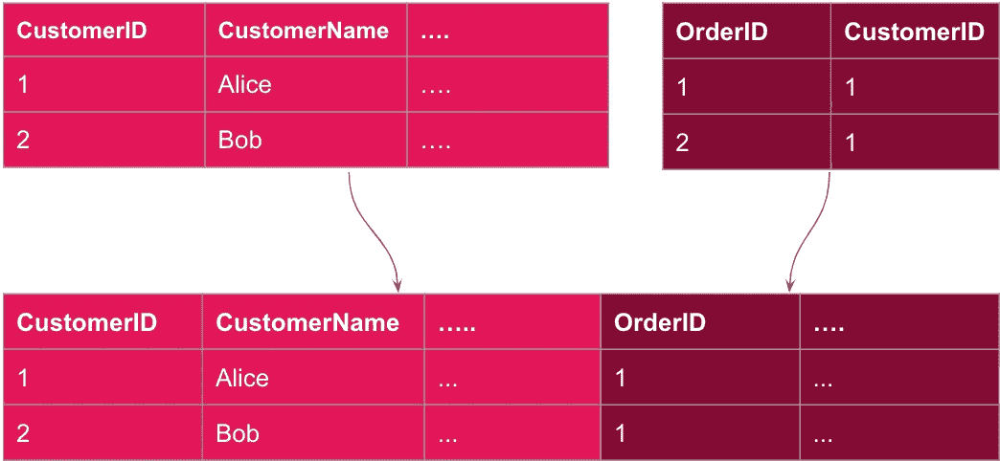
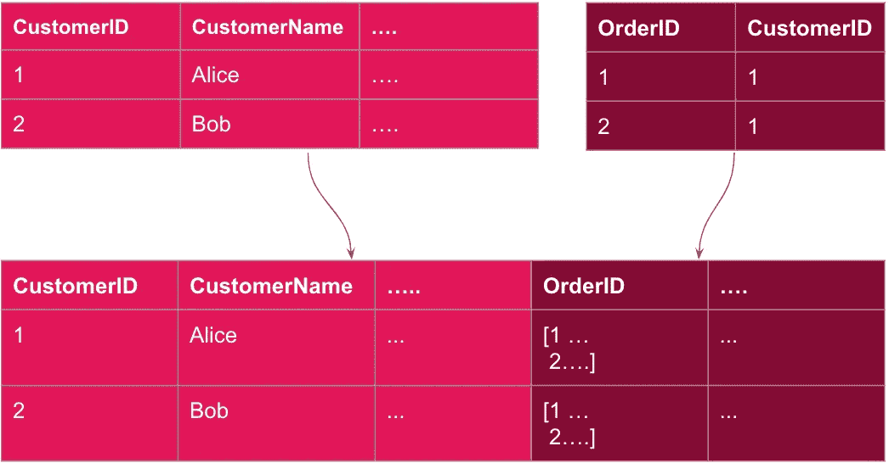

# 如何在 BigQuery 中构建高效的数据结构

> 原文：<https://towardsdatascience.com/how-to-build-efficient-and-perfomant-data-structures-in-bigquery-7981203b8a62?source=collection_archive---------20----------------------->

## 使用反规范化和嵌套数据的方法

[李中清](https://unsplash.com/@picsbyjameslee?utm_source=unsplash&utm_medium=referral&utm_content=creditCopyText)在 [Unsplash](https://unsplash.com/s/photos/pine?utm_source=unsplash&utm_medium=referral&utm_content=creditCopyText) 上拍照

BigQuery 是一个完全托管的、无服务器的数据仓库，位于谷歌云平台基础设施上，提供可扩展的、经济高效的、快速的 Pb 级数据分析。它是支持使用标准 SQL 查询的服务软件。在本文中，我想提到两种主要的技术来使您的 BigQuery 数据仓库变得高效和高性能[1]。

## 前方有些理论

**SQL vs NoSQL** : SQL 数据库是基于表格的数据库，而 NoSQL 数据库可以是基于文档、键值对和图形的数据库。SQL 数据库是垂直可伸缩的，而 NoSQL 数据库是水平可伸缩的。SQL 数据库有一个预定义的模式，而 NoSQL 数据库对非结构化数据使用动态模式[2]。

**基于行和基于列的数据库**:行结构的数据库将属于特定表行的数据存储在相同的物理位置。著名的例子是 MySQL 和 MSSQL 数据库。面向列的数据库与最常见的面向行的数据库形成对比。与面向行的数据库不同，它们不存储彼此相邻的单个行，而是存储列。这种形式的存储对于涉及大量数据的分析过程特别有用，因为聚合函数通常必须针对各个列进行计算。众所周知的例子有 HBase、MongoDB 或 Google BigQuery。

现在，我们来看下两个重要的理论术语: **OLTP 和 OLAP** 。在线事务处理(OLTP)实时捕获、存储和处理来自事务的数据。而在线分析处理(OLAP)使用复杂的查询来分析来自 OLTP 系统的汇总历史数据。与行结构数据库相比，列数据库存在以下问题:

*   具体化整行的开销很大。如果您想执行与 select * from 等效的操作，那么您必须对所有列索引执行一次联接来获取值。
*   虽然插入很简单，但是更新和删除操作很复杂。

出于上述原因，真正的列数据库主要用于数据仓库、分析和其他归档类型的数据存储，而行结构数据库通常更适合 OLTP 工作负载。

## 那现在怎么办？

这一次，介绍基本的理论背景对我来说很重要。因为你要知道 BigQuery 最能被描述为一个混合系统。这绝对是一个基于色谱柱的系统，因此更适合用于分析目的。这对于理解为什么数据应该反规格化也很重要——稍后会详细介绍。此外，BigQuery 与标准 SQL 数据仓库非常相似，因为它可以使用标准 SQL 进行查询，并且更多地充当来自 OLTP 系统的数据(而不是图像数据等)的存储库，但另一方面允许存储嵌套的数据结构。所以 BigQuery 才能真正称得上混合。

## 非规范化数据

以下部分将描述整个过程背后的技术部分。首先，人们必须考虑如何构建他们的最佳数据模式。数据工程师不应该采用或重新开发传统的星型或雪花型模式，而应该考虑相反的情况，即反规范化。如前所述，数据通常来自 OLTP 系统并被规范化。在 BigQuery 中，数据应该再次反规范化。这里有一个小的基本例子:

非规范化-作者图片

简单地说，您应该在您的 ETL/ELT 过程中连接在内容上属于一起的表，并将它们保存为一个新表。视图上的连接理论上也是可行的，但是存储的表——例如在一天的转换步骤中更新一次——性能更好。因此，在上面的示例中，您可以将客户数据与销售数据连接起来，并将其保存为一个新对象。这里的挑战是还要在后台处理业务流程，以便能够找到有意义的新数据对象，并尽可能减少后续数据分析过程中出现的连接和转换。

## 嵌套数据

反规范化过程的下一步是将销售额打包(如果需要的话)到嵌套结构中。如果你问自己什么是嵌套数据——简而言之:BigQuery 支持从支持基于对象的模式的源格式(例如 JSON)加载和查询嵌套和循环数据。这些列可以保持关系，而不会像关系模式或规范化模式那样降低性能[3]。

嵌套和重复数据的图示-按作者分类的图像

地址列包含一个值数组。数组中的不同地址是重复出现的数据。每个地址中的不同字段是嵌套数据。点击了解更多信息[。因此，在上面显示的关于客户和销售数据的示例中，将产生以下数据结构:](/how-to-work-with-nested-data-in-bigquery-84f15646b0b1)

非规范化和嵌套数据-按作者分类的图像

## 摘要

为了在 BigQuery 中构建尽可能高效和高性能的数据结构，数据工程师应该研究技术背景，实现反规范化和嵌套数据这两个核心概念。在我看来，关键不在于技术知识，而在于业务流程知识。在这里，你必须和企业一起发明有意义的数据模型。一旦实现了这一点，在进一步的过程中，例如在报告或分析中，需要的工作就会少得多，并且查询可能也会更快。使查询更有效的另一种可能性是像分区和聚类这样的技术。这些也是从经典数据库中得知的。在这里，我推荐来自 Google 的好的[文档](https://cloud.google.com/bigquery/docs/clustered-tables?hl=en)【4】。

## 资料来源和进一步阅读

[1]谷歌，[，BigQuery](https://cloud.google.com/bigquery?hl=de) (2021)

[2]伊奥诺斯，[NoSQL-NoSQL-达滕班肯](https://www.ionos.de/digitalguide/hosting/hosting-technik/nosql/) (2019)

[3] Google，[指定嵌套和重复的列](https://cloud.google.com/bigquery/docs/nested-repeated?hl=en) (2021)

[4]谷歌，[聚簇表介绍](https://cloud.google.com/bigquery/docs/clustered-tables?hl=en) (2021)