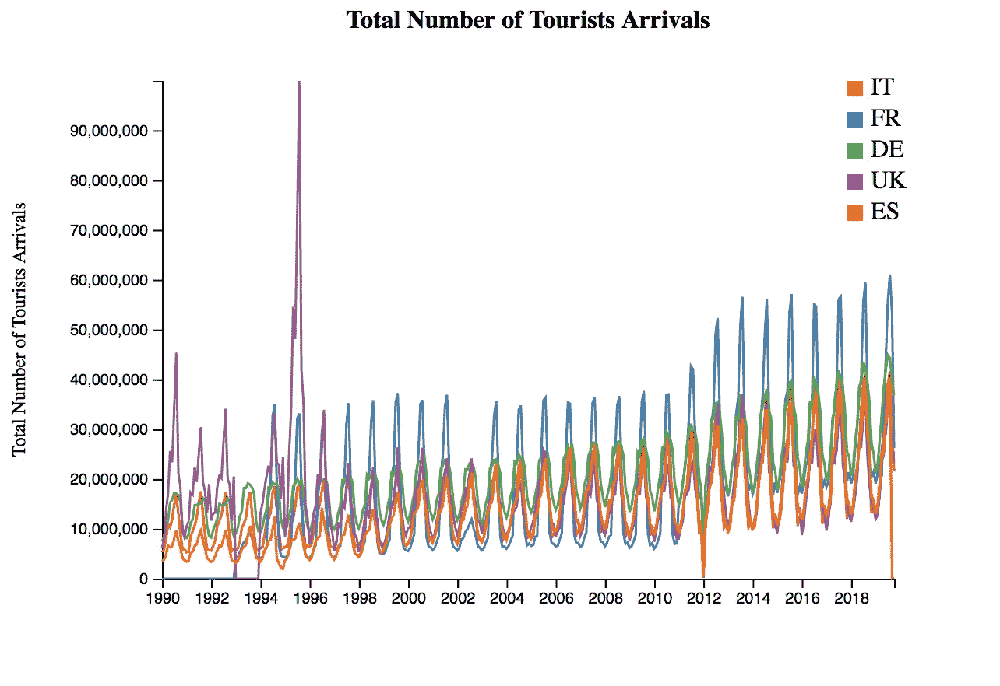
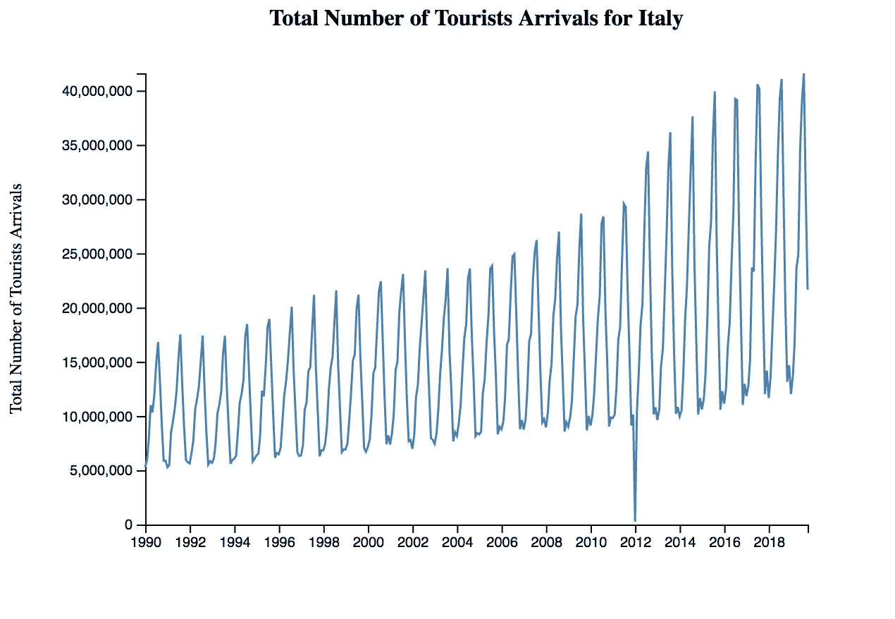
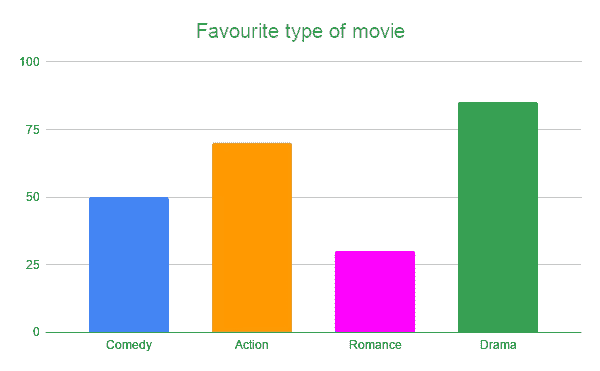
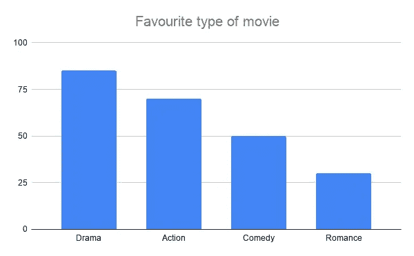
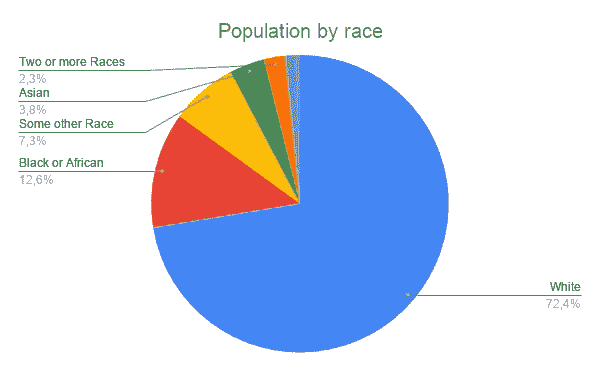
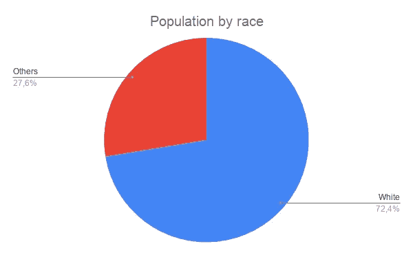

# 如何为数据科学构建高影响力的图表

> 原文：<https://towardsdatascience.com/how-to-build-high-impact-graphs-for-data-science-55ce19d1ab32?source=collection_archive---------44----------------------->

## 数据科学讨论

## 提高数据可视化技能的一些技巧。

图片由[皮克斯拜](https://pixabay.com/?utm_source=link-attribution&utm_medium=referral&utm_campaign=image&utm_content=3750134)的 Gerd Altmann 提供

无论是使用 D3.js 还是其他可视化工具，构建一个图表都是一项非常有趣的任务。你可以挑选，合并和组合你的数据，以获得非常令人印象深刻的图表。你甚至可以构建非常复杂的图表，概括百万个数据。然而，也许，你已经浪费了你的时间。

> 关键是你在图表中放了多少数据并不重要，重要的是它们有多有意义。

在开始画一个图形之前，你要问这个问题: ***我的图形想传达什么？*** 而且，你画完之后，你应该再问一个问题: ***我可以简化我的图形吗？哪些信息是不需要的，因此可以从我的图表中删除？***

事实上，你的图表应该满足以下几点:

*   **专注于某个特定的主题。不要试图说出图表中的所有内容。相反，你应该试着描述一个概念；如果有必要，建立一个以上的图表，解释更多的概念；**
*   **简单，**这样你想描述的东西就一目了然了。一个简单的图形是清晰的，不需要人脑的进一步处理。把复杂的荣耀留给其他东西。
*   **人人可读****，**这样你的信息就能被各种各样的人理解。越多的人理解你的图表，你的图表的影响力就越大。

用一句话概括我到目前为止所说的话，我可以说:

> 用简单的方式描述一个概念，让每个人都能读懂。

在本文的剩余部分，我将尝试说明一些构建图表的好方法和坏方法。我关注三种类型的图表:

*   折线图
*   条形图
*   饼图。

# 折线图

折线图是用来表示某些数值随时间变化的趋势的经典图形。在 x 轴上，图表代表时间，在 y 轴上代表数值。

通常，折线图用于比较一段时间内的一些不同值。下图展示了一个糟糕的折线图示例，它试图比较五个不同国家的游客总数。

作者图片

这个图因为各种原因很不清晰。首先，使用的颜色重叠，因此很难区分它(意大利)和 ES(西班牙)。第二，几乎所有国家的趋势线都很相似，除了 FR(法国)和 UK(英国)直到 1996 年。因此，下面的问题出现了:图形想要传达什么？法国和其他国家的区别？英国到 1996 年的峰值？在第一种情况下，绘制法国趋势线并计算其他国家的平均值就足够了。在第二种情况下，只画出英国的趋势线就足够了。

接下来的图反而满足了所有三个标准:集中、简单和可读。

作者图片

# 条形图

条形图用于表示分类数据。以下示例显示了一个糟糕的条形图示例。

作者图片

在这张图表中，不同的颜色没有用，它们只会分散读者的注意力。此外，酒吧是没有排序的，因此读者必须处理数据，以提取最喜欢的电影。

在构建条形图时，尽量对所有的条形图使用单一颜色，并根据你想要传达的内容进行升序或降序排列。如果你有很多横杠，你可以用单杠。

以下示例通过仅使用一种颜色并按降序对值进行排序来转换上一个条形图:

作者图片

它立即变得清晰，不需要读者进行任何进一步的处理。

# 圆形分格统计图表

饼图用来表示某事物占总数的百分比。在绘制饼状图时，你应该想到八十年代著名的视频游戏*【吃豆人】*，在某种意义上，该图应该代表两个部分，最多三个部分。否则，图形变得不可读。

以下示例显示了一个糟糕的饼图:

图形想传达什么？白人的比例最高？在这种情况下，您可以简单地绘制白色和*其他*，以指示所有其他类别。无论如何，如果要表示的切片数大于 2 或 3，请使用另一种类型的图形。

下面的图表显示了以前的饼图的转变，它变成了一个非常集中、简单和可读的饼图。这个图现在看起来像(一个反)吃豆人。

作者图片

# 摘要

在这篇简短的教程中，我描述了一些构建高影响力图表的标准。每张图表都应该满足以下三个方面:重点突出、简单易读。

另外，在构建一个图之前，你要想好你的图的用途。你选择的图表类型能够代表你的想法吗？

如果你想了解我的研究和其他活动的最新情况，你可以在 [Twitter](https://twitter.com/alod83) 、 [Youtube](https://www.youtube.com/channel/UC4O8-FtQqGIsgDW_ytXIWOg?view_as=subscriber) 和 [Github](https://github.com/alod83) 上关注我。

# 相关文章

</how-to-build-a-narrative-from-data-85e327940c13>  </ipyvizzu-a-fast-library-to-build-charts-animations-in-python-126c100522c5>  </can-context-analysis-help-extract-meaningful-insights-178a21a88e9f>  

# 我们能说数据科学家是数据记者吗？

几年前，我的老板让我帮他准备一门关于数据新闻的大学课程，当时我们正在上另一门关于网页设计的课程。为什么要从网页设计转向数据新闻？

起初，我对这个提议感到困惑，不知道我的老板在打什么主意，但最终，我意识到他是对的。

我开始问谷歌什么是数据新闻，事实上，我没有找到这么多。经过一番搜索，我想到了这个有趣的网站。我读了一些材料，我确信数据新闻与数据科学非常相似。**但是我错了**。

在这里继续阅读。

# 保持联系！

*   在[媒体](https://medium.com/@alod83?source=about_page-------------------------------------)上跟随我
*   注册我的[简讯](https://medium.com/subscribe?source=about_page-------------------------------------)
*   在 [LinkedIn](https://www.linkedin.com/in/angelicaloduca/?source=about_page-------------------------------------) 上连接
*   在推特上关注我
*   跟着我上[脸书](https://www.facebook.com/alod83?source=about_page-------------------------------------)
*   在 Github 上关注我