# 如何使用 SQL 建立机器学习模型

> 原文：<https://towardsdatascience.com/how-to-build-ml-model-using-bigquery-eced0107e4fd?source=collection_archive---------40----------------------->

## BigQuery 中的机器学习和预测建模

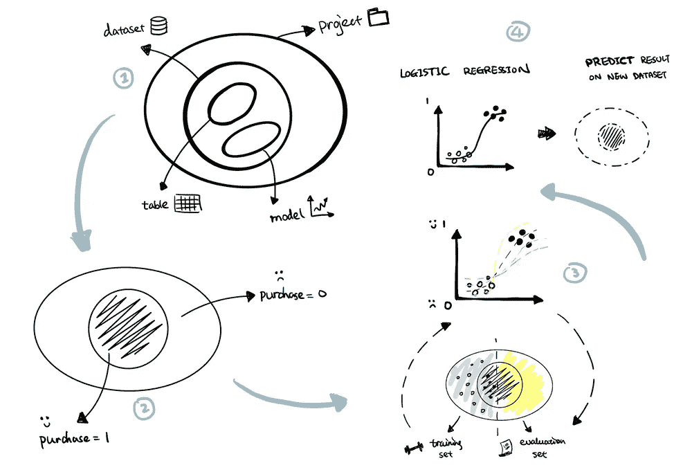

[如何使用 BigQuery 建立 ML 模型](https://www.visual-design.net/post/how-to-build-ml-model-using-bigquery) —图片作者

而踏入机器学习领域的第一步，又是那么容易被各种复杂的算法和丑陋的符号淹没。因此，希望这篇文章能够通过提供一个初学者友好的指南来降低入门门槛。让你通过使用 BigQuery 和 SQL 构建自己的 ML 模型获得成就感。没错，我们可以用 SQL 来实现机器学习。如果你正在寻找几行代码来染指 ML 领域，请继续阅读:)

# **1。建立基本结构**📁

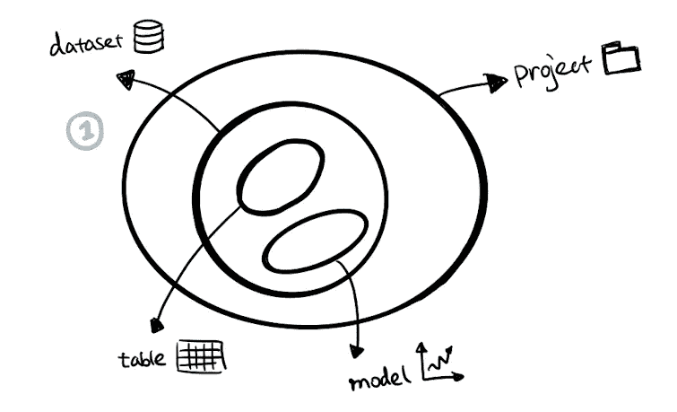

BigQuery 基本结构—作者图片

简单地说， **BigQuery 项目包含数据集，数据集包含表和模型。**

按照以下步骤，使用 Google 公共数据集建立一个项目——“Google 分析示例”。如果您熟悉这个过程，可以直接跳到本文的第二部分。

1)导航到 Google Cloud Platform 控制台左侧边栏中的 BigQuery，然后在 Google Cloud Platform 中创建一个项目，将其命名为您想要的任何名称(例如本例中的“project”)

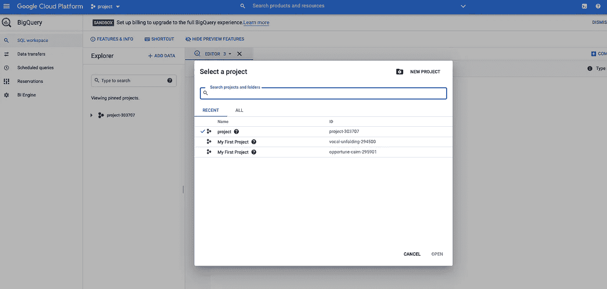

创建项目-按作者分类的图像

2)在“SQL Workspace”面板中，选择您的项目，然后单击“Create Dataset”并为您的数据集命名(如 analytics)。


按作者创建数据集-图像

3)点击“添加数据”并选择“浏览公共数据集”。从公共数据集库中，搜索 google analytics 示例并将其添加到您的项目中。如果感兴趣，请阅读 [Google Analytics 示例模式](https://support.google.com/analytics/answer/3437719?hl=en)。

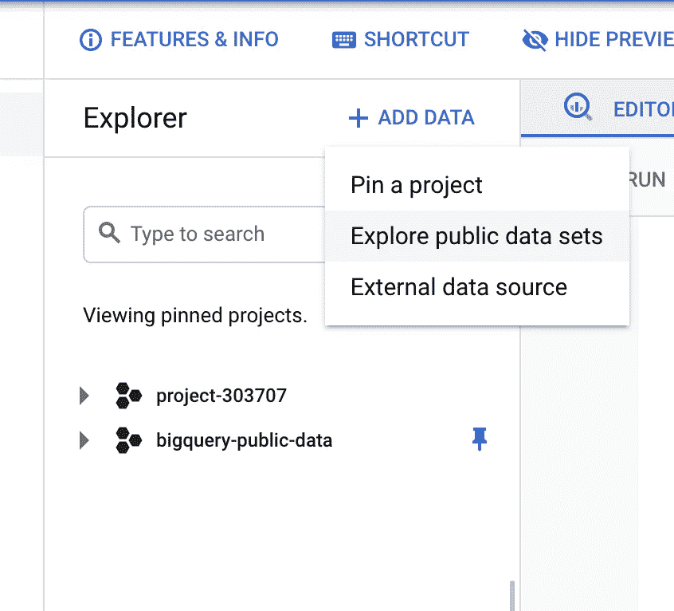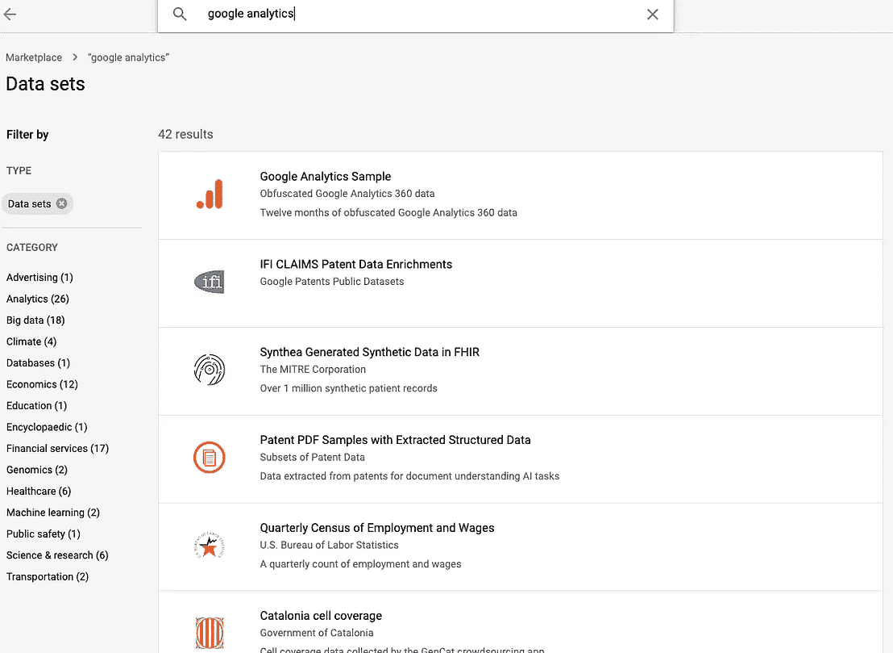

添加 Google Analytics 样本数据集-按作者分类的图片

4)通过导航到“bigquery-public-data”中的“ga_sessions_”来浏览数据集，并选择“Preview”选项卡。这是一个大规模数据集，具有多个列和按日期划分的子集集合(例如，下面的示例中的“2017–08–01”)。注意，数据集位于项目“bigquery-public-data”中，而不是我们自己的项目“project-303707”中，但是我们仍然可以从我们的项目中查询这个数据集，因为它是可公开访问的。

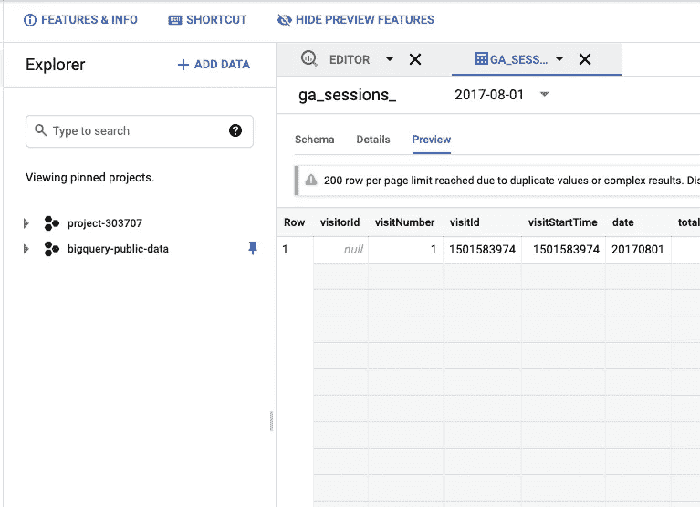

预览数据集-按作者分类的图像

# **2。你有什么问题🤨？**

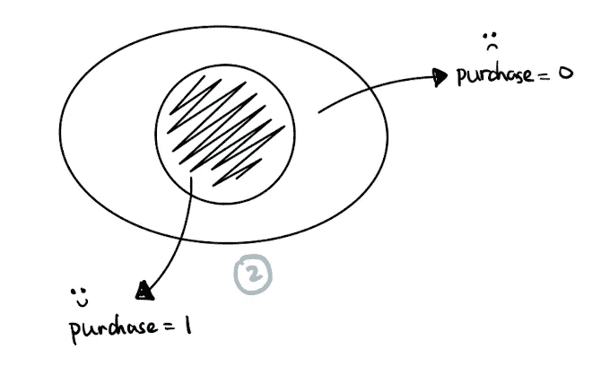

识别问题-作者图片

在开始构建模型之前，通过询问以下问题来澄清我们试图解决的问题:

**1)什么是标签？**

标签是要预测的变量。在这个例子中，我将预测网站访问者是否会进行任何交易，我将这个标签命名为“购买”。这可以从现有变量“totals.transactions”中导出。

**2)标签值是如何定义的？**

为简单起见，我们把这个预测做成非黑即白的情况，要么“购买”，要么“不购买”。由于模型训练不能将字符串值作为输出结果处理，因此有必要将它们编码为数字。

可以使用 SQL 中的 IF 语句定义该标准:

```
IF(totals.transactions > 0, 1, 0) as purchase
```

**3)有哪些特征/预测因素？**

预测值是选择用来预测标注的特征。对于这个简单的模型，选择*、【总计.浏览量】、【设备. isMobile】、【总计.时间现场】*作为预测器。让我们看看它们是否真的是估计购买机会的良好预测指标。

我们已经知道了什么？我们试图预测什么？

我们使用已知的数据来建立模型。在这个练习中，我从谷歌分析数据集中选择了一系列日期在 2017 年 1 月 1 日和 2017 年 7 月 1 日之间的子集。根据“totals.transactions”值，我们已经知道这些记录是否进行了购买。

我选择了 2017 年 7 月 1 日至 2017 年 8 月 1 日的子集作为预测集。尽管我们已经从数据中知道他们是否进行了任何交易。但是为了便于说明，让我们假设我们只知道预测器，并使用它们来预测标签。

我们应该选择什么类型的模型？

机器学习中有两大类问题:分类和回归。分类问题是预测分类数据(例如真/假、猫/狗)，而回归问题是预测具有连续数量的数值数据(例如温度、收入等)。由于标签“购买”被设计为一个具有离散值(1 或 0)的类别，这是一个分类问题。逻辑回归、决策树、支持向量机是解决分类问题的常用模型。我选择逻辑回归，因为它最容易开始，而且它也受 BigQuery ML 支持。

# **3。建立模型**📊

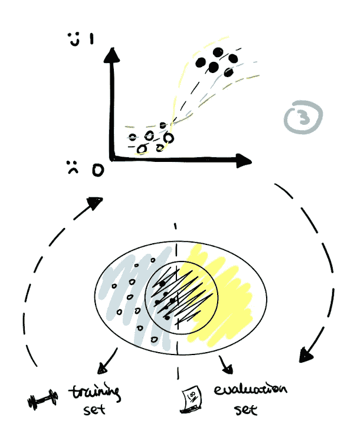

建立模型—作者的图像

在 BigQuery 中构建 ML 模型分为训练数据集和评估数据集。

> **训练数据集:用于创建模型的样本数据子集。**
> 
> **评估数据集:用于评估模型性能的样本数据子集。**

在本例中，日期从“2017–01–01”到“2017–05–01”的数据子集用于训练，而“2017–05–01”到“2017–07–01”用于评估。

**1)训练模型**

```
CREATE OR REPLACE MODEL `analytics.my_model`
OPTIONS 
(
  model_type = "logistic_reg",
  labels = ['purchase']
)
ASSELECT * 
EXCEPT(fullvisitorid)
FROM
(SELECT fullvisitorid,
  IFNULL(totals.pageviews, 0) AS page,
  IFNULL(totals.timeonsite, 0) AS duration,
  CASE 
    WHEN device.isMobile is True THEN 1
    ELSE 0
  END mobile
FROM `bigquery-public-data.google_analytics_sample.ga_sessions_*`
WHERE _TABLE_SUFFIX BETWEEN "20170101" AND "20170501"
)JOIN
(SELECT fullvisitorid, 
  IF(totals.transactions > 0, 1, 0) as purchase
  FROM `bigquery-public-data.google_analytics_sample.ga_sessions_*`
) target 
USING (fullvisitorid)
```

让我们将这段代码分成几个部分:

```
CREATE OR REPLACE MODEL `analytics.my_model`
OPTIONS 
(
  model_type = "logistic_reg",
  labels = ['purchase']
)
AS
```

第一部分通过传递三个参数在“分析”数据集中创建模型“my_model ”:

*   **带有数据集前缀的模型名称**:analytics . my _ Model
*   **模型类型:**“logistic _ reg”代表 [logistic 回归模型](https://machinelearningmastery.com/logistic-regression-for-machine-learning/)
*   **标签:**“购买”，这是我们预测的变量

如果您想学习如何使用 Python 构建逻辑回归模型，本文可能会有所帮助:

[](/simple-logistic-regression-using-python-scikit-learn-86bf984f61f1) [## 使用 Python scikit 的简单逻辑回归-学习

### 从数据预处理到模型评估的逐步指南

towardsdatascience.com](/simple-logistic-regression-using-python-scikit-learn-86bf984f61f1) 

“AS”关键字之后的第二部分指定了训练数据集:

```
SELECT * 
EXCEPT(fullvisitorid)
FROM
(SELECT fullvisitorid,
  IFNULL(totals.pageviews, 0) AS page,
  IFNULL(totals.timeonsite, 0) AS duration,
  CASE 
    WHEN device.isMobile is True THEN 1
    ELSE 0
  END mobile
FROM `bigquery-public-data.google_analytics_sample.ga_sessions_*`
WHERE _TABLE_SUFFIX BETWEEN "20170101" AND "20170501"
)JOIN
(SELECT fullvisitorid, 
  IF(totals.transactions > 0, 1, 0) as purchase
  FROM `bigquery-public-data.google_analytics_sample.ga_sessions_*`
) target 
USING (fullvisitorid)
```

我们在这里将两个表连接在一起，第一个表选择在此场景中用作预测器的所有特征:

*   **"totals.pageviews":** 表示会话内的页面浏览量，然后应用 IFNULL 函数将空值替换为 0
*   **"totals.timeonsite":** 表示在会话中花费的时间，然后应用 IFNULL 函数将空值替换为 0
*   **"device.isMobile":** 表示访问者是否使用移动设备，然后应用 CASE 函数将布尔值(真或假)转换为数值(1 或 0)

关键字“_TABLE_SUFFIX”用于过滤数据集，以便只包括“ga_session”的训练子集(2017–01–01”到“2017–05–01”)。

然后，我们将包含预测值的第一个表与包含每个访问者的“购买”标签的第二个表连接起来，该标签由语句`IF(totals.transactions > 0, 1, 0).`定义

然后我们**使用语句`SELECT * EXCEPT(fullvisitorid) FROM …`将 fullvisitorid** 从连接表中排除，因为 id 对购买预测没有贡献。

在 query composer 面板中运行训练语句后，我们将能够看到“my_model”出现在“analytics”数据集中。

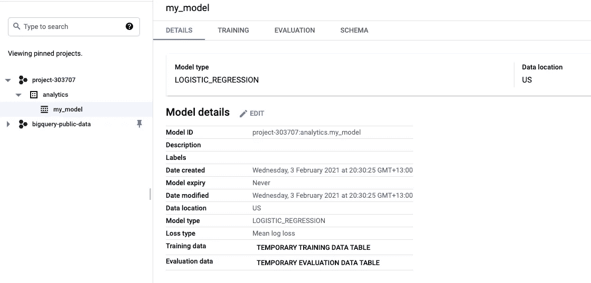

模型细节-作者提供的图片

**2)评估模型**

```
SELECT 
    roc_auc
FROM ML.EVALUATE(MODEL analytics.my_model, 

(
    SELECT * 
    EXCEPT(fullvisitorid)
    FROM
    (SELECT fullvisitorid,
    IFNULL(totals.pageviews, 0) AS page,
    IFNULL(totals.timeonsite, 0) AS duration,
    CASE 
        WHEN device.isMobile is True THEN 1
        ELSE 0
    END mobile
    FROM `bigquery-public-data.google_analytics_sample.ga_sessions_*`
    WHERE _TABLE_SUFFIX BETWEEN "20170501" AND "20170701"
    )

    JOIN
    (SELECT fullvisitorid, 
    IF(totals.transactions > 0, 1, 0) as purchase
    FROM `bigquery-public-data.google_analytics_sample.ga_sessions_*`
    ) target 
    USING (fullvisitorid)
));
```

这可以分为两层。

```
-- outer layer
SELECT roc_auc
FROM ML.EVALUATE(...)
```

外层是从 ML 返回的结果中选择度量。评估子句。在这种情况下，只选择了“roc_auc ”,但我们也可以使用“SELECT *”来获得其他常用的度量来评估分类模型，如精度、召回率、准确度、f1_score 和 log_loss。

```
-- inner layer
MODEL analytics.my_model, 
(
	SELECT * 
	    EXCEPT(fullvisitorid)
	    FROM
	    (SELECT fullvisitorid,
	    IFNULL(totals.pageviews, 0) AS page,
	    IFNULL(totals.timeonsite, 0) AS duration,
	    CASE 
	        WHEN device.isMobile is True THEN 1
	        ELSE 0
	    END mobile
	    FROM `bigquery-public-data.google_analytics_sample.ga_sessions_*`
	    WHERE _TABLE_SUFFIX BETWEEN "20170501" AND "20170701"
	    )

	    JOIN
	    (SELECT fullvisitorid, 
	    IF(totals.transactions > 0, 1, 0) as purchase
	    FROM `bigquery-public-data.google_analytics_sample.ga_sessions_*`
	    ) target 
	    USING (fullvisitorid)
)
```

内层是传递模型“analytics.my_model”和评估数据集作为这个 EVALUATE 函数的参数。正如我们所看到的，评估数据集几乎与训练数据集的定义相同，只是 _TABLE_SUFFIX 已被更改为另一组介于“20170501”和“2017070”之间的数据范围。

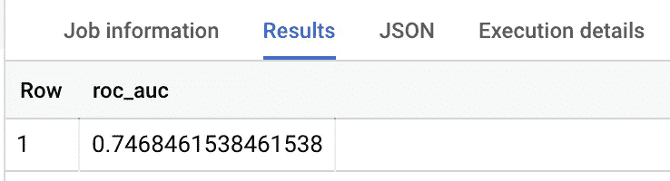

评估结果—作者提供的图片

代码返回的 roc_auc 值为 0.75。以这个数值，只能说这是一款还过得去但还不够好的车型。有许多方法可以提高它的性能，例如，通过引入更多信息的特征作为预测因子来更深入地进行特征选择。我鼓励你想一想，还有哪些属性可能有助于“购买”的预测。尝试实施它并达到更高的 roc_auc 分数。可以把它看作是一个不断测试模型性能并对其进行改进的迭代过程，直到它达到一个最优值(例如 roc_auc > 0.9)。

如果你想到任何提高分数的方法，请在下面随意评论。

# **4。做预测📈**

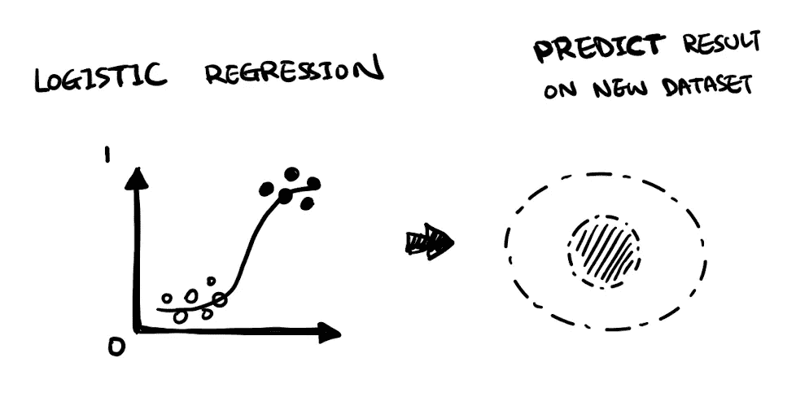

进行预测-按作者分类的图像

将下面的预测语句与训练或评估语句进行比较，有一个明显的区别，即只选择了预测符(*页面、持续时间和移动*)。这是因为标签将是查询输出而不是输入。

```
SELECT
  *
FROM
  ML.PREDICT(MODEL `analytics.my_model`,
    (
    SELECT fullvisitorid,
    IFNULL(totals.pageviews, 0) AS page,
    IFNULL(totals.timeonsite, 0) AS duration,
    CASE 
        WHEN device.isMobile is True THEN 1
        ELSE 0
    END mobile
    FROM `bigquery-public-data.google_analytics_sample.ga_sessions_*`
    WHERE _TABLE_SUFFIX BETWEEN "20170701" AND "20170801" 
     )
  );
```

对于 BigQuery 中的每个预测模型，预测标签将被命名为“预测 _ <label_column_name>”，例如*预测 _ 购买*。此外，我们正在选择一组新的数据“2017–07–01”到“2017–08–01”，这超出了用于训练和评估的原始数据集的范围。理想情况下，它是数据集，我们只有功能的信息，但我们不知道他们是否进行了任何购买。</label_column_name>

下面的结果显示了每个访问者的预测标签以及分别被标记为 1 或 0 的概率。

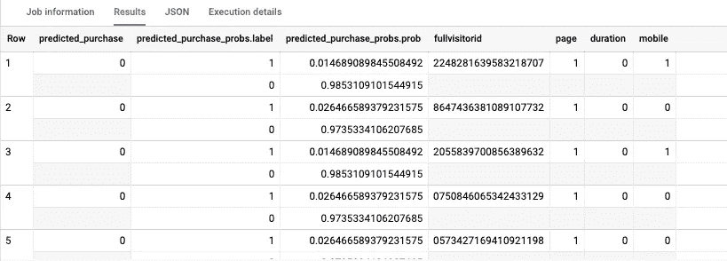

预测结果-作者提供的图片

# 带回家的信息🏠

本文简要介绍了如何在 BigQuery 中使用 SQL 构建一个简单的机器学习模型，包括四个主要步骤:

1.  建立基本结构
2.  清楚这个问题
3.  建立模型(训练和评估模型)
4.  做出预测

希望有助于缓解进入机器学习领域的摩擦。最重要的是，让我们一起学习，一起成长！

## 更多相关文章

[](https://medium.com/analytics-vidhya/top-15-websites-for-data-scientists-to-follow-in-2021-67352092c54d) [## 2021 年数据科学家关注的 15 大网站

### 启发学习的网站和博客

medium.com](https://medium.com/analytics-vidhya/top-15-websites-for-data-scientists-to-follow-in-2021-67352092c54d) [](/learn-sql-in-everyday-language-8d1e06f4daef) [## 用日常语言学习 SQL

### SQL 就像 Excel 一样

towardsdatascience.com](/learn-sql-in-everyday-language-8d1e06f4daef) [](/get-started-with-sql-joins-87835422644b) [## SQL 连接入门

### 使用示例学习左连接、内连接、自连接

towardsdatascience.com](/get-started-with-sql-joins-87835422644b) 

*原载于 2021 年 2 月 9 日 https://www.visual-design.net*[](https://www.visual-design.net/post/how-to-build-ml-model-using-bigquery)**。**