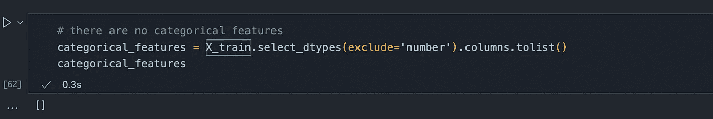
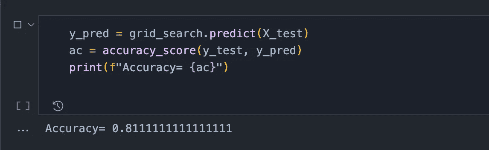

# 如何构建 Scikit-像专家一样学习管道

> 原文：<https://towardsdatascience.com/how-to-build-scikit-learn-pipelines-like-a-pro-107c1ffec225?source=collection_archive---------17----------------------->

## 通过一个迷你项目，学习构建预处理、建模以及网格搜索管道的简单方法


[马克老板](https://unsplash.com/@vork?utm_source=medium&utm_medium=referral)在 [Unsplash](https://unsplash.com?utm_source=medium&utm_medium=referral) 上拍照

每次为项目选择数据集时，您的任务都是清理和预处理数据、处理缺失数据和异常值、建模，甚至执行超参数搜索以找到用于评估的最佳超参数集。

显然，在代码中用**管道**可以方便快捷地做到这一点。

在本文中，我们将浏览一个相当流行的 Kaggle 数据集，执行所有这些步骤，并构建一个真正的 sklearn 管道来学习。

我们开始吧👇

# 探索数据集

我们将在这个迷你项目中使用的数据集将来自 Kaggle — [心力衰竭检测表格数据集](https://www.kaggle.com/andrewmvd/heart-failure-clinical-data)，可在 Creative Common 的许可下获得。从下面的 Kaggle 链接获取:

[](https://www.kaggle.com/andrewmvd/heart-failure-clinical-data) [## 心力衰竭预测

### 预测死亡事件的 12 个临床特征。

www.kaggle.com](https://www.kaggle.com/andrewmvd/heart-failure-clinical-data) 

我们导入一下，看看是什么样子的！


按作者分类的图像-数据预览

下一步是将数据集分成训练集和测试集。除了最后一列是“**死亡事件**”之外，我们有所有用于训练的特征。查看最后一列，我们可以看到这是一个**二进制分类**任务。

列车测试分离

```
The shape of the data:Output:((209, 12), (90, 12), (209,), (90,))
```

最后，我们探索数据集的所有数字列:

```
X_train.describe().T
```


按作者分类的图像-描述数据集

查看分类数据，我们确认没有:

```
# there are no categorical featurescategorical_features = X_train.select_dtypes(exclude='number').columns.tolist()categorical_features
```



作者提供的图片-无猫特征

现在，我们可以继续建设我们的管道了！

# 我们的 Scikit-learn 管道

## 预处理流水线

首先，我们构建预处理管道。它将由两个组件组成——1)一个用于将数据转换到(0，1)之间的`**MinMaxScalar**`实例，以及 2)一个用于使用列中现有值的平均值填充缺失值的`**SimpleImputer**`实例。

```
col_transformation_pipeline = Pipeline(steps=[ ('impute', SimpleImputer(strategy='mean')), ('scale', MinMaxScaler())])
```

我们用一个`**ColumnTransformer**`把它们放在一起。

A `**ColumnTransformer**` 可以接受由我们需要应用于数据的不同列转换组成的元组。对于每个转换，它还需要一个列列表。因为这里只有数字列，所以我们将所有的列都提供给列转换器对象。

那么让我们把它们放在一起:

厉害！我们管道的第一部分完成了！

让我们现在去建立我们的模型。

## 模型管道

我们为此任务选择了一个随机的森林分类器。让我们旋转一个快速分类器对象:

```
# random forest classifierrf_classifier = RandomForestClassifier(n_estimators = 11, criterion='entropy', random_state=0)
```

而且，我们可以将预处理和模型结合在一个管道中:

```
rf_model_pipeline = Pipeline(steps=[ ('preprocessing', columns_transformer), ('rf_model', rf_classifier),])
```

现在，拟合我们的训练数据非常简单:

```
rf_model_pipeline.fit(X_train, y_train)
```

最后，我们可以预测我们的测试集，并计算我们的准确度分数:

```
# predict on test sety_pred = rf_model_pipeline.predict(X_test)
```

综合起来看:

这一切都很好。但是，如果我说您也可以使用这个管道执行网格搜索来查找最佳超参数，那会怎么样呢？那不是很酷吗？

接下来让我们来探索一下！

# 在我们的管道中使用 GridSearch

我们已经建立并使用我们的模型来预测我们的数据集。我们现在将关注于为我们的随机森林模型寻找最佳超参数。

让我们首先建立我们的参数网格:

```
params_dict = {'rf_model__n_estimators' : np.arange(5, 100, 1), 'rf_model__criterion': ['gini', 'entropy'], 'rf_model__max_depth': np.arange(10, 200, 5)}
```

在这种情况下，我们着重于调整模型的三个参数:

1.  **n_estimators** :随机森林中的树木数量，

2.**标准**:测量分割质量的功能，以及

3.**最大深度:**树的最大深度

**这里需要注意的一件重要事情是**:在我们的网格中，我们不是简单地使用`**n_estimators**`作为参数名，而是使用:`**rf_model__n_estimators**`。这里的`**rf_model__**`前缀来自我们为管道中的随机森林模型选择的名称。(参考上一节)。

接下来，我们简单地使用 GridSearch 模块来训练我们的分类器:

```
grid_search = GridSearchCV(rf_model_pipeline, params_dict, cv=10, n_jobs=-1)grid_search.fit(X_train, y_train)
```

让我们把所有这些放在一起:

现在，用我们的`**grid_search**`物体来预测很容易，就像这样:



按作者分类的图像—准确度分数

厉害！我们现在已经为我们的项目建立了一个完整的管道！

# 几句临别赠言…

所以，你有它！由预处理器、模型和网格搜索组成的完整 sklearn 管道都在 Kaggle 的一个迷你项目上进行实验。我希望你会发现这篇教程很有启发性，并且很容易理解。

是时候表扬一下自己了！😀

在这里找到本教程的完整代码。这是我所有数据科学文章的代码库。如果你愿意的话，请给它标上星号和书签！

将来，我会回来写更多基于 Scikit-learn 的文章。所以[跟着我](https://ipom.medium.com/)在媒体上，并留在循环！

## [我还建议成为一名中等会员，不要错过我每周发表的任何数据科学文章。](https://ipom.medium.com/membership/)在此加入👇

[](https://ipom.medium.com/membership) [## 通过我的推荐链接加入 Medium—Yash pra kash

### 作为一个媒体会员，你的会员费的一部分会给你阅读的作家，你可以完全接触到每一个故事…

ipom.medium.com](https://ipom.medium.com/membership) 

# 接通电话！

> *关注我* [*推特*](https://twitter.com/csandyash) *。* [*查看我所有数据科学帖子的完整代码库！*](https://github.com/yashprakash13/data-another-day)

我的其他几篇文章你可能会感兴趣:

[](/the-nice-way-to-deploy-an-ml-model-using-docker-91995f072fe8) [## 使用 Docker 部署 ML 模型的好方法

### 使用 FastAPI 部署 ML 模型并在 VSCode 中轻松封装它的快速指南。

towardsdatascience.com](/the-nice-way-to-deploy-an-ml-model-using-docker-91995f072fe8) [](/31-datasets-for-your-next-data-science-project-6ef9a6f8cac6) [## 您下一个数据科学项目的 31 个数据集

### 基于任务的数据集的汇编，可用于构建下一个数据科学项目

towardsdatascience.com](/31-datasets-for-your-next-data-science-project-6ef9a6f8cac6) [](/how-to-use-bash-to-automate-the-boring-stuff-for-data-science-d447cd23fffe) [## 如何使用 Bash 来自动化数据科学的枯燥工作

### 使用命令行为您的数据科学项目编写一些可重用代码的指南

towardsdatascience.com](/how-to-use-bash-to-automate-the-boring-stuff-for-data-science-d447cd23fffe)