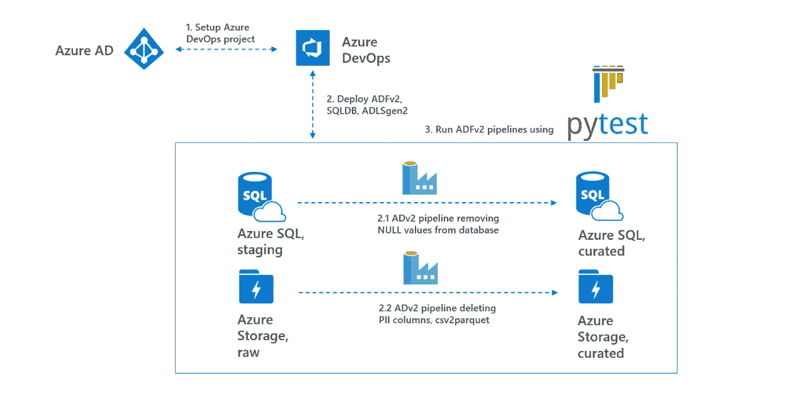
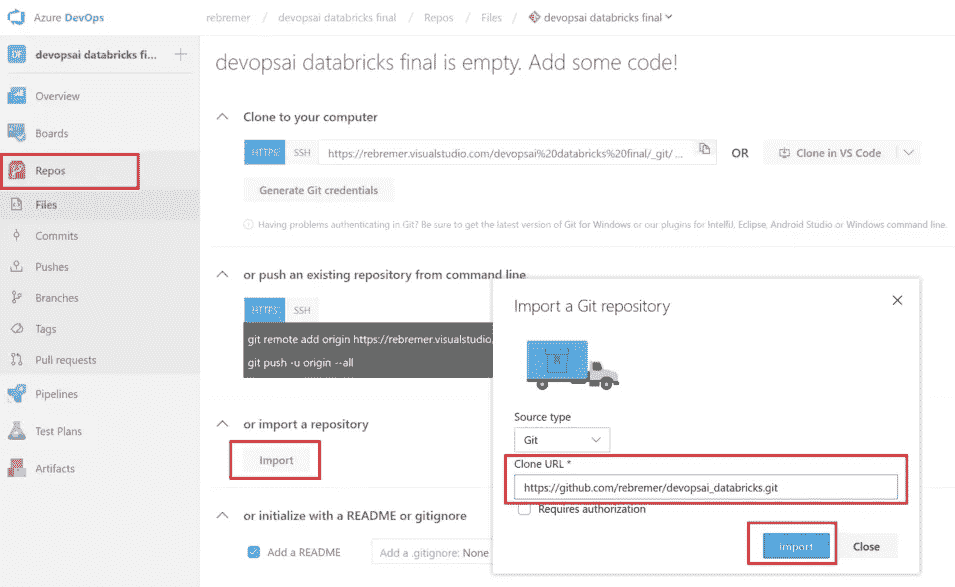
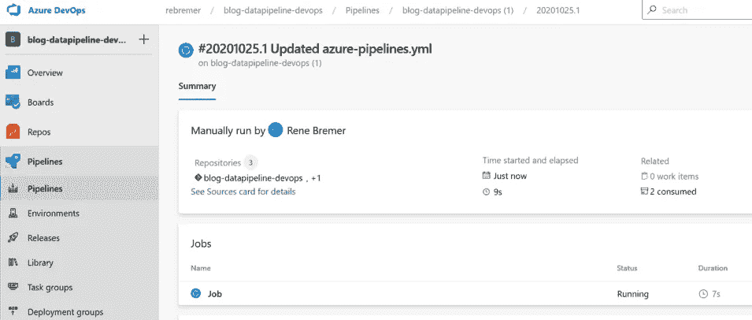
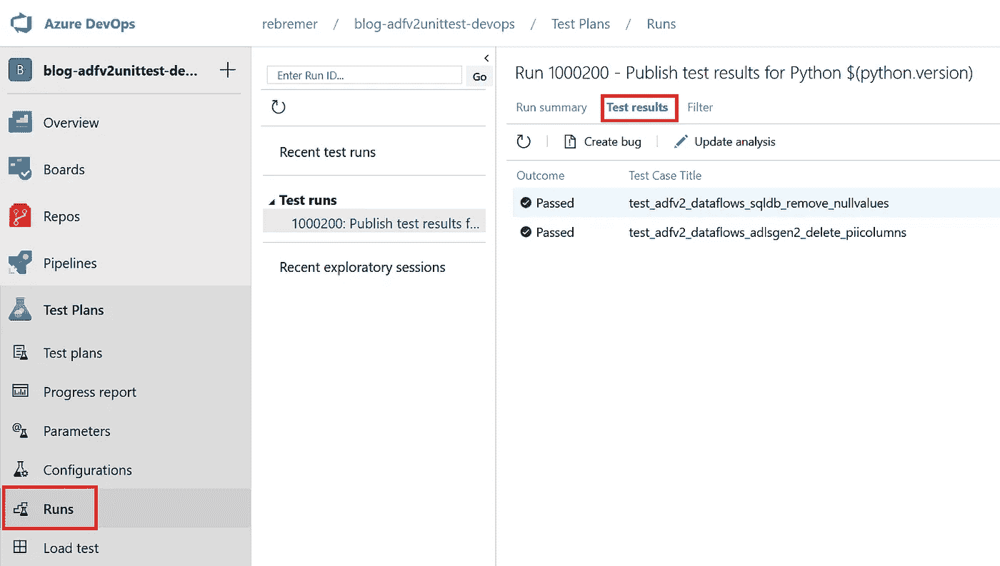
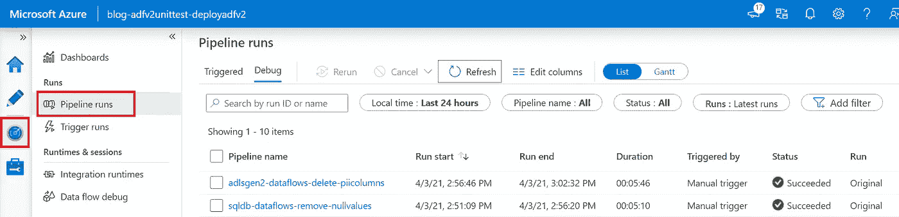
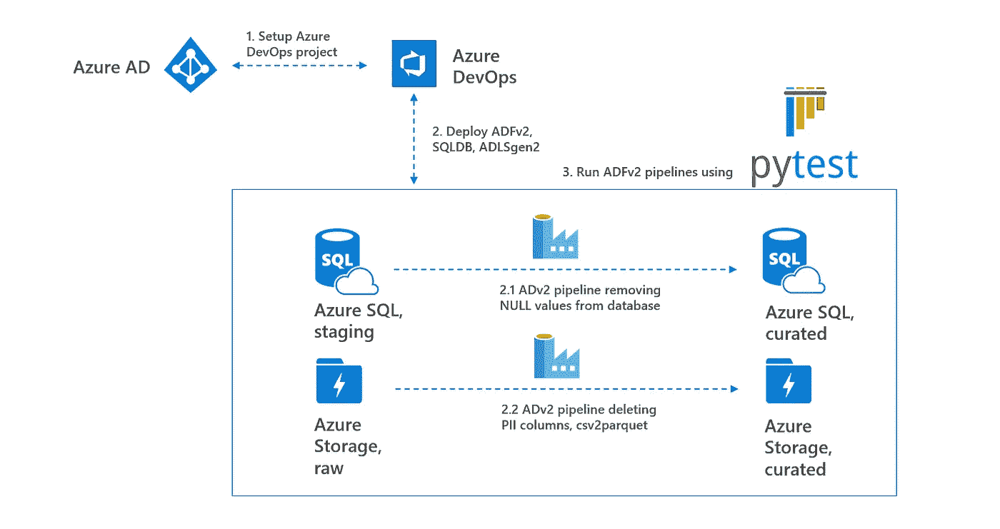

# 如何为 Azure 数据工厂构建单元测试

> 原文：<https://towardsdatascience.com/how-to-build-unit-tests-for-azure-data-factory-3aa11b36c7af?source=collection_archive---------5----------------------->

## 利用 Azure DevOps 和 pytest 进行数据工厂单元测试

# 0.介绍

*TLTR:使用 azure-pipelines.yml 创建 Azure devo PS*[*git projec*](https://github.com/rebremer/blog-adfv2unittest-git)*t，创建构建工件，部署 ADFv2 和 SQLDB bacpac，触发 pytest 做单元测试*

单元测试是一种软件工程实践，侧重于测试代码的各个部分。在单元测试中，以下[最佳实践](https://docs.microsoft.com/en-us/dotnet/core/testing/unit-testing-best-practices#characteristics-of-a-good-unit-test)是适用的:

*   **快**。运行单元测试应该只需要很少的时间。毫秒。
*   **孤立的**。单元测试是独立的，可以单独运行
*   **可重复**。运行单元测试应该总是返回相同的结果
*   **自检**。自动检测测试是通过还是失败
*   **及时**。没有不成比例的长时间编写单元测试代码

在 Azure Data Factory (ADFv2)中创建单元测试可能是一个挑战，因为总是存在对外部数据源的依赖。此外，ADFv2 需要首先部署到 Azure，管道只能作为一个整体进行测试。为了(部分地)克服这些挑战并遵循上面的最佳实践，ADFv2 单元测试项目被创建如下:

1.  设置 Azure DevOps CI/CD 项目以使测试**可重复**
2.  创建包含所有脚本的构建工件，并在发布管道中部署 ADFv2 ARM 模板、SQLDB bacpac 和 csv 文件。通过使数据源成为发布管道的一部分，外部依赖性受到限制，并且更加孤立
3.  使用 SQLDB 运行两条 ADFv2 管道，使用 pytest 运行 ADLSGen2，并将测试结果传播到 Azure DevOps 中的 test 选项卡。这样，就有了测试结果的**自检**

通常，ADFv2 项目包含多个管道。使用 [pytest-xdist](https://pypi.org/project/pytest-xdist/) 可以并行运行管道测试的单元测试。通过这种方式，测试可以更快**(虽然永远无法实现毫秒级，但总测试时间大约等于最长运行的 ADFv2 管道)。使用具有 pytest、pyodbc 和 azure-blob-storage 的现有代码库，可以**及时**创建新的测试。另见下图。**

****

**ADfv2 单元测试—概述，作者图片**

**在这篇博文的剩余部分，将会更详细地解释这个项目。在下一章中，项目将被部署。**

# **1.设置 Azure DevOps CI/CD 项目**

**在这一章中，项目开始运行，并将创建 ADFv2 单元测试项目。在这方面，需要做以下工作:**

*   **1.1 先决条件**
*   **1.2 创建 Azure DevOps 项目**
*   **1.3 创建服务连接**
*   **1.4 配置和建造/发布 YAML 管道**

## **1.1 先决条件**

**本教程需要以下资源:**

*   **[Azure 账户](https://azure.microsoft.com/en-us/free/)**
*   **[蔚蓝 DevOps](https://azure.microsoft.com/en-us/services/devops/)**
*   **[Azure CLI](https://docs.microsoft.com/en-us/cli/azure/install-azure-cli?view=azure-cli-latest) (推荐，也用于故障排除)**

**随后，转到 Azure 门户并创建一个资源组，所有 Azure 资源都将部署在该资源组中。这也可以使用以下 Azure CLI 命令来完成:**

```
az group create -n <<your resource group>> -l <<your location>>
```

## **1.2 创建 Azure DevOps 项目**

**Azure DevOps 是一个工具，可以持续地构建、测试和部署你的代码到任何平台和云。通过以下教程在 Azure DevOps 中创建新项目。创建新项目后，单击存储库文件夹并选择导入以下存储库:**

*   **[https://github.com/rebremer/blog-adfv2unittest-git](https://github.com/rebremer/blog-adfv2unittest-git)**

**也见下图。**

****

**1.2 将存储库添加到您的 Azure DevOps 项目中，图片由作者提供**

## **1.3 创建服务连接**

**从 Azure DevOps 访问资源组中的资源需要服务连接。转到项目设置，服务连接，然后选择 Azure 资源管理器，另见下图。**

****

**1.3.1 创建服务连接，由作者创建图像**

**选择服务主体身份验证，并将范围限制到您之前创建的资源组，另请参见下图。**

****

**1.3.2 按作者将范围限制到资源组、图像**

**默认情况下，服务连接的服务主体(SPN)拥有资源组的参与者权限。但是，对于此管道，SPN 需要资源组的所有者权限(或贡献者旁边的附加用户访问管理员权限)，因为 ADFv2 MI 需要获得 ADLSgen2 帐户的 RBAC 权限。在 Azure DevOps 中点击你的服务连接上的“管理服务主体”时，可以找到应用 id。使用以下 Azure CLI 脚本向 SPN 分配所有者权限(也可以在门户中完成):**

```
# get your subscription id
az account list
# create role
az role assignment create --assignee "<<application id>>" --role "Owner" --scope "/subscriptions/<<your subscription Id>> /resourcegroups/<<resource group name>>"
```

**最后，验证 SPN 是否在 Azure 门户中或使用下面的 CLI 命令为您的资源组分配了所有者角色。**

```
az role assignment list --resource-group <<resource group name>>
```

## **1.4 配置和建造/发布 YAML 管道**

**转到您的 Azure DevOps 项目，选择管道，然后单击“新建管道”。转到向导，选择您之前创建的 Azure Repos Git 和 git repo。在“配置”选项卡中，选择“现有 Azure Pipelines YAML 文件”,然后选择可以在 git repo 中找到的 azure-pipelines.yml，另请参见下文。**

****

**1.4.1 在管道配置向导中，选择现有的 Azure 管道 YAML 文件，按作者排序的图像**

**随后，需要用您自己的值替换以下变量:**

```
variables: 
  #
  # 1\. Azure DevOps settings, change with your own
  AzureServiceConnectionId: '<<your service connection Id>> '
  SUBSCRIPTIONID: '<<your subscription Id>> '
```

**一旦变量被替换，管道就被创建并立即运行，见下文。**

****

**1.4.2 Azure DevOps 部署现代数据管道，图片由作者提供**

**作业运行后，部署所有资源并执行测试。在下一章中，对结果进行了验证。**

# **2.验证测试结果**

**在 Azure DevOps 管道的第一步，部署 ADFv2、SQLDB 和 ADLSgen2。部署完成后，可以使用 Azure CLI 验证是否部署了所有资源。**

```
az resource list -g <<your resource group>>
```

**在 Azure DevOps 管道的第二步中，测试了两条 ADFv2 管道。可以在 ADFv2 monitor 选项卡中验证两个管道是否都已执行。在 pytest 结果中，可以验证测试是否成功。**

****

**2.1 测试结果，图片由作者提供**

**对两条管道执行以下测试:**

****ADF v2 _ data flows _ adlsgen 2 _ delete _ pii columns:****

*   **被 REST 触发后，管道返回 HTTP 200**
*   **检查管道中是否发生超时**
*   **检查 OrdersAggregated 表是否已创建，并且在注释列中不包含空值**

****ADF v2 _ data flows _ sqldb _ remove _ null values:****

*   **被 REST 触发后，管道返回 HTTP 200**
*   **检查管道中是否发生超时**
*   **检查是否可以在 ADLSgen2 的管理文件系统中找到文件 adultcensusincomepiiremoved . parquet**
*   **检查 PII 的敏感年龄栏是否被从拼花文件中删除**

**测试也可以在 data factory 的 monitor 选项卡中进行验证，如下所示。**

****

**2.2 数据工厂运行，按作者排列的图像**

# **3.结论**

**单元测试是一种软件工程实践，侧重于测试代码的各个部分。速度、隔离、可重复性、自检和及时性是单元测试的[最佳实践](https://docs.microsoft.com/en-us/dotnet/core/testing/unit-testing-best-practices#characteristics-of-a-good-unit-test)。在这篇博客中，描述了一个 ADFv2 单元测试项目，该项目利用 Azure DevOps、SQLDB bacpac 和 pytest 的功能，使测试更加隔离、可重复和自检。也见下图。**

****

**3.ADfv2 单元测试—概述，作者图片**