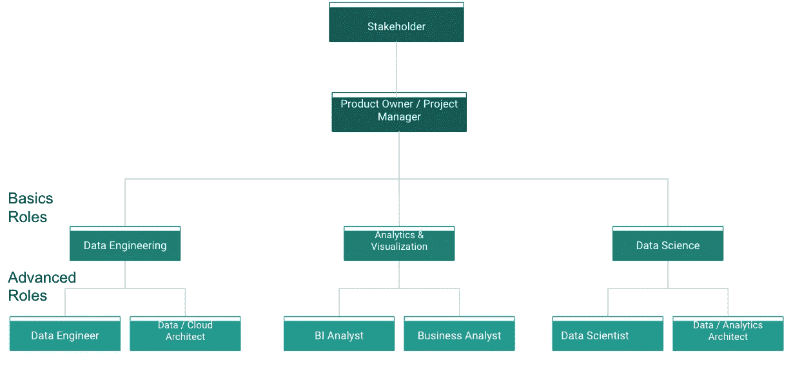
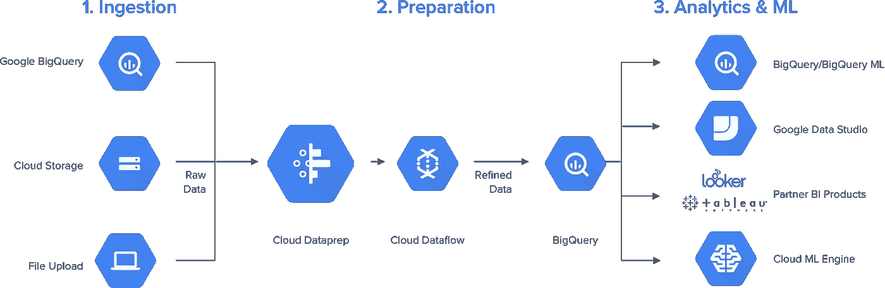

# 如何建立您的数据分析团队

> 原文：<https://towardsdatascience.com/how-to-build-up-your-data-analytics-team-6c6967ff5114?source=collection_archive---------26----------------------->

## 一个由数据工程师、分析师、科学家和产品负责人组成的团队会是什么样子，需要哪些能力？

以赛亚·鲁斯塔德在 [Unsplash](https://unsplash.com/s/photos/team?utm_source=unsplash&utm_medium=referral&utm_content=creditCopyText) 上拍摄的照片

在这篇文章中，我想为建立自己的数据分析团队提供一个可能的蓝图和讨论基础。涵盖的主题将是角色和技能，资产和能力加上项目方法。

## 角色和技能

首先，要考虑你需要什么样的角色和技能。下图会给你一个概述。我区分了大多数团队或项目将具有的更基本的角色和不常见的或在更大的组织中出现的角色。

分析团队中的角色—按作者分类的图片

*   **产品负责人/项目经理**:根据在项目或产品中的工作，你需要一个项目经理或产品负责人，他是分析团队和利益相关者之间的中间人。
*   **数据工程师**:你的基本角色是一名数据工程师，一般来说，他负责与数据的生成、存储、维护、准备、丰富和传播相关的所有过程[1]。点击阅读更多关于数据工程师和数据科学家的区别[。](https://christianlauer90.medium.com/data-science-vs-data-engineering-f6b53a4d6f81)
*   **数据/云架构师**:数据和/或云架构师是数据架构的实践者，数据架构是一门数据管理学科，涉及设计、创建、部署和管理组织的数据架构——在较小的团队中，工程师可能会接管(部分)这些任务[1]。
*   **数据分析师/Visualist** :将数据转化为结构化的数据库，对其进行分析，并最终利用你的商业知识为公司的决策创建一个类似仪表板或报告的基础。
*   商业智能分析师:他们的任务是公司商业智能系统的构思、(进一步)开发、监测和控制。
*   **业务分析师**:业务分析师关心的是在一个执行业务的公司中识别结构和连贯性。
*   **数据科学家**:数据科学家能够使用创新的方法进行分析，并拥有丰富的学术背景。让他与众不同的是，他能够跳出纯数据分析的框框进行思考。
*   **数据分析/科学架构师**:这是一个混合了数据科学家和数据工程师的工作角色。类似于数据/云架构师，但更关心为 ML 和 DL 建立服务，而不是建立数据湖架构。

## 技术资产和能力

除了人力资产(团队成员的知识和技能)，您还需要技术资产，如:

*   数据湖或数据仓库，以提供稳定的数据基础，例如谷歌的 BigQuery、亚马逊的 Redshift 或 Hadoop 等技术。
*   分析工具，如 Anaconda、alteryx 或大型云提供商提供的许多服务中的一种，用于执行统计和 ML 任务。
*   MS Power BI、Google 的 Data Studio 或 Qlik 等商业智能工具可以快速分析数据并构建报告或仪表盘。
*   用于集成和清理数据的数据管道工具，例如通过 ETL/ELT 流程。工具例如是 talend 或 Boomi。
*   像 JupyterLab、R Studio 或 Spyder 这样的开发环境，可以用于 R、Python 和 SQL 这样的编程语言。

下面是一个在谷歌云平台中实现的数据分析架构的例子。

数据分析平台—来源 [Trifacta](https://www.trifacta.com/solutions/google/) [3]

作为一个组织，能够利用其 IT 资产和专业知识来创建数据分析功能是获得商业价值的关键。简而言之:你需要一个拥有聪明技能的数据科学家，并为他提供一套可靠的技术工具，以创建一个良好的机器学习模型。

## 敏捷方法

当在数据分析、工程和科学领域从事更复杂的项目和/或产品时，敏捷方法是必由之路。敏捷方法可以塑造工作流程，以帮助多学科团队优先考虑、计划和成功地增加业务价值。敏捷方法还可以帮助数据和分析团队从客户、利益相关者和最终用户那里获取反馈并采取行动。反馈应导致数据可视化的改进、机器学习模型的重新校准、数据质量的提高以及对数据治理的遵从。

如果这些敏捷方法被正确地应用，并且团队很好地适应它们，这反过来是一个重要的 IT 能力。如何做到这一点，以及例如像讲故事这样的方法将如何帮助你可以在这里阅读。

## 结论

希望这篇文章能给你一些启发和一些开始。第一步总是建立一个团队和工具集。持续发展对两者都适用。这意味着进一步培训员工，更新和扩大技术基础设施。我真的推荐使用敏捷过程来更快地部署已开发的系统，以最小化风险和不良开发。你可以在下面的资料和阅读材料中找到一些灵感和工具。

图片由 [GIPHY](https://giphy.com/gifs/LLHM-em9wy0VhLUCL3MY2Ab) 提供

## 资料来源和进一步阅读

[1] Ted Malaska，《构建数据解决方案的基础:管理成功的数据》(2018 年)

[2] BigData-Insider，[是 ein 数据科学家](https://www.bigdata-insider.de/was-ist-ein-data-scientist-a-600907/) (2017)

[3] Trifacta， [Trifacta 为谷歌云的本地数据准备服务](https://www.trifacta.com/solutions/google/) (2020 年)