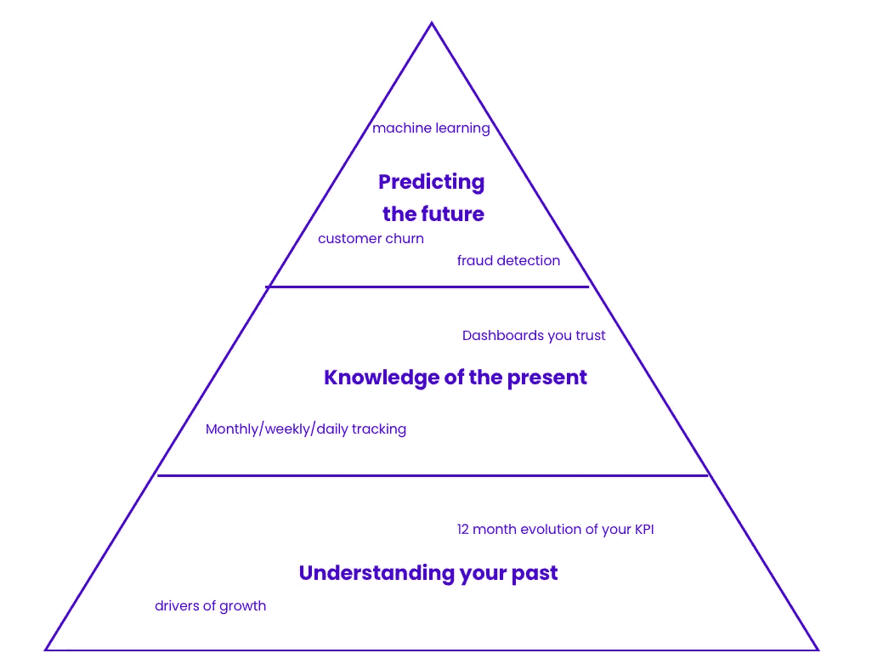
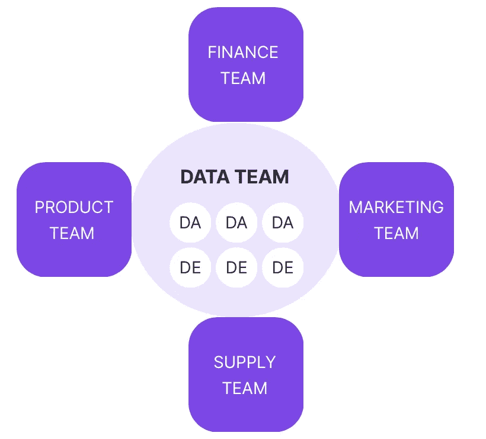
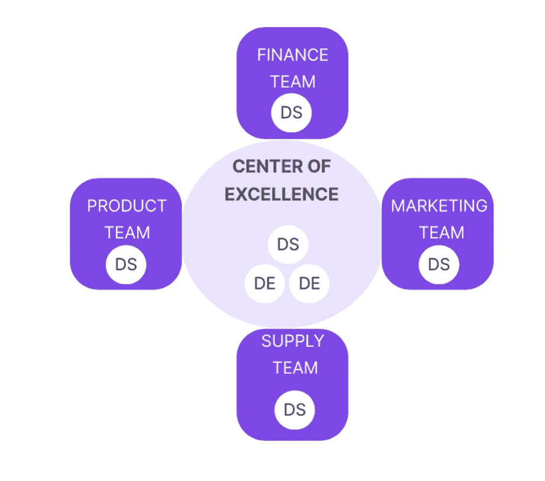

# 如何建立您的数据分析团队

> 原文：<https://towardsdatascience.com/how-to-build-your-data-analytics-team-1276d6729ac4?source=collection_archive---------4----------------------->

## [行业笔记](https://towardsdatascience.com/tagged/notes-from-industry)

## 并将其与您的组织成功集成

图片来自 Castor 的网站

由[Kat Holmes](https://www.linkedin.com/in/kat-holmes-2a9b402a/)—ITV 数据总监进行同行评审

‍As 企业认识到数据对实现业务目标的决定性力量，大多数企业都希望将数据放在业务和产品战略的主导地位。这需要组建一个强大的数据团队，能够有效地将其见解传播到不同的业务领域。不幸的是，这并非易事。

要真正做到数据驱动，企业需要建立三种能力:**数据战略、数据治理和数据分析。**

数据驱动型公司的三大支柱——形象来自推介

**策略**:数据策略是组织使用数据实现目标的路线图。它要求对业务战略固有的数据需求有清晰的理解。你为什么收集数据？你是否在努力赚钱、省钱、管理风险、提供卓越的客户体验，以上都是？

**治理**:数据治理是流程、角色、策略、标准和指标的集合，可确保有效利用信息，帮助您的组织实现其目标。精心设计的数据治理策略可确保您公司的数据**可信、准确且可用**。

**分析:**数据分析这个术语指的是分析原始数据以得出关于它们所包含的信息的结论的过程。通常，组织中与数据分析相关的人员是数据工程师、数据分析师和数据科学家。

最终，您利用数据的能力将取决于这三大支柱。如果您正在阅读本文，并意识到您的组织不具备这些条件，请不要担心。这就是我们在这里的原因。一个好的起点是建立一个强大的**分析团队**，一个与你的业务战略目标紧密相关的团队。这是数据组织的第一个支柱，也是本文的重点。

在组建数据分析团队时，数据主管通常会遇到以下问题:

*   这个团队应该有多大？
*   有多少数据工程师、数据分析师、数据科学家？
*   团队如何与组织的其他部分互动？
*   数据团队的结构是什么？集中式还是嵌入式？

他们这样做是正确的；拥有一支强大的数据团队不再是奢侈品，而是当今公司生存的关键。

让我们从最基本的开始吧。

# 您处于数据之旅的哪个阶段？

在建立一个数据团队之前，重要的是你要意识到你在你的“数据之旅”中处于什么位置，因为这将直接影响你的团队结构。因此，本部分致力于简化数据成熟度评估。请注意，公司规模和数据成熟度是两回事。您的组织可能很大，但在数据层面上还不成熟。

数据成熟度是从您的数据资产中看到有形价值的旅程。我们提出了一个简单的数据成熟度评估框架，在这个框架中，您可以衡量自己了解过去、了解现在和预测未来的能力。我这么说是什么意思？

嗯，在大多数公司里，每个部门都有自己的一套 KPI 来支持公司战略的执行。仅仅定义它们是不够的，还必须清楚地跟踪它们，并且你还必须有能力根据这些 KPI 预测未来的结果。这种能力建立在对你现在的清楚了解上，而这反过来又建立在对过去的深刻理解上。这样做，您就找到了一种评估数据成熟度的简单方法。例如，如果您无法确定贵公司的收入驱动因素(**您的过去**)，这意味着您需要在预测**未来**的结果之前，通过为您的业务带来可见性来提高您的数据成熟度。我们不建议跳过步骤。这就像马斯洛的需求层次理论，但是对于数据来说。

需求的数据层次 Louise de Leyritz 的图像

让我们看几个实际的例子:

**营销投资回报率。**通过使用确定的归因模型，跨多个渠道定义您的投资回报。然后了解其在过去 12 个月中的发展，尤其是其驱动因素(确定表演渠道、一年中的时间、产品等)。).然后借助你信任的报告工具，每天/每周/每月跟踪它的发展。根据这些预测模型预测你的营销预算。

**顾客满意度**。定义你的客户满意度。是 NPS 吗，CSAT？你公司的每个人都应该对它是如何计算的有一个共同的理解。与我们之前的例子一样，计算它在过去 12 个月中的演变，找到它的驱动因素(**过去**)。然后，使用可信的仪表板每天跟踪客户的满意度。确定从今天开始要采取的行动来增加它。你对客户满意度的过去和现在的理解将允许有效地预测客户流失(**未来**)

了解你的过去和现在通常被称为进行描述性分析。描述性分析通过提供上下文来帮助关键利益相关者解释信息，从而帮助组织了解其绩效。这种环境通常以数据可视化的形式出现，包括图形、仪表板、报告和图表。当你分析数据来预测未来时，你是在进行**预测分析。**预测分析的想法是获取历史数据，将其输入考虑关键模式的机器学习模型。将该模型应用于当前数据，并希望它能预测未来。我们将在整篇文章中使用描述性和预测性分析的术语来指代理解过去、现在或预测未来。

如果你意识到你的组织还没有完全成熟(即你对自己的过去和现在没有清晰的认识)，[这里](https://www.castordoc.com/blog/where-are-you-in-your-data-journey)是我们对你的数据团队下一步应该做什么的建议。

# 数据分析团队中的关键人物

数据分析团队通常由四个核心职能部门组成，具体如下。

1.  数据工程师:他们负责设计、构建和维护可以在数据项目中使用的数据集。因此，数据工程师与数据科学家和数据分析师密切合作。我们在这里还包括分析工程师的新角色，尽管实际上，这个角色位于分析和工程之间。
2.  **数据科学家:**他们使用高级数学和统计学，以及编程工具来建立预测模型。数据科学家和数据分析师的角色非常相似，但数据科学家更侧重于预测分析，而不是描述分析。
3.  **数据分析师:**他们使用数据来执行报告和直接分析。数据科学家和工程师通常与原始或未经提炼的数据进行交互，而分析师则处理已经被清理并转换为更加用户友好的格式的数据。
4.  **业务分析师/运营分析师:**他们帮助组织改进其流程和系统。他们专注于仪表板，回答业务问题并提出他们的解释。他们是敏捷的，跨越了 IT 和业务之间的界限，有助于弥合差距和提高效率。他们经常在特定的业务领域工作，如市场营销或财务，他们的 SQL 知识从基本的仪表板到高级分析。
5.  **数据分析主管:**他们为数据团队提供战略监督。他们的目标是创建一个环境，允许所有各方轻松地访问他们需要的数据，建立从数据中提取有意义的见解的业务技能，并确保数据治理。他们还充当数据团队和主要业务部门之间的桥梁，同时充当远见者和技术领导者。‍

# 团队应该有多大？

不同的公司会建立不同规模的数据团队，没有一刀切。我们研究了 300 多家公司的数据团队结构，员工人数在 300-1000 人之间，并得出以下见解:

1.  一般来说，你的目标应该是在你的公司中拥有总数为 5-10%的精通数据分析的员工。一些公司，如亚马逊或脸书，正在培训他们的大部分员工，但我们在分析中排除了他们。
2.  全新数据团队的第一批雇员通常是数据工程师和数据分析师。有了这两个角色，组织已经可以从事一些基本的描述性分析。当建立一个更大的团队时，考虑你需要的技能。典型的数据项目需要以下技能:数据库、软件开发、机器学习、可视化、协作和沟通技能。很难找到拥有所有这些技能的人。因此，你应该意识到每个候选人都具备哪些技能。不管你决定雇佣多少人，你的团队都应该涵盖这些技能。您在数据之旅中所处的位置也会影响您雇佣的人员和所处的阶段。一般来说，数据分析师专注于了解过去。也就是说，他们利用你拥有的数据，试图理解增长的驱动因素和其他指标。业务分析师/obs 分析师面向现在(仪表板)。最后，数据科学家专注于预测未来的结果。因此，如果你对了解自己的过去有困难，那就先雇佣一名数据分析师，而不是数据科学家。
3.  最终决定数据团队规模的应该是业务问题陈述的数量和最严重问题的复杂性。查看路线图的大小，确定在合理的时间内完成数据项目需要多少人。如果您意识到您的数据团队需要一年多的时间来完成项目，那么可能是时候扩大团队了。我们也鼓励你看看你的**运行与构建比率**。您的数据团队成员在处理日常业务运营时“跑步”，关注组织的当前绩效。他们在从事长期项目时“构建”,比如给产品添加新功能。您的数据团队应该用 2/3 的时间运行，用 1/3 的时间构建。如果你的数据团队把所有时间都花在日常需求上，你就在危及公司的未来，也许是时候扩大团队了。
4.  最后，你可能需要做一些特定项目的招聘。如果你是一家从事欺诈检测项目的金融科技公司，或者是一家专门从事物流配送的公司，你可能希望雇佣了解你所在行业具体情况的人。

# 数据团队如何与公司融合？

分析团队没有完美的结构，你的结构可能会改变很多次。如果您的数据团队结构在过去两年中没有变化，那么它很可能是一个次优结构。为什么？因为您公司的数据需求正在快速发展，这要求您调整数据团队的结构。还要记住，你的组织越是静态，下一次变革就越难。出于这个原因，我们不规定一个给定的结构，而是提出最常见的模型，以及它们如何适用于不同类型的企业。

组建数据团队的第一步是**找到组织中已经存在的数据人员**。他们可能不仅仅是头衔中带有“数据”一词的人，也可能是任何不怕数据分析或已经掌握 SQL 技能的员工，比如业务分析师/运营分析师。如果您不花时间仔细寻找预先存在的数据人员，您很可能最终会有一个未计划的数据团队结构，不太可能满足您的业务需求。

‍

## 集中式模型

数据团队的集中式模型—图片由 Louise de Leyritz 提供

集中式模型是实现起来最简单的结构，通常是以数据驱动为目标的公司的第一步。然而，这种模式也有一些缺点，下面会提到。这种结构通常会导致一个集中的数据“平台”，在这个平台上，数据团队可以访问所有的数据，并在各种项目中为整个组织提供服务。该团队中的所有数据工程师、分析师和科学家都由数据主管直接管理。在这种结构下，数据团队以顾问/客户的关系，以虚线向基于业务部门的数据利益相关者报告。

这种灵活的模式可以适应不断发展的业务需求。如果您正处于数据之旅的起点，也就是说，您仍在努力对自己的过去和现在有一个清晰的愿景，这是我们推荐的结构。数据团队的第一个项目将寻求带来业务的可见性，确保您组织中的所有部门都有他们可以信任的 KPI 和仪表板。这种结构特别适合重用性和数据治理非常重要的分析。

**优势**

✅数据团队可以在完成自己的工作的同时，帮助其他团队完成项目。

✅团队可以在整个公司范围内对项目进行优先级排序。

✅在一个集中化的团队中，人才和技能发展的机会更多。事实上，数据团队从事更广泛的项目，数据工程师、科学家和分析师可以从同行的见解中受益。

数据主管✅对公司的战略有一个集中的看法，可以将数据人员分配到最适合他们能力的项目中。

✅鼓励职业发展，如数据工程师、科学家，并对资历角色有明确的看法。‍

**弊端**

❌数据分析团队和其他业务部门之间脱节的可能性很高。在这种模式中，数据工程师和数据科学家不参与其他团队的日常活动，这使得他们很难确定要解决的最相关的问题。

分析小组的❌风险将降为“支持”职能，其他部门不承担其责任。

❌由于数据团队为企业的其他部门提供服务，其他业务部门可能会觉得他们的需求没有得到适当解决，或者觉得规划过程过于官僚和缓慢。

‍

## 分散/嵌入式模型

数据团队的分散模型—图片由 Louise de Leyritz 提供

在一个分散的模型中，每个部门雇佣自己的数据人员，使用一个集中的数据平台。在这种模式下，数据分析师和科学家专注于他们特定业务部门面临的问题，很少与公司其他领域的数据人员互动。在这种结构下，数据分析师直接向各自业务部门的负责人报告。

**优势**

✅嵌入式团队的数据人员反应敏捷，因为他们致力于各自的业务职能，并拥有良好的领域知识。

✅产品经理可以将数据任务分配给最有资格处理这些任务的人。

✅业务数据团队不必为构建数据项目而争夺资源，因为资源就在团队中。

**弊端**

❌缺乏真实的来源，重复的数据内容

由于不同团队之间缺乏沟通，❌的数据人员最终会处理多余的问题。

❌孤岛的产生导致了生产力的侵蚀，因为数据人员不能像在集中式模型中那样利用他们同事的专业知识。

❌:这种模式使得为不同项目的数据人员配备最佳人员变得更加困难。

❌的业务经理通常缺乏技术背景，他们会发现很难管理数据人员，也很难理解他们的工作质量。

‍

## 联合模式/卓越中心

联合模型最适合已经达到数据成熟度、拥有清晰的数据战略并从事预测分析的公司。

Louise de Leyritz 的卓越中心模式 l- Image

在卓越中心模式(COE)中，数据人员嵌入业务部门，但提供领导、支持和培训的集中团队仍然存在。如果数据分析师和科学家跨业务部门部署，您仍然会有一个数据领导者(或根据公司规模的数据领导者核心),他对数据项目进行优先排序和监督。这确保了首先处理最有益的数据项目。

这种策略最适合具有清晰数据路线图的大型企业级公司。卓越中心模式需要一个更大的数据团队，因为在*卓越中心*和不同的业务分支都需要数据科学家。如果您是一家中小型公司，您可能不需要如此规模的数据团队。

这种方法保留了集中式和嵌入式模型的优点。这是一个更加平衡的结构，其中数据团队的行动是协调的，但也让数据专家嵌入到业务部门中。

同样，知道谁是你的数据人员是非常重要的。在您的数据之旅开始时建立一个集中的团队时，确保您没有在其他部门安插业务分析师/运营人员。否则，您将最终得到一个不想要的混合模型，在您的组织中造成完全的混乱。在创建 *COE 时，*您需要确保它是需要的和计划好的。

**优点**

✅卓越中心模式提供了集中式和嵌入式模式的优点。

但是，它仍然存在一些缺点:

**弊端**

❌:这种模式需要一个额外的协调和沟通层，以确保 COE 和业务部门之间的一致性。

❌不适用于中小型组织，因此这些公司可以将它与这种中心辐射型模式带来的好处挂钩。

# 最后的话

如果你的公司要成为数据驱动型，建立一个强大的分析团队是你需要建立的一个关键支柱。您从数据中提取商业价值的程度最终取决于这个团队的实力，以及它与您的其他业务的共生程度。对于您的数据团队的规模、组成和结构，没有定制的建议。这就是为什么您需要了解您的组织的数据成熟度级别，以便您可以建立一个适合您的业务需求并与您的业务战略保持一致的数据团队。

# 关于我们

在 Castor，我们正在开发一个数据文档工具 Figma，Slack generation。或者对 Fivetran，Looker，Snowflake，DBT 的狂热爱好者来说是数据方面的。我们把我们的目录设计成**易于使用、令人愉快和友好。**

想去看看吗？[联系我们](https://meetings.hubspot.com/xavier76)，我们将向您展示一个演示。

*原载于*[*https://www.castordoc.com*](https://www.castordoc.com/blog/how-to-build-your-data-team)*。*