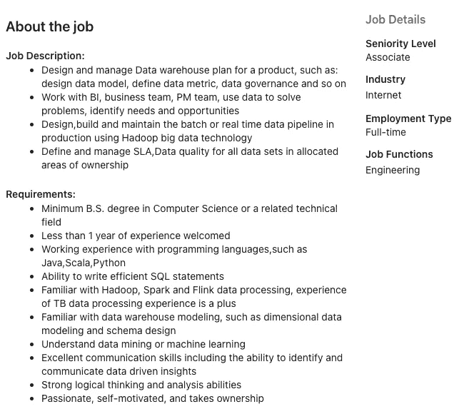

# 如何在 2021 年构建您的数据学习项目

> 原文：<https://towardsdatascience.com/how-to-build-your-data-learning-projects-in-2021-eabf74d72479?source=collection_archive---------32----------------------->

## 创建自己的学习之旅时要考虑的事情

# 介绍

照片由 [Dmitry Ratushny](https://unsplash.com/@ratushny?utm_source=medium&utm_medium=referral) 在 [Unsplash](https://unsplash.com?utm_source=medium&utm_medium=referral) 上拍摄

数据工程是数据行业的一个重要领域。有许多需要处理数据的活动，以便我们可以获得数据驱动的决策。这些例子可以是

*   将数据从一个地方移动到另一个地方。
*   通过各种系统使用，从内部分析到组织外的第三方。
*   按时回答业务问题。
*   确保从前端应用到后端分析的数据质量。
*   管理数据可访问性策略。

> 对数据工程的需求每天都在增长。

作为该领域的数据爱好者，我认为这是任何人都应该具备的一项宝贵技能。当在技术或管理方向发展你的工作时，数据工程技能集可以使你成为一个有竞争力的候选人。

做出决定后，我花时间搜索要学习的话题。我发现有很多话题要谈。与数据分析师和数据科学家领域相比，学习主题相当宽泛。

这让我很困惑，我应该先学什么，后来才能更好地理解当时的这个领域。所以我有了一个简单的想法，那就是**我应该了解这个行业在日常工作中真正使用的是什么**。至少，这个行业已经投票给了我对他们来说什么是重要的。

# 了解公司想要什么。

肖恩·波洛克在 [Unsplash](https://unsplash.com?utm_source=medium&utm_medium=referral) 上拍摄的照片

## 去哪里找(工作描述，面试)

要想知道公司真正想从数据工程中得到什么，我们可以在招聘网站上发布的职位描述中找到。由于地区、国家和你寻找的公司行业的不同，要求可能会有所不同。这里有一个在新加坡的入门级数据工程工作的例子。

一个入门级的数据工程职位描述:作者截图

从上面的工作描述中，我们可以列出如下学习主题

*   编程语言— `Java`、`Scala`、`Python`、`SQL`
*   大数据技术— `Hadoop`、`Spark`、`Flink`
*   基础知识— `Data warehousing`、`Data mining`、`Machine learning`、`Data modeling`、`Data governance`

我们可以从需求部分收集学习主题。你可以搜索最多 5 到 10 个职位描述，并将它们合并在一起。然而，工作描述中的技术清单可能非常粗略。如果你有机会参加面试，你可以问一些有深度的问题，以便更好地了解他们真正需要的技术。

经过一些反复的提炼，会有一个主题列表出现在最上面。如果你把题目分成具体的和基本的，会有所帮助。

在我看来，有些题目可以学一次，适用于很多项目。但是对于一些特定的科目，这是你在你梦想的公司找到工作之前必须掌握的先决条件。

## 至少，基础知识不变。

我鼓励你花时间在基础知识上，比如数据建模、数据仓库、设计模式和数据管道的基本组件。

它将帮助你把每个学习主题联系起来。减少您理解用于实现更好性能的技术的时间。

## 启动器指南

以下是我在搜索中找到的一些排名靠前的主题。该列表是基于我的经验，所以会有从你的目标公司的变化。

*   编程语言— `Python`、`Scala`、`Java`
*   SQL 数据库— `Postgres`，`Mysql`
*   大数据技术— `Hadoop`、`Kafka`
*   数据处理引擎— `Presto`、`Hive`、`Impala`、`Spark`
*   基础知识— `Databases`、`Distributed system`、`Streaming processsing`、`Data manipulation`、`Schema managements`

你可以从你的列表中为每个主题选择一个，并在学习期间和你的第一个动手项目中坚持下去。

# 找到合适的老师。

由[工具拍摄的照片。，Inc](https://unsplash.com/@tool_inc?utm_source=medium&utm_medium=referral) on [Unsplash](https://unsplash.com?utm_source=medium&utm_medium=referral)

## 不是每门课程都适合你。

有许多大规模的在线课程。在谷歌上只需一次搜索，你就能立即找到某个特定主题的在线课程。这里重要的是**不是每门课程都适合你的学习风格。我什么意思？**

有些课程会以一种**自下而上**的方式教你，比如向你介绍基本概念，一点一点地建立你的理解，然后最后将它应用到真实世界的例子中。相比之下，其他人会告诉你另一种从上到下的方法。他们先带你驾驶汽车，然后解释每个部件，如踏板、车轮等。

我发现这两种教学方式都有助于巩固你的基础技能，但能让你在整个学习过程中保持注意力。

> 你需要选择一个你最喜欢的。

很多时候，我问自己一个问题，我现在在学什么？我如何将这种抽象应用到实际的项目中呢？这些概念和我在日常工作中看到的代码有什么联系？

## 他们如何传达信息。

另一个必不可少的因素是**导师的教学风格**。我曾经听过一句话。

> 如果你不明白他们教你什么，不要担心，这不是你的错。你只是没找到合适的。

同一个概念可以用许多不同的方式讲述。有些导师可以翻译所有的复杂，教你最直观的方法，但对有些人来说，他们没有。

根据我的经验，我建议你不要急于进入你在网上找到的任何课程。花点时间观看一个或多个他们的教学视频，并回答下列问题。

*   他们如何向你解释或介绍新概念。
*   你对他们所谈论的有多少了解。
*   口音，例子，他们传达信息的方式。
*   自上而下或自下而上的风格。

下面是我关于学习`datastructure & algorithm`的例子。我第一次注册这门课程时。这是一门理论课，向你展示数学符号，以及如何从数学角度找到解决方案，然后他们应用这个概念来解决问题。

我发现有些数学符号很难理解，当时他们解释的方式对我来说相当模糊。在理解他们告诉我的一切(是的，我应该)之前，我需要一个强大的数学基础。

然而，我决定取消那门课，找了一门新的。后来我发现一门课程用不同的方式教我同样的概念。他们首先向我展示问题，然后将每个内容链接回基础概念。与第一个相比，我对课程内容的理解更加自如，对主题的理解也更加透彻。

根据我告诉你的，我建议继续学习你并不真正感兴趣的课程并不是一个好方法。如果你觉得这不是你的风格，取消注册，找一个新的。相信我；你会找到适合你的好工作，通过学习过程让你更加快乐。

你花在寻找合适的工作上的时间可能是一周，但是接下来一年的整个学习经历将会更有吸引力。

> 学习过程应该是有趣的，而不是令人沮丧和无聊的。

## 找到正确的渠道。

这一部分的最后一个话题是关于你可以从中学习和消费信息的**媒体**。2021 年，有各种方式教你一个新课题。它可以是一本书、视频、交互式编码会议，或者是 Zoom 或 Microsoft team 中的一个小组会议。

你应该尝试每一个可能的渠道，找到最适合你的。对我自己来说，我非常喜欢通过视频学习。我认为这有助于节省我消耗信息的时间。我可以把视频加速到 1.5 倍或者 2 倍。

对一些人来说，书籍可能是一种有趣的替代学习方式，但对我来说不是这样。

# 构建项目。

照片由[内森·杜姆劳](https://unsplash.com/@nate_dumlao?utm_source=medium&utm_medium=referral)在 [Unsplash](https://unsplash.com?utm_source=medium&utm_medium=referral) 上拍摄

## 行动胜于言语。

要彻底理解学习主题，您需要有将学习概念应用到实际项目的实践经验。您可以从在 Jupyter 笔记本中实现一个简单的功能开始，然后一步一步地改进它，使之成为您自己的高质量数据项目。

不仅仅是为了学习，也是为了证明你拥有公司需要的令人满意的技能。

例如，我曾经参加了 Udacity 的数据工程纳米学位课程。我需要建立一个数据管道项目，并提交给 Udacity 的评审员以通过课程。这是我当时一直在做的项目。

<https://github.com/Pathairush/data_engineering>  

在线课程迫使我建立一个项目来获得认证。这是教你一项新技能的好方法，也是让我独立完成一些项目的好方法，而不仅仅是看讲座视频。

有了 Nanodegree 课程的经验和模板，我可以更容易地为以后的项目调整模式。如果你想要一个想法来构建你自己的项目，请随时查看我的 Github。这是另一个你可以自己构建的数据工程项目的例子。

<https://github.com/Pathairush/rdbms_to_hdfs_data_pipeline>  

你做的兼职越多，你学得越快。你将面临一个潜在的空间，你可以应用你的知识，从大规模的在线课程。

在你完成项目后，你可以像我一样，通过写在一篇 **medium** 博客文章中来总结你所学到的东西，并与他人分享。这个过程有助于你巩固和巩固你的思想。它迫使你更简单地向别人解释你做了什么。此外，如果读者发现一些错误或需要改进的地方，他们可以向你提出建议。因此，你可以直接从读者的反馈中提高自己。

## 调试经验

当你去实现的过程中，你绝对会发现一些沿途的 bug。它允许你利用在线资源，如 StackOverflow 或 Github repository，找到一种方法使事情工作。

我觉得这是你以后无论学什么的核心技能。你需要面对一些障碍，并想办法解决它。然后你会得到一些公司正在寻找的**有经验的**。当你自己面对问题时，你会比你只是从讲座中听到的知识有更好的回忆，但从来没有应用到你的项目中。

此外，它还拓宽了你的学习视野，因为仅仅从你的讲座中获得的知识并不能解决一些问题。例如，在初始化开发环境时，您可能会遇到一个问题。但是如果你能搞清楚，你将获得一套创造合适工作环境的新技能。我认为在线课程中没有指出这一点，因为他们总是会给你提供一个一切正常的工作空间。

> 我们通过摔倒来学习

# 写作/教学习。

照片由 [NeONBRAND](https://unsplash.com/@neonbrand?utm_source=medium&utm_medium=referral) 在 [Unsplash](https://unsplash.com?utm_source=medium&utm_medium=referral) 上拍摄

## 简单解释

学习新事物有两种方式，消费或生产。要制作某样东西或教某个人，你需要彻底理解整个主题。当我不得不教别人的时候，我发现自己对这些科目有了更好的理解。

为了让别人理解你所理解的，你讲的故事需要足够简单。故事的顺序应该排列得很好。总结复杂的东西或复杂的过程，它让你训练你的大脑只选择你认为对别人有意义的东西。

我发现在学习新事物时，这是一个被低估的话题，因为这将花费你很多时间来准备教学，而不是消耗别人的知识。我们都有点懒惰。尽管如此，我还是鼓励你尝试将这种学习方法纳入你的学习课程。

如果你想有一个这种学习方法的例子，看看这个。我试着用这些技巧写下面的文章。

</data-quality-check-for-your-data-analysis-tutorial-with-pandas-7ee96d7dc4b6>  </feature-engineering-tutorial-with-pandas-b3b4de1f8a7c>  

## 他人的反馈

在你教授完一门课程或者写完一篇文章并发表之后，它不会是完美的，但是它给了其他人帮助你做得更好的空间。

他们可以对你正在谈论的主题发表评论并补充他们的想法，他们也可以根据你的解释问你一个问题，这让你不得不浓缩你的想法并回答他们，这将导致对主题的更好理解。

# 感谢阅读

## 帕泰鲁什·西达

***如果你喜欢这篇文章，并希望看到更多这样的东西。***

*   跟着我上[媒体](http://padpathairush.medium.com)
*   其他渠道？ [LinkedIn](https://www.linkedin.com/in/pathairush-seeda-b7a62ab6/) ， [Twitter](https://twitter.com/data_products) ，以及[脸书](https://www.facebook.com/DataProds-106431271287292/)