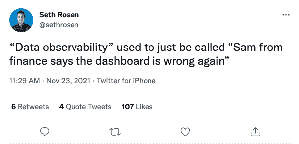
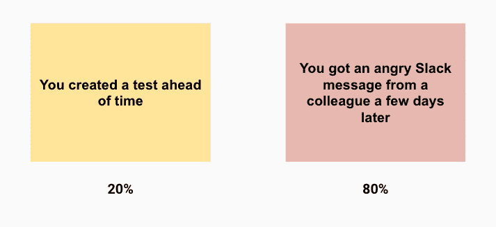
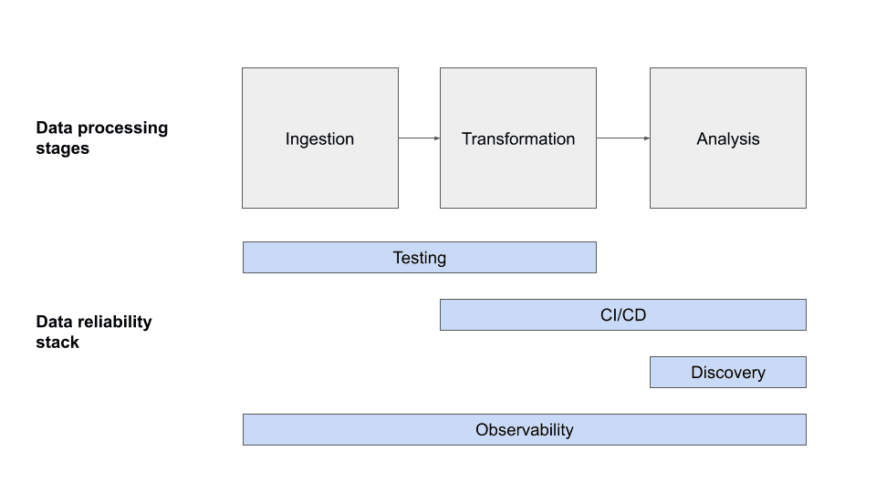

# 如何构建您的数据可靠性堆栈

> 原文：<https://towardsdatascience.com/how-to-build-your-data-reliability-stack-7cf1a0f5bf30?source=collection_archive---------11----------------------->

## 数据可靠性是现代数据团队的一个重要关注点。以下是开始的方法

图片由 [Unsplash](https://unsplash.com/) 上的 [ThisisEngineering RAEng](https://unsplash.com/photos/uyfohHiTxho) 提供

2004 年 7 月 26 日，一家名为 Google 的 5 岁初创公司面临一个严重的问题: [**他们的应用程序宕机**](https://money.cnn.com/2004/07/26/technology/google_site/index.htm?cnn=yes) 。

几个小时以来，美国、法国和英国的用户都无法访问这个流行的搜索引擎。当时只有 800 人的公司和他们的数百万用户被蒙在鼓里，工程师们努力解决这个问题并找出问题的根源。到中午时分，由几个惊慌失措的工程师进行的冗长而密集的过程确定了 MyDoom 病毒是罪魁祸首。

在 2021 年，这种长度和规模的中断被认为是相当不正常的，但在 15 年前，这种类型的软件中断并不罕见。时任谷歌工程经理的本杰明·特雷诺·斯洛斯(Benjamin trey nor Schmidt)多年来带领团队经历了几次这样的经历，他认为必须有一种更好的方法来管理和防止这些令人眼花缭乱的消防演习，不仅是在谷歌，而是在整个行业。

受他早期构建数据和 IT 基础设施的职业生涯的启发，斯洛斯将他的学习整理成一个全新的学科— [**站点可靠性工程**](https://sre.google/)**【SRE】**—致力于优化软件系统(如谷歌的搜索引擎)的维护和运营，同时考虑到可靠性。

根据为学科发展铺平道路的斯洛斯和其他人的说法, , SRE 是关于自动消除对边缘情况和未知的未知(如错误代码、服务器故障和病毒)的担忧。最终，斯洛斯和他的团队希望找到一种方法，让工程师自动化维护公司快速增长的代码库的手工劳动，同时确保他们的代码库在系统崩溃时得到保护。

> “SRE 是一种思考和对待生产的方式。大多数开发系统的工程师也可以成为该系统的 SRE。“问题是:他们能否解决一个复杂的、可能还没有明确定义的问题，并提出一个可扩展的、技术上合理的解决方案？”

如果谷歌有正确的流程和系统来预测和预防下游问题，不仅可以在对用户影响最小的情况下轻松修复宕机，还可以完全避免宕机。

# 数据是软件，软件是数据

近 20 年后，数据团队面临着类似的命运。像软件一样，数据系统正变得越来越复杂，具有多种上游和下游依赖性。十年甚至五年前，在孤岛中管理数据是正常且被接受的，但现在，团队甚至整个公司都在处理数据，促进了更具协作性和容错性的数据管理方法。

在过去的几年中，我们见证了数据工程和分析团队广泛采用软件工程最佳实践来解决这一差距，从采用 dbt 和 Apache Airflow 等开源工具来简化数据转换和编排，到基于云的数据仓库和湖泊，如 [**Snowflake 和**](https://www.montecarlodata.com/how-to-build-your-data-platform-choosing-a-cloud-data-warehouse/) 。

> 从根本上说，这种向敏捷原则的转变与我们如何概念化、设计、构建和维护数据系统有关。孤岛式仪表板和报告的时代已经一去不复返了，它们只生成一次，很少使用，也从不更新；现在，为了在规模上有用， [**数据还必须被产品化**](https://www.montecarlodata.com/how-to-build-your-data-platform-like-a-product/) 、维护和管理，以供整个公司的最终用户使用。

为了让数据像软件产品一样被对待，它也必须像软件产品一样可靠。

# 数据可靠性的提高

推特由永远欢闹的塞斯·罗森提供。

简而言之，[**数据可靠性**](https://www.montecarlodata.com/what-is-data-reliability/) 是组织在整个数据生命周期中提供高数据可用性和健康的能力，从摄取到最终产品:仪表板、ML 模型和生产数据集。过去，从测试框架到数据可观察性，人们已经注意到孤立地解决难题的不同部分，但是这种方法已经不够了。然而，正如任何数据工程师都会告诉你的那样，数据可靠性(以及真正像对待产品一样对待数据的能力)是无法在孤岛中实现的。

一个数据资产中的模式更改会影响多个表，甚至 Tableau 仪表板中的下游字段。当您的财务团队在 Looker 中查询新的见解时，一个缺失的值会让他们歇斯底里。当 500 行突然变成 5000 行时，这通常是一个迹象，表明有些事情不对劲——您只是不知道表在哪里或如何损坏的。

即使有大量的数据工程工具和资源，数据也可能因为数百万种不同的原因而损坏，从操作问题和代码更改到数据本身的问题。

*在与数百个数据团队交谈后，根据我自己的经验，我们发现大约 80%的数据问题无法通过单独的测试来解决。图片由 Lior Gavish 提供。*

根据我们自己的经验，在与数百个团队交谈后，目前大多数数据工程师发现数据质量问题有两种方式:测试(理想的结果)和来自下游利益相关者的愤怒消息(可能的结果)。

与 sre 管理应用停机时间的方式相同，今天的数据工程师必须通过自动化、持续集成和持续部署数据模型以及其他敏捷原则，专注于减少**【数据停机时间】—数据不准确、丢失或出现其他错误的时间段。**

**过去，我们已经讨论过如何构建 [**一个快速而肮脏的数据平台**](/the-quick-and-dirty-guide-to-building-your-data-platform-2f21dc4b7c94)；现在，我们在此设计的基础上进行构建，以反映迈向良好数据之旅的下一步:数据可靠性堆栈。**

**以下是如何和为什么要建立一个。**

# **简介:数据可靠性堆栈**

**如今，数据团队的任务是构建可扩展、高性能的[数据平台](/the-quick-and-dirty-guide-to-building-your-data-platform-2f21dc4b7c94)，该平台可以通过存储、处理和传输数据来满足跨职能分析团队的需求，从而生成准确、及时的见解。但是要实现这一点，我们首先还需要适当的方法来确保原始数据是可用和可信的。为此，一些最优秀的团队正在构建数据可靠性堆栈，作为其现代数据平台的一部分。**

**在我看来，现代数据可靠性堆栈由四个不同的层组成:测试、CI/CD、数据可观察性和数据发现，每一层都代表您公司数据质量之旅中的一个不同步骤。**

****

***数据可靠性堆栈由五层组成，包括测试、CI/CD、数据可观测性和数据发现。图片由 Lior Gavish 提供。***

# **测试**

**在数据进入生产数据管道之前，测试数据对于发现数据质量问题至关重要。通过测试，工程师可以预见到可能会出现的问题，并编写逻辑来抢先检测问题。**

**数据测试是在生产前或生产过程中验证组织对数据的假设的过程。编写检查诸如唯一性和 not_null 等内容的基本测试是组织测试他们对源数据所做的基本假设的方法。对于组织来说，确保数据的格式正确以便团队使用，并且数据满足他们的业务需求也是很常见的。**

**一些最常见的数据质量测试包括:**

*   ****空值** —是否有未知值(空)？**
*   **我得到任何数据了吗？我得到的是太多还是太少？**
*   ****分布** —我的数据是否在可接受的范围内？我的值是否在给定列的范围内？**
*   ****唯一性** —有重复的值吗？**
*   ****已知不变量** —利润永远是收入和成本的差额，还是我的数据中其他一些众所周知的事实？**

**根据我自己的经验，测试数据的两个最好的工具是 [dbt 测试](https://docs.getdbt.com/docs/building-a-dbt-project/tests)和[远大前程](https://greatexpectations.io/)(作为一个更通用的工具)。这两个工具都是开源的，允许您在数据质量问题落入利益相关者手中之前发现它们。虽然 dbt 本身并不是一个测试解决方案，但是如果您已经在使用该框架来建模和转换您的数据，那么他们的开箱即用测试就可以很好地工作。**

# **持续集成(CI) /持续交付(CD)**

**CI/CD 是软件开发生命周期的一个关键组成部分，它通过自动化确保随着时间的推移进行更新时，新代码部署是稳定和可靠的。**

**在数据工程的上下文中，CI/CD 不仅与持续集成新代码的过程有关，还与将新数据集成到系统中的过程有关。通过在早期阶段检测问题，最好是在提交代码或合并新数据时，数据团队能够实现更快、更可靠的开发工作流。**

**让我们从等式的代码部分开始。就像传统的软件工程师一样，数据工程师受益于使用源代码控制，例如 [Github](https://github.com/) ，来管理他们的代码和转换，以便新代码可以被正确地审查和版本控制。一个 CI/CD 系统，例如， [Circle](https://circleci.com/) 或 [Jenkins](https://www.jenkins.io/) (开源)，具有完全自动化的测试和部署设置，可以在部署代码时创建更多的可预测性和一致性。这听起来应该很熟悉。数据团队遇到的额外复杂性是理解代码更改如何影响其输出的数据集的挑战。这就是像 [Datafold](https://www.datafold.com/data-diff) 这样的新兴工具的用武之地——允许团队将一段新代码的数据输出与之前运行的相同代码进行比较。通过在部署代码之前，在流程的早期捕获意外的数据差异，可以实现更高的可靠性。虽然此流程需要代表性的试运行或生产数据，但它可能非常有效。**

**还有另一个工具系列，旨在帮助团队更可靠地传输新数据，而不是新代码。有了 [LakeFS](https://lakefs.io/) 或 [Project Nessie](https://projectnessie.org/) ，团队能够在发布数据之前将其暂存，以便用类似 g it 的语义进行下游消费。想象一下，用新处理的数据创建一个分支，如果认为它是好的，就把它提交给主分支！结合测试，数据分支可能是阻止坏数据到达下游消费者的非常强大的方法。**

# **数据可观察性**

**生产前测试和版本控制数据是实现数据可靠性的第一步，但是当数据在生产中以及生产之外中断时会发生什么呢？**

**除了在转换和建模之前处理数据质量的数据可靠性堆栈元素之外，数据工程团队还需要投资于端到端、自动化的数据可观察性解决方案，这些解决方案可以近乎实时地检测何时出现数据问题。与 DevOps 可观察性解决方案(即 Datadog 和 New Relic)类似， [**数据可观察性**](/what-is-data-observability-40b337971e3e#:~:text=Data%20Observability%2C%20an%20organization%27s%20ability,DevOps%20Observability%20to%20data%20pipelines.&text=Together%2C%20these%20components%20provide%20valuable,and%20reliability%20of%20your%20data.) 使用自动化监控、警报和分类来识别和评估数据质量问题。**

****

**图片由巴尔·摩西提供**

**数据可观察性通过数据健康和可靠性的五个关键支柱来衡量:新鲜度、分布、容量、模式和沿袭。**

*   ****新鲜度:**数据是最近的吗？最后一次生成是什么时候？包括和/或省略了哪些上游数据？**
*   ****分布:**数据是否在可接受的范围内？这是正确的格式吗？完成了吗？**
*   ****卷:**资料都到了吗？数据是意外复制的吗？从表中删除了多少数据？**
*   ****模式:**什么是模式，它是如何变化的？谁对模式进行了更改，原因是什么？**
*   ****沿袭:**对于给定的数据资产，受其影响的上游和下游来源是什么？谁在生成这些数据，谁在依靠这些数据做决策？**

**数据可观察性是您的团队无法预测的其他 80%的数据停机时间的原因( [**未知未知**](https://www.montecarlodata.com/the-new-rules-of-data-quality/#:~:text=The%20two%20types%20of%20data%20quality%20issues) )，不仅仅是检测数据质量问题并发出警报，还提供根本原因分析、影响分析、现场级沿袭以及对您的数据平台的运营洞察。**

**有了这些工具，您的团队将能够通过对数据可靠性的历史和统计洞察，不仅解决而且防止类似问题在未来发生。**

# **数据发现**

**虽然传统上不被视为可靠性堆栈的一部分，但我们认为数据发现至关重要。团队创建不可靠数据的最常见方式之一是忽略已经存在的资产，并创建与现有数据集显著重叠甚至矛盾的新数据集。这在组织中的消费者中造成了混淆，即哪些数据与特定的业务问题最相关，并降低了信任度和可感知的可靠性。这也为数据工程团队制造了大量的数据债务。如果没有好的发现，团队会发现他们需要维护几十个不同的数据集，所有这些数据集都描述相同的维度或事实。单单复杂性就使进一步的开发成为一个挑战，而高可靠性是极其困难的。**

**虽然数据发现是一个非常具有挑战性的问题，但数据目录已经朝着更大的民主化和可访问性取得了进展。例如，我们已经见证了 Atlan、data.world 和 Stemma 等解决方案如何解决这两个问题。**

**同时，数据可观察性解决方案有助于消除许多常见的可靠性问题和实现数据发现所需的数据债务挑战。通过将元数据、谱系、质量指标、使用模式以及人工生成的文档整合在一起，数据可观察性可以回答这样的问题:我可以用什么数据来描述我们的客户？我应该最信任哪个数据集？我如何使用该数据集？谁是可以帮助回答相关问题的专家？简而言之，这些工具为数据消费者和生产者提供了一种找到他们需要的数据集或报告的方法，避免了重复劳动。**

**将这些信息大众化，并让任何使用或创建数据的人都可以使用，这是可靠性难题的一个关键部分。**

# **数据可靠性的未来**

**随着数据越来越成为现代企业日常运营不可或缺的一部分，并为数字产品提供动力，对可靠数据的需求只会增加，确保这种信任的技术要求也会增加。**

> **尽管您的工具会让您在某种程度上实现这一目标，但数据可靠性并不能仅靠技术来解决。最强有力的方法还包括文化和组织转变，以优先考虑治理、隐私和安全，这三个现代数据堆栈领域在未来几年内加速发展的时机已经成熟。**

**您的数据可靠性武库中的另一个强大工具是优先考虑[服务级别协议(SLA)](/how-to-make-your-data-pipelines-more-reliable-with-slas-b5eec928e906)和其他措施，以跟踪相对于与您的利益相关者设定的商定预期的问题频率，这是从软件工程中收集的另一个经过验证的真实最佳实践。随着您的组织将数据视为产品，数据团队不再像财务分析师，而更像产品和工程团队，这些指标将变得至关重要。**

**与此同时，祝您没有数据停机时间，有充足的正常运行时间！**

***本文由利奥·加维什合著。***

*****有兴趣了解更多关于数据可靠性的知识吗？伸出手去*** [***巴尔摩西***](https://www.linkedin.com/in/barrmoses/)*[***利奥加维什***](https://www.linkedin.com/in/lgavish/)***或者剩下的*** [***蒙特卡洛团队***](https://www.montecarlodata.com/request-a-demo/) ***。******