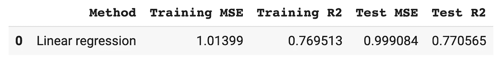
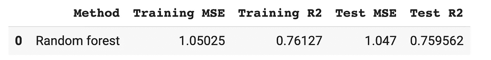
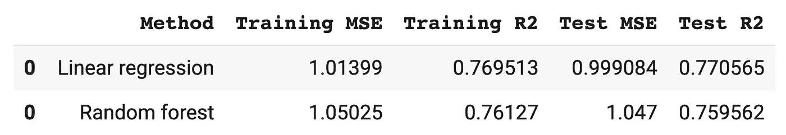
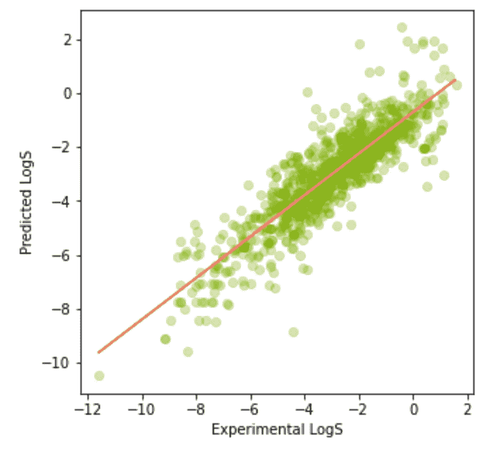

# 如何用 Python 构建你的第一个机器学习模型

> 原文：<https://towardsdatascience.com/how-to-build-your-first-machine-learning-model-in-python-e70fd1907cdd?source=collection_archive---------0----------------------->


使用来自 [envato elements](https://1.envato.market/c/2346717/628379/4662) 的 [aqrstudio](https://elements.envato.com/user/aqrstudio/) 的图像创建(经许可)。

## [数据科学](https://medium.com/tag/data-science) | [机器学习](https://medium.com/tag/machine-learning)

## 使用 Scikit-learn 库从头开始的逐步教程

答之前我写过一篇关于 [*如何构建机器学习模型的博客
(学习数据科学的可视化指南)*](/how-to-build-a-machine-learning-model-439ab8fb3fb1) ，带你踏上一次关于如何构建机器学习模型的视觉和概念之旅。这篇文章没有展示的是如何实现模型的实际构建。

在本文中，您将学习如何用 Python 构建您的第一个机器学习模型。特别是，您将使用传统的线性回归以及其他机器学习算法来构建回归模型。

我制作了下面的 YouTube 视频作为本文的补充，特别是它将让你快速了解机器学习模型构建的概念，这也在上文提到的第一篇博文中有所涉及。

[如何建立机器学习模型](https://youtu.be/NRnaMCNOK7Y) @ [数据教授 YouTube 频道](https://www.youtube.com/channel/UCV8e2g4IWQqK71bbzGDEI4Q)

# 1.你的第一个机器学习模型

那么我们今天构建的是什么机器学习模型呢？在本文中，我们将在溶解度数据集上使用随机森林算法构建一个回归模型。

建立模型后，我们将应用模型进行预测，然后进行模型性能评估和结果的数据可视化。

# 2.资料组

## 2.1.玩具数据集

那么我们要用哪个数据集呢？默认答案可能是使用玩具数据集作为示例，如 Iris 数据集(分类)或 Boston housing 数据集(回归)。

虽然这两个都是很好的例子，但通常大多数教程并不直接从外部源(例如从 CSV 文件)加载这些数据，而是直接从 Python 库(例如`scikit-learn`的`datasets`子模块)导入数据。

例如，要加载 Iris 数据集，可以使用以下代码块:

```
from sklearn import datasetsiris = datasets.load_iris()
X = iris.data
y = iris.target
```

使用玩具数据集的好处是它们使用起来超级简单，只需以一种易于用于模型构建的格式直接从库中导入数据。这种便利的缺点是，初次学习者可能实际上看不到哪些函数正在加载数据，哪些函数正在执行实际的预处理，以及哪些函数正在构建模型，等等。

## 2.2.您自己的数据集

在本教程中，我们将采取一种实用的方法，重点构建您可以轻松复制的实际模型。因为我们将直接从 CSV 文件中读入输入数据，所以您可以很容易地用您自己的数据替换输入数据，并为您自己的数据项目重新调整这里描述的工作流程。

我们今天使用的数据集是`solubility`数据集。它由 1444 行和 5 列组成。每行代表一个唯一的分子，每个分子由 4 个分子属性(前 4 列)描述，而最后一列是要预测的目标变量。该*目标变量*表示分子的溶解度，它是治疗药物的一个重要参数，因为它帮助分子在体内行进以达到其目标。

下面是`solubility`数据集的前几行。

**溶解度数据集的前几行。**

**2.2.1。加载数据**

完整的`solubility`数据集可在 Data 教授 GitHub 上通过以下链接获得: [*下载溶解度数据集*](https://github.com/dataprofessor/data/raw/master/delaney_solubility_with_descriptors.csv) 。

为了适用于任何数据科学项目，可以使用`Pandas`库将 CSV 文件中的数据内容读入 Python 环境。我将在下面的示例中向您展示如何:

```
import pandas as pddf = pd.read_csv('data.csv')
```

第一行将`pandas`库作为简称为`pd`的缩写形式导入(以便于键入)。从`pd`开始，我们将使用它的`read_csv()`功能，因此我们键入`pd.read_csv()`。通过在前面键入`pd`，我们可以知道`read_csv()`函数属于哪个库。

`read_csv()`函数中的输入参数是 CSV 文件名，在上面的例子中是`'data.csv’`。这里，我们将 CSV 文件中的数据内容分配给一个名为`df`的变量。

在本教程中，我们将使用溶解度数据集(可从[https://raw . githubusercontent . com/data professor/data/master/Delaney _ solubility _ with _ descriptors . CSV](https://raw.githubusercontent.com/dataprofessor/data/master/delaney_solubility_with_descriptors.csv)获得)。因此，我们将使用以下代码加载数据:

```
import pandas as pddf = pd.read_csv('https://raw.githubusercontent.com/dataprofessor/data/master/delaney_solubility_with_descriptors.csv')
```

**2.2.2。数据处理**

既然我们已经在`df`变量中有了数据帧，我们现在需要准备一个合适的格式供`scikit-learn`库使用，因为`df`还不能被库使用。

我们如何做到这一点？我们需要将它们分成两个变量`X`和`y`。

除最后一列外的前 4 列将被分配给`X`变量，而最后一列将被分配给`y`变量。

*2.2.2.1。给 X 分配变量*

为了将前 4 列赋给`X`变量，我们将使用以下代码行:

```
X = df.drop(['logS'], axis=1)
```

正如我们所看到的，我们通过删除最后一列(`logS`)来做到这一点。

*2.2.2.2。将变量赋给 y*

要将最后一列分配给`y`变量，我们只需选择最后一列，并将其分配给`y`变量，如下所示:

```
y = df.iloc[:,-1]
```

正如我们所看到的，我们通过显式选择最后一列来做到这一点。也可以采用两种替代方法来获得相同的结果，其中第一种方法如下:

```
y = df[‘logS’]
```

第二种方法如下:

```
y = df.logS
```

从以上选项中选择一项，然后继续下一步。

# 3.数据分割

数据分割允许对模型以前没有看到的新数据进行无偏见的评估。特别是，如果使用 80/20 的拆分比率将整个数据集拆分为训练集和测试集，那么可以使用 80%的数据子集(即我们可以称之为*训练集*)构建模型，并随后对 20%的数据子集(即我们可以称之为*测试集*)进行评估。除了在测试集上应用训练模型之外，我们还可以在训练集上应用训练模型(即，首先用于构建模型的数据)。

随后比较两种数据分割(即训练集和测试集)的模型性能，将允许我们评估模型是*欠拟合*还是*过拟合*。无论训练集和测试集的性能都很差，通常都会出现欠拟合，而在过拟合时，测试集与训练集相比性能明显不佳。

为了执行数据分割，`scikit-learn`库有`train_test_split()`函数允许我们这样做。使用此函数将数据集拆分为训练集和测试集的示例如下所示:

```
from sklearn.model_selection import train_test_splitX_train, X_test, y_train, y_test = train_test_split(
    X, y, test_size=0.2, random_state=42)
```

在上面的代码中，第一行从`sklearn.model_selection`子模块中导入了`train_test_split()`函数。如我们所见，输入参数由`X`和`y`输入数据组成，测试集大小被指定为 0.2(即 20%的数据将进入测试集，而剩余的 80%将进入训练集)，随机种子数被设置为 42。

从上面的代码中，我们可以看到我们同时为训练集(`X_train`和`y_train`)和测试集(`X_test`和`y_test`)创建了 4 个变量，它们由独立的`X`和`y`变量组成。

现在，我们准备使用这 4 个变量进行建模。

# 4.模型结构

有趣的部分来了！我们现在要建立一些回归模型。

## 4.1.线性回归

*4.1.1。模型构建*

让我们从传统的线性回归开始。

```
from sklearn.linear_model import LinearRegressionlr = LinearRegression()
lr.fit(X_train, y_train)
```

第一行从`sklearn.linear_model`子模块导入`LinearRegression()`函数。接下来，`LinearRegression()`函数被分配给`lr`变量，`.fit()`函数对输入数据`X_train`和`y_train`执行实际的模型训练。

现在模型已经建立，我们将应用它对训练集和测试集进行预测，如下所示:

```
y_lr_train_pred = lr.predict(X_train)
y_lr_test_pred = lr.predict(X_test)
```

正如我们在上面的代码中看到的，模型(`lr`)通过`lr.predict()`函数在训练集和测试集上进行预测。

*4.1.2。型号性能*

我们现在将计算性能指标，以便能够确定模型性能。

```
from sklearn.metrics import mean_squared_error, r2_scorelr_train_mse = mean_squared_error(y_train, y_lr_train_pred)
lr_train_r2 = r2_score(y_train, y_lr_train_pred)lr_test_mse = mean_squared_error(y_test, y_lr_test_pred)
lr_test_r2 = r2_score(y_test, y_lr_test_pred)
```

在上面的代码中，我们从`sklearn.metrics`子模块中导入了`mean_squared_error`和`r2_score`函数来计算性能指标。两个函数的输入参数是实际的 **Y** 值(`y`)和预测的 **Y** 值(`y_lr_train_pred`和`y_lr_test_pred`)。

让我们来谈谈这里使用的命名约定，我们将函数分配给自解释变量，明确地告诉变量包含什么。例如，`lr_train_mse`和`lr_train_r2`明确地告诉变量包含使用训练集上的线性回归构建的模型的性能度量 MSE 和 R2。使用这种命名约定的优点是，使用不同的机器学习算法构建的任何未来模型的性能指标都可以通过其变量名轻松识别。例如，我们可以使用`rf_train_mse`来表示使用随机森林构建的模型的训练集的 MSE。

可以通过简单地打印变量来显示性能指标。例如，要打印出训练集的 MSE:

```
print(lr_train_mse)
```

这就给出了`1.0139894491573003`。

要查看其他 3 个指标的结果，我们也可以一个接一个地打印出来，但是这样会有点重复。

另一种方法是生成 4 个指标的整洁显示，如下所示:

```
lr_results = pd.DataFrame(['Linear regression',lr_train_mse, lr_train_r2, lr_test_mse, lr_test_r2]).transpose()lr_results.columns = ['Method','Training MSE','Training R2','Test MSE','Test R2']
```

它产生以下数据帧:



## 4.2.随机森林

随机森林(RF)是一种集成学习方法，它结合了几个决策树的预测。RF 的一个优点是其内置的特征重要性(即它为构建的模型生成的基尼指数值)。

*4.2.1。模型构建*

现在，让我们使用以下代码构建一个 RF 模型:

```
from sklearn.ensemble import RandomForestRegressorrf = RandomForestRegressor(max_depth=2, random_state=42)
rf.fit(X_train, y_train)
```

在上面的代码中，第一行从`sklearn.ensemble`子模块导入了`RandomForestRegressor`函数(也可以称为回归变量)。这里应该注意的是`RandomForestRegressor`是回归版本(即当 Y 变量包含数值时使用),而它的姊妹版本是`RandomForestClassifier`,它是分类版本(即当 Y 变量包含分类值时使用)。

在本例中，我们将`max_depth`参数设置为 2，随机种子号(通过`random_state`)设置为 42。最后，使用`rf.fit()`函数训练模型，我们将`X_train`和`y_train`设置为输入数据。

我们现在将应用构建的模型对训练集和测试集进行预测，如下所示:

```
y_rf_train_pred = rf.predict(X_train)
y_rf_test_pred = rf.predict(X_test)
```

与在`lr`模型中使用的方式类似，`rf`模型也用于通过`rf.predict()`函数对训练集和测试集进行预测。

*4.2.2。型号性能*

现在，让我们计算构建的随机森林模型的性能指标，如下所示:

```
from sklearn.metrics import mean_squared_error, r2_scorerf_train_mse = mean_squared_error(y_train, y_rf_train_pred)
rf_train_r2 = r2_score(y_train, y_rf_train_pred)rf_test_mse = mean_squared_error(y_test, y_rf_test_pred)
rf_test_r2 = r2_score(y_test, y_rf_test_pred)
```

为了合并结果，我们使用以下代码:

```
rf_results = pd.DataFrame(['Random forest',rf_train_mse, rf_train_r2, rf_test_mse, rf_test_r2]).transpose()rf_results.columns = ['Method','Training MSE','Training R2','Test MSE','Test R2']
```

它产生:



## 4.3.其他机器学习算法

为了使用其他机器学习算法建立模型(除了我们上面使用的`[sklearn.ensemble.RandomForestRegressor](https://scikit-learn.org/stable/modules/generated/sklearn.ensemble.RandomForestRegressor.html)`，我们只需要从可用的回归变量中决定使用哪种算法(即，因为数据集的 Y 变量包含分类值)。

*4.3.1。回归变量列表*

让我们来看看我们可以从中选择的一些回归变量示例:

*   `[sklearn.linear_model.Ridge](https://scikit-learn.org/stable/modules/generated/sklearn.linear_model.Ridge.html)`
*   `[sklearn.linear_model.SGDRegressor](https://scikit-learn.org/stable/modules/generated/sklearn.linear_model.SGDRegressor.html)`
*   `[sklearn.ensemble.ExtraTreesRegressor](https://scikit-learn.org/stable/modules/generated/sklearn.ensemble.ExtraTreesRegressor.html)`
*   `[sklearn.ensemble.GradientBoostingRegressor](https://scikit-learn.org/stable/modules/generated/sklearn.ensemble.GradientBoostingRegressor.html)`
*   `[sklearn.neighbors.KNeighborsRegressor](https://scikit-learn.org/stable/modules/generated/sklearn.neighbors.KNeighborsRegressor.html)`
*   `[sklearn.neural_network.MLPRegressor](https://scikit-learn.org/stable/modules/generated/sklearn.neural_network.MLPRegressor.html)`
*   `[sklearn.tree.DecisionTreeRegressor](https://scikit-learn.org/stable/modules/generated/sklearn.tree.DecisionTreeRegressor.html)`
*   `[sklearn.tree.ExtraTreeRegressor](https://scikit-learn.org/stable/modules/generated/sklearn.tree.ExtraTreeRegressor.html)`
*   `[sklearn.svm.LinearSVR](https://scikit-learn.org/stable/modules/generated/sklearn.svm.LinearSVR.html)`
*   `[sklearn.svm.SVR](https://scikit-learn.org/stable/modules/generated/sklearn.svm.SVR.html)`

有关更详细的回归量列表，请参考`Scikit-learn`的 [API 参考](https://scikit-learn.org/stable/modules/classes.html)。

*4.3.2。使用回归器*

假设我们想要使用`[sklearn.tree.ExtraTreeRegressor](https://scikit-learn.org/stable/modules/generated/sklearn.tree.ExtraTreeRegressor.html)`,我们将如下使用:

```
from sklearn.tree import ExtraTreeRegressoret = ExtraTreeRegressor(random_state=42)
et.fit(X_train, y_train)
```

注意我们是如何为`[sklearn.tree.ExtraTreeRegressor](https://scikit-learn.org/stable/modules/generated/sklearn.tree.ExtraTreeRegressor.html)`导入回归函数的，如下所示:
`from sklearn.tree import ExtraTreeRegressor`

然后，回归函数被分配给一个变量(即本例中的`et`)，并通过`.fit()`函数进行模型训练，如`et.fit()`所示。

## 4.4.合并结果

让我们回忆一下，我们之前为线性回归和随机森林模型生成的模型性能指标存储在`lr_results`和`rf_results`变量中。

由于两个变量都是数据帧，我们将使用如下所示的`pd.concat()`函数将它们组合起来:

```
pd.concat([lr_results, rf_results])
```

这会产生以下数据帧:



应注意的是，附加学习方法的性能指标也可以通过添加到列表`[lr_results, rf_results]`中来添加。

例如，`svm_results`可以被添加到列表中，然后成为`[lr_results, rf_results, svm_results]`。

# 5.预测结果的数据可视化

现在，让我们将实际 Y 值与其预测 Y 值的关系可视化，即实验对数与预测对数值的关系。

```
import matplotlib.pyplot as plt
import numpy as npplt.figure(figsize=(5,5))
plt.scatter(x=y_train, y=y_lr_train_pred, c="#7CAE00", alpha=0.3)z = np.polyfit(y_train, y_lr_train_pred, 1)
p = np.poly1d(z)plt.plot(y_train,p(y_train),"#F8766D")
plt.ylabel('Predicted LogS')
plt.xlabel('Experimental LogS')
```

如上所示，我们将使用`Matplotlib`库制作散点图，而`Numpy`用于生成数据的趋势线。这里，我们通过`plt.figure()`功能的`figsize`参数将图形尺寸设置为 5 × 5。

`plt.scatter()`函数用于创建散点图，其中`y_train`和`y_lr_train_pred`(即通过线性回归得到的训练集预测)用作输入数据。使用`#7CAE00`的 HTML 颜色代码(十六进制代码)将颜色设置为绿色。



通过`np.polyfit()`功能绘制的趋势线，并通过`plt.plot()`功能显示，如上图所示。最后，分别通过`plt.xlabel()`和`plt.ylabel()`功能添加 X 轴和 Y 轴标签。

渲染的散点图显示在左侧。

# 下一步是什么？

恭喜你建立了你的第一个机器学习模型！

你可能会问，接下来是什么？答案很简单，多建模型！调整参数，尝试新算法，为机器学习管道添加新功能，最重要的是，不要害怕犯错。事实上，加速你学习的最快途径是经常失败，爬起来再试一次。学习是享受过程，如果你坚持足够长的时间，你会在成为数据专家的道路上变得更加自信，无论是数据科学、数据分析师还是数据工程师。但最重要的是，正如我常说的:

> “学习数据科学的最佳方式是研究数据科学”

## [订阅我的邮件列表，获取我在数据科学方面的最佳更新(偶尔还有免费内容)!](http://newsletter.dataprofessor.org/)

# 关于我

我是泰国一所研究型大学的生物信息学副教授和数据挖掘和生物医学信息学负责人。在我下班后的时间里，我是一名 YouTuber(又名[数据教授](http://bit.ly/dataprofessor/))制作关于数据科学的在线视频。在我制作的所有教程视频中，我也在 GitHub 上分享 Jupyter 笔记本([数据教授 GitHub 页面](https://github.com/dataprofessor/))。

<https://www.youtube.com/dataprofessor>  

# 在社交网络上与我联系

✅YouTube:[http://youtube.com/dataprofessor/](http://youtube.com/dataprofessor/)
♇网站:[http://dataprofessor.org/](https://www.youtube.com/redirect?redir_token=w4MajL6v6Oi_kOAZNbMprRRJrvJ8MTU5MjI5NjQzN0AxNTkyMjEwMDM3&q=http%3A%2F%2Fdataprofessor.org%2F&event=video_description&v=ZZ4B0QUHuNc)(在建)
♇LinkedIn:[https://www.linkedin.com/company/dataprofessor/](https://www.linkedin.com/company/dataprofessor/)
♇Twitter:[https://twitter.com/thedataprof](https://twitter.com/thedataprof)
♇Facebook:[http://facebook.com/dataprofessor/](https://www.youtube.com/redirect?redir_token=w4MajL6v6Oi_kOAZNbMprRRJrvJ8MTU5MjI5NjQzN0AxNTkyMjEwMDM3&q=http%3A%2F%2Ffacebook.com%2Fdataprofessor%2F&event=video_description&v=ZZ4B0QUHuNc)
♇github:[https://github.com/dataprofessor/](https://github.com/dataprofessor/)
♇insta gram: