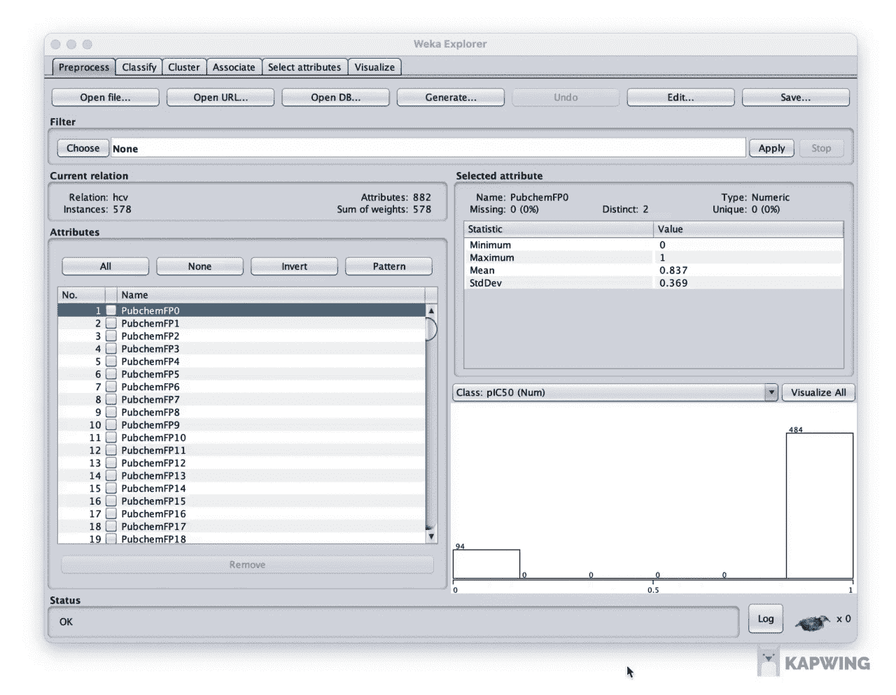

# 如何不用代码构建你的第一个机器学习模型

> 原文：<https://towardsdatascience.com/how-to-build-your-first-machine-learning-model-using-no-code-a7cf8db37dd1?source=collection_archive---------16----------------------->


由 [envato elements](https://1.envato.market/c/2346717/628379/4662) 的 [visuelcolonie](https://elements.envato.com/user/visuelcolonie) 使用图像创建(经许可)。

## [入门](https://towardsdatascience.com/tagged/getting-started)

## 使用 WEKA 的药物发现数据集的端到端教程

你是否曾经想开始机器学习，但也许不知道如何编码的恐惧阻碍了你？

不用担心，因为在本文中，您将学习如何使用药物发现数据集，以一步一步的方式从零开始为端到端项目构建机器学习模型。

这篇文章是初学者友好的，因为提供了计算和生物学概念的解释。

我们这里有很多要讲的，所以让我们开始吧！

# 1.高级概述

## 1.1.本教程中使用的数据

本教程中使用的药物发现数据集将构成已被测试其作为抗丙型肝炎病毒药物潜力的分子。特别地，来自丙型肝炎病毒的 NS5B 蛋白已经针对分子文库进行了实验测试。我们的研究小组从 ChEMBL 数据库中编译了一个数据集，然后使用随机森林建立了一个机器学习模型。最好的模型被部署为一个名为 HCVpred 的 web 服务器。

该研究的概念框架总结如下，关于该程序的进一步细节将在下一节展开。


HCVpred 研究的概念框架。由作者绘制。

以下链接提供了描述该研究全部细节的研究文章:

[](https://onlinelibrary.wiley.com/doi/abs/10.1002/jcc.26223) [## 预测丙型肝炎病毒 NS5B 抑制剂生物活性的网络服务器

### 医学系数据挖掘和生物医学信息学通讯作者中心

onlinelibrary.wiley.com](https://onlinelibrary.wiley.com/doi/abs/10.1002/jcc.26223) 

## 1.2.模型建立过程

现在让我们来看看我们将在本教程中构建的机器学习模型。

在下图中，您可以在左侧看到示意图，而步骤或程序名称显示在右侧。


机器学习模型构建的示意性工作流程的卡通插图，其中目标响应变量(Y)被预测为输入分子特征(X)的函数。从技术上讲，这个过程被称为*定量结构-活性关系* (QSAR)。由作者绘制。

这里，我们从**分子** ( *分子 1* 和*分子 2* )开始，它们通常由它们的 SMILES 符号表示(*即*数据集中的`CANONICAL_SMILES`列，我们将在下一节中看到)。SMILES 是简化分子输入行输入系统的首字母缩写，用于表示分子的化学结构([更多信息请点击](http://simplified molecular-input line-entry system))。把它想象成把分子的化学结构信息以文本形式转化到计算机中的一种方式。

接下来，我们计算**分子描述符**，这是一个将 SMILES 符号作为输入的过程，以便将其转换为描述每个分子独特分子特征的有意义的数字形式。该图显示分子由一串二进制数编码，如 1011001100011010，其中每个数字代表感兴趣的分子特征，而 0 和 1 表示该分子特征的存在或不存在。

分子(*即*行)及其相应分子描述符(*即*即`X1` - `X16`列)和生物活性类别标签(*即*即`Y`列)的集合将构成**数据集**。

然后使用数据集作为输入来构建机器学习模型。经过训练的模型现在可以用来对新化合物进行预测。

最后，通过**特征重要性**图分析特征，可以从训练好的模型中获得洞察力。

# 2.资料组

## 2.1.关于数据集

HCVpred 数据集由总共 578 个分子组成，已经通过实验测试了这些分子针对靶蛋白(丙型肝炎病毒 NS5B)的生物活性。如果一个分子能够有效地结合靶蛋白，那么它将被认为是一个有前途的候选药物。

因此，上述研究的目标是构建能够预测作为分子指纹(*即*分子特征的数值表示)的函数的生物活性(*即*pIC50 值)的机器学习模型。应当注意，pIC50 值代表 **Y** 变量，而分子指纹代表 **X** 变量。

## 2.2.下载数据集

数据集托管在以下 GitHub 存储库( [**下载 HCV_NS5B_Curated.csv**](https://raw.githubusercontent.com/chaninlab/hcvpred/master/HCV_NS5B_Curated.csv) 文件):

[](https://github.com/chaninlab/hcvpred/) [## chaninlab/hcvpred

### HCVpred。在 GitHub 上创建一个帐户，为 chaninlab/hcvpred 开发做出贡献。

github.com](https://github.com/chaninlab/hcvpred/) 

数据集的摘录如下所示:

ChEMBL 数据通过知识共享署名-共享 3.0 无版权许可提供。

## 2.3.我们将使用什么

简言之，在本教程中，我们将使用`CMPD_CHEMBLID`、`CANONICAL_SMILES`和`pIC50`列。计算分子指纹(*即*X 变量)时将需要`CMPD_CHEMBLID`和`CANONICAL_SMILES`列，而`pIC50`列将作为 **Y** 变量使用。

# 3.软件

## 3.1.Java 语言(一种计算机语言，尤用于创建网站)

Java 是一种解释语言，它允许程序跨平台运行在所有操作系统上，比如本教程中使用的 WEKA 和 PaDEL。


首先，确保你的电脑上安装了 Java。最简单的方法是打开一个终端(Windows 中的 Power Shell ),输入`java`,然后按回车键。

如果您看到如下内容，那么您可以继续，否则您可以继续安装 Java。

## 3.2.新西兰黑秧鸡

WEKA 是用 Java 开发的开源机器学习软件，它有一个图形用户界面，允许用户通过点击来使用该软件。


WEKA 是怀卡托知识分析环境的首字母缩写，由新西兰怀卡托大学开发。

WEKA 是一个全面的工具，允许用户执行数据准备、分类、回归、聚类、关联规则挖掘和可视化。Weka 也是一种在新西兰发现的土著鸟的名字，用在他们的标志上，如左图所示。

现在，进入 [**为你的操作系统(Windows、Mac OSX 和 Linux)下载 WEKA**](https://waikato.github.io/weka-wiki/downloading_weka/) 。最后，启动 WEKA，您应该会看到如上所示的用户界面。

## 3.3.PaDEL 描述符

PaDEL-Descriptor 是一个分子描述符计算软件，可以将 SMILES 符号转换为分子描述符。PaDEL 支持 1D、2D 和 3D 描述符以及分子指纹的计算。在这项研究中，我们将使用 HCVpred 最初发表的论文中使用的分子指纹。

现在，进入 [**下载 PaDEL-Descriptor**](http://www.yapcwsoft.com/dd/padeldescriptor/PaDEL-Descriptor.zip) ，可以在所有操作系统上运行。

解压缩 ZIP 文件会显示以下内容:


PaDEL-Descriptor ZIP 文件内容的屏幕截图。

最后，通过双击`PaDEL-Descriptor.jar`文件启动 PaDEL-Descriptor 软件，您应该会看到以下内容:


PaDEL-Descriptor 软件的屏幕截图。

# 4.计算分子描述符

## 4.1.准备 PaDEL 输入文件

在我们使用 PaDEL-Descriptor 软件计算分子描述符之前，我们首先要准备输入文件。

我们将分两步完成:

1.  将`CANONICAL_SMILES`和`CMPD_CHEMBLID`列复制并粘贴到一个新的电子表格文件中，如下所示。


显示如何将输入文件准备到 PaDEL-Descriptor 软件的屏幕截图。

2.将文件保存为`Tab delimited Text (.txt)`文件格式，并命名为`molecule.smi`。


显示将文件保存为制表符分隔的文本(.txt)，然后指定文件名为 molecule.smi

值得注意的是，我们已经删除了标题行(*即*指定列名的第一行)，这样第一行立即以 SMILES 符号及其相应的分子 ID 开始。

另一个需要检查的重要事情是，文件保存后，文件名可能是`molecule.smi.txt`，如果是这样，请将其重命名为`molecule.smi`。

## 4.2.计算描述符

现在让我们按如下所述计算分子指纹。

1.  启动 PaDEL-Descriptor 软件，确保勾选下图所示的指定框，并填写目录名和输出文件名。

那么这些勾选框是什么意思呢？


显示参数设置和使用 PaDEL-Descriptor 启动描述符计算的屏幕截图。

***指纹*** 将指定我们将计算分子指纹(*即*我们将在下一步中指定我们想要选择 12 种指纹类型中的哪一种)。

**标准化**部分下的参数将通过去除盐、检测芳香性、标准化互变异构体和标准化硝基来标准化化学结构。

2.点击顶部的**指纹**标签。接下来，确保勾选`PubchemFingerprinter`框。(*即*您也可以尝试使用其他指纹类型，但重要的是只选择一种指纹类型，否则在分析过程中可能会混淆我们使用的是哪一种)。

最后，点击**开始**按钮，开始描述符计算过程。

## 4.3.检查输出文件

然后，检查生成的输出文件，以查看计算是否顺利，或者是否导致了错误。

**4.3.1。成功运行**

一次成功的运行应该会生成如下所示的输出`descriptors.csv`文件:

相应的日志文件`descriptors.csv.log`如下所示:

**4.3.2。不成功的运行**

但是，如果计算因错误而崩溃，您可能只会看到`descriptors.csv`文件中的标题行。

对于日志文件，您可能会看到如下错误:

# 5.建模前的数据准备

在我们继续建模之前，我们首先必须将 **X** 和 **Y** 变量合并到同一个文件中。在第 4.2 节中，我们已经计算了描述符(*即*变量 **X** 变量)，在本节中，我们将添加`pIC50`列(即 **Y** 变量)作为最后一列。

请注意，在下面的动画图像中，我们创建了一个新文件，它结合了 **X** 和 **Y** 变量。最后，我们将文件保存为 CSV 文件。因此，我们将该文件命名为`hcv.csv`。


显示 X 和 Y 变量组合的屏幕截图。

# 6.模型结构

现在我们有了预处理的数据集，让我们继续使用 WEKA 构建机器学习模型。

## 6.1.启动 WEKA

*   启动 WEKA 软件，您应该会看到以下用户界面:


*   继续点击**浏览器**。资源管理器窗口现在将启动。

## 6.2.加载数据集

*   点击最左侧`Preprocess`选项卡下的`Open file…`按钮，加载数据集。这将弹出一个文件选择窗口，所以继续选择要加载的文件类型为`CSV`，然后选择您之前准备好的`hcv.csv`文件。


显示如何将 CSV 数据集加载到 WEKA 的屏幕截图。

*   让我们花一点时间熟悉一下用户界面。用户界面的每个组件都在下面的屏幕截图和说明段落中进行了编号。


解释 WEKA 用户界面的截图。

1.  **顶栏**包含几个我们可以执行的机器学习任务标签，包括:`Preprocess`、`Classify`、`Cluster`、`Associate`、`Select attributes`和`Visualize`。
2.  后续栏包含几个与**文件输入/输出**相关的按钮，您可以在此加载和保存数据。
3.  **过滤器**栏包含所有实用功能，允许您执行数百个数据处理任务。
4.  **当前关系**栏包含关于数据集的信息:`Relation`(数据集名称)、`Instances`(行数)、`Attributes`(列数)和`sum of weights`(等于实例数，因为实例没有加权)。
5.  **属性**框列出了应用**过滤器**栏中的功能时可以勾选或取消勾选的所有变量(列)。
6.  **选择属性**框包含变量的汇总统计，如最小值、最大值、平均值和标准偏差。
7.  右下方的**图**框以柱状图的形式显示了数据分布的可视化。

## 6.3.数据预处理

让我们放弃所有的低方差变量。

*   点击**过滤器**标签下的`Choose`按钮。接下来，点击→`weka`>`filters`>`unsupervised`>`attributes`>`RemoveUseless`
*   点击`Apply`按钮，您将看到低方差变量将被移除。

***注意:*** 注意，我们从最初的 882 开始变成 550；请注意，变量编号包括 **X** 和 **Y** 变量；另一点需要注意的是，WEKA 对 Class 变量有一个例外，它不会对 **Y** 变量应用低方差过滤器。



显示如何移除低方差特征的屏幕截图。

## 6.4.构建回归模型

**6.4.1。建立模型(训练集)**

现在，让我们构建一个线性回归模型，该模型是使用训练集构建的，并在训练集上评估该模型。

*   点击最顶端栏中的`Classify`选项卡。
*   点击**分类器**栏下的`Choose`按钮。接下来，点击`weka` → `classifiers` → `functions` → `LinearRegression`。
*   点击**分类器**栏下显示`LinearRegression`的白色栏，弹出一个窗口，允许您调整学习算法的参数设置。
*   在**测试选项**框中，选择`Use training set`单选按钮，以使用训练集执行模型构建。
*   点击**开始**按钮，启动模型建立过程。

**注意:**需要注意的是，本教程中还没有进行数据分割，最好保存到以后的教程中。或者你也可以把这个机会当作家庭作业，弄清楚如何进行数据拆分。(提示:预处理选项卡，**滤镜**→`Choose`→`weka`→`filters`→`unsupervised`→`instance`→`RemovePercentage`)。


显示如何建立线性回归模型的屏幕截图。

*   模型建立后，您将在**分类器输出**框中看到模型输出(线性回归方程)和模型性能(在底部)。


让我们看看从**分类器输出**框复制的模型性能。

```
=== Evaluation on training set ===Time taken to test model on training data: 0.03 seconds=== Summary ===Correlation coefficient                  0.9231
Mean absolute error                      0.3599
Root mean squared error                  0.475 
Relative absolute error                 34.4828 %
Root relative squared error             38.4562 %
Total Number of Instances              578
```

在这里，您可以看到`correlation coefficient`(即我们可以用来评估回归模型性能的指标；该度量测量实际值与预测值之间的相关性)为训练集提供了良好的性能。

**6.4.2。构建交叉验证模型**

现在，让我们构建一个 10 重交叉验证模型，将数据集分成 10 等份。接下来，这些部分中的 9 个被用作*训练集*并用于训练模型，然后应用该模型对作为*测试集*被遗漏的 1 个部分进行预测。这个过程总共迭代 10 次，每次迭代将使用不同的折叠作为测试集。最后，模型性能是这 10 个模型的平均值。

应该注意的是，交叉验证模型的计算时间将明显长于训练集的计算时间，部分原因是 10 个模型是为 10 重交叉验证而构建的。

*   点击`Cross-validation`单选按钮，并点击**开始**按钮。
*   默认情况下，折叠次数设置为 10 次(*即*即 10 次交叉验证)，可以改为 5 次，即 5 次交叉验证。


**6.4.3。应用模型对测试集进行预测**

还记得前面提到的关于如何执行数据分割的提示吗？假设您已经执行了数据拆分，您将使用 80/20 的拆分比率将原始完整数据集拆分为两个独立的文件:1) training_set.csv 和 2) testing_set.csv。接下来，您可以通过在 training_set.csv 中加载来使用训练集，然后按照以下过程操作:

*   点击`Supplied test set`单选按钮，然后点击`Set…`按钮，这将弹出一个要求测试集的窗口(你可以点击 testing_set.csv 文件)。
*   最后，点击**开始**按钮启动预测过程。

**6.4.4。如何使用另一种学习算法**

前面，我们已经建立了一个线性回归模型，在这一节中，我们将介绍如何选择另一种学习算法。

*   点击最顶端栏中的`Classify`选项卡。
*   点击`Choose` → `weka` → `classifiers`，会看到根据学习类型分组的不同类型的学习算法，如`bayes`、`functions`、`lazy`、`meta`、…、`trees`。早些时候，我们想要建立一个线性回归模型，在`functions`中可以找到这样做的函数。或者，如果我们想选择随机森林，我们可以点击`trees` → `RandomForest`。因此，整个序列将变成`Choose` → `weka` → `classifiers` → `trees` → `RandomForest`。
*   点击**分类器**栏下的白色栏，显示学习算法的名称，如`LinearRegression`或`RandomForest`，弹出一个窗口，允许您调整学习算法的参数设置。

# 结论

在本文中，您已经学习了如何为自己参与创建的药物发现数据集构建机器学习模型。

那么下一步是什么？下面是您接下来可以做的事情:

*   执行数据拆分
*   执行模型基准测试，即构建几个不同的模型，努力找到性能最佳的模型。您可以通过*改变学习算法*来构建几个模型，并比较最终的模型性能。
*   通过尝试使用不同的超参数集来执行超参数调整，以获得最佳模型。

如果您准备好了，可以在下面的文章中探索如何将 Python 用于数据科学:

[](/how-to-master-python-for-data-science-1fb8353718bf) [## 数据科学如何掌握 Python

### 这是数据科学所需的基本 Python

towardsdatascience.com](/how-to-master-python-for-data-science-1fb8353718bf) 

# 补充视频

## 如何使用 WEKA 建立机器学习模型

在继续之前，应该注意的是，这篇文章是我就同一主题制作的 YouTube 视频的一个端口。这篇文章已经扩展到最好地传达教程。

视频展示了如何构建

## 用于药物发现的机器学习(用 2 分钟解释)

在这个 YouTube 视频中提供了关于如何使用机器学习进行药物发现的简明解释。

# 接下来读这些

*   [**如何用 Python 构建 AutoML App**](/how-to-build-an-automl-app-in-python-e216763d10cd)
    *使用 Streamlit 库的分步教程*
*   [**学习数据科学的策略**](/strategies-for-learning-data-science-47053b58c19f)
    *打入数据科学的实用建议*
*   [**如何免费搭建一个简单的作品集网站**](/how-to-build-a-simple-portfolio-website-for-free-f49327675fd9)
    *不到 10 分钟从头开始的分步教程*

## ✉️ [订阅我的邮件列表，获取我在数据科学方面的最佳更新(偶尔还有免费内容)!](http://newsletter.dataprofessor.org/)

# 关于我

我是泰国一所研究型大学的生物信息学副教授和数据挖掘和生物医学信息学负责人。在我下班后的时间里，我是一名 YouTuber(又名[数据教授](http://bit.ly/dataprofessor/))制作关于数据科学的在线视频。在我做的所有教程视频中，我也在 GitHub 上分享 Jupyter 笔记本([数据教授 GitHub 页面](https://github.com/dataprofessor/))。

[](https://www.youtube.com/dataprofessor) [## 数据教授

### 数据科学、机器学习、生物信息学、研究和教学是我的激情所在。数据教授 YouTube…

www.youtube.com](https://www.youtube.com/dataprofessor) 

# 在社交网络上与我联系

✅YouTube:[http://youtube.com/dataprofessor/](http://youtube.com/dataprofessor/)
♇网站:[http://dataprofessor.org/](https://www.youtube.com/redirect?redir_token=w4MajL6v6Oi_kOAZNbMprRRJrvJ8MTU5MjI5NjQzN0AxNTkyMjEwMDM3&q=http%3A%2F%2Fdataprofessor.org%2F&event=video_description&v=ZZ4B0QUHuNc)(在建)
♇LinkedIn:[https://www.linkedin.com/company/dataprofessor/](https://www.linkedin.com/company/dataprofessor/)
♇Twitter:[https://twitter.com/thedataprof](https://twitter.com/thedataprof)/
♇Facebook:[http://facebook.com/dataprofessor/](https://www.youtube.com/redirect?redir_token=w4MajL6v6Oi_kOAZNbMprRRJrvJ8MTU5MjI5NjQzN0AxNTkyMjEwMDM3&q=http%3A%2F%2Ffacebook.com%2Fdataprofessor%2F&event=video_description&v=ZZ4B0QUHuNc)
♇github:[https://github.com/dataprofessor/](https://github.com/dataprofessor/)
ϝinsta