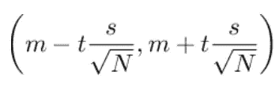
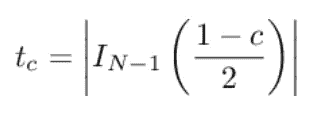

# 如何在 Python 中计算置信区间

> 原文：<https://towardsdatascience.com/how-to-calculate-confidence-intervals-in-python-a8625a48e62b?source=collection_archive---------0----------------------->

## 关于如何在 Python 中计算置信区间的简便指南


*照片由*[*edge 2 edge Media*](https://unsplash.com/@edge2edgemedia?utm_source=unsplash&utm_medium=referral&utm_content=creditCopyText)*[*Unsplash*](https://unsplash.com/s/photos/statistics?utm_source=unsplash&utm_medium=referral&utm_content=creditCopyText)*

*当我们测量一些东西时，我们总是要计算结果的不确定性。置信区间是一个非常有用的工具，用来计算一个范围，在这个范围内，我们可以找到具有一定置信度的可观测值的真实值。*

# *什么是置信区间？*

*想象你问我身高。我可以说我身高 1.93 米，但我不会给你任何关于这个测量的不确定性的信息。置信区间是我们有一定的信心找到我们测量的可观测值的真实值的区间。科学家通常会寻找 95%的置信区间，但使用 90%甚至 99%也很常见。所以，当你问我的身高时，我应该用一个误差估计或者一个置信区间来回答你，比如“有 95%的把握我身高 1.92 米到 1.93 米”。*

*这就是这个工具给我们的:一个区间，在这里可以找到可观察的真实价值。*

*置信区间的一些有用属性是:*

*   *固定置信度，当样本量增加时，区间越来越窄。这是由于大数定律*
*   *固定样本中的点数，当置信度增加时，区间越来越宽。所以，要有更大的信心，就要有更大的区间。*

*在数据科学和统计学中，置信区间对于给出我们测量的科学结果非常有用，其他科学家可以用它来比较他们的结果和我们的结果。*

# *置信区间公式*

*在本文中，我将介绍样本平均值的置信区间的计算，这是对总体期望值的估计。*

*给定 *m* 平均值、 *s* 样本标准差和 *N* 样本量，置信区间由以下公式定义:*

**

*有一个 *t* 参数，你可以看到，它与我们想要的置信度有关。这个参数的计算可以用不同的方式来完成。如果我们的样本量很小(即少于 30 点)，我们可以使用学生的 t 分布来计算它。给定置信度，我们必须选择 *t* 的值，该值给出[ *-t，t* ]区间中的分布面积，该面积等于我们的置信度。*

*从数学上讲，给定一个等于 *c* 的置信度值， *t* 对应的值为:*

**

*其中 *I(x)* 是学生的具有 *N-1* 个自由度的逆累积分布函数。实际上，它是我们从 1 中减去置信度后，分布的右尾等于剩余面积的一半的值。这样，包含在尾部之间的面积就等于我们想要的置信度。*

*如果样本量很大(即大于 30 个点)，我们可以用正态分布来近似学生的 t 分布，并忽略自由度。*

*这些分布背后的原因是中心极限定理的结果。对于大样本，样本平均值的行为类似于高斯变量(如果测量值是独立的且总体方差有限)。对于小样本量，我们使用学生的 t 分布。*

# *使用引导程序*

*关注我的文章的人都知道我非常喜欢[引导技术](https://www.yourdatateacher.com/2021/04/19/the-bootstrap-the-swiss-army-knife-of-any-data-scientist/)。这是因为它是一个无偏的算法，不对数据集的分布做任何假设。*

*我们可以使用 bootstrap 来计算置信区间，方法如下:*

1.  *基于我们的数据集创建一个新的样本，替换掉相同数量的点*
2.  *计算平均值并存储在数组或列表中*
3.  *多次重复该过程(例如 1000 次)*
4.  *在平均值列表中，计算 2.5%和 97.5%的值(如果您想要 95%的置信区间)*

*Bootstrap 给了我们一个无偏的估计，支付了复杂算法的计算成本。当编写这样的算法不成问题时，我更喜欢使用它，但通常在几乎所有情况下，您都可以安全地使用原始公式。*

# *Python 中的置信区间计算器*

*现在让我们使用 Student 的 t 分布和 bootstrap 技术来计算 Python 中的置信区间。*

*让我们导入一些有用的库。*

```
*import numpy as np 
from scipy.stats import t*
```

*现在让我们模拟一个数据集，它由从正态分布中提取的 100 个数字组成。*

```
*x = np.random.normal(size=100)*
```

*让我们看看我们要计算平均值的 95%置信区间。让我们根据置信区间的公式来计算我们需要的所有数字。*

```
*m = x.mean() 
s = x.std() 
dof = len(x)-1 
confidence = 0.95*
```

*我们现在需要 *t* 的值。计算逆累积分布的函数是 *ppf。*我们需要应用绝对值，因为累积分布适用于左尾，所以结果将是负的。*

```
*t_crit = np.abs(t.ppf((1-confidence)/2,dof))*
```

*现在，我们可以应用原始公式来计算 95%的置信区间。*

```
*(m-s*t_crit/np.sqrt(len(x)), m+s*t_crit/np.sqrt(len(x))) # (-0.14017768797464097, 0.259793719043611)*
```

*我们知道这是正确的，因为正态分布的均值为 0，但如果我们对总体一无所知，我们可以说，在 95%的置信度下，总体的期望值介于-0.14 和 0.26 之间。*

*我们可以用无偏的 bootstrap 得出同样的结果。在这个例子中，我创建了数据集的 1000 个重采样(带有替换)。*

```
*values = [np.random.choice(x,size=len(x),replace=True).mean() for i in range(1000)] np.percentile(values,[100*(1-confidence)/2,100*(1-(1-confidence)/2)]) # array([-0.13559955, 0.26480175])*
```

*正如我们所看到的，这个结果几乎等于我们用封闭公式得出的结果。*

# *结论*

*置信区间很容易计算，可以为数据分析师和科学家提供非常有用的见解。它们给出了非常强大的误差估计，如果使用正确，可以真正帮助我们从数据中提取尽可能多的信息。*

**Gianluca Malato 是一名数据科学家，在*<http://www.yourdatateacher.com/>**上教授机器学习和数据科学。***

***原载于 2021 年 11 月 8 日 https://www.yourdatateacher.com**的* [*。*](https://www.yourdatateacher.com/2021/11/08/how-to-calculate-confidence-intervals-in-python/)**