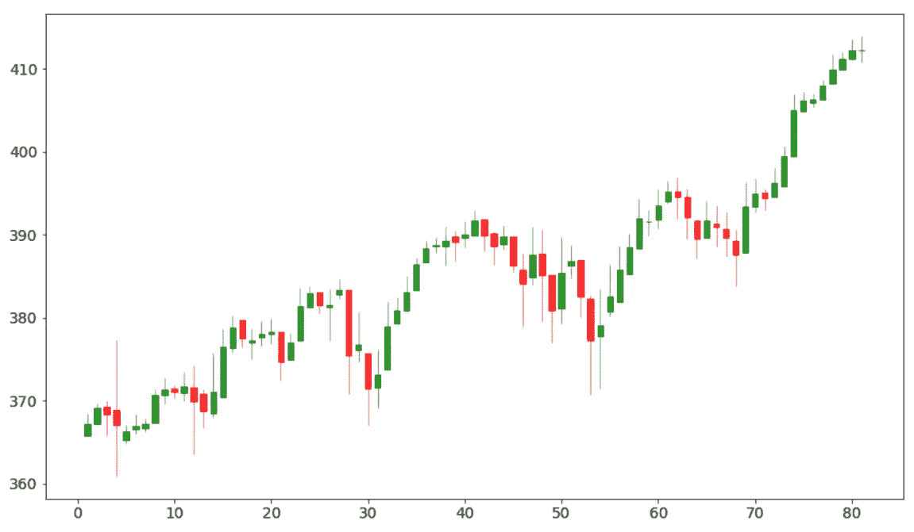

# 如何在 Python 中计算用于交易的 Heikin Ashi 蜡烛

> 原文：<https://towardsdatascience.com/how-to-calculate-heikin-ashi-candles-in-python-for-trading-cff7359febd7?source=collection_archive---------2----------------------->

## 让我们看看如何在 Python 中使用这个强大的交易工具


Heikin Ashi 烛台图表示例。图片由作者提供。

***注来自《走向数据科学》的编辑:*** *虽然我们允许独立作者根据我们的* [*规则和指导方针*](/questions-96667b06af5) *发表文章，但我们不认可每个作者的贡献。你不应该在没有寻求专业建议的情况下依赖一个作者的作品。详见我们的* [*读者术语*](/readers-terms-b5d780a700a4) *。*

定量交易者知道他们需要从价格图表中提取尽可能多的信息。价格波动是发现交易机会的一种非常有用的技术，但有时很难读懂，因为蜡烛图可能很乱或很嘈杂。所以，交易者需要一个工具来平滑价格波动并消除噪音。Heikin Ashi 蜡烛可以帮助我们。让我们看看怎么做。

# 什么是 Heikin Ashi 蜡烛？

Heiken Ashi 蜡烛图(有时称为 Heiken Ashi)是一种特殊的蜡烛图，试图消除价格波动的噪音。特别是，在这种图表中，没有间隙。

让我们看一张有普通烛台的标准普尔 500 图表。


标准普尔 500 海图。图片由作者提供。

正如你所看到的，每天都有很多缺口，蜡烛的影子有时很宽，让你很难决定该做什么。

Heikin Ashi 蜡烛是这样计算的:

*   **打开**:(打开(前一根蜡烛)+关闭(前一根蜡烛))/2
*   **关闭**:(开+低+关+高)/4
*   **高**:与实际蜡烛相同
*   **低**:与实际蜡烛相同

如您所见，计算今天的 HA 蜡烛图使用了今天和昨天的蜡烛图数据。这样，哈蜡烛顺利价格行动。

应用于同一图表的结果是:


标准普尔 500 图表与黑金阿什蜡烛。作者图片

如您所见，没有间隙，图表更容易阅读。

# 如何使用 Heikin Ashi 图表？

使用 HA 图表非常简单。首先，我们可以看到，在一个重要的反转之前，我们可以检测到一些旋转的顶部形态，即具有非常小的真实形体和几乎相同大小的大阴影的蜡烛。这是检测趋势反转的重要方法。

然后，我们可以看到，当趋势强劲时，对面的阴影几乎不存在(即在强劲的看涨趋势中，下部阴影是看不见的，而在强劲的看跌趋势中，上部阴影是看不见的)。这给了我们一个趋势强度的清晰概述。最后，颜色的变化经常被用来确认趋势已经改变了方向，也可以作为一个操作信号。

这些都是建立交易策略的有用工具，我们不需要像蜡烛图一样捕捉几种模式，但我们只需要发现旋转顶部和颜色变化。

Heikin Ashi 蜡烛线的缺点是，像任何其他类型的移动平均线一样，它们捕捉趋势反转有一些延迟。所以，他们的信号总是对已经发生的事情的确认。因此，只有当你需要长期策略时，它们才是有用的，因为信号的延迟会让你很晚进场和出场。然而，HA 蜡烛是一个非常有用的工具，特别是当你处理倒票和需要平滑非常嘈杂的价格行为时。就像任何其他指标一样，将它与另一个信号一起使用是很有用的，例如移动平均线。

现在让我们看看如何在 Python 中计算 Heikin Ashi 蜡烛。

# Python 中的示例

对于本例，我们将分析 2020 年 12 月 15 日至 2021 年 4 月 15 日的标准普尔 500 数据。你可以在 GitHub 的这里找到完整的代码。

首先，让我们安装一些有用的库:

```
!pip install yfinance
!pip install mpl_finance
```

然后，让我们导入它们并应用一些图形增强:

```
import pandas as pd
import yfinance
from mpl_finance import candlestick_ohlc
import matplotlib.pyplot as pltplt.rcParams['figure.figsize'] = [12, 7]plt.rc('font', size=14)
```

现在我们可以下载标准普尔 500 的数据，并用一个连续的索引代替日期

```
name = 'SPY'
ticker = yfinance.Ticker(name)
df = ticker.history(interval="1d",start="2020-12-15",end="2021-04-15")df['Date'] = range(df.shape[0])
df = df.loc[:,['Date', 'Open', 'High', 'Low', 'Close']]
```

让我们创建一个简单的函数来绘制数据框的图表:

```
def plot_chart(df):
  fig, ax = plt.subplots() candlestick_ohlc(ax,df.values,width=0.6, \
                   colorup='green', colordown='red', alpha=0.8) fig.tight_layout()fig.show()
```

现在，让我们看看最初的烛台图表:

```
plot_chart(df)
```


作者图片

如你所见，它充满了缺口和长尾。

现在，让我们根据原来的公式来计算 Heikin Ashi 蜡烛。由于我们需要检查前一根蜡烛，我们必须跳过第一行。

我们将把结果存储在一个名为 *df_ha* 的新数据帧中。我们复制蜡烛线的原始数据，以便保持相同的高点和低点。然后，我们删除第一行。

```
df_ha = df.copy()for i in range(df_ha.shape[0]):
  if i > 0:
    df_ha.loc[df_ha.index[i],'Open'] = (df['Open'][i-1] + df['Close'][i-1])/2

  df_ha.loc[df_ha.index[i],'Close'] = (df['Open'][i] + df['Close'][i] + df['Low'][i] +  df['High'][i])/4df_ha = df_ha.iloc[1:,:]
```

我们现在可以画出结果:

```
plot_chart(df_ha)
```



正如我们所看到的，缺口消失了，旋转的顶部 HA 蜡烛线能够很好地预测趋势反转。

# 结论

Heikin Ashi 蜡烛对于任何类型的交易者来说都是非常有用的工具，它必须出现在每个投资者的工具箱中。只是不要忘记平滑的价格行为是有延迟信号的代价的。

*吉安卢卡·马拉托是意大利数据科学家和小说作家。他是数据科学、机器学习和数据分析在线学校*[*【YourDataTeacher.com*](https://www.yourdatateacher.com/)*的创始人。*