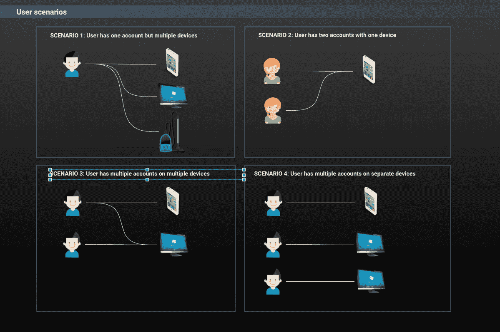
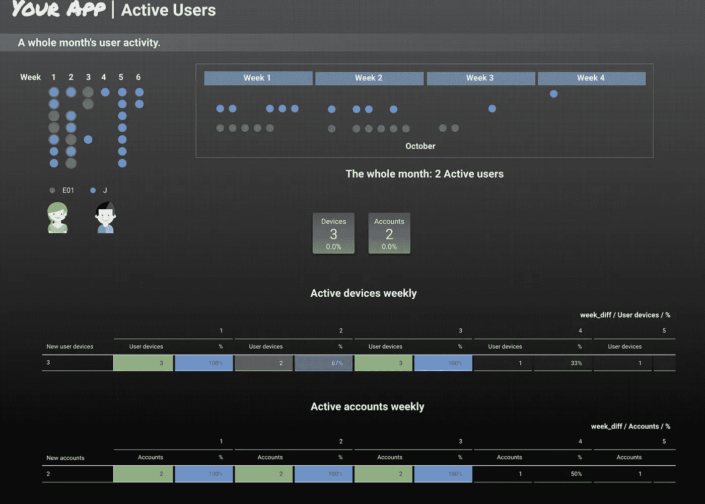
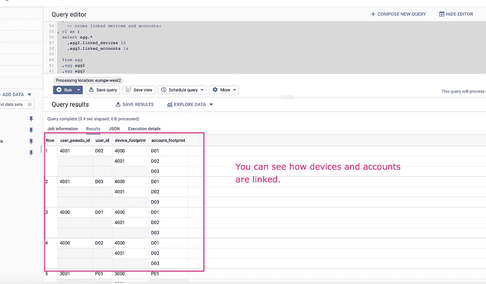
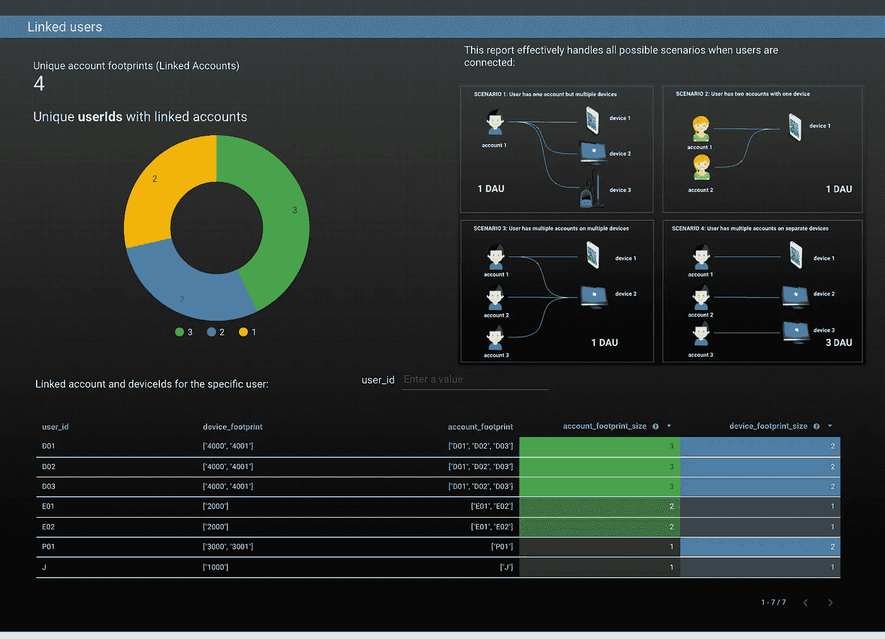
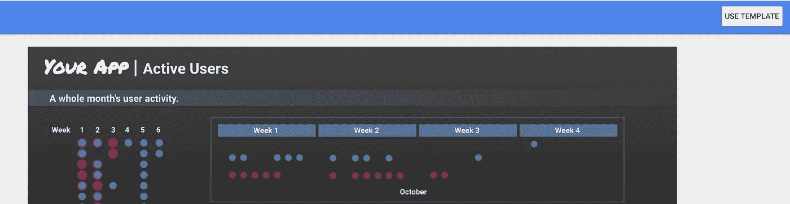
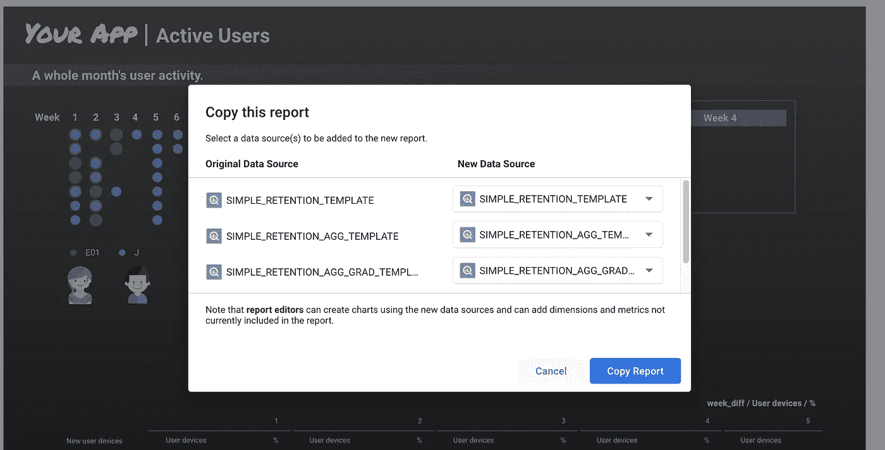
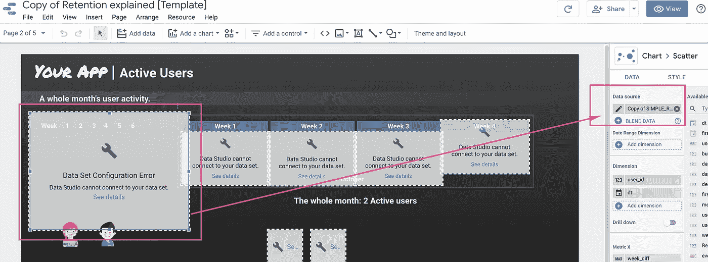
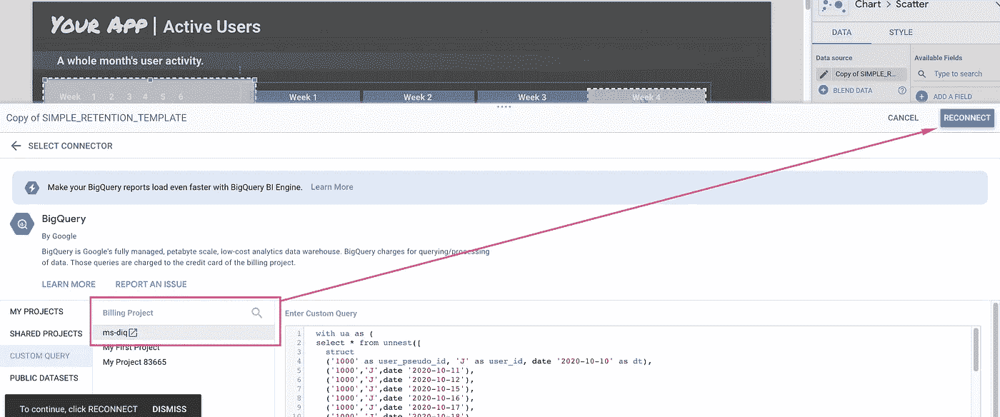
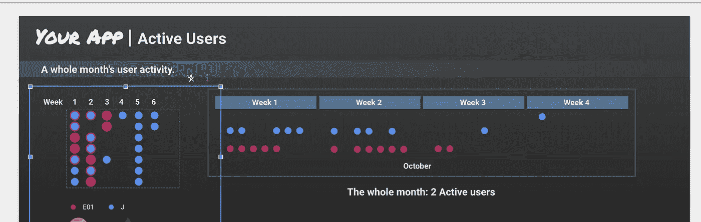

# 如何计算真实活跃用户？数字是多少？

> 原文：<https://towardsdatascience.com/how-to-calculate-real-active-users-what-are-the-numbers-2a3a3363b4a4?source=collection_archive---------15----------------------->

## 为什么我不信任用户活动仪表板



用户群场景。作者图片

营销人员和机器学习工程师的完整 SQL 指南。茅、DAU 和 WAU。Firebase 和 BigQuery 示例。包括漂亮的报告模板。在本文最后阅读如何复制。**免费的！**

> 计算应用程序中的活跃用户可能有些棘手。你会怎么做？Count —活动的**设备 id**或活动的**账户**？

为了有效地计算您的**活动用户数量**，您需要将 **deviceId** 和 **userId** 组合在一起。

根据用户的不同，您可能会面临不同的情况，用户可能使用多台设备，可能在一台设备上拥有不同的帐户，并交叉使用彼此的设备和帐户。

## **这个教程讲的是什么？**

这篇文章是关于如何使用 SQL 计算**真实的**月/日/周活跃用户指标。

您可以应用不同的方法来计算活跃用户数。本文旨在回答这些简单的问题:

*   什么是“活跃用户”？
*   我们如何统计拥有多种设备的用户？
*   我们如何统计在一台设备上拥有多个帐户的用户？
*   我们如何统计交叉使用彼此设备的用户？
*   如何可视化结果并创建仪表板？
*   如何识别真实用户？(例如，帮助标记垃圾邮件发送者)

我创建了这个得心应手的 [***数据*** ***工作室模板***](https://datastudio.google.com/u/0/reporting/28036fe6-26ea-4eff-bdd1-70b3a78fd7e9/page/umInB/preview) 。请随意使用。

## 这篇文章是写给谁的？

*   可能希望看到真实情况的营销人员。
*   被要求构建用户活动报告和图表的分析师。
*   人工智能和人工智能专家可能希望在他们的模型中使用 MAU/DAU/WAU 标志作为分类特征。

## 什么是“活跃用户”

让我们假设每个客户端应用程序在运行时每天都会登录几次。每个登录事件都可以与**用户 id** 和**设备 id** 一起记录到您的数据湖/数据仓库中。

我之前在这篇文章中写过关于每日活跃用户的内容:

[](/retention-and-daily-active-users-explained-79c5dab1bf84) [## 留存和日活跃用户解释。

### 针对 Firebase 用户、机器学习爱好者和营销人员的完整 Data Studio 指南和 BigQuery 教程。所有…

towardsdatascience.com](/retention-and-daily-active-users-explained-79c5dab1bf84) 

这就是 **Firebase** 记录用户的方式。默认情况下，您将拥有 user_pseudo_id，可以像这样启用 user_id:

[](https://firebase.google.com/docs/analytics/userid) [## 设置用户 ID | Firebase

### Google Analytics 有一个 setUserID 调用，它允许你为使用你的应用的个人存储一个用户 ID。这通电话…

firebase.google.com](https://firebase.google.com/docs/analytics/userid) 

活跃用户通常被报道为**月活跃用户(MAU)** ，**周活跃用户(WAU)** ，以及**日活跃用户(DAU)** 。让我们用一个可视化的例子来进一步说明活跃用户:



每日活跃用户。作者图片

在上图中，您可以看到用户注册后每天登录。每一个彩色圆圈都暗示着用户在那天很活跃。用户`‘J’`在第 1-6 周非常活跃。不过还是算 1 MAU(月活跃用户)。因此，我们可以看到该月有 2 个活动用户，因为所有用户在该月都至少活动过一次。

> 如果一个用户在一个月的每一天都访问你的应用程序，那就是单个用户。 ***不是 30 个不同的用户。***

让我们看看这个样本数据集，并在 BigQuery 中运行它:

您可能注意到，用户 id“E01”在下面的数据集中有 **2 个设备** ( **user_pseudo_id 2001 和 2000** )。

我们计算了**用户**，这就是为什么它是 2(不是 3) MAU。

> 所以毛/DAU 数完全取决于你应用于数据的方法。
> 
> 如果一个用户打开了你的应用，然后卸载了它——这是一个日常活跃用户吗？**对于许多仪表板，是的，这是因为它们将设备 id 算作用户。**

## **我们如何计算月/日/周活跃用户？**

没有任何一个 T21 DAU 的标准是完美的。现实世界的问题，如越狱设备，意味着在任何计算中总会有一些不确定性。

从下面图表中的四个不同场景，我们可以有把握地计算前三个场景的 DAU。第四种情况是，一个人有几个帐户，但只在不同的设备上使用它们，这是不可能检测到的。计算依赖于在一台设备上使用多个帐户。


用户场景。作者图片

# DAU 计算

## 方法一。计数唯一设备

*…如果一个用户有多个 device _ ids，则只替换一个。*

> **例如:**

假设我们有两个用户约翰和艾玛。约翰有一部 **Iphone** ，艾玛有**安卓**和**两个设备**:

所以这里我们可以看到 **3 个设备和 3 个用户账号= 2 个真实用户**。简单。

**如何计算 DAU:**

运行下面的 SQL，你将得到 **2 DAU** 。

> 对我个人来说，这个方法**不是最好的，我会解释为什么。**

**首先这个不靠谱:**

```
select user_id ,min(user_pseudo_id) as device_id
from ua
group by 1
;
```

的确，在`device_id` **弦**上做 MIN 可能是错误的。事实上，在某些情况下，它可能是正确的，因为下面的这个小东西。

**让我们想象一下这种情况。**

*艾玛有一个* ***第二个*** *用户账号，她正在她的平板电脑* ***上使用它，这是她的第二个设备，遇到了一个应用错误*** *并决定* ***重新安装*** *应用程序。对于****DAU****的计算我们假设这一切都发生在同一天。*她的 **device_id** 在平板电脑上会与新的*不同。我们永远不知道新的 device_id 会是什么样子，并且这里的 **MIN** 函数会使用黑盒。运行下面的 SQL，你就会明白为什么了。*

*DAU 将是 3 岁，而实际上是 2 岁。):*

*实际上我对 3 点没意见。越高越好。但是，根据业务逻辑，它必须是 2。*

## *方法二。*

> ****…计算所有用户设备的关联账户。****

*这是一个棘手的方法，我必须承认，我花了一些时间试图想出最好的解决方案，用 SQL 链接所有活跃用户的帐户。*

*在这个场景中，我们将看到更复杂例子。还记得不同场景的插图吗？*

**

*用户场景。作者图片*

***让我们看看他们每个人的数据会是什么样子。***

1.  ***Sceanrio 0。最简单的一个。**用户 Id `J`只有一个设备，在 2020 年 10 月 10 日活动:*

```
*(‘1000’ as user_pseudo_id, ‘J’ as user_id, date ‘2020–10–10’ as dt),*
```

*2.**场景 1。**当一台设备存在多个账户时，我们假设只有一个用户。例如，设备 id 为“2000”的用户有两个帐户。我们称之为用户‘E’:*

```
*(‘2000’,’E01',date ‘2020–10–10’),
(‘2000’,’E02',date ‘2020–10–10’),*
```

*3.**场景二。**如果一个帐户有多个 device _ ids，我们只计算一个。例如，用户“P01”有两台设备:*

```
*(‘3000’,’P01',date ‘2020–10–10’),
(‘3001’,’P01',date ‘2020–10–10’),*
```

*4.**场景三。现在我们来看看下面这个。用户' D '在 2 台设备上有 3 个帐户。因此，我们在设备 id '4000 '上有两个帐户，在设备' 4001 '上有两个帐户。问题是我们不能应用场景 1(其中一个设备存在多个帐户，我们假设它只是一个用户)。事实上，如果我们使用这个逻辑，我们将得到 2 个 DAU(设备‘4000’和‘4001’)
——而在现实生活中可能只有一个用户。例如:***

```
 *(‘4000’,’D01',date ‘2020–10–10’),
 (‘4000’,’**D02**',date ‘2020–10–10’), — 4000, 4001 | D01, D02

 (‘4001’,’**D02**',date ‘2020–10–10’), — 4000, 4001 | D02, D03
 (‘4001’,’D03',date ‘2020–10–10’)*
```

*使用 **D02** 我们可以链接账户 **D01** 和 **D03** 。*

*也可能是 3。例如，共享 PC 或平板电脑的家庭。
我们真的不知道，所以让我们称这些帐户为“关联的”，并使用设备和帐户足迹将它们标记为一个帐户。
**那么我们如何用 SQL 做到呢？**
在这种情况下，我们需要检查是否有另一个相同账号的设备在使用它。*

*在 BigQuery 中运行以下 SQL:*

**

*关联设备和关联账户。作者图片*

*使用该数据集，您可以生成显示链接用户的报告。例如:*

**

*链接用户报告*

# *结论*

*在本教程中，我们构建了一个漂亮的仪表板，按照简单的示例和不同的用户场景显示**日活跃用户**数量和**关联账户**。事实上，在许多情况下，数字根本不能反映真实情况。例如，重新安装应用程序或任何删除设备的操作都会产生新的`device_id`标识符，这可能会也可能不会增加总 DAU 号码。以及任何越狱设备或用户垃圾邮件活动可能会大大增加您的 DAU，使其不准确。*

*这个动手项目演示了如何使用 SQL (BigQuery 标准 SQL)和 Google Data Studio 将用户与多个帐户和多个设备联系起来，并创建一个定制的分析工具，该工具可以轻松调整到任何业务逻辑或方法。这是一个简单的 BI 解决方案，可以更好地了解用户群。*

****感谢阅读！****

# *如何使用该模板*

1.  *点击此[链接](https://datastudio.google.com/u/0/reporting/28036fe6-26ea-4eff-bdd1-70b3a78fd7e9/page/umInB/preview)并点击**使用模板***

**

*作者图片*

*复制模板。作者图片*

*2.单击复制包含数据集的报告:*

**

*作者图片*

*3.有些部件会显示为损坏，但单击一个部件，然后单击编辑*

**

*作者图片*

*4.选择您的**计费项目**并点击**重新连接**:*

**

*作者图片*

*成功了！*

**

*作者图片*

## *推荐阅读:*

*[](https://medium.com/build-the-right-thing/key-app-metrics-with-bigquery-part-1-dau-mau-9eac7cbdbe04) [## BigQuery 的关键应用指标第 1 部分:DAU/MAU

### 这篇文章是一系列文章的第一部分，灵感来自于 a16z 播客剧集指标和保持与参与的心态。

medium.com](https://medium.com/build-the-right-thing/key-app-metrics-with-bigquery-part-1-dau-mau-9eac7cbdbe04) [](https://cloud.google.com/bigquery/docs/reference/standard-sql/functions-and-operators) [## 标准 SQL | BigQuery 中的表达式、函数和运算符

### 无论您的企业是刚刚踏上数字化转型之旅，还是已经走上数字化转型之路，谷歌云的解决方案…

cloud.google.com](https://cloud.google.com/bigquery/docs/reference/standard-sql/functions-and-operators) [](https://support.google.com/datastudio/answer/6283323?hl=en) [## 欢迎来到数据工作室！

### 通过高度可配置的图表和表格可视化您的数据。轻松连接到各种数据源。分享…

support.google.com](https://support.google.com/datastudio/answer/6283323?hl=en) 

[https://help . amplitude . com/HC/en-us/articles/115003135607-Tracking-Unique-Users](https://help.amplitude.com/hc/en-us/articles/115003135607-Tracking-Unique-Users)*