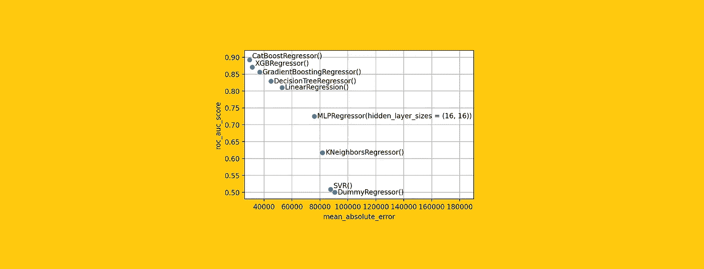
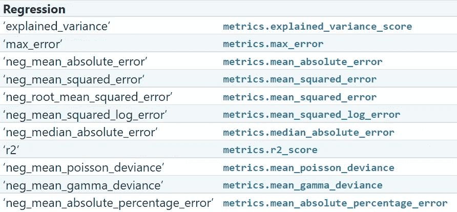
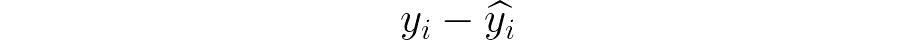
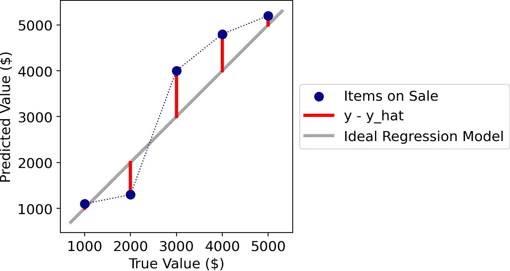
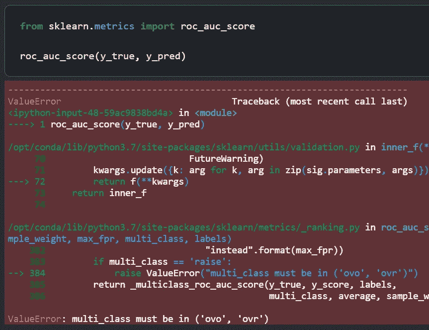
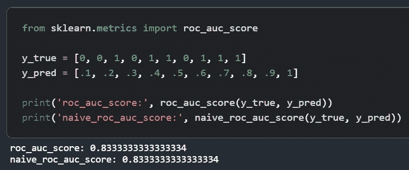
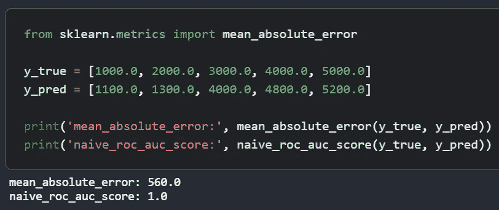
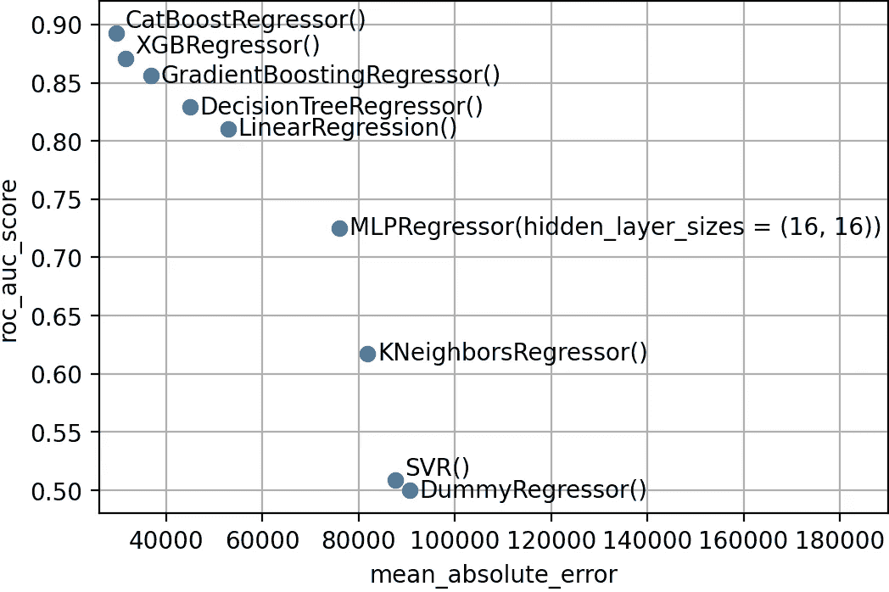

# 你也可以计算回归模型 ROC 曲线

> 原文：<https://towardsdatascience.com/how-to-calculate-roc-auc-score-for-regression-models-c0be4fdf76bb?source=collection_archive---------6----------------------->

## 他们可能告诉你 ROC 曲线下的面积不能计算连续的目标变量。他们错了。下面是如何用 Python 实现的。



[作者图]

你是一家拍卖公司的数据科学家，你的老板让你建立一个模型来预测在售物品的锤价(即最终售价)。这种模式有两个目的:

1.  为每件商品设定一个有意义的开价；
2.  在拍卖过程中每隔一段时间放置最贵的物品。这样，你就会保持住观众的注意力。

因为您想要预测一个点值(以美元为单位)，所以您决定使用一个**回归模型**(例如，`XGBRegressor()`)。现在，你如何评价你的模型的性能？

让我们看看 Scikit 的回归模型度量工具箱:



Scikit-learn 的回归度量[ [链接](https://scikit-learn.org/stable/modules/model_evaluation.html) ]。

所有这些指标都试图量化**模型预测与实际值的差距**。事实上，如果你看一看他们的公式，你总会发现这个量:



实际值和模型预测值之间的差异。[作者图]

换句话说，这些指标非常有助于评估**接近真实价格**(第一个目标)的能力。但是它们对评估第二个目标毫无用处，第二个目标是**将物品从最贵到最便宜排序的能力**。

想要个例子吗？假设您的模型的第一个版本提供了这些结果:

```
y_true = [1000.0, 2000.0, 3000.0, 4000.0, 5000.0]
y_pred = [1100.0, 1300.0, 4000.0, 4800.0, 5200.0]
```

从图形上看，



在回归问题中比较真实值和预测值。[作者图]

如果拿`mean_absolute_error(y_true, y_pred)`的话，得到 560 美金，大概不太好。但是，排名很完美！这意味着该模型完全能够辨别哪些物品将以更高的价格拍卖。

这是关于我们模型的一个非常重要的信息，这是我们从其他回归指标中感受不到的。但是我们如何衡量回归模型的排序能力呢？

评估预测模型排序能力的最流行的指标是`roc_auc_score`。所以，让我们试着用我们的数据来计算一下…



[作者图]

我们得到一个错误！

这是因为`roc_auc_score`只适用于分类模型，要么是一个类对 rest(“ovr”)，要么是一个对一个(“ovo”)。Scikit-learn 希望找到离散的类到`y_true`和`y_pred`，而我们传递连续的值。

为此，我们需要**将** `**roc_auc_score**` **的概念扩展到回归问题**。我们将这样的度量标准称为`regression_roc_auc_score`。在下一段中，我们将了解如何计算它。

# 寻找“回归 _roc_auc_score”

直观上，`regression_roc_auc_score`应当具有以下性质:

*   和`roc_auc_score`一模一样，应该是有界在 0(最差可能排名)和 1(最好可能排名)之间，0.5 表示随机排名。
*   当目标变量为二进制时，`regression_roc_auc_score`必须给出与`roc_auc_score`相同的结果(这样，这个度量将是`roc_auc_score`的推广)。

现在，如何获得我们正在寻找的度量？

`roc_auc_score`定义为 ROC 曲线下的面积，ROC 曲线是在所有分类阈值下，x 轴为假阳性率，y 轴为真阳性率的曲线。但是不可能用回归方法计算 FPR 和 TPR，所以我们不能走这条路。

幸运的是，我们有另一个定义。事实上，根据[维基百科](https://it.wikipedia.org/wiki/Receiver_operating_characteristic)，`roc_auc_score`与“一个分类器将随机选择的正面实例排列得比随机选择的负面实例更高的概率”相一致。

换句话说，**如果我们取任意两个观察值 *a* 和 *b* 使得 *a* > *b* ，那么** `**roc_auc_score**` **等于我们的模型实际上排名 *a* 高于 *b*** 的概率。

这个定义对我们更有用，因为它对回归也有意义(事实上 *a* 和 *b* 可能不限于 0 或 1，它们可以假设任何连续值)；

此外，现在计算`roc_auc_score`要容易得多。事实上，它归结为考虑每一对可能的项目 *a* 和 *b* ，这样 *a > b* ，并计算我们的模型对 *a* 的预测值实际上比对 *b* 的预测值高多少倍(最终的平局将被计算一半)。那么，`roc_auc_score`就是成功的次数除以配对总数。

在 Python 中，这将是:

naive_roc_auc_score 的 Python 代码。[作者代码]

为了确保维基百科提供的定义是可靠的，让我们将我们的函数`naive_roc_auc_score`与 Scikit-learn 的结果进行比较。



[作者图]

太好了！

如上所述——与 Scikit-learn 的`roc_auc_score`不同——这个版本也适用于连续的目标变量。让我们试一试:



[作者图]

产量正是我们所期望的。排名是完美的，因此`roc_auc_score`等于 1。

# 从天真到自举

一切看起来都很棒，但上面的实现有点幼稚。事实上，`naive_roc_auc_score`评估每一对可能的观察值。这样就需要 O( *n* )次迭代(其中 *n* 为样本数)，一旦 *n* 变大一点就变得不可用。

然而，**如果我们不需要“精确”的答案，我们可以通过自举**获得一个很好的近似值。我们可以使用许多随机选择的对，而不是评估每一个可能的对(这意味着不少于 *n* *( *n* +1)/2 对)。

这将转化为以下 Python 代码:

回归 _roc_auc_score 的 Python 代码。[作者代码]

`regression_roc_auc_score`有三个参数:`y_true`、`y_pred`和`num_rounds`。如果`num_rounds`是整数，则作为随机对的个数来考虑(近似解)。然而，您也可以通过将字符串`"exact"`传递给`num_rounds`来计算“精确的”分数(即所有可能的配对)。

# 给我看一些真实的数据！

你很想看看函数`regression_roc_auc_score`在真实数据集上的结果吗？我也是，所以让我们在一个经典数据集上使用它来解决回归问题:来自 [StatLib](http://lib.stat.cmu.edu/datasets/) 的 California Housing(数据可以直接从 [Scikit-learn](https://scikit-learn.org/stable/modules/generated/sklearn.datasets.fetch_california_housing.html#sklearn.datasets.fetch_california_housing) 导入，这是 BSD 许可下的)。

目标变量是加州各区的房价中值。该数据集由 20，640 个样本和 8 个观察到的特征组成。

```
from sklearn.datasets import fetch_california_housing
from sklearn.model_selection import train_test_splitX, y = fetch_california_housing(return_X_y = True, as_frame = True)
y *= 100000X_train, X_test, y_train, y_test = train_test_split(X, y, test_size = 0.33, random_state = 4321)
```

现在，让我们在训练集上尝试许多不同的模型，然后在测试集上计算一些指标(包括前面段落中定义的`regression_roc_auc_score`)。

```
from sklearn.dummy import DummyRegressor
from sklearn.neighbors import KNeighborsRegressor
from sklearn.linear_model import LinearRegression
from sklearn.svm import SVR
from sklearn.neural_network import MLPRegressor
from sklearn.tree import DecisionTreeRegressor
from sklearn.ensemble import GradientBoostingRegressor
from xgboost import XGBRegressor
from catboost import CatBoostRegressor
from sklearn.metrics import mean_absolute_error, median_absolute_error, roc_auc_score, r2_score, explained_variance_scoremodelnames = [
 ‘DummyRegressor()’, 
 ‘KNeighborsRegressor()’,
 ‘LinearRegression()’, 
 ‘SVR()’,
 ‘MLPRegressor(hidden_layer_sizes = (16, 16))’,
 ‘DecisionTreeRegressor()’, 
 ‘GradientBoostingRegressor()’,
 ‘XGBRegressor()’,
 ‘CatBoostRegressor()’
]metricnames = [
 ‘mean_absolute_error’, 
 ‘median_absolute_error’,
 ‘r2_score’,
 ‘explained_variance_score’,
 ‘regression_roc_auc_score’
]metrics = pd.DataFrame(index = modelnames, columns = metricnames)for modelname in modelnames:
  model = eval(modelname)
  pred_test = model.fit(X_train, y_train).predict(X_test)
  for metricname in metricnames:
    metrics.loc[modelname, metricname] = eval(f'{metricname}(y_test, pred_test)')
```

下面的图比较了所有训练模型的`regression_roc_auc_score`和`mean_absolute_error`:



比较不同模型的 regression_roc_auc_score 和 mean_absolute_error。[作者图]

正如我们所料，这两个指标是反向相关的。当然，较低的`mean_absolute_error`往往与较高的`regression_roc_auc_score`联系在一起。

后一个指标提供了关于模型性能的额外知识:在计算了`regression_roc_auc_score`之后，我们可以说，在给定 *a* > *b* 的情况下，Catboost 估计 *a* 比 *b* 更高的值的概率接近 90%。

感谢您的阅读！我希望你喜欢这篇文章。

我感谢反馈和建设性的批评。如果你想谈论这篇文章或其他相关话题，你可以发短信给我[我的 Linkedin 联系人](https://www.linkedin.com/in/samuelemazzanti/)。