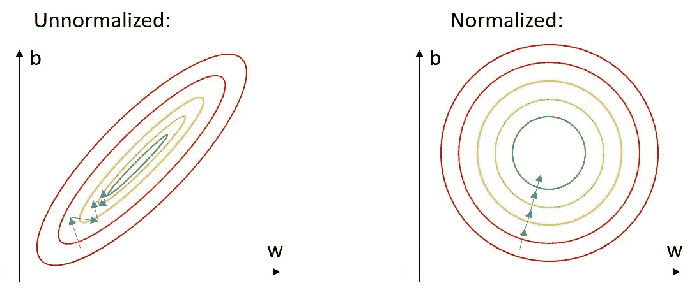
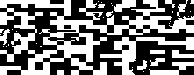
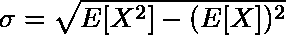
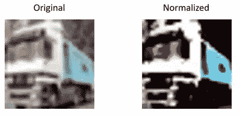

# 如何计算平均值和标准差—在 Pytorch 中归一化数据集

> 原文：<https://towardsdatascience.com/how-to-calculate-the-mean-and-standard-deviation-normalizing-datasets-in-pytorch-704bd7d05f4c?source=collection_archive---------5----------------------->

## 如果输入数据是标准化的，神经网络收敛得更快。了解如何计算自己数据集的平均值和标准差。


露丝·齐默曼在 [Unsplash](https://unsplash.com/s/photos/statistics?utm_source=unsplash&utm_medium=referral&utm_content=creditCopyText) 上拍摄的照片

# 为什么归一化允许更快的收敛

数据集的规范化通常被视为一项相当平凡的任务，尽管它会强烈影响神经网络的性能。对于非标准化数据，特征的数值范围可能变化很大。以一个机器学习应用程序为例，在该应用程序中，房价是根据几个输入(表面积、年龄等)来预测的。表面积通常在 100 到 500 米之间，而年龄更可能在 0 到 25 岁之间。如果将这些原始数据输入到我们的机器学习模型中，将会出现缓慢的收敛。

如左图所示，搜索最陡的梯度，这在某种程度上是正确的方向，但也拥有相当大的振荡部分。这可以通过对学习率的推理来解释。*表面积*特征需要相对较大的学习速率，因为其范围相当大。但是这个大的学习率对于*年龄*来说太大了。优化器每一步都会超调，这会导致振荡，从而导致收敛缓慢。



标准化数据允许更快的收敛

可以通过减去每个特征的平均值( )并除以标准差(σ)来对数据进行归一化。这样，每个特征的平均值为 0，标准差为 1。这导致更快的收敛。



在机器视觉中，每个图像通道都是这样标准化的。

# 计算数据集的平均值和标准差

首先，需要一些进口。

我将使用 CIFAR 数据集及其彩色图像作为例子。但是，同样的代码也适用于灰度图像的 MNIST 数据集。

训练示例被下载并转换为张量，之后加载器获取 64 个图像的批次。

必须对所有图像、图像的高度和宽度计算平均值，但不能对通道进行计算。在彩色图像的情况下，期望大小为 3 的输出张量。

标准偏差可通过以下公式计算:



E[X ]表示平方数据的平均值，而(E[X])表示数据平均值的平方。

最后，计算 CIFAR 数据集的平均值和标准偏差。

```
Mean: tensor([0.4914, 0.4822, 0.4465])
Standard deviation: tensor([0.2471, 0.2435, 0.2616])
```

# 将标准化集成到您的 Pytorch 管道中

数据加载器必须结合这些标准化值，以便在训练过程中使用它们。因此，除了 *ToTensor()* 变换之外，随后是利用获得的值的归一化。

请注意，由于网络是在归一化图像上训练的，因此每个图像(无论是验证还是推断)都必须用相同的获得值进行归一化。



来自 CIFAR 数据集的归一化图像示例

# 结论

数据规范化是神经网络训练过程中的一个重要步骤。通过将数据归一化为 0 的统一平均值和 1 的标准偏差，可以实现更快的收敛。

如果您有任何问题，请随时联系我！