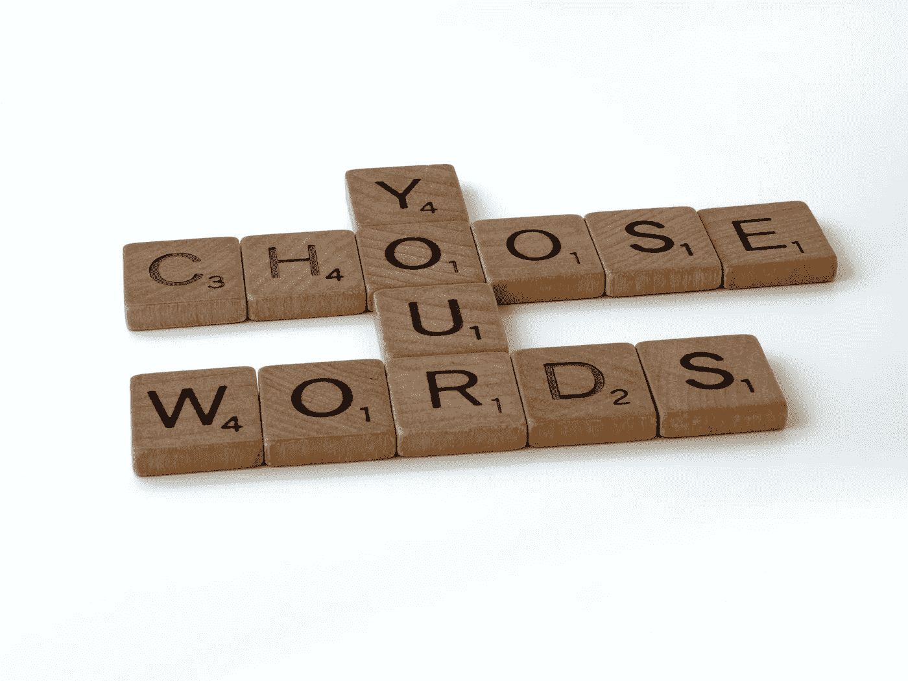
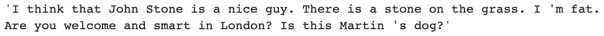

# 如何使用人工智能大写单词

> 原文：<https://towardsdatascience.com/how-to-capitalize-words-using-ai-13750444d459?source=collection_archive---------16----------------------->

## NLP 的 truecasing 教程，带实际操作代码。

你有没有面对过一个庞大的文本语料库缺少单词的大写？在发表这篇文章之前，你需要大写 1000 个单词。在这篇文章中，我演示了如何自动修复文档中的案例信息。

布雷特·乔丹在 Unsplash 上拍摄的照片

[真实大小写](https://en.wikipedia.org/wiki/Truecasing)是一个自然语言处理问题，在没有信息的文本中找到单词的正确大写。

使用案例包括来自各种音频源的抄本、自动语音识别、光学字符识别、医疗记录、在线消息和游戏。原始文本源通常是匆忙生成的，大多数单词都是小写的。

有几种解决真实大小写问题的实用方法:

*   **句子分割**:将输入的文本分割成句子，并将每个句子的第一个单词大写。
*   **词性标注**:查找句子中每个单词的定义和上下文，并使用特定的标签大写单词，例如名词。
*   **名称-实体-识别(NER)** :将句子中的单词分类成特定的类别，并决定大写字母，例如人名等。
*   **统计建模**:对通常以大写格式出现的单词和一组单词训练一个统计模型。

我提出了一个简单的实际操作的 truecaser，它结合了句子分割和词性技术，如下所示。

算法正确地将单词 *stone* 的第一个实例识别为人名，应该大写。

该方法在不区分大小写的大型文档集上表现如何？下面我使用众所周知的 [Yelp 数据集](https://www.kaggle.com/yelp-dataset/yelp-dataset?select=yelp_academic_dataset_review.json)中的评论对代码进行子弹测试。文本在被我的代码处理之前是小写的。使用 [BLEU score](https://en.wikipedia.org/wiki/BLEU) 将生成的大写文本与原始版本进行比较。

通过比较预测大写和真实大写之间的 n-grams 的数量，我们获得 86.71%作为真实大写修复质量的度量。

在这篇文章中，我讨论了 truecaser，将大小写信息恢复为大小写错误或无大小写的文本的过程，并且我提出了一个 truecaser，它与专业撰写的商业评论有 86%的一致性。真实大小写有助于其他 NLP 任务，如自动内容提取和机器翻译，以提高准确性。