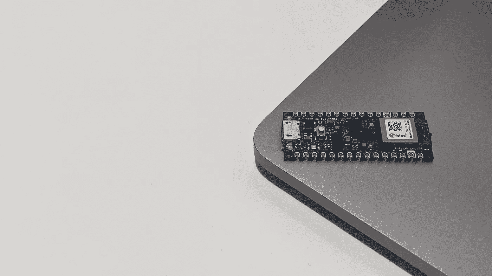
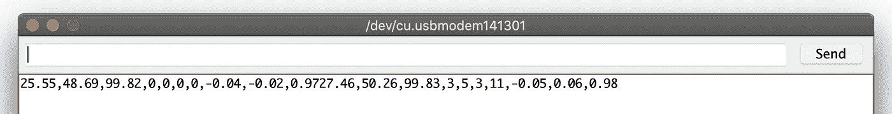
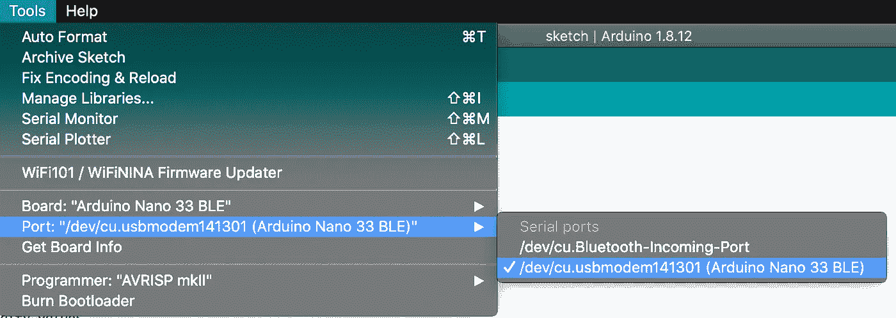
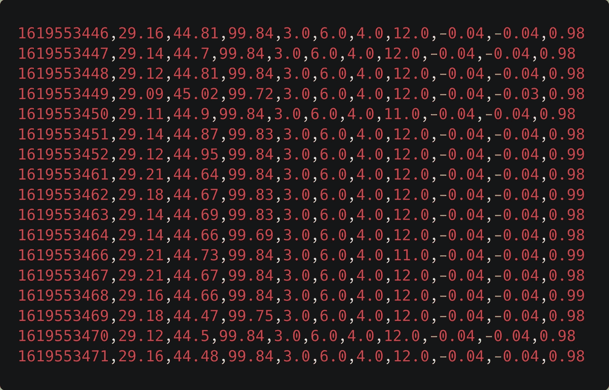

# 如何在 Arduino 中捕获传感器数据，并使用 PySerial 在 Python 中读取它

> 原文：<https://towardsdatascience.com/how-to-capture-sensor-data-in-an-arduino-and-read-it-in-python-using-pyserial-ae66a04637b1?source=collection_archive---------41----------------------->

## [实践教程](https://towardsdatascience.com/tagged/hands-on-tutorials)

## 从 Arduino Nano 33 BLE 中获取传感器数据

传感器感知。它们能看到、听到和闻到我们人类无法(或不应该)看到、听到或闻到的东西。传感器数字化。通过视觉、听觉和嗅觉，他们量化和数字化我们的周围环境——他们创造数据。配备传感器的 Arduino 就是这种设备的一个例子。这些设备“感知”它们的周围环境，并用数据解释它们。也许你想知道如何提取这些数据。

本文解释了如何从 Arduino 中捕获多个传感器数据，并使用 Python 和库 [*PySerial*](https://juandes.com/capture-arduino-data-pyserial/pyserial.readthedocs.io/) 读取这些数据。我将使用的 Arduino 是 [*NANO 33 BLE*](https://www.arduino.cc/en/Guide/NANO33BLE) ，这是一款配备了超过 5 个传感器的微处理器，除了其他功能之外，还可以测量温度、环境压力和湿度。在文章的第一部分，我将描述如何编写一个 Arduino 程序，从它的传感器获取数据；在第二部分，我将描述如何编写 Python 脚本来读取 Arduino 的数据并将其写入 CSV 文件。



我的 Arduino

# 步骤 1 —编写 Arduino 草图以捕捉传感器数据

在这一节中，我们将编写 Arduino 的草图(Arduino 程序的正式术语)来捕获传感器数据。我们一起经历吧。

```
#include <Arduino_HTS221.h> // Temperature sensor
#include <Arduino_LPS22HB.h> // Air pressure sensor
#include <Arduino_APDS9960.h> // Color, light, and proximity sensor
#include <Arduino_LSM9DS1.h> // Accelerometervoid setup() {
  Serial.begin(9600);
  while (!Serial);if (!HTS.begin()){
    Serial.println("Failed to start the HTS221 sensor.");
    while(1);
  }if (!BARO.begin()) {
    Serial.println("Failed to start the LPS22HB sensor.");
    while (1);
  }if (!APDS.begin()) {
    Serial.println("Failed to start the APDS9960 sensor.");
    while (1);
  }if (!IMU.begin()) {
    Serial.println("Failed to start the LSM9DS sensor.");
    while (1);
  }}void loop() {
  // Read the temperature and humidity values
  float temp = HTS.readTemperature(); // In C
  float humidity = HTS.readHumidity(); // In %
  float pressure = BARO.readPressure(); // In kPaint r, g, b, a;
  APDS.readColor(r, g, b, a);float x, y, z;
  IMU.readAcceleration(x, y, z);while (!APDS.colorAvailable() || !APDS.proximityAvailable())
  {
  }Serial.print(temp); 
  Serial.print(',');
  Serial.print(humidity); 
  Serial.print(',');
  Serial.print(pressure);
  Serial.print(',');
  Serial.print(r);
  Serial.print(',');
  Serial.print(b);
  Serial.print(',');
  Serial.print(g);
  Serial.print(',');
  Serial.print(a);
  Serial.print(',');
  Serial.print(x);
  Serial.print(',');
  Serial.print(y);
  Serial.print(',');
  Serial.print(z);
  // Use Serial.println(); to add a linebreak// 10 mins
  delay(600000);
}
```

我们的(C++)代码从加载传感器库的 include 语句开始。这些是:

*   [HTS221](https://www.arduino.cc/en/Reference/ArduinoHTS221) :温度传感器
*   [LPS22HB](https://www.arduino.cc/en/Reference/ArduinoLPS22HB) :压力传感器
*   [APDS9960](https://www.arduino.cc/en/Reference/ArduinoAPDS9960) :读取颜色、光线和接近度的传感器。
*   [LSM9DS1](https://www.arduino.cc/en/Reference/ArduinoLSM9DS1) :加速度传感器。

加载完库之后，我们有了`setup`函数，这个函数在草图开始时只被调用一次。在这里，我们将定义串行端口，我们希望在这里写入输出并初始化四个传感器。`while`语句用于无限迭代，直到串口和传感器可用。

下面的函数是`loop`，草图是主要程序，我们将在这里捕获传感器数据——该函数将永远运行，除非您终止它或出现错误。在前三行中，我们读取温度、湿度和压力值，并将它们分配给三个变量。接下来，我们将读取 APDS 传感器颜色红色、蓝色、绿色和环境光强度。(我应该提到，红色、蓝色和绿色不是标准的 RGB 颜色元组，其值的范围是从 0 到 255。相反，它们的值类似于红色、蓝色和绿色的强度。).为了读取颜色数据(使用`APDS.readColor()`)，我们将发送前面的四个变量作为参数，将读取的值传递给它们。类似地，我们将使用与颜色相同的方法读取加速度计数据。有了这些，我们就有了数据。

函数的后半部分涉及将捕获的值写入串行端口，以便稍后从 Python 中读取它们。在`IMU.readAcceleration`之后，`while`语句等待，直到 APDS 传感器上有颜色或接近度可用。一旦其中一个可用，程序将退出循环，并以逗号分隔( [CSV](https://en.wikipedia.org/wiki/Comma-separated_values) )行的形式打印这些值，例如，“1，2，3，4，5”最后，我们将添加一个`delay()`函数来暂停程序一段时间(以毫秒为单位),这段时间在参数中指定(您可以根据需要随意更改)。

接下来，我们将使用 *Arduino IDE* 将草图上传到 Arduino 板上，你可以从[https://www.arduino.cc/en/software](https://www.arduino.cc/en/software)获得。你可以在 https://www.arduino.cc/en/Guide[找到安装指南。](https://www.arduino.cc/en/Guide)

一旦安装并打开，我们需要安装 Arduino 板和传感器库。要安装板库，进入**工具**->-**板**->-**板管理器**，搜索“纳米 BLE”要安装传感器库，进入**工具**->-**管理**-**库**和**-**搜索“HTS221”、“LPS22HB”、“APDS9960”和“LSM9DS1”现在，请将 Arduino 连接到电脑。然后点击“箭头”按钮将草图上传到 Arduino。为了确保它正在运行，进入**工具**->-**串行**-**监视器**查看它的输出(图 1)。你会注意到缺少换行符。那很好。一旦我们从 Python 中读取数据，我们就不需要它了，这将在下一步中完成。



图一。打印的数据。这里我们有两组传感器读数，中间没有换行。我们将在 Python 端处理这个问题。

# 步骤 2 —使用 PySerial 读取 Python 中 Arduino 的数据

在第一步中，我们编写了一个 Arduino 草图，它从多个来源捕获传感器数据，并将它们打印到一个串行端口。在步骤 2 中，我们将编写一个 Python 脚本，它使用库 [PySerial](https://github.com/pyserial/pyserial) 逐行读取所述数据，因为 Arduino 将它打印到串行端口；要安装 PySerial，从您的终端执行`$ pip install pyserial`。在读取数据时，我们将把值转换成一个列表，并在把列表附加到一个 CSV 文件之前把当前的本地时间戳添加到列表中。下面是完整的脚本。

```
import csv
from time import timeimport serial# Your serial port might be different!
ser = serial.Serial('/dev/cu.usbmodem141301', timeout=1)f = open("df.csv", "a+")
writer = csv.writer(f, delimiter=',')while True:
    s = ser.readline().decode()
    if s != "":
        rows = [float(x) for x in s.split(',')]
        # Insert local time to list's first position
        rows.insert(0, int(time()))
        print(rows)
        writer.writerow(rows)
        f.flush()
```

我们将通过导入我们将使用的库来启动脚本。这些是:

*   `csv`:将数据写入 CSV 文件。
*   `time`:获取当前当地时间。
*   `serial` (PySerial):读取 Arduino 的数据。

接下来，我们需要声明我们的`Serial`对象，以便从参数中指定的端口读取数据。在本例中，我从端口`/dev/cu.usbmodem141301`读取数据，但这可能会因您的设置而异。为了找到正确的端口，我喜欢使用 Arduino IDE 的“端口”视图，您可以从**工具**->-端口**中访问该视图(图 2)。这里你会看到两个串行端口:一个蓝牙和一个物理端口。你想要非蓝牙端口。将它的路径写在串行对象的第一个参数中。第二个参数 timeout 控制函数等待的时间(以秒为单位)，直到所请求的字节数到达(我们将在后面添加)。如果请求的字节数在超时前没有到达，函数"[返回在此之前收到的所有字节](https://pyserial.readthedocs.io/en/latest/pyserial_api.html#serial.Serial)(py Serial 的串行类文档)。**

****

**图二。您可以从“工具”菜单中找到主板的串行端口。**

**因为我们的脚本将 Arduino 的数据写入一个 CSV 文件，所以我们需要一个`csv.writer`对象将数据追加到文件中。编写器有两个参数，`f`，目标文件和`delimiter` " `,`"来指定哪个字符分隔字段。**

**现在我们写数据。为了无限期地运行我们的脚本，我们将使用一个`while True`循环来读取发送到串行端口的最新行——注意，我们必须解码数据，因为它是以字节形式出现的。(说到字节，`readline()`有一个参数 size `s`用来指定函数最多会读取多少字节；我们将使用参数的默认值`-1`来读取所有内容)。每当我们读一行，我们将检查它是否是空的。如果是，我们再次迭代。但是如果不是——这是令人兴奋的部分——我们将在将数据添加到文件之前对其进行预处理。**

**我们不会写入数据，因为它来自串行端口。相反，我们将对其进行预处理，并用本地时间对其进行扩展，以获得更丰富的数据集。在`if`语句中，我们将使用 list comprehension 来创建一个新的列表，方法是分割字符串，使用字符"`,`"作为分隔符(因为这是我们在 Arduino 上打印数据的方式)，并将值从字符串转换为浮点数。对于这个列表，我们将在它的第一个位置插入当前本地时间戳(以秒为单位)。然后，我们将打印它，将其写入 CSV，并在之后刷新该文件。就这样，我们结束了！**

**要运行脚本，请执行命令`$ python main.py`。如果您得到一个类似这样的错误，**

```
FileNotFoundError: [Errno 2] No such file or directory: '/dev/cu.usbmodem141301'
```

**这意味着定义的串口是错误的或不可用的。我再次建议使用 Arduino IDE 来找到正确的端口。另一种方法是列出端口，如以下网址所述:[https://www . mathworks . com/help/support pkg/arduinoio/ug/find-arduino-port-on-windows-MAC-and-Linux . html](https://www.mathworks.com/help/supportpkg/arduinoio/ug/find-arduino-port-on-windows-mac-and-linux.html)。运行脚本几分钟后，返回 CSV 文件查找数据。下面的图 3 显示了我的一个例子。**

****

**图 3。我的 CSV 文件样本。缺少列名；我没有从脚本中添加它们，以防你使用我以外的数据。**

# **总结和结论**

**我们人类正以稳定的节奏赋予科技感知的能力。会达到类似人类的水平吗？我不知道。但是根据基于感知的人工智能(正如李博士在他的书[人工智能超能力](https://www.goodreads.com/book/show/38242135-ai-superpowers)中所讨论的)的准确性和用例来判断，例如物体探测器，我们可以肯定地说，它会让我们怀疑我们人类在某些任务中是否优越。**

**在本文中，我们没有构建这样的人工智能。相反，我们收集了我们需要的数据，以防我们想要建立一个。为了收集数据，我们在 NANO 33 BLE 设备中编写并部署了一个 Arduino 草图，该设备配备了可以捕捉温度、压力、湿度、亮度和加速度数据的传感器。为了导出数据，我们编写了一个 Python 脚本，从 Arduino 中读取数据，并将其写入一个 CSV 文件。**

**你会用它来建造什么？您将如何使用这个新数据集？由于这个 Arduino 支持[用于微控制器的 TensorFlow Lite】，这是一个用于在微控制器上执行 TensorFlow 模型的 TensorFlow C++库，我计划用数据构建一个模型，并将其部署在设备上。模型会做什么？目前为止还没想。但不管是什么任务，我肯定它会比我做得更好。](https://www.tensorflow.org/lite/microcontrollers)**

**你可以在[https://github . com/juandes/arduino-content/blob/main/sketches/get _ sensor _ data/sketch/sketch . ino](https://github.com/juandes/arduino-content/blob/main/sketches/get_sensor_data/sketch/sketch.ino)找到草图代码，在[https://github . com/juandes/arduino-content/blob/main/Python/py serial/main . py](https://github.com/juandes/arduino-content/blob/main/python/pyserial/main.py)找到 Python 脚本。**