# 如何捕获 Power BI 生成的 SQL 查询

> 原文：<https://towardsdatascience.com/how-to-capture-sql-queries-generated-by-power-bi-fc20a94d4b08?source=collection_archive---------9----------------------->

## 面带微笑，向您的 DBA 提供关于 Power BI 生成的 SQL 查询的所有必要信息

[https://www . pexels . com/photo/cute-dog-in-bright-shirt-on-light-background-5733428/](https://www.pexels.com/photo/cute-dog-in-bright-shirt-on-light-background-5733428/)

从前，你那吓人的老 DBA 红着脸走进你的办公室，愤怒地问你:“你到底对你的 Power BI 报告做了什么？！它扼杀了我们所有的工作负载！！!"

你知道他为什么生气，甚至在他对你大喊大叫之前。这是因为使用 DirectQuery 的“那个”报告，因为您的用户想要“接近实时”的数据…

我已经写了为什么你应该[重新考虑使用 DirectQuery](/direct-query-in-power-bi-what-when-why-8180825812d2) ，以及在什么情况下(可能)走这条路是有意义的。

然而，看起来您的 DBA 并没有您想象的那么“糟糕”。他提出帮助您优化最详尽的 SQL 查询，他只是希望您将这些查询发送给他…

哦，等等，当我在 Power BI 中“看不到”SQL 查询时，我如何向他发送这些查询呢？！别担心，有多种方法可以捕获 Power BI 引擎生成的 SQL 查询[。](/how-to-reduce-your-power-bi-model-size-by-90-76d7c4377f2d)

## SQL Server 事件探查器—面向传统人士！

[https://www . pexels . com/photo/vintage-car-on-parking-in-mountains-5480749/](https://www.pexels.com/photo/vintage-car-on-parking-in-mountains-5480749/)

在我向您展示如何使用优秀的 SQL Server Management Studio (SSMS)及其内置功能 SQL Server Profiler 之前，让我简单解释一下后台发生的事情:Power BI Desktop 启动了分析服务表格式的本地实例。因此，您可以使用 SQL Server 事件探查器像跟踪任何其他事件一样跟踪此实例。

像往常一样，我将在所有示例中使用示例 Contoso 数据库。

您要做的第一件事是打开 SSMS 工具栏下的 SQL Server Profiler:

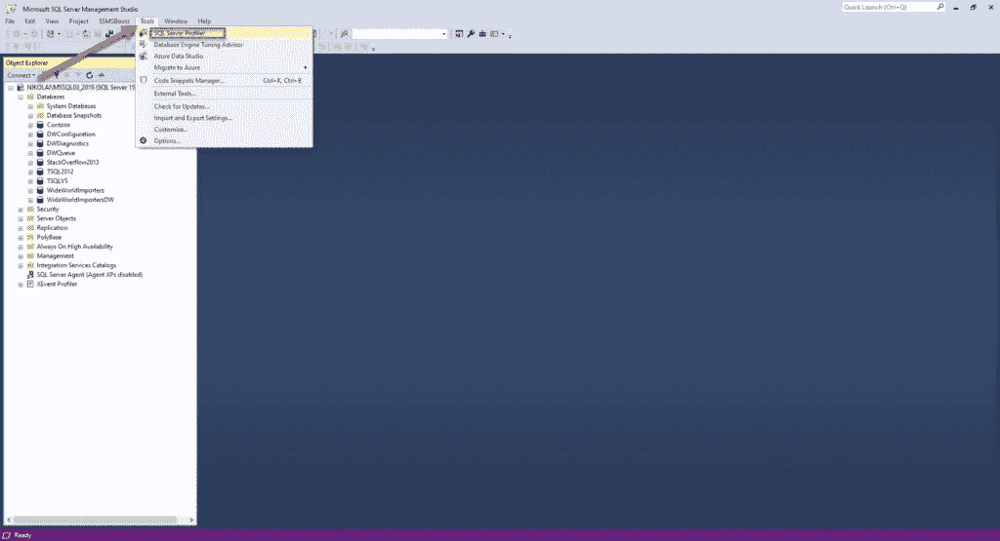

作者图片

我的 Power BI 报告相当简单，它只包含三种视觉效果:

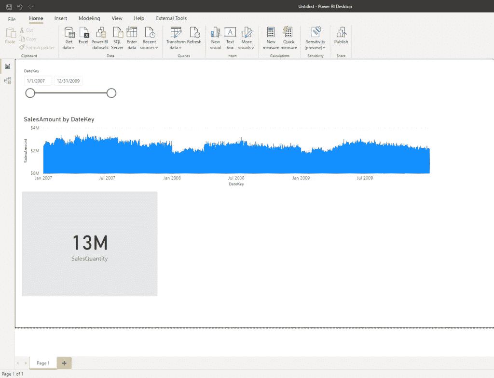

作者图片

关于 DirectQuery，要记住的最重要的事情是——每当您与报表进行交互时，每个视觉对象都将向数据源发出查询，即使您没有与特定的视觉对象进行交互！在我的示例中，每当我对报表进行操作时，就会有两个单独的查询被发送到底层的 Contoso SQL 数据库。

让我们打开 SQL Server Profiler，检查一下发生了什么:

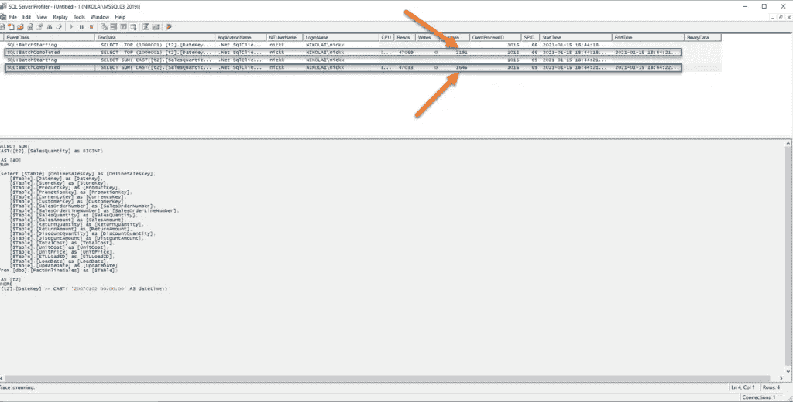

作者图片

在这里，您可以看到，当我更改我的日期切片器的值时，Power BI 触发了两个单独的查询(针对我们的每个视觉效果)！您可以在 *SQL: BatchCompleted* 事件类下看到关于每个查询的更多细节:执行用了多长时间，进行了多少次读取，等等。

但是，最重要的是，您可以捕获 Power BI 生成的 SQL:

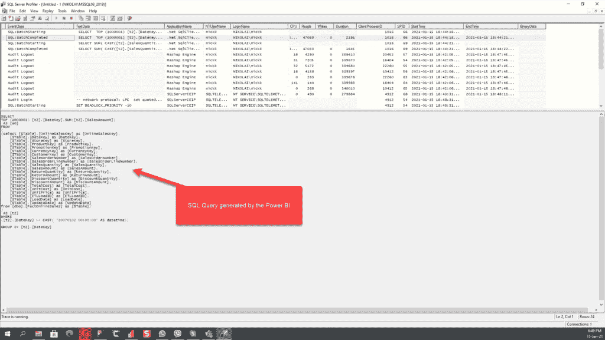

作者图片

现在，您可以复制这个查询并发送给您的 DBA，这样他就可以决定是否有性能改进的空间(可能是[添加索引](https://data-mozart.com/rows-or-columns-where-should-i-put-my-index-on/)或者其他什么)。

无论如何，您现在已经准备好帮助查找影响常规工作负载的 SQL 查询了。

## DAX Studio —简单而优雅的解决方案！

[https://www . pexels . com/photo/cute-dog-in-bright-shirt-on-light-background-5733428/](https://www.pexels.com/photo/cute-dog-in-bright-shirt-on-light-background-5733428/)

如果您不熟悉 SQL Server Profiler 和其他“传统”工具(当我说传统时，我指的是您的 DBA 喜欢的工具:))，您可以利用 Power BI Desktop 本身的性能分析器特性，与 [DAX Studio](https://daxstudio.org/) 协同工作，以达到相同的效果！

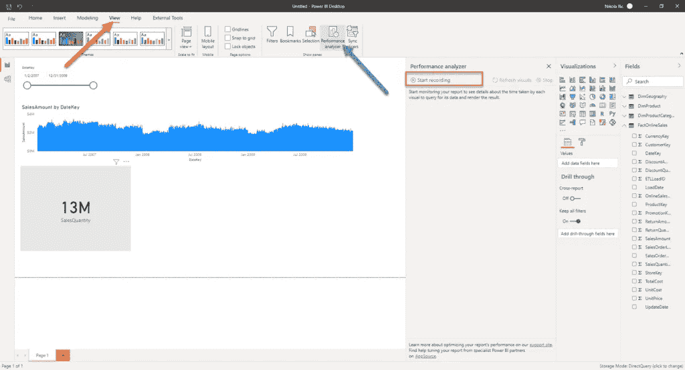

作者图片

只需刷新视觉效果，您应该能够在报告画布上看到每个视觉效果的总时间:

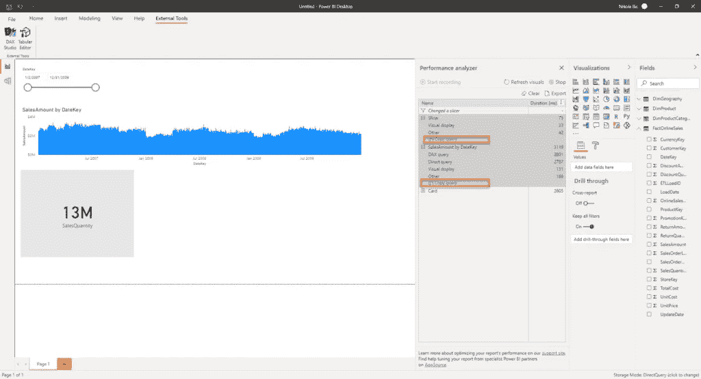

作者图片

选择复制查询选项，然后直接进入 DAX Studio。将复制的查询粘贴到主窗口后，向下滚动，您将看到 SQL 查询！多酷啊！

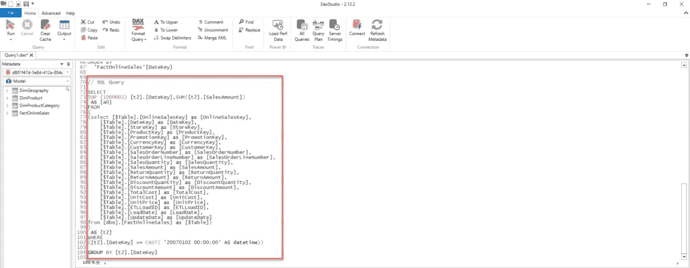

作者图片

我有一个额外的建议给你！如果您有多个查询(例如我们的例子中有两个，但有时可能会有 10 个以上)，那么来回移动、一个接一个地复制和粘贴查询会非常麻烦。

您应该在 DAX Studio 中启用“所有查询”按钮，并等待几分钟，直到查询跟踪开始:

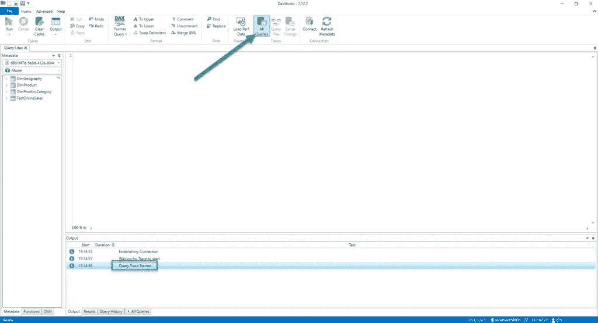

作者图片

现在，回到 Power BI Desktop 并刷新视觉效果。完成后，再次打开 DAX Studio 并转到所有查询选项卡:

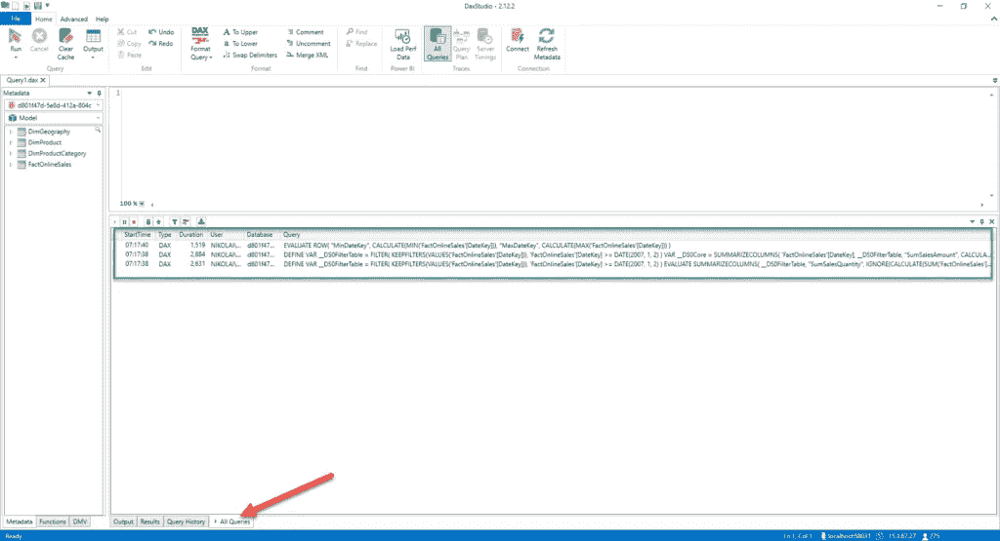

作者图片

瞧——我所有的查询现在都被一次捕获了！而且，一旦我关闭“所有查询”选项卡并打开“服务器计时”选项卡，我就可以单击一个特定的查询:

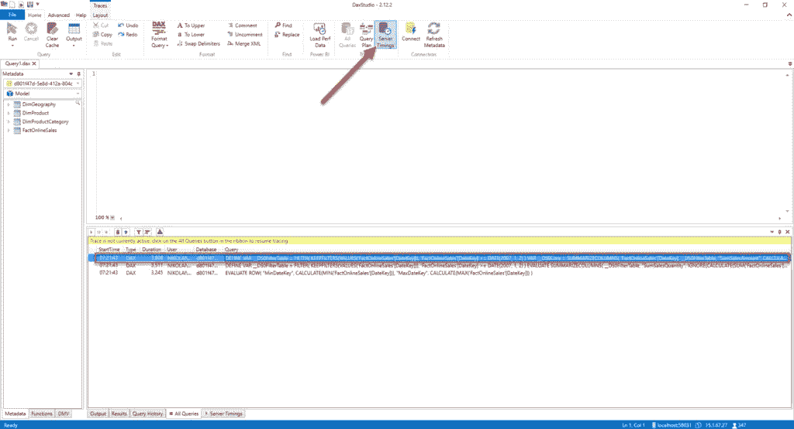

作者图片

双击选定的查询后，DAX 代码将出现在主窗口中，因此我可以单击 Run，并转到底部的 Server Timings 选项卡:

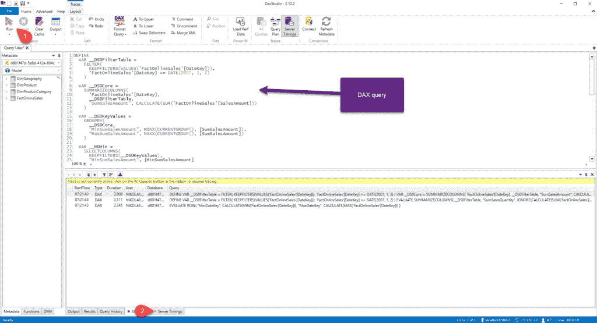

作者图片

在那里，您不仅可以找到 Power BI 生成的 SQL 查询，还可以找到与服务器性能相关的不同指标，比如 CPU 时间。您还可以检查公式引擎(FE)和存储引擎(SE)满足请求所需的时间。

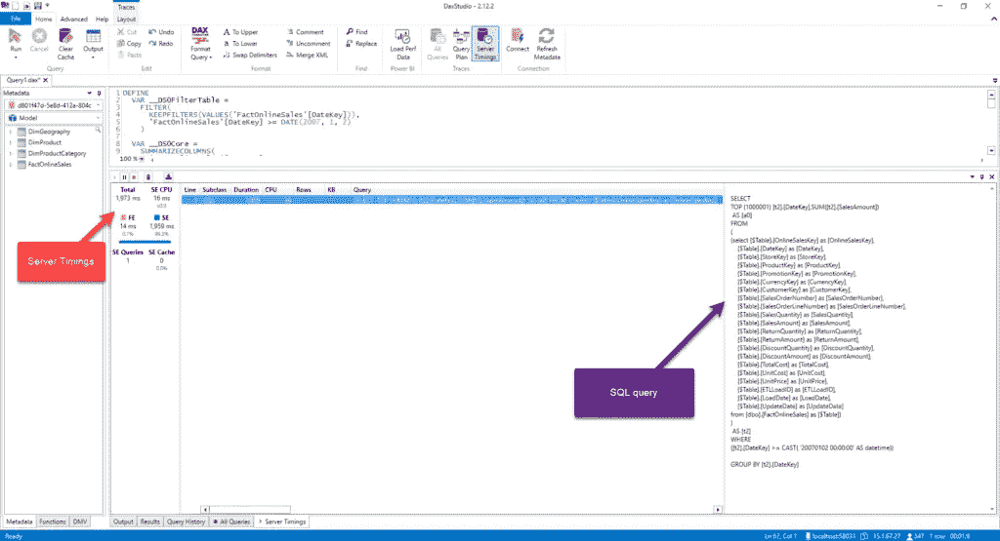

作者图片

## 结论

如您所见，有不同的方法来捕获 Power BI 生成的 SQL 查询。

您再也不需要担心了——下次您的 DBA 来到您的办公桌前时，请面带微笑，因为您现在可以为她/他提供在源(SQL 数据库)端微调 SQL 查询所需的所有信息了！

感谢阅读！

成为会员，阅读 Medium 上的每一个故事！