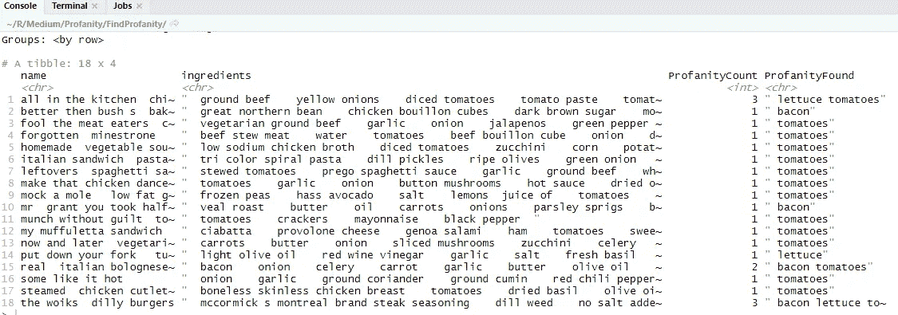

# 如何用 R 捕捉亵渎

> 原文：<https://towardsdatascience.com/how-to-catch-profanity-with-r-4a21e024d4db?source=collection_archive---------28----------------------->

## 忘了肥皂吧，我们会用数据科学的力量给他们洗洗嘴


泰勒·尼克斯在 [Unsplash](https://unsplash.com?utm_source=medium&utm_medium=referral) 上的照片

人们说脏话。如果你或你的公司碰巧有任何类型的用户生成内容，这些人会在你的网站、社交媒体、评论、评论等上说脏话。他们会匿名坐在他们的小屏幕后面，像海军陆战队队员一样在你的网站上骂人！

幸运的是，我曾经是一名海军陆战队员，所以我认为自己是骂人的专家。我将教你如何用几行 r 来捕捉亵渎。

# 问题比你想象的要大

在深入研究代码之前，让我们先思考一下这个问题是如何难以解决的。无论我们认为自己有多聪明，都比不上那些找到新方法骂人的人。仅 f-bomb 就有数千种变体，每天都有新的变体被创造出来(我在写这篇文章的时候就创造了几个新的！).

以下是你所面临的一些例子:

*   符号替换:cat = c@t
*   语音替换:duck = duc
*   大写替换:狗=干旱
*   字母分隔:goose = g o o s e
*   字符重复:mouse = moooouuuusssse
*   内心世界掩蔽:马=海马
*   语言替换:bird = pajaro
*   字母反转:rat = tar
*   还有很多很多其他人…

这排除了每个人的个人喜好，昨天还是良性的单词和短语今天可能突然变得具有攻击性。加分的是，这个词在世俗和非世俗的语境中都可以恰当地使用。

那么我们有机会吗？嗯，算是吧。

我们当然可以用黑名单和模式匹配来解决这个问题。)、机器学习和事后措施(例如暂停或禁止有毒用户)。但是没有什么能真正打败人类的节制。

语言变化的速度比我们的算法还快，我们的 ML 模型将永远与最后一个例子(一个好词一夜之间变坏)作斗争。

最好的方法通常是上述所有措施的结合。你想要黑名单(由人类版主每天添加新词)，模式匹配来捕捉给定词的所有排列，ML 模型标记潜在的不良内容，以及足够严格的暂停/禁止措施来劝阻用户越过这条线。将所有这些与通过身份验证消除匿名结合起来，你*可能*就有机会了。

今天，我们将只关注第一项，通过黑名单捕捉亵渎。

# 不良

为了让你免于阅读一堆淘气的单词，我们要做一个小小的思维实验。就在今天，让我们假设“培根”、“莴苣”和“番茄”是英语中最卑鄙、最可怕、最亵渎的词汇。

如果你用脚趾踢床脚，你可能会说‘培根！！!'。如果你在祖母家说“番茄”，她可能会和你断绝关系，并把你从遗嘱中删除。如果你说“莴苣”这个词……你就明白了。

现在不要担心你不会学习如何真正抓住亵渎。我们将建立我们自己的不良词汇(又名黑名单)，但你将能够使用我的代码通过交换一个变量来捕捉实际的亵渎。

漂亮的西红柿很酷，对吧？！

# 获取数据

现在我们已经确定 BLT 是不好的，我们需要找到一些 BLT。我们在哪里可以找到这些原料？在美食菜谱上怎么样！Kaggle 有一个免费的食物食谱数据集(Shuyang Li，“Food.com 食谱和互动。”卡格尔，2019，doi:10.34740/卡格尔/DSV/783630。)你可以从他们的网站上下载。该数据集被许可用于商业用途(CC BY 4.0)。

# 编写代码

首先打开 RStudio 并创建一个名为“ProfanityFinder”的新 R 项目。将 RAW_recipes.csv 放到项目的文件夹中。同时在这个项目中创建一个新的 R 脚本，名为“BadWords”。r '

用你的话说。脚本，安装这些软件包你你还没有他们。Tidyverse 允许我们使用一些漂亮的管道语法来操作数据，sentimentr 有一些很棒的 NLP & profanity 函数。

接下来，我们将配方数据导入 tibble (Tidyverses 版本的 R 数据帧)。

现在我们的数据已经导入，让我们稍微清理一下。首先，我们只需要 name 和 ingredients 列，所以让我们选择它。

接下来，我们通过删除标点来清理成分栏。这个专栏有一些特殊的字符，比如方括号，它们会对我们的亵渎函数造成很大的破坏。我们将使用一行简单的代码来删除所有这些。

最后，食谱数据超过 230，000 行！虽然我们可以耐心地处理所有数据，但最好将其限制在 100 行以内。事实证明，如果不碰到一些熏肉、生菜和西红柿，你就无法深入了解食谱数据(请原谅我的法语！).

现在我们到了最精彩的部分。我们需要一个我们关心的不良词汇的列表。公司将这些列表称为黑名单或阻止列表。在 NLP 领域，我们通常将单词列表称为“词典”。不管你喜欢什么术语，让我们现在就建立它。

我们的词典是一个由三个顽皮单词组成的字符向量，它们被分配给一个名为 customCussWords 的变量。

注意了！这是魔法酱被搅拌的地方。我们的词典可能是一个简单的 3 个单词的列表，但是 sentimentr 包碰巧有相当多的实际不良单词的词典。想亲眼看看吗？在 RStudio 中，只需在控制台中键入我们的变量来读取其内容。

```
customCussWords
```


图片作者。

这里有一个警告，下面的命令会在你的控制台上显示一些非常可怕的单词。是时候开始锻炼你的铁胃了，因为事实证明你停止亵渎的方法就是用亵渎！

在运行 import(sentimentr)命令后，在控制台中键入以下命令，将会显示字符向量的内容，就像我们的“customCussWords”变量一样。

```
lexicon::profanity_alvarez
lexicon::profanity_banned
lexicon::profanity_arr_bad
```

这些只是一些不好的词汇。还有很多很多可以使用。为了更好的效果，为什么不把它们都结合起来。更好的是，定义你自己的！

那么所有这些意味着什么，我提到的神奇调味汁到底是什么？简单。无论你在哪里看到我们的 BLT 词典“自定义脏话”,你都可以用上面的脏话词典替换掉，现在你的代码会神奇地捕捉到脏话！

例如:

```
do_stuff(customCussWords)
```

可以变成:

```
do_stuff(lexicon::profanity_alvarez)
```

那么，我们实际上如何捕捉亵渎？sentimentr 包有一个方便的功能叫‘亵渎’！这个方便的函数有两个输入。第一个输入是文本，第二个输入是要与文本进行比较的单词词典！

让我们给亵渎函数一个旋转。首先，我们将使用一个不包含脏话的短语。


图片作者。

profanity 函数返回一个包含几个有趣列的表。它有元素和句子的 id、单词计数、亵渎计数，最后还有提供的文本中包含亵渎的单词的百分比。让我们在函数中加入一些诅咒，让它变得更有趣！


图片作者。

结果意味着我们有一个包含 3 个单词的句子，其中一个在我们的词典中找到。因为 1/3 的文章都是脏话，所以我们的脏话比例是 33%。

对于给定的文本，profanity 函数不仅返回 1 行。它实际上通过一个叫做“句子边界消歧”的过程将单词分解成句子。这是一种奇特的 NLP 语言，用于在我们的语言中寻找可能代表句子开始和结束的东西。

如果你还记得的话，我们之前已经删除了文本中所有的标点符号。句号是决定句子结束位置的众多方法之一。以下代码将从亵渎函数返回多行结果:


图片作者。

理解所有这些很重要，但是对于我们的简单练习，我们将只查看 profanity_count 列。我们可以 sum()这个列，以确保我们捕获了所有出现的句子！

使用 base R 语法，我们可以像这样访问特定的列:


图片作者。

万一有多个句子，我们可以这样总结:


图片作者。

现在我们知道了做这件事需要知道的一切！让我们获取配方数据，并使用 Tidyverse 添加一个带有 mutate()的列。

这是在做什么？

1.  称我们的食谱为数据框架
2.  行方式——对于每一行数据，执行以下操作
3.  mutate——添加一个新列，使用我们的 customCussWords 词典将配料列传递到 sentimentr 的亵渎函数中
4.  过滤器-只显示有亵渎的记录


图片作者。

我们做到了！我们新的“亵渎计数”专栏正在查找并计算单词 bacon、莴苣和番茄的所有出现次数！

知道我们的文本中哪里存在亵渎是很好的，但是我们可以更进一步。让我们添加一列，返回我们的程序发现的实际亵渎。Sentimentr 确实有一个应该做这件事的函数(extract_profanity_terms)，但至少在我拥有的 R 的构建上，这个函数似乎坏了。别担心，我们会写我们自己的函数！

我们的目标是将文本和词典传递给一个函数，并让它返回它能找到的所有熏肉、生菜和西红柿。再说一次，如果你需要找到真正的脏话，只需传递上面提到的一个词汇就可以了！

我们的函数在做什么？

*   我们定义了一个名为 returnText 的空字符
*   我们循环使用词典中的单词(培根、生菜、西红柿),看看这个单词是否在文本中。如果找到这个单词，Grepl 将返回 true 或 false。
*   如果找到这个单词，我们用粘贴函数把它附加到 returnText 变量中
*   我们退回所有找到的脏话。

最后，我们可以在代码中添加一个新的 mutate，将 recipe 传递给这个函数，它将像这样返回脏话:



图片作者。

就是这样！我们已经编写了在文本中发现亵渎的代码！

# 关于效率的一个注记

我们在这里写的代码在大多数小数据集上都能很好地工作，但是在一些场景中这是行不通的。

首先，句子边界消歧是一个代价很高的计算。如果您有一个较大的数据集，您会希望将所有文本预处理成句子。Sentimentr 有一个名为 get_sentences 的函数可以做到这一点。此外，从我们的数据中删除所有标点符号可能不是最明智的做法。您可能希望保留句点和感叹号，以帮助您的代码找出句子的开始和结束位置。

第二，我们编写的返回文本中的脏话的小循环并不是最有效的方法。你可以通过不同的方法获得更好的性能，比如 lapply，sapply 等。

最后，如果您试图标记实时数据或仔细阅读数十亿条记录，R 真的不适合这种语言。r 不完全是最快的编程语言，它的并行处理能力徘徊在“*有限的*和“*不存在的*”之间。如果您的用例涉及大量或实时数据，您会希望选择一种更接近机器的语言。

# 那是一个(BLT)包装！

现在你知道怎么抓坏人了吧！你可以从我的 GitHub 下载所有的代码[！。](https://github.com/KendonDarlington/FindProfanity)

你知道你可以在一篇文章上点击鼓掌按钮多达 50 次吗？如果你觉得这篇文章内容丰富，那就把生菜从那玩意儿里砸出来！