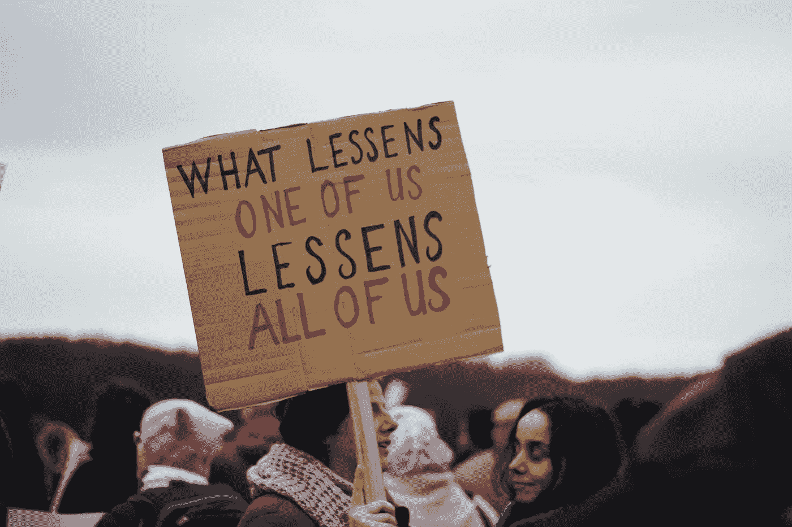
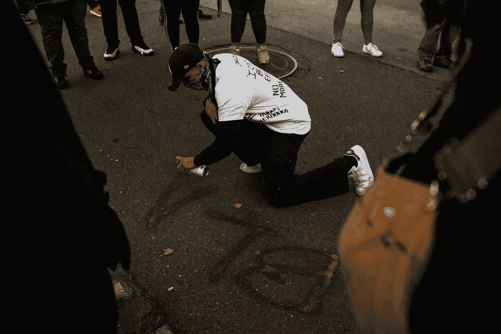

# 如何用数据科学改变世界

> 原文：<https://towardsdatascience.com/how-to-change-the-world-with-data-science-33c3b55bead?source=collection_archive---------29----------------------->

## 利用数据科学的力量应对全球挑战

朱莉安娜·科佐斯基在 [Unsplash](https://unsplash.com/s/photos/world?utm_source=unsplash&utm_medium=referral&utm_content=creditCopyText) 上的照片

> 只有当我们收集的数据能够通知和激励那些有能力做出改变的人时，事情才能完成

如今，全球有近百万人在数据科学相关领域工作。

该行业经历了巨大的增长，全球大部分数据都是在过去两年中生成的。数据驱动的行业在过去几年里经历了巨大的增长。

数据科学的应用让生活变得更加轻松。从寻找最好的电影到选择最好的餐馆就餐，数据为我们提供了比我们可能需要的更多的便利。

当今世界，几乎所有数据科学的应用都致力于让已经舒适的生活变得更加舒适。

然而，我们可以利用现有的数据做更多的事情。用于促进销售的相同算法可以被编写为相反促进社会影响。

# 如何利用数据科学造福社会？

照片由[米歇尔·亨德森](https://unsplash.com/@micheile?utm_source=unsplash&utm_medium=referral&utm_content=creditCopyText)在 [Unsplash](https://unsplash.com/s/photos/equality?utm_source=unsplash&utm_medium=referral&utm_content=creditCopyText) 上拍摄

利用数据科学造福社会的一些例子包括:

*   创建机器学习算法来预测家庭的贫困状况。
*   识别网络欺凌和自杀之间的趋势。
*   检查不同街道特征对行人死亡的影响。
*   确定社交媒体使用的个性化算法是否会强化负面的身体形象。

现在是创造数据驱动的解决方案来解决社会问题的最佳时机。收集与上述所有主题相关的大量数据是可能的。

非营利组织可以利用这些数据更好地理解社会问题。如果他们所做的工作是由数据驱动的，他们将能够在实现社会问题的解决方案方面迈出更大的步伐。

例如，可以实现机器学习模型来识别需要立即关注的社区，并对它们进行优先排序。

然而，为了社会利益，在数据科学领域取得进展是很困难的。虽然大型科技公司有能力聘请数据科学家并开发大型数据生态系统，但非营利组织负担不起。

## 这意味着，尽管非政府组织拥有丰富的数据，但他们无法利用这些数据，因为他们缺乏技术技能。

幸运的是，有一些组织帮助非政府组织获得技术人才。

这些组织将数据科学家/分析师与世界各地的非政府组织配对。

事实上，如果你是一名有抱负的数据科学家，你可以在其中一个组织中做志愿者。您将能够与其他行业专业人士合作，分析社会数据并回答紧迫的问题。

# 你如何参与其中

在 [Unsplash](https://unsplash.com/s/photos/you?utm_source=unsplash&utm_medium=referral&utm_content=creditCopyText) 上由 [Etty Fidele](https://unsplash.com/@fideletty?utm_source=unsplash&utm_medium=referral&utm_content=creditCopyText) 拍摄的照片

> “使用数据不仅可以决定我们想看什么样的电影，还可以决定我们想看什么样的世界”——data kind

**DataKind** 是一个连接数据科学家和非政府组织的组织。他们甚至为想要涉足社会科学的数据科学家提供指导。

他们的座右铭是 ***“利用数据科学的力量为人类服务。”***

如果你是一名想要回馈社会的数据科学家，你可以加入 DataKind 成为一名志愿者。如果你作为志愿者加入，他们会将你分配到一个现有的项目中，你将与一群志同道合的人一起回答一个社会数据科学问题。

截至目前，他们正在进行的最受欢迎的项目之一叫做**零视力**。这个项目旨在将与交通相关的伤亡降至零。

他们的大多数活动都是在晚上或周末组织的，所以全职工作的人也可以积极参与。你可以在这里了解更多关于 DataKind 做[的工作。](https://www.datakind.org/about)

华威大学也有一个 DSSG(社会公益数据科学)暑期奖学金，做的工作和 DataKind 类似。他们教导学生与非政府组织合作，为社会公益开发数据科学产品。你可以在这里看一看他们做的一些工作。

社会数据科学有更多的奖学金和志愿者机会，所以如果你对此感兴趣，你应该做一些研究。

# 您可以参与的项目

如果你想在社会数据科学领域做一些研究，这里有一些项目想法给你:

## 分析 BLM 运动

照片由 [Gabe Pierce](https://unsplash.com/@gaberce?utm_source=unsplash&utm_medium=referral&utm_content=creditCopyText) 在 [Unsplash](https://unsplash.com/s/photos/blm?utm_source=unsplash&utm_medium=referral&utm_content=creditCopyText) 上拍摄

作为对系统性种族主义的回应，一场名为“黑人的命也是命”的民众运动应运而生。这场运动抗议警察暴行和黑人在日常生活中面临的其他形式的暴力。

然而，BLM 运动受到了其他社区的强烈反对。很多人不愿意相信系统性种族主义的存在。他们说像 BLM 这样的运动是不必要的。

像“所有生命都重要”这样的运动是对 BLM 运动的回应，他们坚持认为美国是一个后种族社会，种族主义在这个国家已经不存在了。

数据可以用来证明黑人社区是否处于劣势。纽约警察局每天都会发布交通堵塞数据。

每个交通站的细节都被记录下来，这些数据可以用来寻找系统性种族主义的证据。它可以用来回答像*这样的问题，“少数民族是否更经常被警察拦下，却没有更多犯罪证据？”*

如果这是你感兴趣的分析，你应该看看斯坦福开放警务项目。

## 贫困预测

照片由[乔丹·欧宝](https://unsplash.com/@opeleye?utm_source=unsplash&utm_medium=referral&utm_content=creditCopyText)在 [Unsplash](https://unsplash.com/s/photos/poverty?utm_source=unsplash&utm_medium=referral&utm_content=creditCopyText) 上拍摄

为了消除极端贫困，定期对其进行衡量非常重要。非政府组织只有不时地对其减贫战略进行评估，才能了解其是否有效。

如果我们要确定贫困，我们首先需要收集家庭消费数据。然后，我们可以在带标签的贫困数据集上训练机器学习模型，并对未来数据进行预测。

有了好的算法，我们可以快速识别低收入家庭。这些预测可以帮助社会组织优先考虑低收入家庭，并制定减贫战略。

如果这是一个你感兴趣的项目，你应该看看 [Kaggle 的贫困预测数据集](https://www.kaggle.com/c/costa-rican-household-poverty-prediction)。

# 结论

大多数现有的数据驱动解决方案都专注于提高人们日常生活的舒适度。虽然这是产生最多收入的数据科学应用，但它肯定不是最有意义的应用。

数据有可能为人们创造更好的生活，并可用于解决贫困、药物滥用和种族主义等问题。

应用数据科学来解决社会问题被称为社会数据科学，可以产生改变世界的影响。