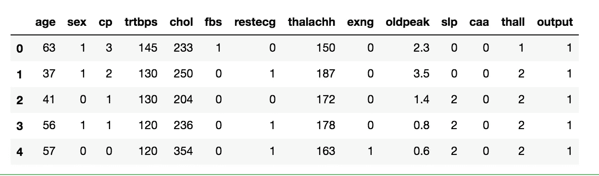
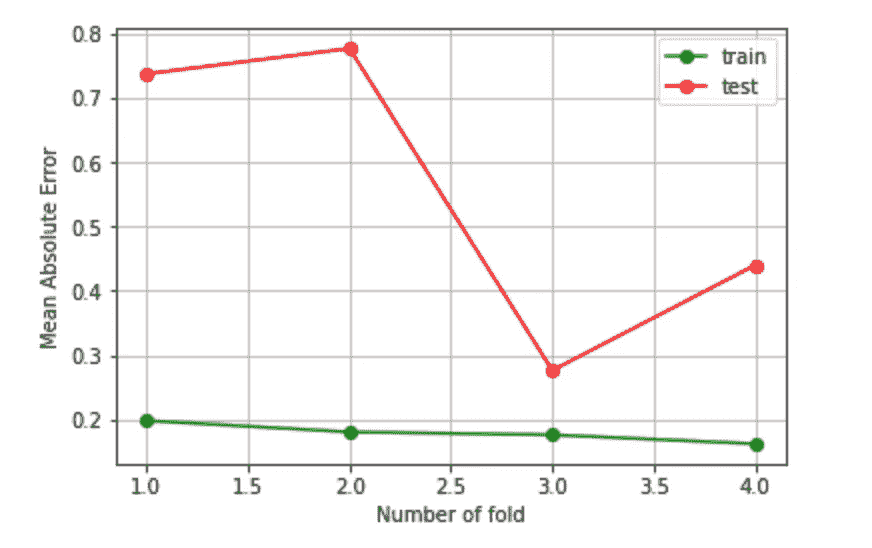
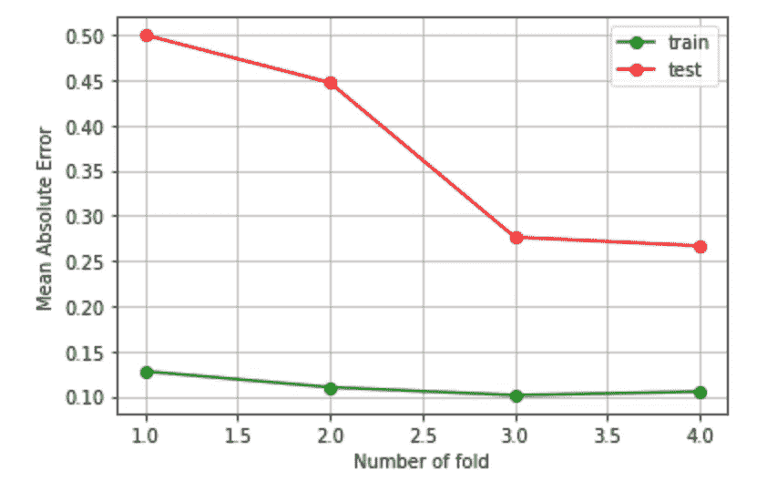
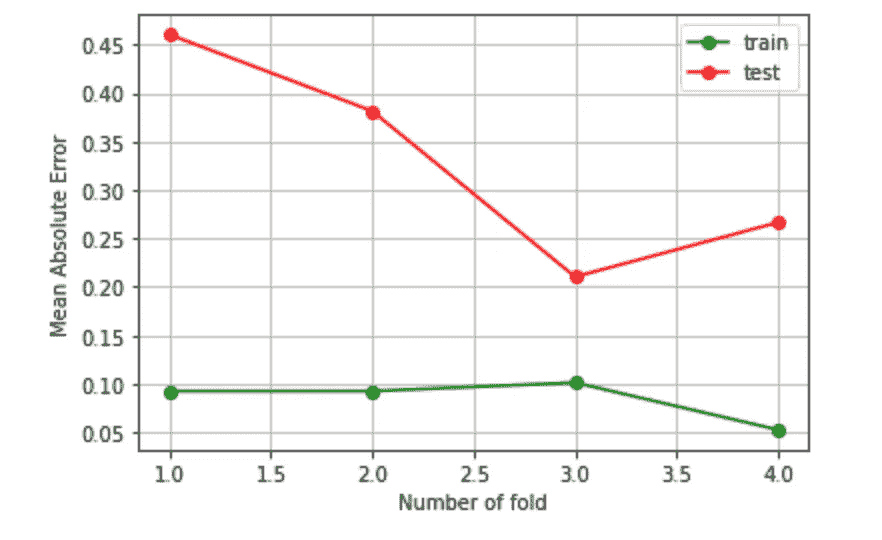
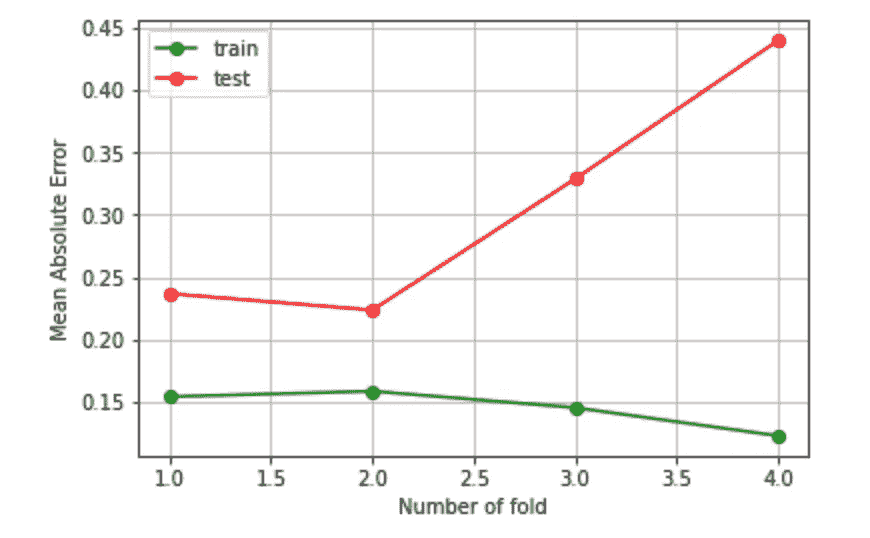
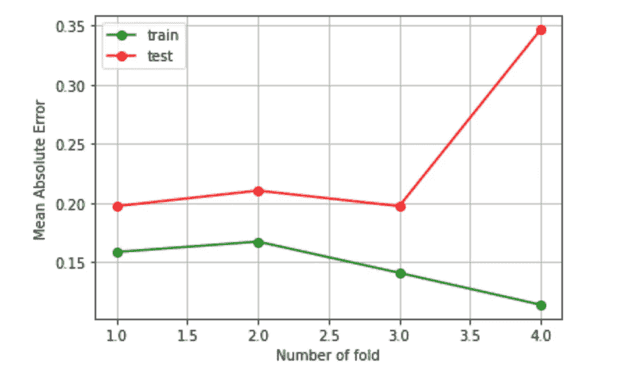

# 如何使用 scikit-learn 检查分类模型是否过度拟合

> 原文：<https://towardsdatascience.com/how-to-check-if-a-classification-model-is-overfitted-using-scikit-learn-148b6b19af8b?source=collection_archive---------6----------------------->

## 数据分析

## Python 中的现成教程，有助于识别和减少过度拟合


图片由[罗兰·施泰因曼](https://pixabay.com/users/rollstein-13853955/?utm_source=link-attribution&utm_medium=referral&utm_campaign=image&utm_content=4727161)从 [Pixabay](https://pixabay.com/?utm_source=link-attribution&utm_medium=referral&utm_campaign=image&utm_content=4727161) 拍摄

在处理机器学习算法时，最困难的问题之一是评估经过训练的模型在未知样本下是否表现良好。例如，可能会发生这样的情况:模型在给定的数据集下表现很好，但在部署时却无法预测正确的值。训练数据和测试数据之间的这种不一致可能是由不同的问题造成的。最常见的问题之一是过度拟合。

> 一个模型很好地适应了训练集，但测试集很差，这种模型被称为对训练集过度适应，而一个模型对两个集都不太适应，这种模型被称为欠适应。摘自[这篇非常有趣的文章](/the-relationship-between-bias-variance-overfitting-generalisation-in-machine-learning-models-fb78614a3f1e)作者 Joe Kadi。

换句话说，**过度拟合意味着机器学习模型能够对训练集进行太好的建模。**

在本教程中，我利用 Python `scikit-learn`库来检查分类模型是否过度拟合。同样的程序也可以用于其他模型，如回归。提议的战略包括以下步骤:

*   将数据集分成训练集和测试集
*   用训练集训练模型
*   在训练集和测试集上测试模型
*   计算训练集和测试集的平均绝对误差(MAE)
*   绘制和解释结果

必须对不同的训练集和测试集执行前面的步骤。

作为示例数据集，我使用心脏病发作数据集，可在 [Kaggle 存储库](https://www.kaggle.com/rashikrahmanpritom/heart-attack-analysis-prediction-dataset)中获得。所有代码都可以从我的 [Github 库](https://github.com/alod83/data-science/blob/master/DataAnalysis/Overfitting.ipynb)下载。

# 加载数据

首先，我通过 Python `pandas`库将数据集作为数据帧加载。数据集包含 303 条记录、13 个输入要素和 1 个输出类，输出类可以是 0 或 1。

```
import pandas as pddf = pd.read_csv('source/heart.csv')
df.head()
```



作者图片

我建立数据集。我定义了两个变量，`X`和`y`，分别对应于输入和输出。

```
features = []
for column in df.columns:
    if column != 'output':
        features.append(column)
X = df[features]
y = df['output']
```

# 构建并测试模型

通常，`X`和`y`被分成两个数据集:训练集和测试集。在`scikit-learn`中，这可以通过`train_test_split()`函数完成，该函数返回训练和测试数据。然后，通过训练数据拟合模型，并通过测试数据检验其性能。然而，所描述的策略不允许验证模型是否过度拟合。

出于这个原因，我不使用`train_test_split()`函数，而是使用 K 折叠交叉验证。

> K Folds 将数据集拆分成 k 个子集，在不同的训练集上训练模型 k 次，在不同的测试集上测试模型 k 次。每次，训练集由 k-1 个子集组成，而测试集是剩余的子集。

`scikit-learn`库为 K 折叠提供了一个类，称为`KFold()`，它接收数字`k`作为输入。对于每一对(训练集、测试集)，我可以建立模型并计算训练集和测试集的平均绝对误差(MAE)。在这个具体的例子中，我利用了`KNeighborsClassifier()`。

```
from sklearn.model_selection import KFold
from sklearn.neighbors import KNeighborsClassifier
from sklearn.metrics import mean_absolute_error
import matplotlib.pyplot as pltkf = KFold(n_splits=4)
mae_train = []
mae_test = []
for train_index, test_index in kf.split(X):

   X_train, X_test = X.iloc[train_index], X.iloc[test_index]
   y_train, y_test = y[train_index], y[test_index] model = KNeighborsClassifier(n_neighbors=2)
   model.fit(X_train, y_train)
   y_train_pred = model.predict(X_train)
   y_test_pred = model.predict(X_test)
   mae_train.append(mean_absolute_error(y_train, y_train_pred))
   mae_test.append(mean_absolute_error(y_test, y_test_pred))
```

然后，我可以绘制培训和测试 MAEs，并对它们进行比较。

```
folds = range(1, kf.get_n_splits() + 1)
plt.plot(folds, mae_train, 'o-', color='green', label='train')
plt.plot(folds, mae_test, 'o-', color='red', label='test')
plt.legend()
plt.grid()
plt.xlabel('Number of fold')
plt.ylabel('Mean Absolute Error')
plt.show()
```



作者图片

我注意到，对于所有 k 倍，训练 MAE 非常小(大约 0.2)。相反，测试 MAE 非常大。范围从 0.3 到 0.8。因为训练 MAE 很小，而测试 MAE 很大，所以我可以断定这个模型是过度拟合的。

我将所有之前的操作组合成一个名为`test_model()`的函数，它接收模型以及`X`和`y`变量作为输入。

# 限制过度拟合

可以通过以下两种策略(潜在地)限制过拟合:

*   降低复杂性
*   调整参数
*   改变模式。

## 1.降低复杂性

我试图通过将所有输入特征缩放到 0 到 1 之间的范围来改进模型。我利用了由`scikit-learn`库提供的`MinMaxScaler()`。

```
from sklearn.preprocessing import MinMaxScaler
import numpy as npfor column in X.columns:
    feature = np.array(X[column]).reshape(-1,1)
    scaler = MinMaxScaler()
    scaler.fit(feature)
    feature_scaled = scaler.transform(feature)
    X[column] = feature_scaled.reshape(1,-1)[0]
```

我构建了一个新模型，并调用了`test_model()`函数。现在，该模型在训练集和测试集上的性能都有所提高。然而，测试 MAE 仍然很大。因此，模型仍然是过度拟合的。

```
model = KNeighborsClassifier(n_neighbors=2)
test_model(model, X,y)
```



作者图片

降低复杂性的另一种可能性是减少特征的数量。这可以通过主成分分析来实现。例如，我可以将输入要素的数量从 13 个减少到 2 个。为此，`scikit-learn`库提供了`PCA()`类。

```
from sklearn.decomposition import PCA
pca = PCA(n_components=2)
pca.fit(X)
X_pca = pca.transform(X)
X_pca = pd.DataFrame(X_pca)
```

我在新特性上测试了模型，我注意到模型的性能提高了。现在测试 MAE 的范围从 0.20 到 0.45。



作者图片

## 2.调整参数

另一种可能性是调整算法参数。`scikit-learn`库提供了`GridSearchCV()`类，允许搜索特定模型的最佳参数。要调整的参数必须作为`dict`传递，对于每个参数，必须传递要分析的值列表。另外，`GridSearchCV()`战功也是交叉验证的。在变量`best_estimator_`中，最佳估计值在拟合后可用。

```
from sklearn.model_selection import GridSearchCVmodel = KNeighborsClassifier()param_grid = {
   'n_neighbors': np.arange(1,30),
   'algorithm' : ['auto', 'ball_tree', 'kd_tree', 'brute'],
    'metric' : ['euclidean','manhattan','chebyshev','minkowski']
}grid = GridSearchCV(model, param_grid = param_grid, cv=4)
grid.fit(X, y)
best_estimator = grid.best_estimator_
```

我测试模型。我注意到测试 MAE 的范围从大约 0.25 到 0.45。

```
test_model(best_estimator, X,y)
```



作者图片

## 3.改变模式

先前的尝试减少了过度拟合。然而，模型性能仍然很差。因此，我试图改变模式。我试一个`GaussianNB()`型号。我注意到性能有了惊人的提高。事实上，测试 MAE 的范围在 0.20 和 0.35 之间，因此我可以得出结论，该模型没有过度拟合。

```
from sklearn.naive_bayes import GaussianNB
model = GaussianNB()
test_model(model, X,y)
```



作者图片

# 摘要

在本教程中，我已经说明了如何检查分类模型是否过度拟合。此外，我还提出了三种策略来限制过度拟合:降低复杂性、调整参数和改变模型。

正如这个具体例子中所描述的，我们经常使用错误的模型来处理问题。因此，我的建议是:**请尝试不同的型号！**

如果你想了解我的研究和其他活动的最新情况，你可以在 [Twitter](https://twitter.com/alod83) 、 [Youtube](https://www.youtube.com/channel/UC4O8-FtQqGIsgDW_ytXIWOg?view_as=subscriber) 和 [Github](https://github.com/alod83) 上关注我。

# 相关文章

[](/a-complete-data-analysis-workflow-in-python-and-scikit-learn-9a77f7c283d3) [## Python 和 scikit 中的完整数据分析工作流程-学习

towardsdatascience.com](/a-complete-data-analysis-workflow-in-python-and-scikit-learn-9a77f7c283d3) [](/how-to-improve-the-performance-of-a-supervised-machine-learning-algorithm-c9f9f2705a5c) [## 如何提高(监督)机器学习算法的性能

### 如今，每个数据科学家都能够编写代码来训练机器学习算法:加载一个代码就足够了

towardsdatascience.com](/how-to-improve-the-performance-of-a-supervised-machine-learning-algorithm-c9f9f2705a5c) [](/data-preprocessing-in-python-pandas-part-6-dropping-duplicates-e35e46bcc9d6) [## Python Pandas 中的数据预处理—第 6 部分删除重复项

### 使用 Python 熊猫库删除重复项的快速教程。

towardsdatascience.com](/data-preprocessing-in-python-pandas-part-6-dropping-duplicates-e35e46bcc9d6) 

# 来自社区

[](/is-your-model-overfitting-or-maybe-underfitting-an-example-using-a-neural-network-in-python-4faf155398d2) [## 你的模型是否过拟合？或者不合身？python 中使用神经网络的示例

### 过拟合，欠拟合，泛化能力，交叉验证。一切都简单解释了。我还提供了一个…

towardsdatascience.com](/is-your-model-overfitting-or-maybe-underfitting-an-example-using-a-neural-network-in-python-4faf155398d2) [](/the-relationship-between-bias-variance-overfitting-generalisation-in-machine-learning-models-fb78614a3f1e) [## 机器学习模型中偏差、方差、过拟合和泛化的关系

towardsdatascience.com](/the-relationship-between-bias-variance-overfitting-generalisation-in-machine-learning-models-fb78614a3f1e) 

# 新到中？您可以每月订阅几美元，并解锁无限的文章— [点击此处](https://alod83.medium.com/membership)。