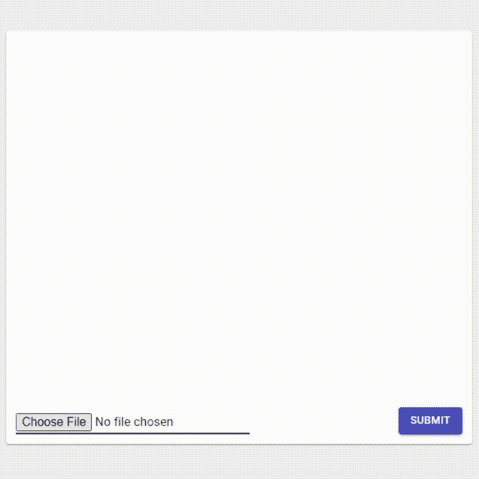
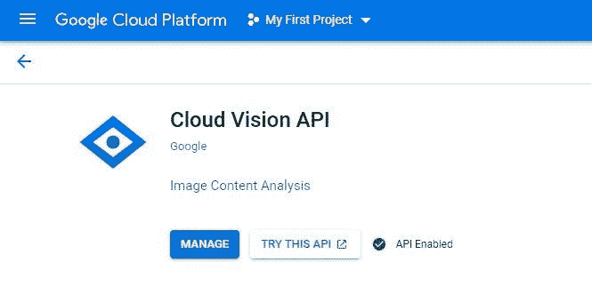
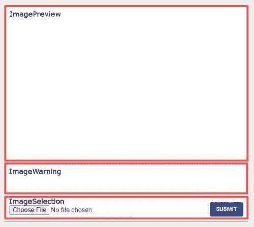
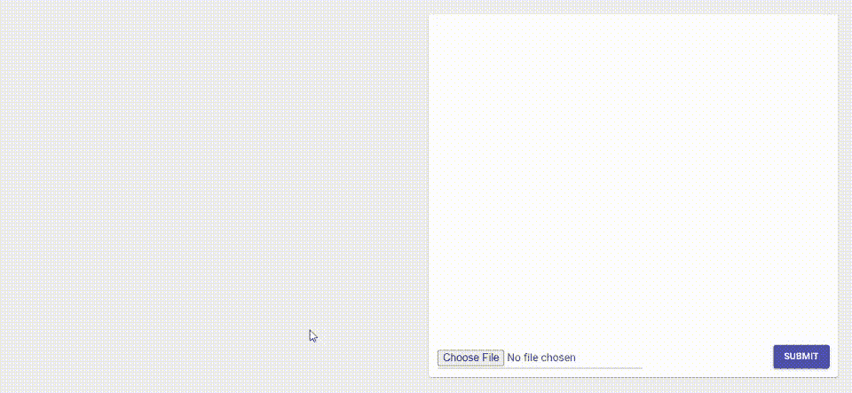

# 如何自动检查个人资料图片上传

> 原文：<https://towardsdatascience.com/how-to-check-profile-picture-uploads-automatically-a0f4b55f1763?source=collection_archive---------28----------------------->

## …使用现有的人工智能 API

作者 Gif

<https://github.com/JEDS-AI/profile-picture-checker>  

# 介绍

个人资料图片上传功能广泛应用于许多应用程序中。它允许用户定制他的简档，并且允许容易地识别他们。在某些用例中，显示一些警告或限制用户上传不合适的图片可能会有所帮助。可能的情况是，上传一张非常模糊或戴着头饰的照片是不允许的/有用的。要实现这样的功能，手动检查图像真的很麻烦。这就是人脸识别可以帮助改进上传个人资料图片的过程的地方。

我将使用 Google Cloud Vision API 来实现这个功能。Google 提供了很多很好用的机器学习 API。将来使用这些端点的成本可能会有所不同，因此如果您感兴趣，请自行查找。现在你有 1000 个免费的初始请求，所以试用是免费的。

# 设置 Google 云视觉 API

首先，你应该为自己创建一个谷歌云账户。
之后你可以登录谷歌云控制台。

在 Google Cloud 控制台中，您必须执行某些任务才能成功地向 API 发出请求。
为了存档，您还可以使用[快速启动设置](https://cloud.google.com/vision/docs/setup)。
必要的步骤是:

*   创建新项目
*   激活谷歌云视觉 API

*   启用计费(不用担心，有免费方案)
    但是真的需要启用，不然不行。
*   设置认证
    请随意使用 Google 推荐的方式，使用服务帐户并生成私有和公共密钥。对我来说，生成一个 API 键并在我的请求中使用它要容易得多。但是请记住，它可能不如其他方法安全。根据您的使用情况，保护特定 IP 地址的 API 密钥就足够了。所以如果你只是想尝试 API，一个 API 密匙就足够了。

# 测试面部识别请求结果

为了测试人脸识别 API，我手工做了一些请求。我用不同的图片进行了测试，看看结果如何变化。请求应该是这样的:

API 键在请求 URL 本身中提供。请求方法是 POST，因为我们想向端点发送一些东西。请求体必须遵循这种给定的格式，因为您也可以在一个请求中发送多个图像。但是我们不会在这里使用这个功能。

您还必须定义应该使用 API 的哪些特性。对于这个用例，它是“面部检测”功能。maxResults 值在这里是不必要的，因为我们只发送一个图像。

对于下面的图片，我希望得到戴头饰的信息。

图片由[像素](https://www.pexels.com/)上的 [Adrea Piacquadio](https://www.pexels.com/@olly) 拍摄

当成功调用人脸识别 API 时，您会得到如下所示的结果。为了简单起见，我删除了一些数据。例如，你得到了鼻子或眼睛位置的大量数据，但是我们现在不需要这些信息。

如你所见，我们得到了一些关于情绪(喜悦、悲伤、愤怒、惊讶)和图像属性(曝光不足、模糊和头饰)的信息。该值显示了不同参数对于给定图片的可能性。在这个例子中，除了 headwearLikelihood 是“可能”之外，所有参数都是非常不可能的。对于这一结果，如果佩戴头饰不适合上传个人资料图片，则显示一些警告是有意义的。

可能性评级可以有 6 个不同的值:未知、非常不可能、不太可能、可能、可能、非常可能

# 设置一个基本的 React JS 项目

为了实际使用 API，你可以使用任何可以处理 HTTP 请求的东西。例如，它可以是 Web 应用程序或移动应用程序。我使用 React-JS 创建了一个基本的 Web 应用程序。

你可以去看看 [GitHub 仓库](https://github.com/JEDS-AI/profile-picture-checker)，那里提供了我的实现。你可以随意用它来测试你自己的 API。(不要忘记更改 API 键)。

要自己创建一个 react 项目，我建议遵循 React 官方文档的步骤。此外，我安装了 [Material UI](https://material-ui.com/) 作为 UI 框架，这样应用程序开箱后看起来很好。

# 用例的实现

为了创建一个示例用例，我从实现 3 个组件开始，它们将一起工作来创建 ProfilePictureUploader 组件。
组件包括:

*   图像预览
*   图像警告
*   图像选择

作者图片

# 试映

ImagePreview 基本上是一个等待图像信息的标签。如果信息被更新，它将重新呈现新的图像。我对高度做了一些限制，并添加了一些额外的造型，使它看起来更好。

# 警告信息

ImageWarning 组件使用 API 调用的结果，并决定是否显示警告。该组件还获取 API 调用当前是否待定的信息，以显示加载指示符。在这个例子中，我决定在愤怒、模糊或头饰参数不是“非常不可能”时显示警告。如果出现警告，会生成一个小图标和一条文本来通知用户。您当然可以实现其他符合您需求的逻辑。

# 输入并提交

ImageSelection 组件由一个文件输入和一个提交按钮组成。文件输入用于从用户处获取图像，提交按钮目前没有功能，它只是用来显示如何处理配置文件图像。例如，点击提交，它可以上传到您的服务器。

# 个人资料图片上传者

这三个组件在一个名为 ProfilePictureUploader 的包装组件中使用，该包装组件提供 API 请求本身并定义其他三个组件的排列方式。

请看看 detectFaces 函数。该函数执行对 Google Cloud Vision API 的请求。如您所见，为了进行人脸检测，需要提供一个请求主体。使用这个请求体，您可以向 https://vision.googleapis.com/v1/images:annotate?的
**发送一个 POST 请求 key = $ { APIkey }**
API key 就是你从谷歌云控制台得到的 API key。在这里，我只是将它直接写入代码中，这通常不是最好的方法，但在开始时尝试一下也是可以的。请求成功后，将向 ImageWarning 组件发出响应，以确定是否应该显示警告。

# 结果

作者 Gif

在我的测试中，API 本身非常可靠和快速。它总是花费大约 1 秒钟来得到一个结果，这对于做这样一个复杂的任务来说是相对快的。

一般来说，我认为这是一个很好的方式来改善个人资料图片上传这样的功能，因为它可以帮助减少你的应用程序中不良或不适当的图片数量。无论如何，你应该决定你是否想要完全限制用户上传这样的内容，或者你只是想像我一样显示警告。一如既往，它高度依赖于您的特定用例。