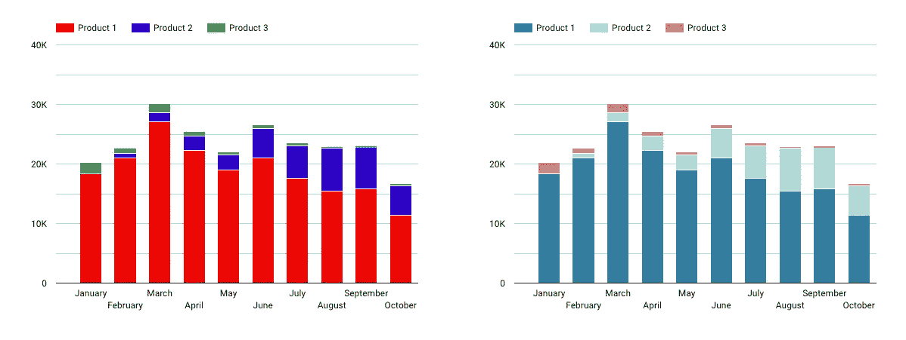
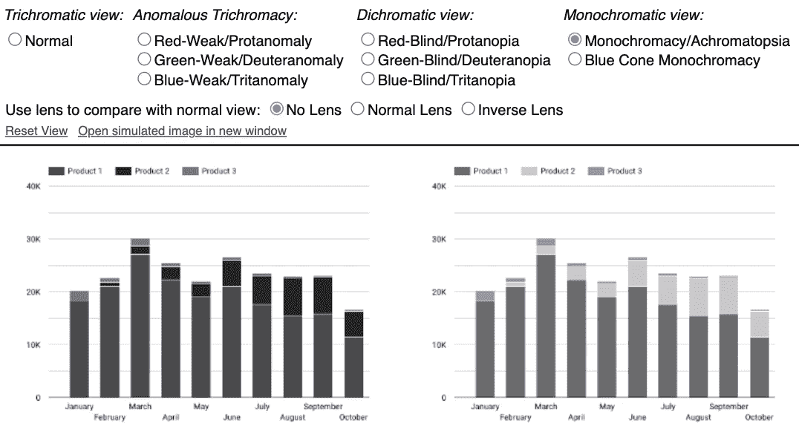

# 如何为数据可视化选择正确的颜色

> 原文：<https://towardsdatascience.com/how-to-choose-the-right-colors-for-data-visualizations-faf290f9d1a5?source=collection_archive---------12----------------------->

## 数据即

## 创建有影响力的图表时，颜色在决策中的作用

照片由[海伦娜·洛佩斯](https://unsplash.com/@wildlittlethingsphoto?utm_source=unsplash&utm_medium=referral&utm_content=creditCopyText)在 [Unsplash](https://unsplash.com/?utm_source=unsplash&utm_medium=referral&utm_content=creditCopyText) 拍摄

本质上，图是由什么构成的？形状，线条，大概吧。肯定是一些文本元素。可能吧。但最重要的是:颜色。无论你选择黑白设计还是彩色设计，**任何数据可视化的颜色都会对读者产生不可忽视的影响。**

2017 年的一篇名为[“可视化中的情感色彩”](https://research.tableau.com/sites/default/files/Affective%20Color%20CHI%202017.pdf)的研究论文展示了颜色在我们对数据可视化的情感解释上的力量。他们的结果*“展示了如何操纵颜色和调色板属性来实现情感表现力”*。例如，他们演示了轻微改变调色板如何将同一幅图的感觉从“严肃”转变为“有趣”。这只是告诉我们**在数据可视化中，我们在颜色方面的选择有多么重要**。

在进入问题核心之前，我们先举个例子来说服你。请看下面的两张图表:

作者的图表(基于随机测试数据)

哪一个最吸引你？如果你必须从两个图表中选择一个来说明一篇文章，你会选择哪一个？你可能更喜欢正确的，不是吗？然而，这两张图之间唯一的区别是颜色，仅此而已。

但在第二张图中，我特别注意选择有意义的(根据传达的信息)、一致的(与预定义的颜色代码一致)和容易理解的(特别是对色盲的人)颜色。在我作为数据分析师的整个经历中，我发现这三个要素是成功的数据可视化的关键**。现在让我们进入细节。**

# 1.让颜色有意义

对于许多决定来说，指导你决定图表颜色的首要问题是:**你想传达什么信息？**

清楚地陈述你的图表的目标会让你从显而易见的选项开始。正如电影导演比利·怀尔德所建议的:

> “对观众来说不要太聪明。显而易见。让细微之处也显而易见。”

谁说数据可视化与电影如此不同？事实上，这就是我们想要通过我们的图表达到的目的:观众立即理解它的含义，并被传达的信息所说服。

例如，如果一个图表显示了两种趋势的相反演变，那么显而易见的选择将是为积极趋势选择一种具有积极内涵的颜色(如绿色)，为消极趋势选择一种相反的颜色(如红色)。类似地，渐进演变可以用相同颜色的不同强度变化来表示。

**根据你的文化背景以及你希望你的图表传达的感情**，选择最有意义的颜色将有助于读者更好地理解和坚持你的图表。如果你想更多地了解用四种不同的方式给同一个图表着色对读者来说会有不同的意义，你可以参考这篇文章:

</the-power-of-color-in-data-visualizations-9868d661f2a0>  

# 2.使颜色一致

现在你知道了如何确保你的图表通过所选的颜色传达正确的信息，你必须做出一致的选择。我的意思是:

*   选择有限数量的颜色
*   选择适合环境的颜色
*   一旦设定好，就坚持选择颜色

第一条规则是在一个图表中最多有 10 种不同的颜色，而 T4 倾向于 3 到 5 种不同的颜色。人脑是有局限性的，就像我们的眼睛一样。为了与我们的第一条建议保持一致:如果你想让你的信息清晰有效地传达给观众，避免与多余的信息混淆，比如太多的颜色。

第二，**颜色必须符合图表呈现的背景**:受众是谁(公众、同事、客户、董事会……)？将在哪种介质上呈现(数字介质，印刷在纸上……)？它将被哪些元素包围(在演示文稿中，在文章中，作为独立的图表…)？同一个图形可以有两组不同的颜色，但是一组比另一组与上下文更相关。

最后，颜色一致性的一个关键要素是**坚持为给定的图形**定义颜色后选择的颜色。根据我的个人经验，我习惯于为不同的利益相关者构建显示类似数据的仪表板。虽然每个仪表板彼此独立，但观众在查看图形时要习惯于给定的颜色代码，这一点很重要，无论图形显示在哪个仪表板中。让我们举一个首席执行官查看五个不同国家的仪表板的例子:对他们来说，在所有仪表板上有相同的“颜色代码”是最方便、最容易阅读的(例如，“产品 1”将始终显示在深蓝色#337d9e 中，等等)。).

# 3.使颜色易于使用

正如我们刚才提到的，展示数据可视化的受众和背景对其影响有很大的作用。当你微调颜色选择时，记住上下文。特别是，出现图形的**不同设备**可以显示不同的颜色变化。为了尽可能避免图形感知上的差异，请避免使用高度饱和的颜色或太浅的颜色，因为它们可能在不同设备上以错误的方式出现。

可达性的另一个方面是考虑有颜色缺陷的**人**。[全球约 8%的男性和 0.5%的女性患有色盲](https://www.colourblindawareness.org/colour-blindness/)。知道你的观众中有不可忽视的一部分可能是色盲，有一些方法来调整所选择的颜色，以显示所有人都能理解的颜色。一种简单的方法是选择具有不同饱和度值的颜色。此外，您还可以使用[色盲模拟器](https://www.color-blindness.com/coblis-color-blindness-simulator/)，这是一个免费的在线工具，来测试图形是否是色盲安全的。

如果我们以我最初的例子为例，将两张图传入色盲模拟器，我们会发现右边的图比左边的图更适合色盲人群，因为颜色之间的对比更明显。

使用色盲模拟器显示的作者图形

# 获胜的组合

根据我的经验，我注意到让漂亮而强大的图表如此成功和令人难忘的是三个被低估的属性的组合:

*   使颜色**有意义**以使读者立即感觉到你的图形的吸引力
*   使颜色**一致**，使读者在从一个图形跳到下一个图形时不会迷路
*   使颜色**易于使用**使所有读者感到关注，并能够获得数据可视化技能的力量

你喜欢读这篇文章吗？ [*成为*](https://marie-lefevre.medium.com/membership) *的一员，加入一个不断成长的充满好奇心的社区吧！*