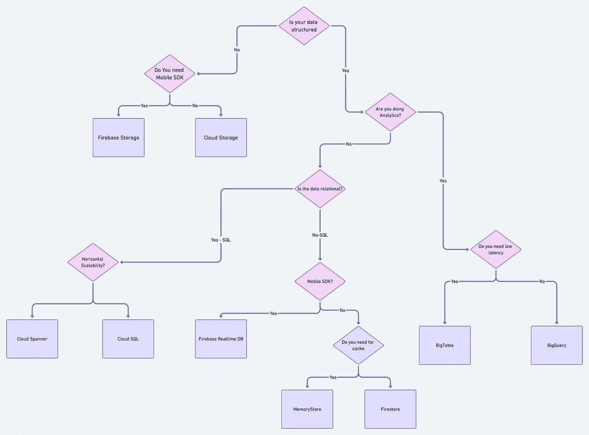

# 如何选择合适的谷歌云平台数据库

> 原文：<https://towardsdatascience.com/how-to-choose-the-right-google-cloud-platform-database-a223f4d7482f?source=collection_archive---------7----------------------->

## **向云及更远的地方！我抓住你了，范姆！**

[*坦纳·博瑞克*](https://unsplash.com/@tannerboriack?utm_source=unsplash&utm_medium=referral&utm_content=creditCopyText) *上 Unsplash*

选择正确的 GCP 数据库取决于很多因素，包括您的工作负载和所涉及的架构。今天，我将为大家提供流行的谷歌云数据库服务的概述，包括评估和选择服务时的关键考虑因素。

# **了解你的数据库**

谷歌云平台(GCP)旨在提供一系列计算资源，数据库服务就是其中之一。GCP 有能力处理现代数据，具有高效、灵活和卓越的性能，是一个托管平台解决方案，用于跨地域传播数据。

在选择 Google 数据库服务时，应该考虑很多因素，比如数据的类型和大小、延迟、吞吐量、可伸缩性和 IOPs 等等。

# **GCP 主要提供三种全球数据分发参考架构模型:**

**1)** **单一—** 所有部署模式中最简单的一种，可以通过在 Google 上创建新的云数据库和/或“提升和转移”现有工作负载来部署数据库。

**2)** **混合—** 当云中的应用程序需要访问本地数据库时，这些类型的部署非常有用，反之亦然。

部署混合模型(一些数据在 Google Cloud 上，一些在内部)时，有三个主要因素需要考虑:

主数据库:首先，你需要决定主数据库是存储在本地还是云端。一旦您选择了云，GCP 资源将充当内部资源的数据中心，而如果您选择了内部资源，您的内部资源会将数据同步到云中以供远程使用或备份。

**托管服务:**可用于云中的资源，这些服务包括可伸缩性、冗余和自动备份。但是，您可以选择使用第三方托管服务。

**可移植性:**根据您选择的数据存储类型，您的数据的可移植性也会受到影响。为了确保可靠和一致的数据传输，您需要考虑跨平台存储，如 MySQL。

**3)** **多云—** 这些类型的部署可以帮助您有效地分发您的数据库并创建多个故障保险，因为它使您能够将部署在 Google Cloud 上的数据库与来自其他云提供商的数据库服务相结合，从而为您提供更广泛的专有云功能优势。

部署此模型时，有两个主要因素需要考虑:

**集成**:确保客户端系统可以无缝地访问数据库，不管它们部署在什么云上，例如，使用开源客户端库使数据库可以跨云顺畅地使用。

**迁移**:由于有多个云提供商，可能需要借助数据库复制工具或导出/导入流程在云之间迁移数据。Google Storage Transfer service 就是这样一个工具，可以帮助您进行数据库迁移。

# **云是极限:谷歌云平台数据库服务**

GCP 提供了几种数据库服务供您选择。

## **云 SQL** :

Cloud SQL 是一种关系型 GCP 数据库服务，完全由 MySQL、PostgreSQL 和 SQL Server 管理并与之兼容，包括自动备份、数据复制和灾难恢复等功能，以确保高可用性和灵活性。

**何时选择:**从本地 SQL 数据库到云的“提升和转移”,到处理大规模 SQL 数据分析，再到支持 CMS 数据存储和微服务的可扩展性和部署，云 SQL 有许多用途，当您需要关系数据库功能但不需要超过 10TB 的存储容量时，云 SQL 是更好的选择。

## **云扳手**:

另一个完全托管的关系型 Google 云数据库服务 Cloud Spanner 不同于 Cloud SQL，它专注于结合关系型结构和非关系型可伸缩性的优势。它提供了跨行的一致性和高性能操作，并包括内置安全性、自动复制和多语言支持等功能。

**何时选择:**如果您计划使用大量数据(超过 10TB)并需要事务一致性，那么 Cloud Spanner 应该是您的首选。如果您希望使用分片来获得更高的吞吐量和可访问性，这也是一个完美的选择。

## **大查询:**

使用 BigQuery，您可以通过 SQL 和查询流数据来执行数据分析。由于 BigQuery 是一个完全托管的无服务器数据仓库，其内置的数据传输服务可以帮助您从本地资源(包括 Teradata)迁移数据。

它整合了通过 BigQuery ML、BI Engine 和 GIS 提供的机器学习、商业智能和地理空间分析功能。

**何时选择:【BigQuery 的用例涉及流程分析和优化、大数据处理和分析、数据仓库现代化、基于机器学习的行为分析和预测。**

## **云大表**:

这是一项完全托管的 NoSQL 谷歌云数据库服务，专为大型运营和分析工作负载而设计。云 Bigtable 包括高可用性和零停机配置更改功能。实际上，您可以将它与各种工具集成，包括 Apache 工具和 Google 云服务。

云 Bigtable 用例涵盖金融分析和预测、物联网数据接收、处理和分析，以及超个性化营销应用。

**何时选择:**如果您正在使用大量的单键数据，云 Bigtable 是一个不错的选择，并且更适合低延迟、高吞吐量的工作负载。

## **云火商店:**

Cloud Firestore 是一个完全托管的无服务器 NoSQL GCP 数据库，旨在开发无服务器应用程序，可用于存储、同步和查询 web、移动和物联网应用程序的数据。凭借离线支持、实时同步和内置安全性等关键功能，您甚至可以将 Firestore 与 GCP 的移动开发平台 Firebase 相集成，从而更轻松地创建应用程序。

云 Firestore 用例包括具有在线和离线功能的移动和 web 应用程序、多用户、协作应用程序、实时分析、社交媒体应用程序以及游戏论坛和排行榜。

**何时选择:**当你的重点在于 app 开发，需要实时同步和离线支持的时候。

## **Firebase 实时数据库:**

这是 NoSQL 谷歌云数据库，是 Firebase 平台的一部分。它允许您实时存储和同步数据，并包括离线使用的缓存功能。它还使您能够实现声明性身份验证，通过身份或模式匹配用户。

它包括移动和网络软件开发工具包，以简化应用程序开发。
Firebase 实时数据库的使用案例包括跨设备应用程序的开发、广告优化和个性化以及第三方支付处理。

## **云存储库**:

Cloud Memorystore 旨在实现安全、高可用性和可伸缩性，是一个完全托管的内存 Google Cloud 数据存储，使您能够创建亚毫秒级数据访问延迟的应用程序缓存。

云内存商店的使用案例包括应用程序的“提升和转移”迁移、机器学习应用程序、实时分析、低延迟数据缓存和检索。

**何时选择:**如果您正在使用键值数据集，并且您的主要关注点是事务延迟。

# 选择关键问题的数据库

我还创建了这个流程图，它可以显示选择数据库的方向:

由 Anuj Syal 创建，[异想天开的链接](https://whimsical.com/choosing-the-right-database-in-gcp-M7L3jcgNZSiLqhF5nPxTxK)

# 寻找更多信息

我在 youtube 上制作了这个视频，详细介绍了这个话题

由 [Anuj Syal](https://www.youtube.com/channel/UCO8XsgcjqArk_mAd1VGBMfg) 在谷歌云中选择数据库

# **我的想法**

随着越来越多的企业寻求云服务来运行其核心关键系统，并作为启动其新应用的主要平台，选择正确的谷歌云平台(GCP)数据库开启了可能性，并可以成为交易撮合者，为客户提供最少的停机时间、安全且经济高效的服务和解决方案。

# 在 Linkedin 和 Twitter 上关注我

如果你对类似的内容感兴趣，点击 Medium 上的“关注”按钮，或者在 Twitter 和 Linkedin 上关注我