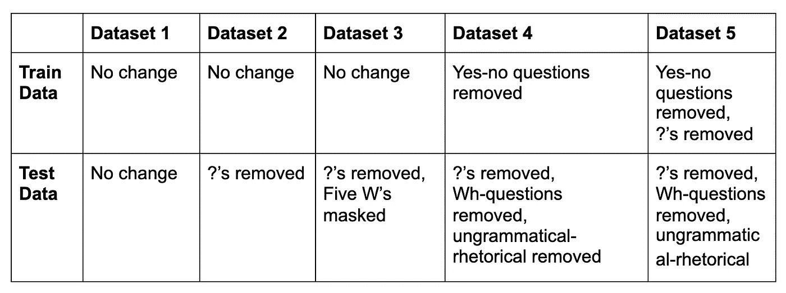
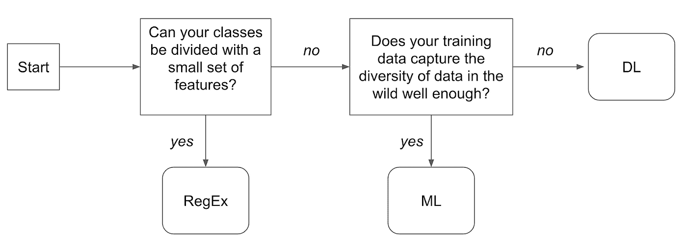
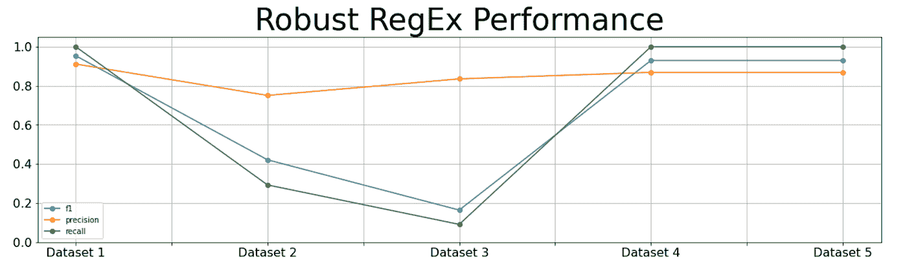
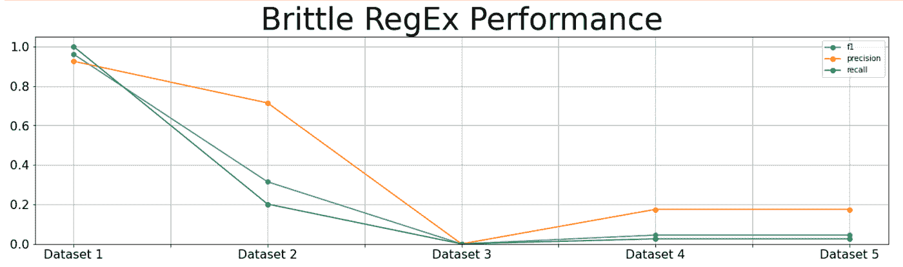
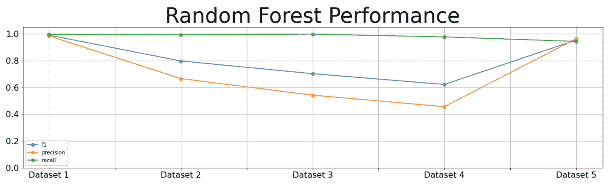
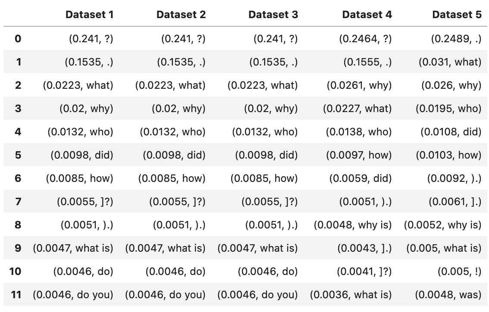
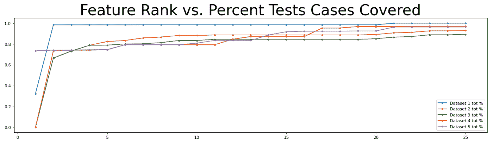
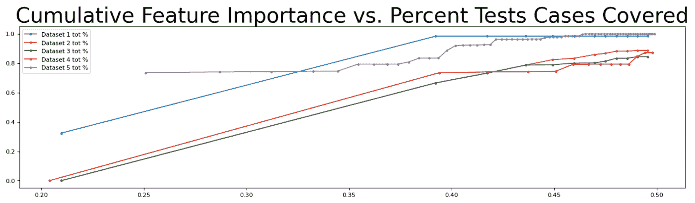
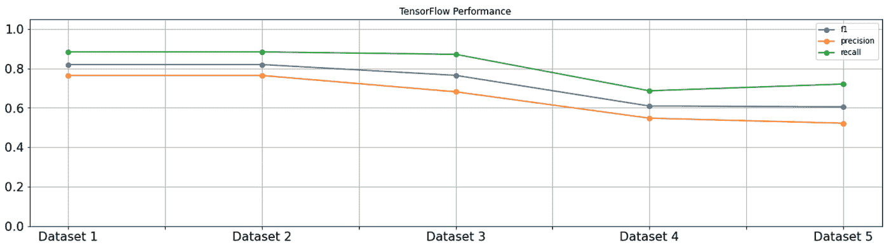
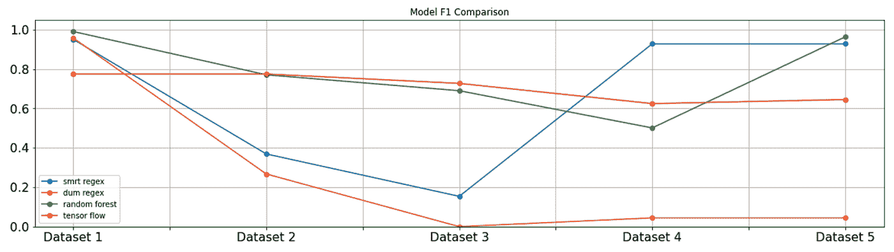

# 如何在组织环境中选择正确的文本分类模型

> 原文：<https://towardsdatascience.com/how-to-choose-the-right-model-for-text-classification-in-an-organizational-setting-1a610a0418e1?source=collection_archive---------20----------------------->

## [行业笔记](https://towardsdatascience.com/tagged/notes-from-industry)

## *在应用机器学习中，理解和忽略技术因素的重要性，或者，何时使用推杆走出沙坑。*

从沙坑推球(作者的*图片)*

对于误入沙坑的高尔夫球，典型的反应是咒骂、叹息，然后拿着沙楔跋涉到沙坑。这不是一个艰难的决定。每个高尔夫球袋都有一个沙楔，不像所有其他关于使用哪个球杆的决定——我应该使用 5 号铁杆吗？混血儿？铁木？a 6 铁？沙坑有一个专门为它设计和命名的俱乐部。所以你可能会惊讶地发现，有些严肃的高尔夫专业人士建议，只要有可能，你应该在沙坑里使用推杆。为什么？如果有更好的工具，为什么还要推荐推杆呢？因为最好的工具并不是最适合这项工作的工具，*它是你最擅长使用的工具。*

如果你从事软件技术方面的工作，你可能经历过一个老工程师兴奋地告诉你他们 15 年前在 awk 中写的某个工具完美地解决了你的某个问题。知道正确的工作使用正确的工具是管理顾问拿这么多钱来提出计划的原因。管理顾问服务没有价值，因为他们是唯一聪明到足以解决难题的人，他们有价值是因为他们见过很多类似的问题，并且他们足够聪明到可以从中吸取教训。你的公司可能会被收购一次，但是三大巨头已经有了几个世纪的合并经验。老工程师的优势不在于他精通命令行工具，也不在于他比初级工程师更聪明，而是他之前已经看到了这个问题。

但是使用 awk 是一个好的解决方案吗？答案很少取决于 awktegenarian 计划的绩效，而更多地取决于当前的组织需求和能力。如果他离开了，或者其他人需要维护或修改程序，或者需要向主管解释程序，使用 awk(一种古老的命令行语言)比电子表格更糟糕，即使电子表格更慢，不能处理那么多数据，并且需要每次手动编辑数据 20 分钟才能使用。

在 Salesforce，我的团队为各种 NLP 任务开发和部署模型，但我们的主要工作是电子邮件的文本分类模型。拟合模型是双重的:您使您的模型适合您的数据*和*您使您的模型适合您的组织。在这篇文章中，我将从技术数据科学的角度，通过一个示例文本分类问题来说明我们在选择正确的问题模型时学到的一些见解。然后，我将向您展示如何抛弃这一切，以适应您的组织约束。

从技术角度来看，我们选择什么样的模型最终取决于我们的训练数据*在多大程度上捕捉到了它将在生产中获得的数据的多样性*。Salesforce 拥有大量不同的客户组织。有两个人的组织，也有上万人的组织。他们销售单元、包、许可证和合约。一些公司使用单一、简单的销售流程，另一些公司有几十种不同的渠道来销售各种产品。一些公司比其他公司更有可能允许我们根据他们的数据训练模型。因此，当我们创建数据集时，我们总是知道*先验*我们的训练数据既不完整又有偏差，这是我们在选择模型时考虑的首要问题。不管我们为手头的任务选择什么模型，它都需要在产品的生命周期中以合理的成本进行部署、扩展和维护。销售人员需要能够向客户演示，产品经理需要能够向高管演示。这些组织需求通常比技术需求更重要。

# 任务和语料库:

这篇博文的示例任务是将一个句子归类为疑问句/非疑问句。我选择这个是因为这是一个简单的、定义明确的任务，而且我们对问题的定义基本一致。大多数有趣的文本分类任务会涉及到大量的定义争论，比如“我们什么时候一起吃午饭吧”是不是一个*调度请求*。

对于语料库，我使用的是由杰克·金斯曼准备的数据集。这个数据集对我们的目的特别有用，因为它包含了*大量*的问题(占句子的 33.81%)，这些问题是*容易标记的*(没有一个遗漏问号)，并且许多问题(71.94%的问题)是不合语法的反问句，这给了这个问题实质。(因为我是出于研究目的使用这个语料库，所以数据集的具体内容并不重要，除了有许多带有特殊语法的问题。)有三种基本类型的问题。首先是使用[五个 w](https://en.wikipedia.org/wiki/Five_Ws)(19.55%)的 [*疑问句*](https://dictionary.cambridge.org/us/grammar/british-grammar/questions-wh-questions) ，例如“当巫师和术士透露他们所拥有的东西时，到底发生了什么？”接下来是*是-否问题*产生是或否的回答(8.51%)，比如“它真的来自也门吗？”或者“你会回答吗？”最后是不符合语法的反问句(71.94%)，比如“日期公布(早)？”或者“与外国演员合作付款/分散资金？”

因为这个数据集中的所有问题都包含一个问号，所以我通过简单地出现一个结束问号来将每个句子标记为一个问题/不是一个问题。然后，我将数据集分成 80/20，用于训练和测试。因为确定哪种建模方法最适合数据的主要区别归结为“您的问题复杂吗？您的训练数据有多完整？”我操纵数据集来创建不同但相似的上下文，以观察训练数据如何很好地捕捉测试数据的多样性。在第一个数据集中，测试集没有被改动。在第二个数据集中，我从测试数据中删除了所有的问号。在第三个数据集中，我删除了问号，并用一个未知标记(“XXXXX”)屏蔽了测试数据中的五个 W。在第四个数据集中，我只对是非问题(和非问题)进行测试，并且在没有任何是非问题的情况下进行训练。我也从测试数据中去掉问号。在第五个数据集中，我采用了第四个数据集，但也从训练集中删除了问号。下表描述了数据集及其差异。

# **前期底线:**

我对根据您的数据拟合模型的最后建议非常简单。如果你的类与一小部分特性紧密相关，那么使用正则表达式。如果将你的类分开需要更复杂的规则，并且你的训练数据捕获了你的测试数据的多样性，那么使用传统的机器学习，并且作为最后的手段，使用深度学习。当然，数据的“捕获多样性”不是一个精确或可量化的指标，所以我将遍历不同的数据集，并显示随机森林在哪里足够接近(数据集 1、2、3 和 5)，以及在哪里不够接近(数据集 4)。下面的流程图总结了这一点:

不探究数据，很难(解读:不可能)知道这些问题的答案，*。在某种意义上，您可以使用正则表达式来回答您的类是否可以用一小组功能来划分，因此应该使用正则表达式，您可以使用机器学习来确定您的训练数据是否捕捉到了野外数据的多样性，因此应该使用机器学习。这里的挑战不是技术上的，而是情感上的。一旦你创建了一个模型，尤其是你努力工作的模型，很难[删除它](https://nedbatchelder.com/text/deleting-code.html)。但是过分看重你的模型会阻止你做正确的事情。愿意创造模型，而且要小心谨慎地去做，然后把它们扔掉。你必须愿意[谋杀你亲爱的人。](https://slate.com/culture/2013/10/kill-your-darlings-writing-advice-what-writer-really-said-to-murder-your-babies.html)*

*我在某种程度上回避了探索以了解数据的需求，因为我们已经知道了很多关于问题的信息，而不探索这些数据，疑问词形成了一个封闭的类别，并且问题的语法很少出现在问题之外。这有点像开始一个项目，在探索了一个月之后发现它表现得出奇地好，但这是一篇更好的博文，因为我们可以直接进入问题的实质。*

# *从正则表达式开始*

*如果可以用一小组特性来划分类，那么 RegEx 是最好的方法。如果每个问题都包含一个结束问号，并且结束问号不会出现在文本中的其他地方，那么使用 RegEx 将是完美的。我可以只寻找一个终结问号的存在，但这是一个不切实际的坏的稻草人。请记住，我们已经知道了很多关于问题的知识，如果我们不知道，我们会一直探索数据，直到我们知道，人们并不总是使用问号(例如在随意的谈话，聊天，语法错误等。)并且这些问题倾向于使用五个 W 中的单词。所以我做了两个正则表达式分类器:一个只寻找结尾问号和五个 W，我称之为脆弱正则表达式分类器，另一个做同样的事情，但另外寻找是非问句的句子开始模式，我称之为健壮正则表达式分类器。除了结尾问号之外的附加模式以牺牲精确度为代价提高了召回率。比如句子“我们知道这是什么意思。”是对五个 W 的模式的肯定匹配，但不是一个问题，并且“这是关于病毒还是其他什么”将产生对 Robus 正则表达式分类器的肯定匹配，而不是对脆弱分类器的肯定匹配。这两个正则表达式分类器说明了理解数据的价值。*

****

*在数据集 1 上，测试数据仍然有问号，两个正则表达式分类器都表现得非常好。在数据集 2 上，测试用例丢失了问号，两个分类器的召回率和精确度都下降了，但没有下降到零，这要归功于除了终端问号之外的附加特征。在数据集 3 上，测试用例缺少问号，问题词被屏蔽，这两个模型在性能上有差异。健壮的正则表达式分类器的召回率进一步下降，因为现在只有是非问题模式会发现问题，是非问题是少数问题，但是脆弱的正则表达式分类器的性能一直下降到零。在数据集 4 和 5 上，健壮的正则表达式分类器再次具有优异的性能。*

*我们如何改进健壮的正则表达式分类器在数据集 1、4 和 5 上的性能，它在这些数据集上表现良好？由于召回几乎是完美的，我们希望提高精确度，也就是说，找到一种减少误报的方法。这样做的第一个方法是将*异常*添加到我们的模式中。我反对这样做。*

*随着您添加异常，您将开始注意到一些异常需要更多的异常，等等。如果你继续沿着这条路走下去，你将会积累严重的技术债务。我最喜欢的论文之一是一篇关于自动断字程序的内存分配的论文。该算法通过规则、例外和例外对例外进行连字符连接，大约有五层深。这种嵌套的 if 语句算法非常强大，速度也非常快，但是众所周知，它很难调试或理解。此外，很容易为新案例添加规则，并且在不了解原因的情况下无意中使您的性能变得更差。正则表达式有一个额外的好处，那就是写起来比读起来容易得多，所以当你创建更多的异常、更细致入微的正则表达式时，你的系统会变得更难理解、更难调试、更难适应新的情况。*

*正则表达式分类器的性能在数据集 2 和 3 上直线下降，原因很好:正则表达式挑选出的特征不再与我们希望分离的类相关。那么，对此有什么办法呢？我们需要查看数据，并创建更多我们认为可以捕捉差异的模式，但是一旦我们走得太远，模式变得难以管理(主观评估)，就该标记数据并让数据决定如何将特征映射到类。即使是最好的正则表达式有时也需要删除。这就把我们带到了下一个方法:机器学习。*

# *开发一个 ML 模型*

*一旦你开始沿着规则和异常，异常到异常的路径，或者手动调整特性和类分离的路径，就到了机器学习的时候了。如果你发现自己试图实现三个层次的词典排序规则，那么你很早就犯了一个错误，导致你走到了人生的这一步。对于机器学习方法，您需要标记数据，如果您开始制定足够复杂的 RexEx 规则，您可能已经有了一组不错的样本数据。让我们看看随机森林模型在五个数据集上的表现。*

**

*ML 模型性能的直觉比 RegEx 分类器简单得多:当训练和测试数据更相似时，模型性能更好。数据集 1、2 和 3 实际上都具有相同的训练数据，并且仅在它们的测试数据上有所偏离，这些测试数据顺序地离训练集越来越远。*

*从测试集(数据集 2)中删除问号会导致性能明显下降，因为模型关注的主要特征是问号。事实上，问号和句号是两个最重要的特征，而且相差一个数量级。我选择随机森林模型有两个原因:它在各种上下文中表现良好，并且它通过测量每个特性的公开误差来提供[特性重要性](https://en.wikipedia.org/wiki/Random_forest#Variable_importance)。像许多事情一样，特征重要性“有点像概率”，但也不尽然——但对于每个特征来说，重要性是一个介于 0 和 1 之间的数字，它们加起来就是一个**。**对于一个重要的特征，通常必须选择在我们的随机森林中对小决策树进行分支，这意味着它既有力地分隔了类别，又相对频繁地出现。如果您最强大的特性在测试集中不经常出现(或者根本不出现)，性能就会下降。下面是在五个数据集上训练的随机森林模型的要素重要性表。*

**

*所有的模型都需要训练数据在某些重要的方面类似于野外的数据，在这种情况下，重要的是它们被特征化的方式*。有两种方法可以将这种关系形象化。第一个是看看在不太重要的特性列表中，你必须深入到什么程度，直到你拥有了出现在大多数测试用例中的特性。**

**

*这个图更容易阅读，但是它掩盖了这样一个事实:随着你对特性的深入研究，它们变得越来越不重要，也就是说，它们出现在更多的测试用例中，但是它们对于划分你的类来说不是很有帮助。我们的特征受制于 Zipf 定律，这意味着这个词的频率与它在频率表中的排名大致成反比。区别性特征很可能不常见。问题识别任务回避了一些问题，因为五个 W 和问号是一个封闭的集合，并且相对频繁地出现，但是尽管如此，排名较低的特征明显不太频繁。为了捕捉这一现象，我做了另一个更难读懂的图，如下:*

**

*x 轴是累积的特性重要性，y 轴是包含任何 n 元语法的测试用例的百分比。例如，在数据集 1 中，前两个特征('？“还有“.”)占重要性的 40%多一点，并且出现在几乎每一个测试用例中。ML 模型在数据集 1 上表现良好，因为最重要的特征经常出现在测试用例中。另一方面，数据集 4 说明了几乎相反的情况:大多数重要的特性并没有出现在尽可能多的测试用例中，并且只有当我们进入越来越不有用的特性时，这个百分比才开始上升。*

*这是你可以用来先验地确定你的训练和测试数据不够相似的东西吗？大概不会。你必须认真仔细地开发模型，确定这个模型不行，然后你必须谋杀你亲爱的模型。每次你都要进入数据。希望这一部分有助于建立你的直觉，理解模型从训练数据的特征化中学到了什么，以及*它如何容易地*将这种理解应用于测试数据。*

*缩小差距的一个方法是*从你的训练数据中删除*信息，以防止过度拟合某些在你的得分数据中不常出现(或从不出现)的特征。数据集 5 与数据集 4 相同，只是在训练数据中没有任何问号。性能显著提高，问号从重要特性列表中消失。如果你不能修改你的数据，试着寻找更多的数据源，最好是那些直接来自或代表你实际评分数据的不同维度的数据源。联系你团队中的其他人或者附近的团队，看看他们是否能想出一些你的模型难以处理的例子。其他团队的人*喜欢*拿出例子来证明他们比你的模型更聪明。当我在 SlackBot 中提供我们的模型时，我发现我的同事可以想出令人惊讶的反例深度(稍后将详细介绍)。在你刷掉 TensorFlow 之前，试着多找些训练数据。如果你只能做到这些，那就该深度学习了。*

# *作为最后手段的深度学习*

*你已经得出结论，你的训练数据没有捕捉到你将在野外看到的数据。有各种各样真实的，可以原谅的原因来解释你为什么会沦落到这种境地。也许在收集数据时出现了错误。也许你的 MSA 只覆盖了你的一部分用户，所以你从选择加入的数据中得到一个有偏见的样本。也许你购买了一个类似的数据集，但是它已经过时了，或者不可行。无论你认为你的训练数据没有覆盖野生环境中的数据，以及你无法增加或修复你的数据集的原因是什么，都是时候进行深度学习了。*

*深度学习非常流行，而我远不是这方面的专家。深度学习似乎可以稳健地处理各种任务，前提是你有足够的数据让它优化大量参数。我尝试了一个简单的双向 LSTM 模型，它做得非常好。*

**

*更重要的是，它在所有五个数据集上表现稳健。所以我为什么不推荐你每次只用深度学习，然后收工呢？*

*如果你还记得，这篇博文是关于如何选择合适的模型。其中一部分意味着选择适合您的数据的模型。另一部分是选择适合您组织的模型。正则表达式在组织环境中有很多优势。它们不需要 GPU 来训练，并且可以作为您已经部署的任何代码的一部分来部署。如果你的主管或经理坚持某个具体的例子有效，你可以确保它有效。如果我们非常诚实的话，正则表达式几乎不需要标签数据的少数正面例子。深度学习模型需要 GPU、大量的标记数据和充足的时间来探索巨大的超参数空间。如果你训练一个深度学习模型，但你的公司以前从未部署过，或者你自己将要部署它，这可能会花费你的项目几个月或几年的时间。您可能更喜欢 F1 分数较低的普通 ML 模型，但是它可以由其他人及时部署和维护。*

*如果我要告诉你，正确的模型是一个你可以用你所拥有的资源来部署的模型，用你可以得到的数据来训练，在你的老板有耐心的时间内，为什么我要经历所有这些详细的技术分析？如果你试图让一个模型适应组织，而不知道如何首先让它适应数据，你将不会成功。我将分享一些我为 Salesforce 设计签名解析器模型时的例子。*

*我有三个组织约束，我需要我的模型来适应。第一个是部署模型的团队用 Kotlin 为 Kafka Streams 编写了 jobs。因此，我需要将我的模型打包成一个可部署为 JAR 的库。这意味着我的团队之前使用的两个机器学习框架——[ml lib](https://spark.apache.org/docs/latest/ml-guide.html)和 [TensorFlow](https://www.tensorflow.org/) 已经过时了。我最终使用了 [SMILE](https://haifengl.github.io/) (由[李海锋](https://github.com/haifengl)编写)，因为它在 Scala 中提供了最少的机器学习功能，并自己实现了我的数据科学工作流所缺少的工具。第二个约束是签名解析器需要接受个人身份信息(PII)的训练，但是我们在 Salesforce 的客户数据中不使用 PII。因为签名*是* PII，所以我最终编造了训练和测试数据，与我们客户的数据有统计上的相似性，但没有实际使用他们的数据。我[在这里写了关于数据伪造的文章](https://engineering.salesforce.com/how-to-use-open-source-data-to-solve-customer-problems-9103582f46b7)。最后，我让标题评分模型作为 Slack Bot 在内部可用，并发现产品经理有几个标题，他们只需*需要*来查看它的正确评分。理论上，解决这个问题的正确方法是经历标记更多数据和重新训练模型的艰苦过程，但这很耗时，而且还有十几个其他项目更需要我的关注，所以我创建了 Otherwise 模型。我在模型前面放了一个简单的正则表达式，它处理他们需要的特殊情况，*否则*我的 ML 模型会完成这项工作。*

*PS 如果你想知道，这里有一个图表，比较每个模型与每个数据集的 F1 分数。请注意，这里没有一处提到构建新的基础设施和组件来大规模支持 TensorFlow 是非常重要的。*

**