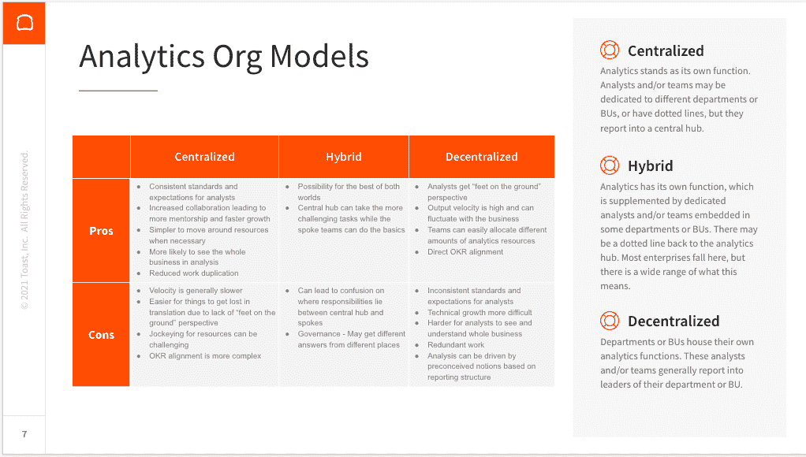

# 如何为您的数据团队选择正确的结构

> 原文：<https://towardsdatascience.com/how-to-choose-the-right-structure-for-your-data-team-be6c1b66a067?source=collection_archive---------10----------------------->

## 现场笔记

## 在高速发展的初创公司建立数据团队的最佳实践，从雇佣你的第一个数据工程师到 IPO。

*图片由* [*常阳*](https://unsplash.com/photos/Sj0iMtq_Z4w) *上* [*下*](https://unsplash.com/) *。*

*关于死亡，莎士比亚的哈姆雷特曾经说过:“* ***生存还是毁灭，这是个问题。”***

*关于她的数据团队，某创业公司一位睿智的数据负责人曾经说过:* ***“集中还是分散，那是个问题。”*** *而且是很重要的一条。*

以下是一些最佳数据领导者如何应用敏捷方法来构建可随公司发展而扩展的数据组织。

随着初创公司越来越多地投资于数据，以推动决策制定并为其数字产品提供支持，数据领导者面临着快速扩展团队的任务。从了解招聘哪些角色(以及何时招聘)到为数据 设置[**SLA，当今的数据领导者负责——毫不夸张地说——在旅程的每个阶段保持对公司的洞察。**](https://www.montecarlodata.com/how-to-make-your-data-pipelines-more-reliable-with-slas/)

无论您处于这场马拉松的哪个阶段，最大的挑战之一就是为您的数据团队确定合适的报告结构。

随着数据需求的增加，集中式数据团队带来的瓶颈也在增加，分散式数据团队带来的重复和复杂性也在增加。就在你认为你已经找到了“完美”的范例(即，一个中央数据工程团队、分布式数据分析师、一些分析工程师来弥补差距！或者一些数据分析师与在首席技术官手下工作的数据工程师一起向首席运营官汇报工作！)，当优先级发生变化时，你的整个策略就会发生变化。

**那么，数据领导者应该做些什么呢？**

为了更好地了解一些最好的团队是如何解决这个问题的，我与<https://www.linkedin.com/in/greg-waldman-a843b130>****[Toast](https://pos.toasttab.com/)的高级商业智能总监坐下来，讨论他公司数据团队的发展，并分享他在这些集中和分散结构之间永无休止的拉锯战中的经验。****

****在过去的五年里，Greg 带领 Toast 数据团队从一名分析师(Greg 本人)成长为一个 20 多人的组织，并从集中模式发展为混合分散模式，然后再回来。****

******请继续阅读，了解 Greg 的团队如何让业务需求驱动数据团队结构，他如何知道何时有必要做出这些改变，以及他希望早点聘用的关键角色。******

# ****开始时:当一个小团队努力满足数据需求时****

****当格雷格在 2016 年加入 Toast 时，该公司已经有 200 名员工，但没有专门的分析人员。尽管缺乏专业人才，但该公司一直优先考虑使用数据来做出决策。****

****“我们的创始团队非常精明，”格雷格说。“他们用 Excel 文档管理公司，但最终当他们有 200 人时，他们知道这种方法无法扩展。当我来的时候，问题基本上是这样的，“我们有太多的会议，一个人认为数字是 5，而另一个人认为数字是 4，然后他们就一直为此争吵。所以，不要让这种事情发生。"****

****Greg 立即钻研并开始构建工具、流程和基本的数据程序。第一年，Toast 数据团队增加了两倍，现在有三个人。该公司继续使用数据来推动其文化和决策。****

> ****“每个人都说他们有数据驱动的文化，但我在足够多的地方工作过，知道其中的区别，我看到了与吐司相比的并列，”格雷格说。“我们整个公司的人——尤其是我们的领导层——在做出重大决策之前都会认真寻找数据。”****

****但是，尽管小型数据团队增加了两倍，Toast 本身却增加了一倍。到 2017 年，该公司拥有 400 名员工。集中式数据团队无法满足整个快速增长、数据至上的组织的需求。****

****“我们在门外排起了长队，”格雷格说。“人们渴望获得比我们所能提供的更多的数据。我认为这对我们来说是一个转折点。因为如果您找不到满足这种需求的方法，那么业务可能会开始以不同的方式运营，并且如果您无法为他们提供必要的数据，那么数据驱动力就会减弱。”****

# ****支持作为分散数据操作的超增长****

****随着各部门开始寻找满足自身数据需求的方法，向分散式结构的转变开始形成。****

****“最终，公司的其他部门也出现了小规模的分析，比如销售和客户成功，”格雷格说。“主要是因为我们的小团队无法满足不断增长的业务需求。所以他们成立了自己的团队，这种方式很有效！”****

****2018 年，这个由 10 名数据专业人员组成的分散团队在业务部门内工作，满足了数据需求，并支持了 Toast 的快速发展，因为该公司的规模几乎再次翻了一番，员工人数增长到 750 人。Greg 和他的团队还重建了他们的数据技术堆栈，从端到端数据平台迁移到现代分布式堆栈，包括 s3、Airflow、Snowflake、Stitch 和 Looker。****

> ****在其业务部门工作的专职分析师仍然与 Greg 的核心分析团队保持密切联系，这使得 Toast 成为完全集中和完全分散的数据团队结构的混合体。但随着该组织不断扩大规模-2019 年达到 1，250 名员工，拥有 15 名数据分析师、数据科学家和数据工程师-这种混合模式开始出现问题。****

******数据一致性是一个问题**。“当谈到什么是好数据时，整个组织有不同程度的严格性。当你很小的时候，你很好斗，你在成长，任何数据都比没有数据好。但最终，我们认识到不准确的数据可能是有害的。”****

****即使有技术上准确的数据，Greg 也知道，在建立整个公司的数据可观察性和信任标准时，分析师、技术负责人和下游利益相关者之间的强大沟通是至关重要的。****

****“随着业务变得越来越大和越来越复杂，你需要分析师开始看到整个业务，”格雷格说。“即使在一个分散的模型中，当涉及到围绕性能和可操作性设置标准时，你也需要确保分析师与其他分析师和技术领导者密切合作。”****

# ****重组、重新集中和重新关注数据信任****

********

*****在评估如何构建他的数据团队时，Toast 总是权衡三种选择:集中式、分散式和混合式，随着时间的推移，他们尝试了每种选择的规模。最终，他发现混合模式对于他的分析团队的规模和范围来说是最有效的。图片由 Greg Waldman 和 Toast 提供。*****

****因此，Toast 将一直在各自的客户成功和走向市场团队下工作的分析师带回到了一个分析保护伞下。****

****“我们最终实现了集中化，一个讨论过但被低估的好处就是团队中的人们从彼此身上学到了多少东西，”Greg 说。该团队现在是财务和战略部门的一部分。但他知道中央集权的结构可能不是土司的长期解决方案。****

****“简而言之，我对数据团队的看法是，你希望每个人尽可能多地增加商业价值，”Greg 说。“我们一直非常乐于改变和尝试不同的东西，并理解适用于 200 人、500 人、1000 人和 2000 人的答案是不同的，这没关系。“当你到达那些转折点，需要尝试新事物时，这一点可能会变得有些明显。”****

****归根结底，无论这对您团队的报告结构意味着什么，都是为了满足业务需求，同时确保技术线索是分析师的推动因素，而不是瓶颈。****

# ****扩展创业公司数据团队时要记住的 4 件事****

********

*****最终，Greg 的团队选定了一个带有少量分布式元素的集中式数据团队结构，为他们提供了对数据产品更大的所有权和治理能力，以及构建可扩展的模块化数据堆栈的能力。图片由 Greg Waldman 和 Toast 提供。*****

****Greg 为在超高速增长的公司中面临类似挑战的数据领导者提供了一些来之不易的建议，但每种策略都回到了他的原则，即专注于哪种方法最符合您公司的业务需求，这可能会随着时间的推移而改变。****

****简而言之，他建议，领导者应该保持敏捷，团队应该愿意适应业务需求。以下是方法。****

# ****雇用数据通才，而不是专家，但有一个例外****

****Greg 认为，你应该雇佣的第一个专家是数据工程师。****

****Greg 说:“早期，我们基本上只是雇佣了能做一点点事情的数据运动员。“我们让这些运动员扮演分析师/数据工程师。我有一个高级经理的职位空缺，一个数据工程师申请了，但她对管理没有任何兴趣。当我和她交谈时，很明显我们团队非常需要专门的数据工程技能。回想起来，考虑到我们的增长轨迹，我应该在一年前就寻找这样的人。”****

****很多时候，数据团队会因为缺乏构建和维护 ETL 管道所需的技术支持而束手束脚，并确保底层的数据基础设施能够根据公司的分析需求进行扩展。****

> ****“因此，尽管我仍然相信应该雇佣那些什么都能做的数据运动员，但数据工程师是个例外。在你雇佣了几个分析师之后，你的第一个数据工程师应该紧随其后。”****

# ****从第一天开始就优先考虑建立一个多样化的数据团队****

****这是不言而喻的，但是当涉及到为长期成功建立你的团队时，你需要(早期)投资于具有[不同经历和背景](https://www.entrepreneur.com/article/338663)的候选人。同质化是创新的阻碍，它阻碍了数据分析师和工程师理解所有数据消费者的观点和需求。****

****然而，当你大规模快速行动时，可能很难记住这一点——除非你制定了一套反映这一目标的清晰的招聘和增长 KPI。****

> ****格雷格说:“尽早考虑多样性。“因为特别是在这些小型数据团队中，如果你不小心，你最终只会和一群来自相似背景的志同道合的人在一起。你不想要一群相同的人——你需要不同的视角。”****

****说‘我们需要建立一个多元化的团队’是一回事，但要做到这一点完全是另一回事。那么，数据领导者应该如何入门呢？****

******这里有几个小技巧:******

*   ****与高管和你的人员团队合作，撰写包含不同经历和背景的工作描述(例如，避免使用过于男性化的语言，使用中性语言)****
*   ****将不同的招聘小组放在一起(即使他们不是从数据团队中挑选出来的),以体现你正在努力建立的团队****
*   ****广撒网，招聘可能没有传统数据头衔或角色的候选人；这是一个不断发展的空间！****
*   ****实施不分性别或种族的申请流程，根据资格和经验进行筛选****

****“在创业旅程的后期，建立一个多元化的团队要困难得多，因为来自不同背景的人希望加入一个由不同背景的人组成的团队。如果你一开始就没有考虑到这一点，事情会变得更具挑战性。”****

# ****过度沟通是变革管理的关键****

****这一点在我们“远程优先”的世界中更加重要，在这个世界中，许多团队在家里工作，通过电子邮件、Slack 和信鸽(开玩笑！)是任何工作的必要组成部分。****

****红点风险投资公司(red point Ventures)[**的董事总经理托马斯·通古兹(Tomasz Tunguz)表示，公司应该始终如一地向客户重复自己的**](https://tomtunguz.com/why-you-should-repeat-yourself/) (即他们的核心价值主张)，即使这看起来没有必要。当涉及到与数据利益相关者交流他们的工作和任何团队变化时，数据领导者也是如此。****

****例如，如果你的分散的客户成功分析师在客户成功主管手下工作 3 个月后将向分析主管汇报，你不仅应该传达这种变化正在发生，而且还应该重申这种调整不会改变你的团队产出的性质。即使团队不再分散，涉众仍然可以期望映射到核心业务目标的准确、及时的分析。****

> ****虽然结构变化不可避免地会影响利益相关者(职能团队)和服务提供者(数据团队)之间的关系性质，但是整理、交流和重复这种转变如何不会影响您团队的 KPI 将会恢复善意并帮助跨职能团队克服变化。****

****格雷格说:“如果你让分析师向企业领导人汇报，确保他们有权根据他们看到的数据进行反击。”“否则，这可能是一种微妙的动态，鼓励他们展示支持轶事假设的数据。当你将这些团队重新纳入分析体系时，你的分析师们将相互学习，但影响其他部门可能会很有挑战性。”****

****最近，Toast 一直在运行一个很大程度上集中的分析模型，该模型表现良好，满足了过去一年半的业务需求。****

# ****不要高估“单一的真理来源”****

****“单一真实来源”或黄金数据的概念是一个强大的概念——理由很充分。努力实现指标一致性和一致的干净数据有助于公司相信他们的数据为他们指明了正确的方向。尽管如此，作为一个超增长创业公司的数据领导者，你会在任何给定的时间参与大量的实验和项目——只要你有对数据信任的方向性<https://www.montecarlodata.com/data-observability-the-next-frontier-of-data-engineering/>**(即，这张表是最新的吗？我知道谁拥有这个数据集吗？为什么 50 排变成了 500 排？)，对“单一真相来源”的需求就没有那么迫切了。******

******“我总是告诉人们不要高估整个‘单一来源的真相’的概念，”格雷格说。“作为一个完美主义者，我花了很长时间才学会这个。有时候你需要做到 100%正确，但也有很多时候你做不到。通常，方向的准确性是好的，而你试图做到完美只会浪费资源。80/20 法则是关键。”******

******数据总是杂乱的，很少是完美的。如果您优先考虑端到端的数据健康和准确性视图，而不是更精细的控制，您将完成更多工作。******

********Greg 给数据领导者的最后一条建议？********

****“雇佣沟通能力强的优秀人才，其他一切都会变得容易得多。优秀的人会带你找到其他优秀的人，你可以雇佣世界上最聪明的人，但如果他们不能把自己的分析传达给不太懂技术的人，他们就不会成功。”****

*******想了解更多关于建立成功数据团队的信息？伸出手去*** [***巴尔摩西***](https://www.linkedin.com/in/barrmoses) ***和*** [***蒙特卡洛团队***](http://www.montecarlodata.com) ***。*******