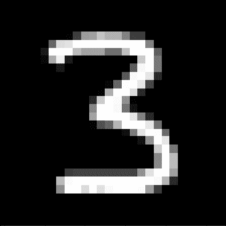
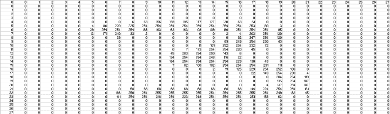
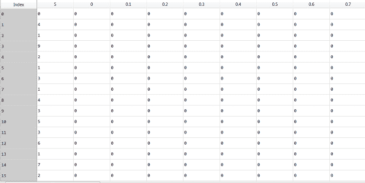
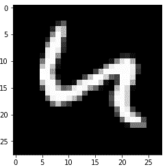

# python 中如何对手写数字进行分类

> 原文：<https://towardsdatascience.com/how-to-classify-handwritten-digits-in-python-7706b1ab93a3?source=collection_archive---------33----------------------->

## 没有任何机器学习库的帮助

如果你已经阅读了本系列的前几篇文章(页面底部的链接)，你应该已经完全从基本原理构建了一个 DNN 类。让我们看看是否可以使用这个类来创建一个能够读取手写数字的神经网络。

这是一个经典的例子，说明对于我们人类来说很容易做到的事情，但是要编写一个程序来完成同样的任务却非常困难。在我们人类对图片进行分类的情况下，让我们想想正在发生什么。对于观看图像的人来说，大脑接收光子形式的输入，并基于该输入对图像进行分类。

基于此，我们可以说，击中我们眼睛的光子和图片的内容之间一定有某种关系。很明显，对吧？当然，图片看起来是什么样子和图片是关于什么的有关系。但是，数学建模需要这个命题；

> *根据我们从图片中接收到的输入(光子),存在某种数学函数可以告诉我们图片中有什么。*

使用神经网络，我们将很容易找到这个极其复杂的函数。

## 获取和清理我们的数据

本着推进人工智能的精神，修改后的国家标准与技术研究所(MNIST)收集了数以万计的手写数字照片，每张照片都有一个标签。这个数据可以在这里[下载。下面是其中一个数字的例子。](https://www.kaggle.com/oddrationale/mnist-in-csv/data)



*此图标注为 a 3。*****图片作者****

现在，对于我们人类来说，我们接收光子进入眼睛的输入。类似地，对计算机来说，这张图片只是像素值的矩阵。这些像素值的范围从 0 到 255(因为图像是黑白的)，如下所示:



****图片作者****

这些图片是 28X28，784 像素值。我们的目标是将这些 784 像素的值映射到所写的数字。那么，我们开始吧。我们先来看数据。你应该已经从我上面提供的 Kaggle 链接下载了一个 zip 文件夹。解压缩文件夹后，您会看到一个 mnist_test 和 mnist_train CSV 文件。目前，我们将只关注 mnist_train CSV。下面我用 pandas 打开文件，然后显示文件的内容。

```
**import pandas as pd
import numpy as np
import matplotlib.pyplot as plt****data = pd.read_csv(‘mnist_train.csv’)**
```



****图片作者****

如您所见，该数据的第一列是标签(图像表示的数字)，其余是图像的像素值(总共 785 列)。每一行都是一个单独的图像。使用 pandas iloc 功能，我们可以将输入与标签分开。此外，我们确保输入在 0 和 1 之间正常化。

```
**labels = np.array(data.iloc[:,0])
x_train = np.array(data.iloc[:,1:])/255 
# We divide by 255 so that all inputs are between 0 and 1**
```

我们的下一步可能看起来很奇怪，但却是至关重要的。现在每个标签只是一个数字或一维。这意味着神经网络必须输出 0 到 9 之间的正确数字。我们可以通过将输出的维度增加到 10 个维度，每个维度对应一个数字，来使我们的神经网络的分类任务变得更容易。例如，我们将更改标签“0”，使其为“[1，0，0，0，0，0，0，0，0，0]，' 1' = '[0，1，0，0，0，0，0，0，0]等等。这被称为“一热编码”，我这样做我们的标签如下。

```
**encoded_labels = []
for i in range(len(labels)):
  naked = [0,0,0,0,0,0,0,0,0,0]
  naked[labels[i]] = 1
  encoded_labels.append(naked)**
```

现在我们可以使用 matplotlib 来检查这些图像实际上是什么样子。

```
**# Take a look at what the images look like
random_index = np.random.randint(0,40000)
img = x_train[random_index].reshape(28,28)
plt.imshow(img, cmap = “gray”)**
```

正如你所看到的，我们的神经网络真的有它的工作要做，用这些图片…



****图片作者****

## 创造我们的神经网络和训练

我们将使用在本文之前创建的 DNN 类(在这里找到)。每个图像有 784 个输入和 10 个输出，我将选择一个有 1250 个神经元的隐藏层。因此，我们的层应该是[784，1250，10]。在 for 循环中，我们简单地生成一个随机索引，然后对与该索引对应的数据和标签运行 train 函数。我还每 1000 步打印一些有用的信息，见下文:

```
**model = DNN([784,1250,10])****from collections import deque
error = deque(maxlen = 1000) 
"""A deque is just a list that stays at 1000 units long (last item gets deleted when a new item gets added when at length = 1000)"""****for n in range(30000):
  index = np.random.randint(0,59998)
  error.append(model.train(x_train[index], encoded_labels[index]))
  if n%1000 == 0:
    print(“\nStep: “,n)
    print(“Average Error: “, sum(error)/1000)
    plt.imshow(x_train[index].reshape(28,28), cmap = “gray”)
    plt.show()
    print(“Prediction: “, np.argmax(model.predict(x_train[index])))**
```

## 结果和测试

在我的电脑上仅仅过了 5 分钟，神经网络就能正确识别大多数数字。10 分钟后，神经网络似乎已经完全训练完毕，平均误差达到 0.2 左右。重要的是不要过度训练模型，这会导致神经网络只是记忆图像，这将使它在预测它从未见过的事物方面非常糟糕。

让我们使用我们下载的那个 mnist_test.csv 文件来看看我们的神经网络对它以前从未见过的数据执行得有多好。下面我对 mnist_test 文件中的每张图片调用 predict 函数，然后检查预测是否正确。然后我计算这个神经网络正确预测的百分比。

```
**test_data = pd.read_csv(‘mnist_test.csv’)
test_labels = np.array(test_data.iloc[:,0])
x_test = np.array(test_data.iloc[:,1:])/255****correct = 0****for i in range(len(test_data)):
  prediction = np.argmax(model.predict(x_test[i]))
  if prediction == test_labels[i]:
    correct +=1****percent_correct = correct/len(test_data) * 100
print(percent_correct,’%’)**
```

以下是该项目的最终代码:

我最后得了 93.5 分。随意尝试训练更长的时间，增加层数和/或神经元数，改变激活函数或损失函数，改变学习速率，看看这是否可以改善。虽然 93.5%非常令人兴奋，但我们实际上可以做得更好。我们可以让神经网络能够识别图片中的独特特征，以帮助它识别图像。这是*卷积神经网络*背后的思想，我将在以后的文章中详细解释。

> 感谢您的阅读！如果这篇文章在某种程度上帮助了你，或者你有什么意见或问题，请在下面留下回复，让我知道！此外，如果你注意到我在某个地方犯了错误，或者我可以解释得更清楚一些，那么如果你能通过回复让我知道，我会很感激。

> 这是一系列文章的继续，这些文章从头开始对神经网络进行了直观的解释。其他文章请参见下面的链接:
> 
> [第 1 部分:什么是人工神经网络](/what-is-an-artificial-neural-network-b508c821ace8)
> 
> [第二部分:如何从零开始训练神经网络](/how-to-train-a-neural-network-from-scratch-952bbcdae729)
> 
> [第 3 部分:全面实施梯度下降](https://doingengineering21.medium.com/full-implementation-of-gradient-descent-no-holding-back-86e688f36064)
> 
> [第 4 部分:梯度下降的实现(示例)](https://doingengineering21.medium.com/implementing-gradient-descent-example-102b4454ea67)
> 
> 第 5 部分:如何用 python 对手写数字进行分类