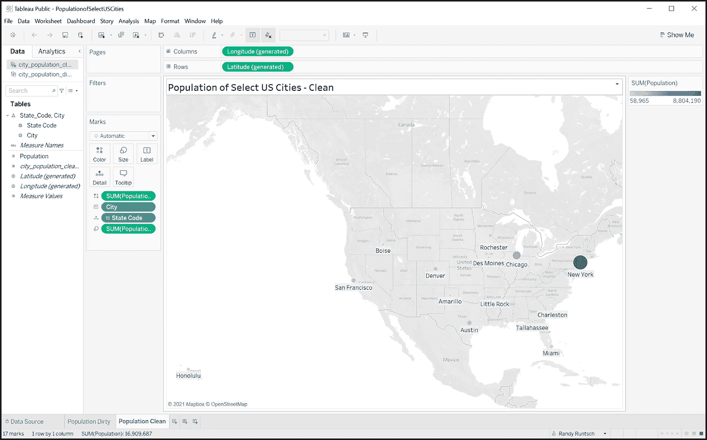

# 如何用 SQL、Tableau 和 Google 搜索清理地理地名

> 原文：<https://towardsdatascience.com/how-to-clean-geographic-place-names-with-sql-tableau-and-google-search-6a58e8bc50ae?source=collection_archive---------23----------------------->

## [实践教程](https://towardsdatascience.com/tagged/hands-on-tutorials)、数据工程、数据清理、SQL 和 Tableau

## 使用熟悉的工具检测和清理不干净的地理数据

由 [NASA](https://unsplash.com/@nasa?utm_source=unsplash&utm_medium=referral&utm_content=creditCopyText) 在 [Unsplash](https://unsplash.com/s/photos/data?utm_source=unsplash&utm_medium=referral&utm_content=creditCopyText) 上拍摄的照片。

> “垃圾进，垃圾出。”匿名的

# 介绍

任何数据工程、数据分析和数据科学项目的生命周期都包括数据清理过程。清理数据的主要目的是检测和纠正损坏、不准确或不完整的数据记录。此外，有效的清理有助于确保数据分析或数据科学产品完整准确地传达所需信息。

最近在一家大型企业任职时，我在 Tableau 中开发了一个员工差旅分析仪表板。我使用 SQL 从旅行请求和管理系统的 IBM DB2 数据库中获取数据。

每个旅行请求包括目的地城市、州或省(如果适用)和国家，以及许多数据元素。不幸的是，差旅申请 web 表单没有对这些字段执行任何编辑检查，因此差旅申请人拼错了许多地名，并用不正确的地理位置填充了应用程序的数据库记录。

由于 travel analytics 仪表盘每周更新一次，我需要一个简单易行的流程来清理每周新引入的地理数据错误。我开发的方法包括使用 Tableau 来识别地理地名错误，使用 Google 和 Wikipedia 来确定正确的和确认的值，使用 SQL 来检索和清理数据。

本文描述了我用来清理地理数据的方法的修订版。它通过一个小规模项目展示了该解决方案，包括一个示例数据库表、SQL 代码和一个 Tableau 数据可视化项目。

# 样本数据清理项目概述

地理地名数据清理项目样本包括以下步骤和组成部分:

1.  使用 SQL SELECT 语句从数据库表中检索美国城市人口数据。我在这个示例项目中使用了 Microsoft SQL Server，但是它可以与任何关系数据库管理系统一起工作，比如 Oracle、MySQL、PostgreSQL 等。
2.  将使用 SQL 检索的城市人口数据加载到 Tableau 工作表中。
3.  创建城市及其人口的地图。Tableau 将自动检测并报告无效的城市名或州代码。换句话说，Tableau 将识别其内部地理地名数据库中不存在的城市名称和州代码。
4.  对于无效的地名，使用谷歌搜索找到正确的拼写位置。此外，如有必要，使用维基百科来确认城市名称、州代码和人口值的组合。
5.  在上述步骤 1 中描述的 SQL 语句中添加或修改 CASE 语句，以更正拼写错误的城市名称和州代码。
6.  将使用修改后的 SQL 语句检索到的城市人口数据重新加载到 Tableau 工作表中。
7.  查看城市人口地图。如果仍然不准确，重复步骤 4 到 7，直到 SQL 语句清除了所有脏数据。

> "我们相信上帝，所有其他人都会带来数据."爱德华·戴明

# 城市人口数据库表示例

为了演示数据清理技术，我创建了一个名为 City_Population 的表，其中包含以下几列:

*   **城市** —城市的名字
*   **州代码** —州的双字符代码
*   **人口**——2020 年美国人口普查人口或维基百科记录的 2010 年后的最新估计人口

城市 _ 人口表结构。图片作者。

然后我用 17 行填充了这个表，其中充满了数据错误，如下所示。

City_Population 表中的示例数据。图片作者。

# 基本 SQL 选择查询

下面显示的选择查询检索 City_Population 表中所有行的 City、State_Code 和 Population 值。请注意，由于 Population 是 SQL Server 中的一个关键字，因此它被放在了方括号中。

选择查询以获取城市、州代码和人口。作者代码。

# 将数据加载到 Tableau

在我以前的职位上，我直接从 Tableau Desktop 调用 SQL 查询，将 SQL Server 和其他数据库中的数据加载到 Tableau 项目中。对于这个项目，我使用 Tableau Public，它排除了调用 SQL 查询的能力。Tableau Public 支持各种其他数据源。这个项目我选了 Excel。以下是将数据加载到 Excel，然后再加载到 Tableau Public 的一般步骤:

1.  在 SQL Server Management Studio (SSMS)中运行选择查询。如果运行 SQL Server，可以使用 SSMS。否则，请使用您所使用的数据库的查询工具。
2.  将查询返回的数据复制并粘贴到 Excel 工作表中。保存 Excel 工作簿。
3.  打开 Tableau Public(或 Tableau Desktop)并将 Excel 文件添加为数据源。

按照以下步骤从 SSMS 输出窗口复制数据。

将数据从 SSMS 复制到 Excel。图片由作者提供。

下面是 Excel 电子表格，其中包括从 SSMS 粘贴的数据。注意，工作表名为 city_population_dirty，工作簿名为 city_population_dirty.xlsx，我将这个工作表加载到 Tableau 中。稍后，我将加载一个“干净”的工作表到 Tableau 中。

Excel 中的数据，并准备加载到 Tableau。图片由作者提供。

要将数据加载到 Tableau 中，请打开 Tableau Public 或 Tableau Desktop。接下来，在连接标题下，单击[Microsoft Excel]。当提示打开文件时，导航到 city_population_dirty.xlsx 并单击[打开]。

连接到 Tableau Public 中的 Excel 电子表格。图片由作者提供。

肮脏城市的人口数据应该加载到 Tableau 中，如下所示。

已加载到 Tableau Public 中的脏城市人口数据。图片由作者提供。

# 查看 Tableau 中的脏数据

将数据加载到 Tableau 后，我在一个名为“Population Dirty”的工作表中创建了一个地图。注意屏幕右下角的信息“10 未知”。这一信息表明，Tableau 无法绘制数据中的 10 个地名。

城市人口图。请注意，名称无效的城市不会显示在地图上。图片由作者提供。

要识别脏数据，请单击“10 未知”Tableau 将显示如下所示的编辑位置对话框。

请注意未识别的城市名称，例如 *Aims* 和 *Amerillo* 。我可以用下拉框中的值(位于“未识别”下)替换这些值。但是，虽然这样做会清除此 Tableau 仪表板的数据，但清除的数据将无法用于其他 Tableau 项目或其他用途。因此，对于本文描述的项目，我决定清理 SQL 中的数据。然后，清理后的数据将可供所有下游用户使用，比如 Tableau。

Tableau 公共“编辑位置”对话框显示无效或无法识别的城市名称。图片由作者提供。

# 在谷歌中查找正确的城市名称

[谷歌搜索](https://www.google.com/)使用微软在其 Visual Studio 工具的智能感知中使用的技术，在用户输入文本时找到可能的结果。此外，谷歌似乎会纠正拼写，甚至可能使用“听起来像”的算法来识别搜索词。

对于无法识别的城市“Aims”，我查看了 Excel 文件中的数据，并注意到具有脏值的记录的州代码是“IA”因此，当我搜索“Aims ia”时，Google 返回“Ames，ia”和“City in Iowa”作为第一个结果。我确信“Ames”是“Aims”的正确拼法，于是继续前往下一个拼错的城市。

在谷歌中搜索城市和州。图片由作者提供。

但如果不确定谷歌是否返回了正确的城市，我也会在维基百科上查找谷歌建议的地方的拼写。例如，当我在谷歌中搜索“查尔斯顿南卡罗来纳州”，它会返回“查尔斯顿南卡罗来纳州的一个城市”为了验证这一点，我在维基百科中查找了这个城市，并将其人口与 Excel 电子表格中的人口进行了比较。两个源中的值都是 150，277。

在维基百科中确认城市人口。图片由作者提供。

# 清除 SQL 中的数据

为了清理 SQL 中的地名，我在 SELECT 查询中使用了 CASE 语句。例如，下面显示的查询更正了十个城市名。它还将明尼苏达州的州代码从“MP”更新为“MN”

查询以获取和清除城市、州和人口数据。作者代码。

为了从 Tableau 的查询中准备数据，我运行它并将其输出数据复制到名为“city_population_clean.xslx”的工作簿中名为“city_population_clean”的 Excel 工作表中，如下所示。

Excel 电子表格与清洁城市人口数据。图片由作者提供。

# 在 Tableau 中加载和查看清洁城市人口数据

接下来，我将干净的数据集加载到 Tableau 中，并基于干净的数据构建一个地图工作表。该过程与上面针对脏数据描述的过程相同。

请注意，工作表不再在右下角显示类似“10 不干净”的消息。这是因为 Tableau 可以识别输入文件中的所有地名。此外，它还在地图上标出了每个城市。

Tableau Public 地图，展示了精选美国城市的完整列表。图片由作者提供。

最后一步是将 Tableau 项目的“干净”工作表保存到 Tableau 公共服务器。你可以在这里查看[。](https://public.tableau.com/views/PopulationofSelectUSCities/PopulationClean?:language=en-US&publish=yes&:display_count=n&:origin=viz_share_link)

Tableau 公共仪表板称为美国城市人口选择。图片由作者提供。

# 这种数据清理方法的利与弊

虽然这里介绍的数据清理方法成功地清理了城市人口表中的地名，但是与其他方法相比，它有一些优点和缺点。

# 赞成的意见

*   过程很简单。
*   可以快速检测并纠正脏数据。
*   当最终用户或软件很少将脏数据引入数据库表时，这种方法是实用的(只需对 SQL 查询进行少量更改)。

# 骗局

*   需要 SQL 编码技能，以潜在地改变每个新数据集的 SQL 查询。
*   容易出错，因为每当检测到脏数据时，代码都需要更改。即使一个优秀的程序员也可能犯错误。
*   SQL 代码可能会变得难以处理。最终，SQL 查询可能包含数百行，使得维护变得困难。

# 替代清洁方法

虽然上面描述的数据清理过程提供了一个实用的解决方案，但是您也可以考虑其他解决方案。例如，在一个理想的系统中，当请求旅行的员工输入数据时，web 表单会检测并纠正数据错误。这种方法将通过消除大多数地理数据清理需求来节省时间和金钱。

另一种数据清理方法涉及一个将脏地名映射到干净地名的表。SQL 查询将用干净的地名替换从城市人口表中检索到的脏值。

# 结论

这里描述的地理数据清理方法在维护旅行分析仪表板方面证明是有效的。即使每周有数百条新的旅行记录，获取、清理和发布这些数据的整个过程也只用了不到一个小时。

我希望这些关于数据清理的信息对您有所帮助。对我来说，数据清理是数据工程、数据分析和数据科学项目生命周期中最具挑战性和最令人满意的步骤之一。

> "没有数据就进行理论化是一个严重的错误。"—夏洛克·福尔摩斯

# 工具信息

[SQL Server Management Studio](https://docs.microsoft.com/en-us/sql/ssms/download-sql-server-management-studio-ssms?view=sql-server-ver15)

[Tableau Public](https://public.tableau.com/)