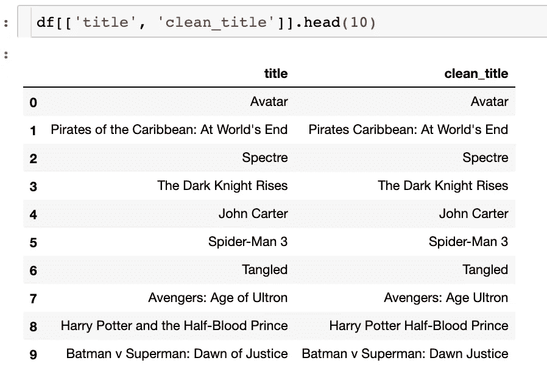
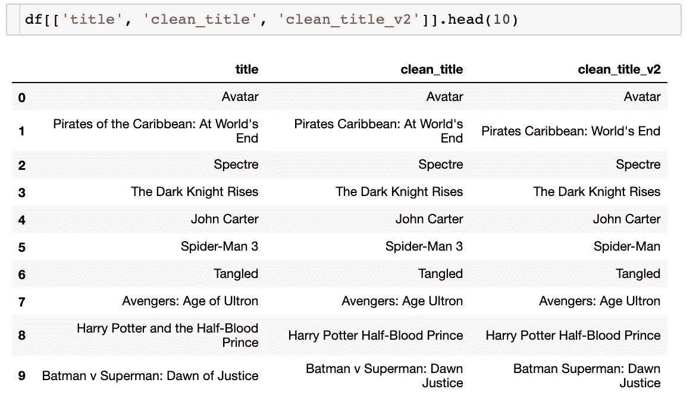

# 如何清理文本数据

> 原文：<https://towardsdatascience.com/how-to-clean-text-data-639375414a2f?source=collection_archive---------18----------------------->

## …删除数据科学应用的停用词


[JESHOOTS.COM](https://unsplash.com/@jeshoots?utm_source=unsplash&utm_medium=referral&utm_content=creditCopyText)在 [Unsplash](https://unsplash.com/s/photos/cleaning?utm_source=unsplash&utm_medium=referral&utm_content=creditCopyText) 上的照片【1】。

# 目录

1.  介绍
2.  清理文本数据
3.  摘要
4.  参考

# 介绍

数据大部分时间都是杂乱的、无组织的、难以处理的，这应该不足为奇。当您从教育实践进入数据科学时，您会发现大多数数据是从多个来源、多个查询获得的，这可能会导致一些不干净的数据。在某些或大多数情况下，您必须提供最终用于训练模型的数据集。有一些文章关注数字数据，但是我希望这篇文章主要关注文本数据，这与自然语言处理相一致。也就是说，这里有一个在 Python 中清理文本数据的简单方法，以及它什么时候有用。我将使用来自 [TMBDF 5000 电影数据集](https://www.kaggle.com/tmdb/tmdb-movie-metadata)【2】的流行数据集，这样你就可以跟上了。

# 清理文本数据


Marylou Fortier 在[Unsplash](https://unsplash.com/s/photos/text?utm_source=unsplash&utm_medium=referral&utm_content=creditCopyText)【3】上的照片。

> **删除停止字**

另一种解释“停用词”的方法是删除不必要的文本。但是，需要注意的是，当您使用常用停用词库时，您可能会删除实际上想要保留的单词。这就是为什么你应该先考虑你想删除的单词列表。常用的停用词有`‘the’`、`‘of’`等。你想要删除这些词的原因是如果你想保留这些词、短语、句子等的主题。一个例子是*‘有一次他们在七月去商店参加节日聚会’*。如果你去掉停止词和一些不必要的词，你只会得到剩余的`time, July, holiday, party`。

> 话虽如此，让我们看看如何从电影片名中删除一些停用词:

```
import pandas as pdimport nltk.corpus
nltk.download(‘stopwords’)
from nltk.corpus import stopwordsdf = pd.read_csv('...path/tmdb_5000_movies.csv')stop_words = stopwords.words('english')
df['clean_title'] = df['title'].apply(lambda x: ' '.join([word for word in x.split() if word not in (stop_words)]))
```

在上面的代码中，我们导入必要的库，然后将我们的数据读入 pandas 数据帧。从那里，我们分配我们将从`‘title’`列的文本中删除的停用词，这将在`‘clean_title’`列中显示它们各自的效果。输出如下所示。在第 1、3 和 8 行中，是停用词被删除的地方，正如您可以并排看到的 before 和 after。



作者截图[4]

除了 nltk 的停用词库，您还可以“手动”添加其他停用词。为了实现这个功能，你可以简单地给`stop_words`添加一个字符串列表。例如，如果我们想要删除文本“3”，因为在这种情况下它不是一个数字，我们可以将它以及单词“at”和字母“v”添加到列表中。它的工作方式如下:

```
stop_words = stopwords.words(‘english’) + [‘At’, ‘v’, ‘3’]# apply the same code as above but assign
# a new column to see the differencesdf['clean_title_v2'] = df['title'].apply(lambda x: ' '.join([word for word in x.split() if word not in (stop_words)]))
```

在下面的屏幕截图中，您可以看到 lambda 函数是如何移除添加的字符串列表中的值的。



作者截图[5]。

> 现在我们已经展示了一种清理文本数据的方法，让我们讨论一下这个过程对数据科学家有用的可能应用:

*   删除不必要的单词，以便您可以执行词干分析，在词干分析中，您可以隔离删除后留下的单词的词根
*   与上面类似，你可以只分离出单词的词条
*   只有保留必要的单词才能让您更容易地标记数据中的词性，例如，如果您只标记形容词，并在您的模型数据中使用该文本，如“美丽”、“惊人”、“响亮”将用于预测电影评论的目标变量。一个模型将能够更容易地从形容词中识别情感，以辨别电影评论是好是坏，或者电影需要改进什么
*   从更新文本的主要词创建一个摘要仪表板，例如，去掉“蜘蛛侠 1”、“蜘蛛侠 2”和“蜘蛛侠 3”中的数字，将允许对所有蜘蛛侠电影进行分析，如赚钱，或这些电影的平均评论评级
*   更容易进行主题建模——在大量文本之间找到共同的主题
*   创建更少量的文本，以便您的建模在训练和预测时变得更快、更便宜
*   可用于删除错误的文本，例如，如果人们正在手动键入响应，您可以清理他们的响应，如果他们的输入是从语音到文本的，您可以自动删除通常被语音错误解释的单词

当然有更多的理由删除停用词，并清理你的文本数据。同样重要的是要记住，有一些新兴的算法可以很好地处理文本数据，比如 CatBoost。

# 摘要

正如你所看到的，仅仅清理数据的一部分就可以为进一步清理和处理数据打下基础。希望数据的这种变化最终会使您的模型更加健壮和准确。我给出的例子很小，但你可以看到如何将它应用到包含数百个句子的数据中会更有用。

> 总而言之，以下是如何从文本数据中删除停用词:

```
* import libraris* import your dataset* remove stop words from the main library* add individual stop words that are unique to your use case
```

**更新:** *单词* `*The*` *没有被删除，因为它是大写的，所以在清理它之前，请确保将所有文本都小写。感谢您的标注，* [*米亚罗姆*](https://medium.com/u/6758dbf768b8?source=post_page-----639375414a2f--------------------------------) ！

我希望你觉得我的文章既有趣又有用。如果你同意这种删除停用词的方法，请在下面随意评论——为什么或为什么不？你喜欢不同的图书馆吗？如果你有，请随意评论你喜欢其中一个的原因。这个图书馆有什么缺点？你知道一个更新的库可以在效率、易用性和速度方面击败 nltk 吗？还有哪些清理文本数据的方法？你是否碰巧根本不使用库，而只是删除了你管理的一个特定列表？谢谢你看我的文章！

*请随时查看我的个人资料和其他文章，* [Matt Przybyla](https://medium.com/u/abe5272eafd9?source=post_page-----639375414a2f--------------------------------) ，*也可以在 LinkedIn 上联系我。*

# 参考

[1]照片由[JESHOOTS.COM](https://unsplash.com/@jeshoots?utm_source=unsplash&utm_medium=referral&utm_content=creditCopyText)在[Unsplash](https://unsplash.com/s/photos/cleaning?utm_source=unsplash&utm_medium=referral&utm_content=creditCopyText)(2019)上拍摄

[2] Kaggle， [TMBDF 5000 电影数据集](https://www.kaggle.com/tmdb/tmdb-movie-metadata)，(2021 —已访问)

[3]Marylou Fortier 在 [Unsplash](https://unsplash.com/s/photos/text?utm_source=unsplash&utm_medium=referral&utm_content=creditCopyText) 上拍摄的照片，(2020)

[4] M.Przybyla，清洁文本示例，(2021 年)

[5] M.Przybyla，清理文本示例并添加个别停用词，(2021 年)