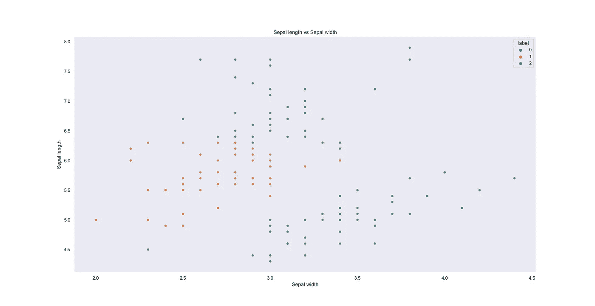
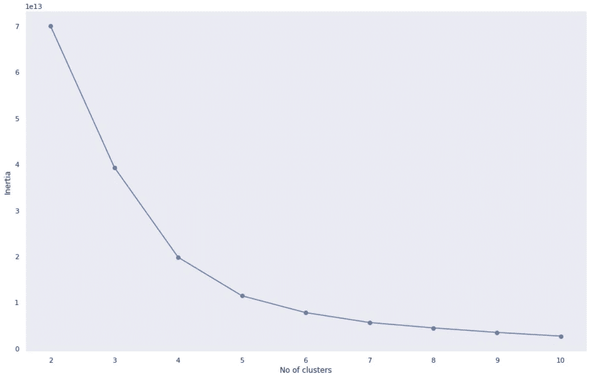
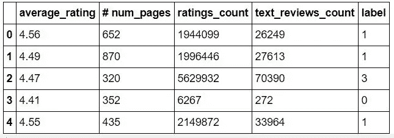
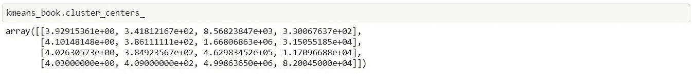
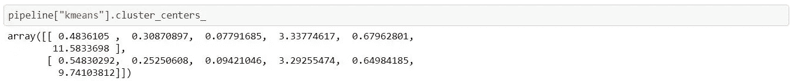
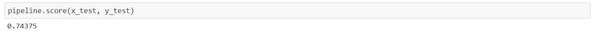
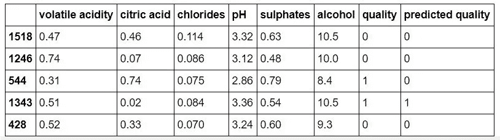

# 如何聚类数据！

> 原文：<https://towardsdatascience.com/how-to-cluster-data-65d37c98ce55?source=collection_archive---------32----------------------->

## 使用无监督机器学习和 K-均值聚类的指南



图片来源:我

在从事数据科学项目时，数据科学家经常会遇到含有未标记数据点的数据集。因此，很难获得可用于对数据行为建模的有洞察力的知识。为了从无意义的数据中找出意义，部署了无监督的机器学习技术来标记数据点，并提供不同类别之间的清晰对比。

一种非凡的无监督机器学习技术被称为聚类。聚类是将未标记的数据分组到类中的一种很好的机制。它通过检查整个数据集来寻找数据点变量之间的相似性。注意到某些相似性后，可以将数据集分成多个组，组成员拥有相似的属性。 **K 均值聚类**是本文将要探讨的聚类类型。

# K-Means 通过 scikit-learn 进行聚类

## 样本聚类

Scikit-learn 是一个机器学习库，可以通过 Python 获得。它可以用来建立机器学习算法，以做出准确的预测。K-means 聚类模型是使用下面的代码通过 scikit-learn 导入的。

```
**from** **sklearn.cluster** **import** KMeans
```

需要一个数据集来利用 K 均值聚类模型。因此，goodreads 书籍评级的数据集从 Kaggle 下载并上传到 Jupyter Notebook。然后，提取数值变量，如平均评分、页数、评分计数和文本评论计数。使用这四个变量，可以在数据集上拟合 K 均值聚类。

下一步是计算出将数据集合理分组的最佳聚类(组)数量。通过尝试不同数量的簇，有可能计算出它们的惯性。K 均值聚类的惯性是对聚类的一致性和独特性的度量。通过绘制惯性对聚类数的图表，在图表上创建肘状结构的点处选择最优的聚类数。这样做是因为增加超过肘点的簇的数量不会大量改变惯性值，并且最终会创建不必要的额外簇/组。



聚类的最佳数量将是 4，因为这是创建图形肘部的位置

因此，选择四个组作为组的数量。然后，将其拟合到 goodreads 图书数据集上，以便将标签归属于数据点。

```
kmeans_book = KMeans(n_clusters = 4)
kmeans_book.fit_predict(books_df)
```



goodreads ' book 数据集的前五行在 K-Means 聚类适合数据集后进行标记

通过选择四个聚类，创建了理想地代表每个聚类的四个中心。然后，测量每个数据点与中心的距离，并根据其最近的聚类中心标记数据点。下面可以看到四个聚类中心。



数据集中的四个聚类中心

## 作为预处理形式的聚类

K-means 聚类也可以用作构建机器学习算法时的预处理方法。这可以通过创建一个管道来实现，在该管道中，对独立变量应用 K 均值聚类，以测量每个数据点到聚类中心的距离。然后，可以应用分类器，根据数据点到聚类中心的距离来标记数据。

K-means 聚类作为预处理器的一个用例可以在红酒质量的分类中找到。首先，将数据集分成训练和测试数据集，并使用两个聚类的 K-means 聚类和决策树分类器创建管道。

```
**from** **sklearn.model_selection** **import** train_test_split
x_train, x_test, y_train, y_test = train_test_split(x, y, random_state = 10, train_size = 0.8)pipeline = Pipeline([("kmeans", KMeans(n_clusters = 2)), ("dec", DecisionTreeClassifier())])
```

上面显示的管道代码可以适用于训练数据，并用于对测试数据的独立变量进行预测。

```
pipeline.fit(x_train, y_train)
y_pred = pipeline.predict(x_test)
```

在下图中可以看到聚类中心。



管道的聚集中心

管道的准确度分数约为 0.74。



管道的准确度分数。



葡萄酒质量检测数据的前五行。包含数据点预测质量的列被附加到表格中。

# 结论

聚类为数据科学家提供了一种从无意义的数据集中提取有用信息的方法。通过对数据集进行聚类，可以对其进行标记，这些标记可用于模拟数据点的行为或创建可视化图表，以有效区分数据集上的不同点。在未标记数据集带来的混乱中，K-means 聚类是一种建立这些数据集结构的好方法。

本文使用的代码的链接可以在这里 查看 [**。**](https://github.com/MUbarak123-56/DataBEL/blob/master/K-Means%20Clustering.ipynb)

非常感谢您的阅读！