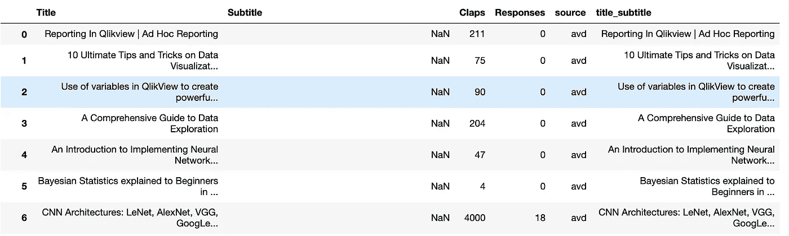
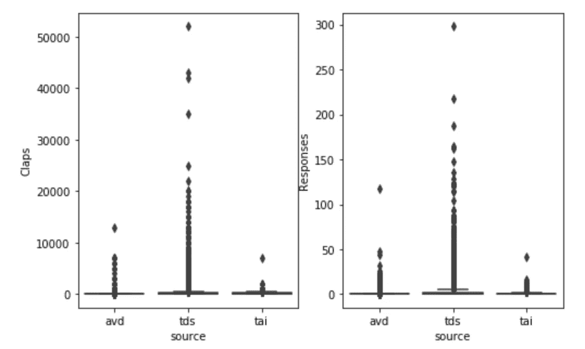
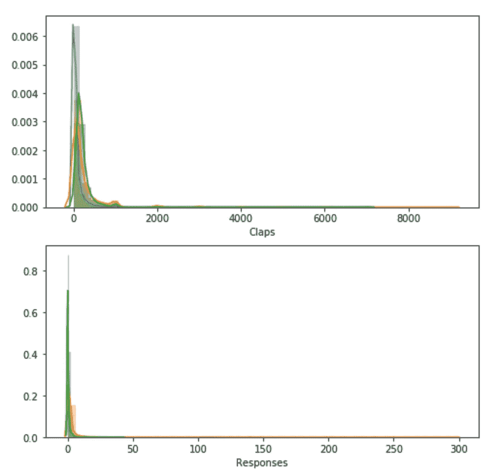
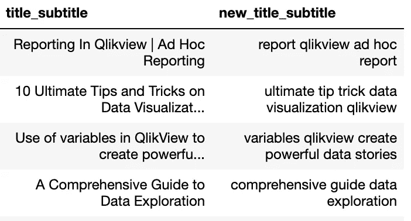
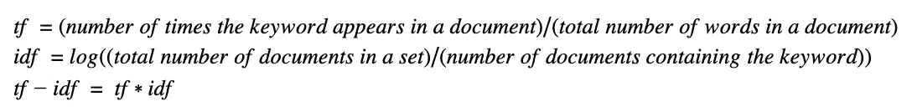
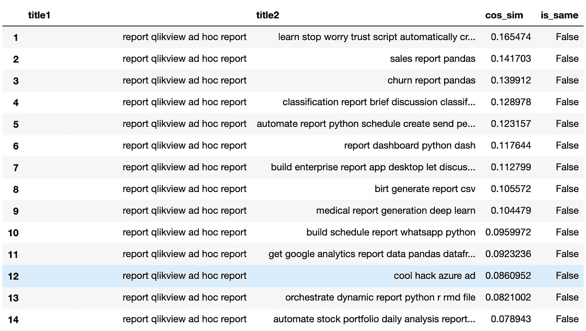
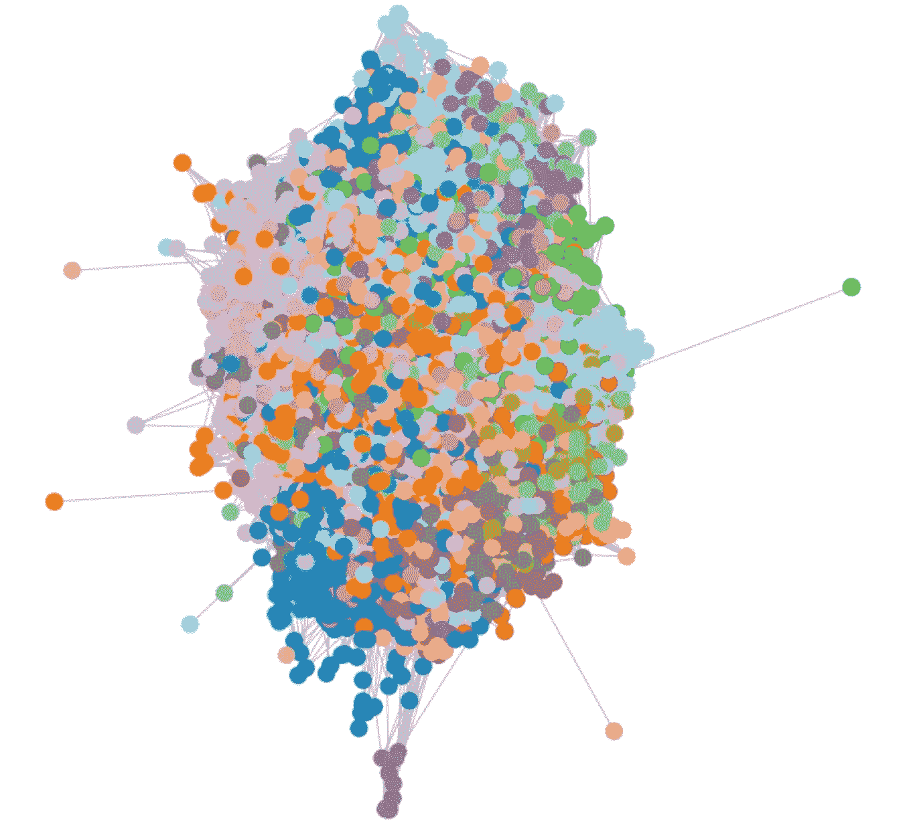
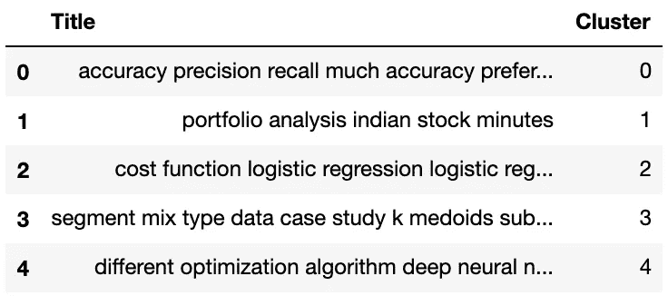
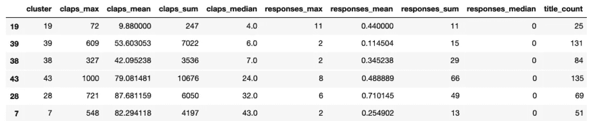
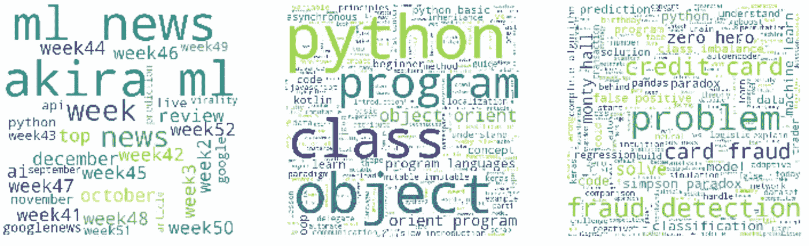

# 如何在 Python 中使用 TF-IDF 和图划分对相似句子进行聚类

> 原文：<https://towardsdatascience.com/how-to-cluster-similar-sentences-using-tf-idf-and-graph-partitioning-in-python-5fb70627a4e0?source=collection_archive---------2----------------------->

## 哪些数据科学文章更能吸引读者(第二部分)


[Hanson Lu](https://unsplash.com/@hansonluu?utm_source=medium&utm_medium=referral) 在 [Unsplash](https://unsplash.com?utm_source=medium&utm_medium=referral) 上的照片

在这一系列文章中，我们分析了数据科学出版物的历史档案，以了解哪些主题更受读者欢迎。之前我们讨论过[如何获取将用于进一步分析的数据](https://medium.com/analytics-vidhya/what-data-science-articles-attract-more-attention-part-1-efe8faf209d0)。

在本文中，我们将介绍如何清理我们之前收集的文本数据，使用网络图对相似的主题进行分组，并在这些集群中建立模式。

## 数据汇总

让我们提醒自己数据是什么样子的。它是从三个数据源[field:' Source ']—[Analytics vid hya](https://medium.com/analytics-vidhya)[' avd ']、 [TDS](https://towardsdatascience.com/) ['tds']和[获得的文章的组合。](https://medium.com/towards-artificial-intelligence)

我们收集了出版物档案中每篇文章的标题、副标题、掌声和回应。

```
import pandas as pd# Reading the data obtained using code [here](https://medium.com/analytics-vidhya/what-data-science-articles-attract-more-attention-part-1-efe8faf209d0).
avd = pd.read_csv('analytics_vidhya_data.csv')
tds = pd.read_csv('medium_articles.csv')
tai = pd.read_csv('towards_ai_data.csv')avd['source'] = 'avd'
tds['source'] = 'tds'
tai['source'] = 'tai'# Create single data set, join title and subtitle
single_matrix = pd.concat([avd, tds, tai])
single_matrix['title_subtitle'] = [' '.join([str(i),str(j)]) for i, j in zip(single_matrix['Title'].fillna(''), single_matrix['Subtitle'].fillna(''))]
```



文章数据集

我们在数据集中添加了一个名为“title_subtitle”的附加列，它是列*“Title”*和*“Subtitle”*的连接，我们将主要使用这个列，以便更好地查看文章所属的主题。非常有趣的是，39%的文章没有副标题，只有很小一部分没有标题。

让我们快速看一下每个数据源的掌声和响应分布。我们从方框图开始，我们使用 Python 中的 *seaborn* 库来创建我们的图。

```
# We will use seaborn to create all plots
import seaborn as sns
import matplotlib.pyplot as pltfig, axes = plt.subplots(1, 2, figsize=(8, 5))
# Claps
sns.boxplot(ax=axes[0], x="source", y="Claps", data=single_matrix)# Responses
sns.boxplot(ax=axes[1], x="source", y="Responses", data=single_matrix)
```

我们可以看到，走向数据科学不仅有更多的活动，而且有相当多的离群值，个别文章获得了读者的大量吸引力。当然，每个来源的活动取决于出版物的规模，对于较大的出版物，我们观察到更多的作者和读者。

当涉及到回应时，我们观察到的活动远少于所有来源的鼓掌，尽管这种行为并不十分意外。



按来源划分的掌声和回应的箱线图

接下来，我们移除异常值并可视化场的分布，以获得更清晰的图像。

```
# Code to create distribution subplots
fig, axes = plt.subplots(2, 1, figsize=(8, 8))# Claps
sns.distplot(avd['Claps'][avd['Claps']<10000], hist=True, rug=False, ax=axes[0])
sns.distplot(tds['Claps'][tds['Claps']<10000], hist=True, rug=False, ax=axes[0])
sns.distplot(tai['Claps'][tai['Claps']<10000], hist=True, rug=False, ax=axes[0])# Responses
sns.distplot(avd['Responses'], hist=True, rug=False, ax=axes[1])
sns.distplot(tds['Responses'], hist=True, rug=False, ax=axes[1])
sns.distplot(tai['Responses'], hist=True, rug=False, ax=axes[1])
```

我们可以看到两种分布都向左倾斜，这意味着大多数文章得到的掌声很少，甚至更少的回应。然而，这并不奇怪，因为文章的成功取决于许多因素，如高质量的写作，相关的主题等等。取得良好的平衡不是一件简单的事情！



按来源划分的掌声和响应分布

## 如何清理文本数据？

在处理文本时，清理数据是一个重要的步骤(如果不是最重要的部分的话)。在处理这类任务时，有标准的做法可以遵循。我们将采取以下步骤来处理标题和字幕:

*   删除标点符号和其他符号
*   删除停用词和数字
*   词汇

我们将混合使用正则表达式和 *nltk* 库来 ***删除标点符号、符号、停用词和数字*** *。*

```
import re
single_matrix['title_subtitle'] = [re.findall(r'\w+', i.lower()) for i in single_matrix['title_subtitle'].fillna('NONE')]
```

上面的代码匹配一个或多个单词字符，事实上 *r'\w+'* 与*r '[a-zA-Z0–9 _]+'相同。*同样，在应用 *re.findall()* 和 *i.lower()* 命令时，他们方便地将句子拆分成单词，并转换成小写。这将在接下来的步骤中非常有用。因此，句子*‘在 qlikview 中报告|临时报告’*变成了*【报告，在，Qlikview，临时，临时，报告】。*

接下来，我们将使用 *nltk* 库上传一个停用词词典，这样我们就可以将它们从句子中删除。此外，我们将单词“使用”和“部分”添加到列表中，因为它们在数据集中被过度使用。为了删除我们用于循环迭代每个句子的停用词，在这样做的时候，我们也确保从句子中删除数字。

```
# The code to upload list of stop words and remove them from sentencesimport nltk
nltk.download('stopwords') 
from nltk.corpus import stopwordsstopwords_eng = stopwords.words('english')  
stopwords_eng += ['use', 'using', 'used', 'part']new_titles_sub = []
for title_sub in single_matrix['new_title_subtitle']:
    new_title_sub = []
    for w_title in title_sub:
        if w_title not in stopwords_eng and not w_title.isdigit():
            new_title_sub.append(w_title)

    new_titles_sub.append(new_title_sub) 

single_matrix['new_title_subtitle'] = new_titles_sub
```

最后，我们要把句子中的单词去掉。考虑到上下文，词条解释将单词转换为其有意义的词根形式。频繁的词干提取是一种计算速度更快的替代方法，但是不够精确。我们再次使用 nltk 来表示单词

```
nltk.download('wordnet')
nltk.download('words')
from nltk.stem import WordNetLemmatizer
wordnet_lemmatizer = WordNetLemmatizer()new_titles_sub = []
for title_sub in single_matrix['title_subtitle']:
    new_title_sub = []
    for w_title in title_sub:
        new_title_sub.append(wordnet_lemmatizer.lemmatize(w_title, pos="v"))
    new_titles_sub.append(new_title_sub) 

single_matrix['new_title_subtitle'] = new_titles_sub
single_matrix['new_title_subtitle'] = [' '.join(i) for i in single_matrix['new_title_subtitle']]
```

让我们看看所有转换后的句子是什么样的



## 如何使用 TF-IDF 对文本数据进行矢量化？

TF-IDF 代表术语频率-逆文档频率，它是*某个特定文档集中某个关键字与某个文档相关程度的数值度量。*它常用于文本分析，一些例子包括内容排名和信息检索。这里的是一篇非常有用的论文，更详细地讨论了这种方法。

顾名思义，该度量由两部分组成，一部分是查找单词在文档中出现的频率(TF)，另一部分是单词在语料库中唯一性的程度(IDF)。让我们来看看简化版的公式及其组成部分:



我们可以看到，更频繁出现的单词将导致更低的 TF-IDF 分数，而对于罕见的单词，分数将更高。这种权重调整非常重要，因为过度使用的单词不会有额外的意义。

理解计算的最简单的方法是举例，在我们的数据集中，单个标题是一个文档，所有标题形成一个语料库(文档集)。考虑标题*‘使用变量 qlikview 创建强大的数据故事’中的*‘create’*一词，*文档有 7 个词，*‘create’*只出现一次，所以 *TF(create) = 1/7* 。其中一个数据源中的文章总数为 *12963* ，单词*‘create’*出现在 *268* 标题中，因此*IDF(create)= log(12963/268)= 3.88*。因此， *TF-IDF =0.14*3.88 = 0.55* 就是单词*‘create’*的得分。

既然我们知道了如何计算文档中每个单词的分数，我们就可以对带有文章标题和副标题的数据集进行矢量化处理。为此我们将使用 Python 中的 *sklearn* 库，特别是*tfidf 矢量化* r 函数。

注意:[*tfidf 矢量化* r](https://scikit-learn.org/stable/modules/generated/sklearn.feature_extraction.text.TfidfTransformer.html#sklearn.feature_extraction.text.TfidfTransformer) 使用的公式与上面指定的略有不同，它将 IDF 加 1。这样做是为了确保每个文档中出现的单词不会被忽略。

```
from sklearn.feature_extraction.text import TfidfVectorizertf = TfidfVectorizer(analyzer='word', ngram_range=(1, 3), min_df=0)tfidf_matrices = []
data_sets = []
for source in ['avd', 'tai', 'tds']:
    source_data = single_matrix[single_matrix['source'] == source].drop_duplicates()
    data_sets.append(source_data['new_title_subtitle'])
    tfidf_matrices.append(tf.fit_transform(
source_data['new_title_subtitle']))
```

我们引入了遍历数据源的 for 循环，这样做是为了缩短计算时间。当查看所有句子对之间的距离并将它们分成组时，也需要这样做。输出是稀疏矩阵，其中行是文档，列是语料库中唯一的单词。

现在我们已经有了矢量化的标题和副标题，我们可以**计算所有句子之间的成对距离。**我们将在代表句子的向量对之间使用**余弦相似度**。该度量考虑两个向量之间的角度，通常用于文本分析。对所选相似性度量的一些很好的解释可以在[这里](https://www.sciencedirect.com/topics/computer-science/cosine-similarity#:~:text=Cosine%20similarity%20measures%20the%20similarity,of%20an%20inner%20product%20space.&text=It%20is%20often%20used%20to,or%20phrase%20in%20the%20document.)找到，本文不仅提供了清晰的定义，还讨论了基于上下文的使用。

我们使用 *sklearn* 库来计算成对余弦相似度，再一次根据源进行分割。

```
from sklearn.metrics.pairwise import linear_kernel
matrix_with_cos_sim = []
for m in tfidf_matrices:
    matrix_with_cos_sim.append(linear_kernel(m, m))
```

每个数据源的输出是一个 numpy 数组(NxN ),所有句子之间具有成对的相似性，其中 N 是单个数据源的标题/副标题的数量。

## 如何利用网络图将相似的句子分组？

我们的目标是找到包含类似数据科学主题的文章的聚类，为此，我们将从构建一个加权图开始，其中节点是文章，边是它们的余弦相似性。然后，我们能够通过应用图划分来创建聚类，目的是在不强加大量社区的情况下找到有意义的子图(也称为社区)。

我们将使用 Python 库 *networkx* 和*社区*来构建和划分图表。在我们继续构建图表之前，我们将只为语料库中的每个文档选择前 15 个相似的标题，这个数字是根据称为模块性的度量来选择的，模块性给出了划分有多好的指示。这种方法不仅锐化了图形，而且有助于提高计算速度。

```
import numpy as np
from tqdm import tnrange
top_n_sentences = []
for cs, t in zip(matrix_with_cos_sim, data_sets):
    no_dups = np.array(t)
    i = 0
    top_frame = []
    for c, z in zip(cs, tnrange(len(cs))):
        # Create vector of titles
        start_name = pd.Series([no_dups[i]]*15) 
        # Index of top 15 similar titles
        ix_top_n = np.argsort(-c)[0:15]
        cos_sim = pd.Series(c[ix_top_n])
        names = pd.Series(no_dups[ix_top_n])
        i +=1
        top_frame.append(pd.DataFrame([start_name, names, cos_sim]).transpose())

    top_frame = pd.concat(top_frame)
    top_frame.columns = ['title1', 'title2', 'cos_sim']
    # Remove the similarities for the same sentences
    top_frame['is_same'] = [bool(i==j) for i, j in zip(top_frame['title1'], top_frame['title2'])]
    top_frame = top_frame[top_frame['is_same'] != True]

    top_n_sentences.append(top_frame)
```

该脚本为数据集中的每个标题生成具有前 15 个相似标题的数据框(按源划分)，它将用作构建图表的输入。让我们看看其中一个源的数据框示例



我们将继续构建和划分图表，我们将对拥有第二大数量文章的源(Analytics Vidhya)进行构建和划分。这些代码片段可以应用于本文涵盖的所有源代码。

```
# We start by defining the structure of the graphtop_frame = top_n_sentences[2] #TDS articlesedges = list(zip(top_frame['title1'], top_frame['title2']))
weighted_edges = list(zip(top_frame['title1'], top_frame['title2'], top_frame['cos_sim']))
nodes = list(set(top_frame['title1']).union(set(top_frame['title2'])))
```

我们现在可以使用上面定义的结构使用 *networkx* 来构建图形

```
import networkx as nx
G = nx.Graph()
G.add_nodes_from(nodes)
G.add_edges_from(edges)
G.add_weighted_edges_from(weighted_edges)
```

接下来，我们使用*社区*库对图进行分区，在模块导入之前，确保安装 *python-louvain* 库以避免错误。

```
# !pip install python-louvainimport community
partition = community.best_partition(G)
modularity = community.modularity(partition, G)
```

前面我们提到了模块性，这是衡量分区好坏的标准，本例中的值是 *0.7* 。通常，大于 0.6 的值被认为是足够好的分区。

```
# Takes some time for larger graphs
import matplotlib.pyplot as plt
pos = nx.spring_layout(G, dim=2)
community_id = [partition[node] for node in G.nodes()]
fig = plt.figure(figsize=(10,10))
nx.draw(G, pos, edge_color = ['silver']*len(G.edges()), cmap=plt.cm.tab20,
        node_color=community_id, node_size=150)
```

上面的代码生成了我们刚刚发现的图形和社区，虽然这个图看起来很忙，但我们仍然能够看到通过这种方法发现了相当多的集群。



标题和副标题被划分到社区中

在我们更详细地研究集群之前，我们将把我们之前创建的*分区*变量转换成更易读的格式。

```
title, cluster = [], []
for i in partition.items():
    title.append(i[0])
    cluster.append(i[1])

frame_clust = pd.DataFrame([pd.Series(title), pd.Series(cluster)]).transpose()
frame_clust.columns = ['Title', 'Cluster']
```

上面代码的输出是数据帧，其中包含所有标题和副标题以及它们所属的社区，通过对图进行划分，可以识别出 45 个集群。



标题和副标题被划分到社区中

现在我们已经获得了集群，我们可以为每个集群创建汇总统计数据，以了解其中是否有任何集群有更多的活动。我们将有分区的数据集与有掌声和回应的数据集合并，然后我们将计算每个组的最小值、最大值、平均值、中值和文章数。尽管主要关注中值，因为我们之前看到数据偏向较小的值，并且存在异常值。

```
avd = single_matrix[single_matrix['source'] ==           'avd'].drop_duplicates()frame_clust = frame_clust.merge(tds[['Title', 'new_title_subtitle', 'Claps', 'Responses']], how='left', left_on='Title', right_on='new_title_subtitle')grouped_mat = frame_clust.groupby('Cluster').agg(
{'Claps': ['max', 'mean', 'sum', 'median'],
 'Responses': ['max', 'mean', 'sum', 'median'], 
 'Title_x': 'count'}).reset_index()grouped_mat.columns = ['cluster', 'claps_max', 'claps_mean',  'claps_sum', 'claps_median','responses_max', 'responses_mean', 'responses_sum', 'responses_median', 'title_count']grouped_mat = grouped_mat.sort_values(by = ['claps_median', 'title_count'])
```

出于代表性目的，我们将只关注读者活跃度最低的三个社区和读者活跃度最高的三个社区。我们首先考虑数据集，然后我们将可视化单词云，以确定每个小组的共同主题。



读者活跃度最低和最高的社区

上表显示，这些群组并不是很大，让我们看看每个群组中有哪些共同的主题，我们将使用 wordcloud 库。

```
from wordcloud import WordCloud
fig, ax = plt.subplots(1, 3, figsize=(12.5,6.5))clusters = [19, 39, 38] #lowest activity groups
# clusters = [43, 28, 7] #highest activity groupsfor cluster, col in zip(clusters, [0, 1, 2]):
    corpus = ' '.join(frame_clust['new_title_subtitle'].  [frame_clust['Cluster'] == cluster])
    ax[col].imshow(WordCloud(width = 800,
                             height = 800,
                             background_color ='white', 
                             min_font_size = 10).generate(corpus))
    ax[col].axis("off")plt.show()
```

我们首先看一下活跃度最低的社区，看起来第 19 类的文章大多属于一个作者，这可以解释活跃度较低的原因。另外两个集群由多个作者撰写的更多文章组成。有趣的是，我们可以观察到诸如“python 中的面向对象编程”和“欺诈检测”这样的主题引起了读者最少的兴趣。



读者活动较少的群集

转到最活跃的集群，引起读者更多兴趣的突出主题是自然语言处理、神经网络、激活函数和支持向量机。


读者活跃度较高的集群

**总结**

虽然我们能够在低和高读者活动组中建立共同的主题，但我们仍然观察到没有很多掌声和回应的文章，以及在每个组中有高活动的文章。当试图建立读者感兴趣的一般模式以及文章饱和度较高的主题时，这种分析会很方便。然而，选择一个相关的主题并不能保证文章的成功，因为许多其他重要因素有助于吸引读者。