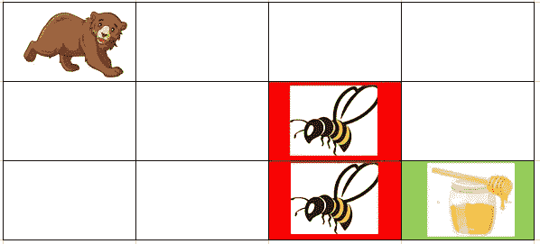
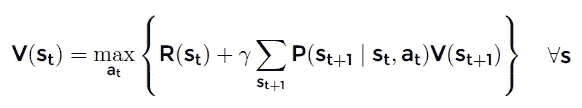
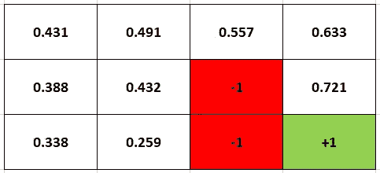
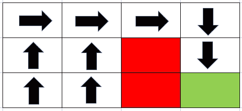

# 强化学习的值迭代算法如何编码

> 原文：<https://towardsdatascience.com/how-to-code-the-value-iteration-algorithm-for-reinforcement-learning-8fb806e117d1?source=collection_archive---------0----------------------->

## 利用强化学习求解 MDP

[来源](https://unsplash.com/photos/2EJCSULRwC8)

在本文中，我将向您展示如何实现价值迭代算法来解决马尔可夫决策过程(MDP)。当你进入强化学习和人工智能时，这是你应该学习的第一个算法。

强化学习是机器学习的一个领域，它专注于让代理学习如何在特定环境中表现/行动。MDP 仅仅意味着问题的框架，环境本身。

## 什么构成了 MDP？

MDP 由 5 个元素组成。

1.  **一套状态**。这表示代理在环境中的所有可能位置。
2.  **一套动作**。这表示代理在任何给定状态下可以采取的所有操作。
3.  **转移概率**。这表示代理尝试的操作成功(或失败)的概率。
4.  **奖励**，是到达特定状态的数值。
5.  **折扣系数γ** ，与即时奖励相比，这意味着减少未来奖励的价值。

MDP 中代理的目标是找到最优策略，即在任何给定状态下采取的最优行动的集合。

## 一个例子

理解这一切的最简单的方法是用一个例子。

假设我们有一只熊(代理人)想要得到蜂蜜(正奖励)，同时避开它周围的蜜蜂(负奖励)。在每个单元(或状态)，熊可以采取行动。例如，从他的实际位置，他可以向下或向右。最后，我们有转移概率。有时候，熊会打算做一些事情，但它会做其他事情(例如，向下而不是向左)。靠近蜜蜂会变得更加“危险”，因为失足可能意味着负面的回报。

来源:自制图片

现在，为了找到获得蜂蜜的最佳方式，熊将在环境中行走。他可能会走进蜜蜂，被蛰，并学会避免这种状态。最终，随着时间的推移，他会弄清楚如何在任何给定的状态下表现，以获得蜂蜜而没有后果！聪明的熊！

但是熊将如何学习呢？数值迭代算法是解决这一问题最常用的算法之一。让我们开始吧。

## 值迭代算法

该算法试图找到处于任何给定状态的值 V(st)。它使用贝尔曼方程。

来源:[https://artint.info/html/ArtInt_227.html](https://artint.info/html/ArtInt_227.html)

别担心，这真的没那么复杂。所有这一切意味着，考虑到转移概率，处于一个状态的价值等于该状态的直接回报(R)加上每个相邻状态的贴现回报(St+1)的最大值。因此，我们在这个算法中只先行一步。

这是一种迭代算法，其中状态值不断更新，直到收敛，即当值停止变化时。

最终，最优策略是隐含的，因为它将是为每个状态提供最佳价值的行动。

## 用 Python 实现算法

现在让我们进入有趣的部分！

下面是第一部分，代表了 MDP 的初始设置/创建(状态、动作、奖励等)。).

`SMALL_ENOUGH`变量是用来决定在哪个点上停止算法是合适的。`Noise`代表随机行动而非有意行动的概率。

在第 13–16 行，我们创建了状态。在第 19–28 行，我们为各州创建了所有奖励。有蜂蜜的州为+1，有蜜蜂的州为-1，其他州为 0。

然后，我们创建一个字典，包含任何状态的所有可能的动作。每个状态有 2 到 4 个可能的动作(向下、向上、向左或向右)。

最后，我们为每个状态定义一个初始随机策略以及一个值字典，包含每个状态的初始奖励。这最后一个字典将在算法期间被更新。

下面是值迭代算法。

从第 8 行和第 14 行可以看出，我们遍历了每个状态和每个状态中的每个动作。

在第 25–33 行，我们选择了一个随机的动作，在 10%的时间里，它会被执行，而不是预期的动作。这增加了问题的不确定性，使其成为非确定性的。通常，在值迭代中，您可能有不止一个可能的随机动作(考虑所有相邻的状态)或者甚至更高的噪声。然而，在这里，为了保持简单并确保算法快速运行，我只选择了一个可能的随机动作，每个状态发生的概率相对较小。

在第 38 行，我们计算在一个状态中采取一个动作的值。

在第 40-41 行，我们保存了与最佳值相关联的动作，这将给出我们的最优策略。

最后，在第 48 行，如果迭代期间在所有状态中观察到的最大改进被认为太小，则算法停止。

## 结果呢

这个超级小的例子在 44649 次迭代中收敛。

以下是与每个州相关的值。

我们看到，越接近最终回报，处于这种状态的价值就越高。

我们还看到，处于状态(2，1)的值(0.259)比更远的状态(2，0)的值(0.338)小。这是因为当接近负回报时，熊可能会失足撞到蜜蜂。因此，在这种情况下，最好远离这些州，即使这意味着也远离蜂蜜！

从这些值中，我们可以得出最优策略。

显然，我使用的例子非常简单，因此只需查看环境就可以很容易地找出最佳策略。然而，环境变得越大，我们人类就越难找出每个国家的最佳行动方案。对于电脑来说，不是。

之前不知道该做什么的熊，现在已经学会了如何在躲避蜜蜂的同时获取蜂蜜。对他有好处！

下面的存储库包含了这个项目使用的所有代码:[https://github . com/francoistamant/reinforcement-learning-MDP](https://github.com/francoisstamant/reinforcement-learning-mdp)

非常感谢你的阅读，我希望你学到了一些东西，如果你有任何问题，请随时联系我！

成为会员:【https://francoisstamant.medium.com/membership】T2