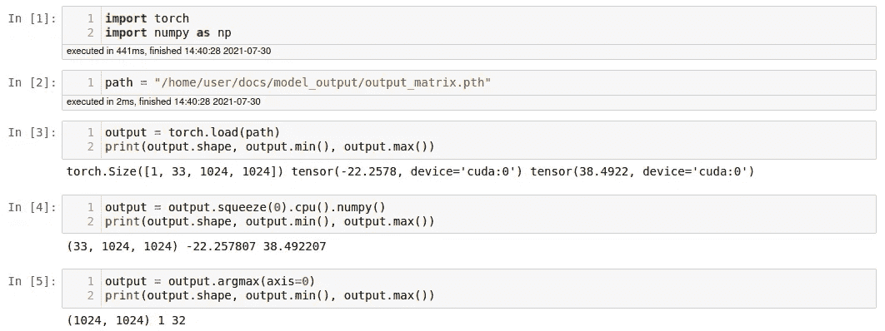
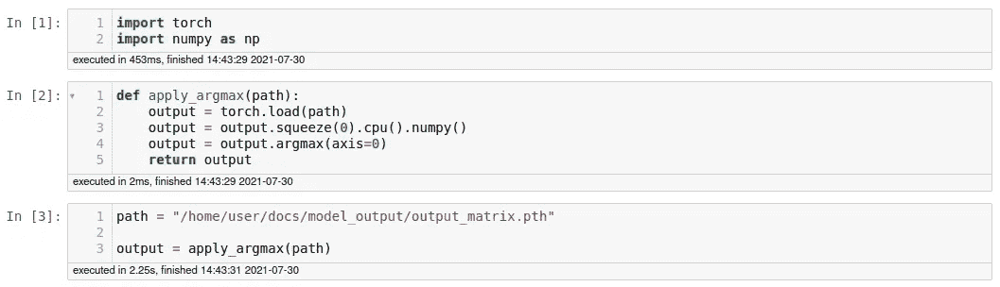
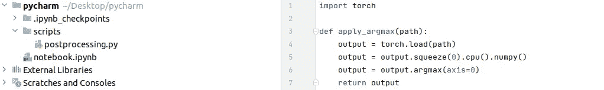
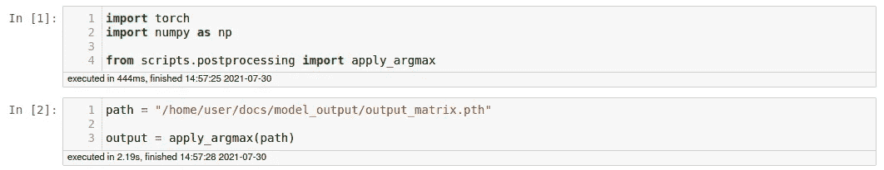

# 当你只知道 Jupyter 笔记本时如何编码

> 原文：<https://towardsdatascience.com/how-to-code-when-all-you-know-are-jupyter-notebooks-78cf8d4f32e0?source=collection_archive---------12----------------------->

## 从笔记本转换到 Python 文件的初学者指南

克里斯里德在 [Unsplash](https://unsplash.com?utm_source=medium&utm_medium=referral) 上的照片

当我开始我的第一份机器学习工作时，我之前所有的编码都是在 Jupyter 笔记本上完成的。然而，我开始工作的公司没有使用它们，所以我有点害怕不知道没有它们如何编码，而是必须使用 Python 文件。也许你发现自己处于和我当时相似的位置，开始学习如何使用文件和脚本，但不知道如何开始。唉，这是我的教程，当你只知道 Jupyter 笔记本时，如何编码。

Jupyter Notebook 是一个方便的小东西:你可以编写代码，合并细胞，分割细胞，运行单个细胞——无论它们在笔记本中的什么位置——并直接在执行的细胞下方看到输出。然而，就像生活中的一切一样，笔记本也有它们的问题:它们可能会很乱，以非线性顺序执行单元格的能力使得再现性很难，并且很难将笔记本中的代码投入生产。Python 文件不会带来这些问题，一旦你学会了使用它们，它们实际上会使编码变得更加容易。

那么什么是 Python 文件呢？它是 Python 函数和语句的集合，要么直接执行，要么从其他地方导入。这个代码集合可以像带有. py 后缀的文本文件一样简单，用文本编辑器打开。然而，更常见(也更实用)的是使用 IDE 来处理文件，比如 *PyCharm* 或 *Visual Code Studio* 。(为了熟悉 *PyCharm* 的基础知识，我在这里推荐这个简短的教程。它向您展示了如何启动项目、创建文件以及运行这些文件。关于 *Visual Code Studio* 的简短介绍，点击[这里](https://code.visualstudio.com/docs/introvideos/basics)。)

## 开发代码

在我的第一份工作开始时，在 PyCharm 中执行脚本对我来说并不神秘。相反，我不确定如何使用简单的脚本而不是笔记本来开发 T21 代码。

编码是一个迭代的过程。你写几行代码，看看行不行，再写更多的代码，等等。在 Jupyter 笔记本中，这个过程非常简单，因为它允许您执行每一行来查看它是否工作。当使用脚本时，事情有点不同，因为您不能只执行一行。你或多或少必须从头到尾运行你的整个脚本。

当从 Jupyter 笔记本切换到 Python 脚本时，对我来说效果很好的是下面的方法:我写了一段代码(一到三行左右)，然后运行脚本看看它是否工作。在整个代码中使用 Print 语句通常是检查代码是否真的在做您想要它做的事情的好方法。像这样:

在这个例子中，我编写了一个函数，用零值填充图像，这样图像就得到想要的形状。当我运行代码并且没有抛出错误时，我继续写一些代码行并再次检查我的代码是否运行没有任何错误:

如果是这样，我想写的函数就完成了，我删除打印语句和调用函数的行——瞧，它就完成了:

## 结合笔记本和脚本

老实说，我仍然经常使用 Jupyter 笔记本——它们太方便了，可以把我的可视化和数据分析都放在一个地方。在将代码转换成 Python 文件之前，我经常使用它们来开发代码。正如我上面提到的，笔记本非常适合运行单独的代码行来查看它们是否工作，这非常有帮助，尤其是当你还不是一个有经验的程序员的时候。

所以我经常做的是在笔记本上开发代码——一行一行，用打印语句来查看代码是否在做我想让它做的事情——直到我有了一个可以变成函数的代码块。然后我把这个函数放到一个 Python 文件中。如果我愿意，我可以将它从那里再次导入到我的笔记本中，以便在那里使用。

在笔记本上逐行开发代码…

把它变成一种功能…

将它复制粘贴到 Python 文件中…

…导入并执行笔记本中的功能

我希望您现在感觉不那么茫然了，并准备开始自己尝试 Python 文件。显然，我没有涵盖与 Python 文件相关的所有内容。因此，如果您想知道如何不从 ide 内部而是从命令行运行 Python 文件，我可以在这里推荐本文。如果你想了解更多关于导入模块的知识，你可以在这里阅读[。玩得开心！](https://www.askpython.com/python-modules/creating-a-python-module)