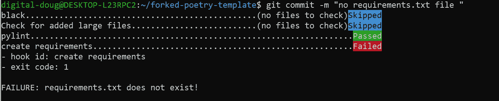
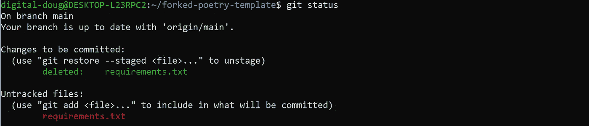
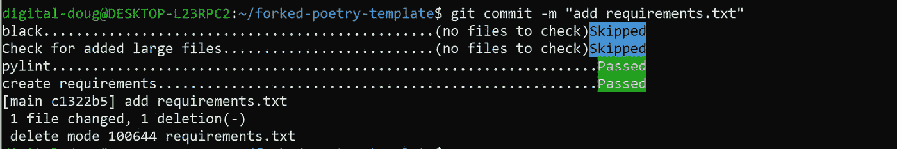
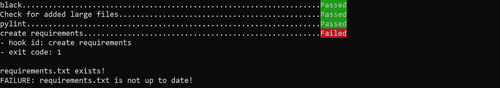

# 实现您自己的 Python 预提交挂钩

> 原文：<https://towardsdatascience.com/how-to-code-your-own-python-pre-commit-hooks-with-bash-171298c6ee05?source=collection_archive---------21----------------------->

## 创建自己的预提交钩子作为 bash 脚本，用于静态分析和与 Git repo 的持续集成。

作者:[爱德华·克鲁格](https://www.linkedin.com/in/edkrueger/)和[道格拉斯·富兰克林](https://www.linkedin.com/in/douglas-franklin-1a3a2aa3/)。


约翰·沃尔特·班茨在 Unsplash 上拍摄的照片

*这里是这个项目的模板。我们使用诗歌进行包装管理。本文着重于编写定制的预提交钩子。*

<https://github.com/edkrueger/poetry-template>  

*有关 Python 预提交钩子的更多介绍性信息，请查看本文。*

</getting-started-with-python-pre-commit-hooks-28be2b2d09d5>  

# 什么是预提交挂钩？

预提交钩子是 Git 钩子的子集。Git-hooks 是每当 Git 存储库中发生特定操作时自动运行的脚本——比如提交或推送。“预提交挂钩”在提交发生之前运行。

预提交挂钩通常用于确保代码在发布前被正确地链接和格式化。这些钩子也用于持续集成、构建过程、依赖性管理和测试。然而，使用预提交钩子进行测试在 DevOps 领域是有争议的，不在我们的讨论范围之内。

通过简单的 bash 代码，您可以为特定需求创建自己的定制钩子——例如，持续集成到已部署的应用程序。

# 预提交 Python 包

令人困惑的是，还有一个叫`pre-commit`的 Python 包。预提交是一个用于预提交挂钩的管理工具。它在每次提交之前管理安装和执行挂钩。

我们需要安装`pre-commit`作为开发需求。例如，对于诗歌，你会跑；

```
poetry add pre-commit --dev
```

## 自定义挂钩

下面是我们的定制钩子的 bash 代码，`create-requirements.`这个 bash 脚本被设计来保持`requirements.txt`与诗歌的锁文件`poetry.lock.`同步

这很有用，因为如果我们保持需求是最新的，我们可以使用这个文件进行部署，避免任何定制的构建包。

例如，我们可以通过确保我们对虚拟环境依赖关系树所做的任何更改都反映在我们的`requirements.txt`文件中来保持 Heroku 应用程序的部署。

这很有用的另一个原因是，通过避免在容器中安装虚拟环境，您可以创建更轻、更简单的 docker 构建。


照片由 Iza Gawrych 在 Unsplash 上拍摄

如果我们有一个与我们的`requirements.txt`不同步的虚拟环境，这个预提交钩子将捕获它，提供一个适当的错误消息，并创建正确的`requirements.txt`。

write _ requirements.sh

让我们仔细看看我们的代码，看看 bash 和 exit 状态是如何与包`pre-commit`一起使用来阻止提交完成的。

在第 1 行，我们可以看到 bash 变量`NEW_REQUIREMENTS`存储了我们使用的包管理器`poetry`生成的需求。

第 3–9 行检查是否存在名为`requirements.txt`的文件，该文件提供了该结果的最终输出。如果文件不存在，我们使用退出状态 1 表示失败**，预提交停止提交。**

> *对于 bash shell 来说，以零(0)退出状态退出的命令已经成功。非零(1–255)退出状态表示失败。*

bash 脚本将完成并最终生成一个新的`requirements.txt`文件，因为在检查第 11 行时`NEW_REQUIREMENTS`不等于空白的`REQUIREMENTS`。

在第 11 行，我们将当前的`requirements.txt`文件存储为`REQUIREMENTS`。然后是第 13–15 行，检查旧版本`REQUIREMENTS,`是否与我们当前虚拟环境的`NEW_REQUIREMENTS.`相同。如果这些文件相同，我们不需要更新任何内容，并使用退出状态 0 来表示成功。如果`create-requirements`是我们的最后一个钩子，这允许预提交运行下一个钩子或者完成提交过程。

但是，如果`REQUIREMENTS`和`NEW_REQUIREMENTS`不相同，我们需要重写我们的`requirements.txt`。这是在第 18 行完成的，我们从 poem 的虚拟环境中创建了一个新的`requirements.txt`文件。注意，在我们重写这个文件之后，我们使用退出状态 1，这样我们的脚本失败了，我们的提交也失败了。

这个失败允许我们运行`git add requirements.txt`来提交。我们的下一个`git commit`将重新运行我们的钩子，这一次通过所有的检查，因为新的`requirements.txt`对我们的虚拟环境是最新的。

该流程确保我们在本地运行应用的虚拟环境与我们在远程运行应用的虚拟环境保持一致。

# 确保我们的定制挂钩正常工作

在这里，我们运行一些检查来查看 bash 脚本是如何工作的。

## 首次测试

假设我们的回购中没有`requirements.txt`文件，我们尝试提交。



我们的自定义挂钩失败

根据我们的 bash 代码，我们应该得到一个失败和`requirements.txt does not exist`错误消息。然后在目录中生成一个`requirements.txt`。我们可以通过运行`git status.`看到这一点



git 状态

请注意，我们现在有一个未被跟踪的`requirements.txt.`在实践中，人们现在会:

*   运行`git add requirement.txt`
*   运行`git commit -m "add requirements.txt"`



我们的定制钩子传递

现在我们的提交已经完成，可以推送给 git 了。

如果您不想提交这个检查，运行`git reset HEAD~` 来恢复提交。

## 第二次测试

假设我们对虚拟环境的依赖关系进行了更改。我们可以用下面的代码运行预提交钩子。

```
 poetry run pre-commit run --all-files
```

这将给出与运行相同的终端输出:

```
git commit -m “modified requirements.txt”
```



然而，第一行只运行我们的预提交钩子，而第二行运行我们的钩子来准备提交。

请注意新的错误消息`requirements.txt is not up to date!`

同样，我们现在有一个由 bash 脚本的第 18 行生成的未跟踪的`requirements.txt` 。实际上，现在人们会:

*   运行`git add requirement.txt`
*   运行`git commit -m "update requirements.txt"`

预提交挂钩的目的是确保在对 Git repo 进行更改之前，某些事情会发生或不会发生。在我们的例子中，这个预提交钩子确保我们的`requirements.txt`文件存在，并且与我们当前的诗歌虚拟环境保持一致。所有这些都是在我们将任何代码推送到 git 并最终投入生产之前完成的。

## 结论

我们的定制钩子`create-requirements`，确保我们在本地使用的环境与我们在远程创建的环境一致。这可以通过 bash 代码、退出状态和`pre-commit`来实现。非零的退出状态会导致 bash 脚本发出一个错误。因此，这些错误可以用来阻止不符合我们标准的提交。